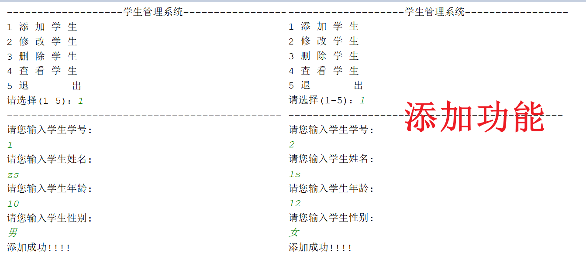
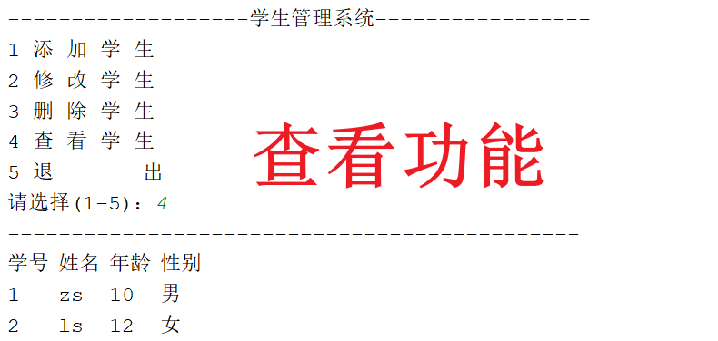
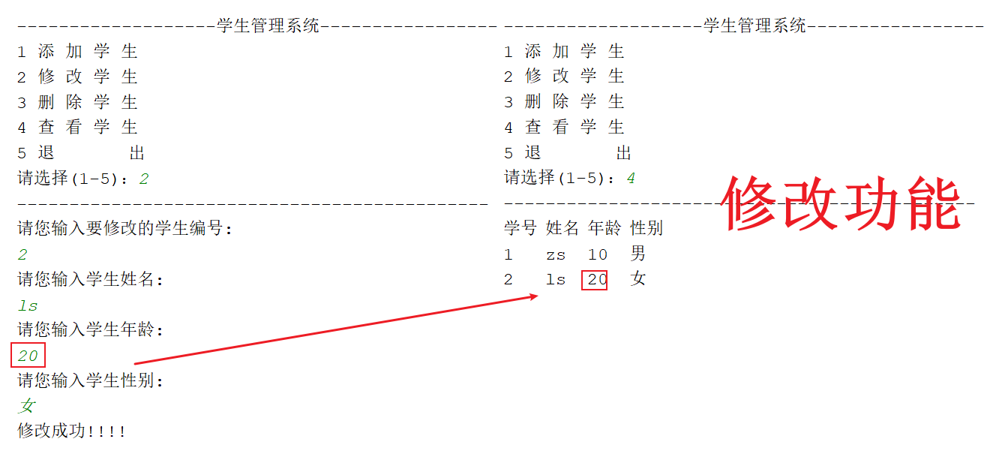
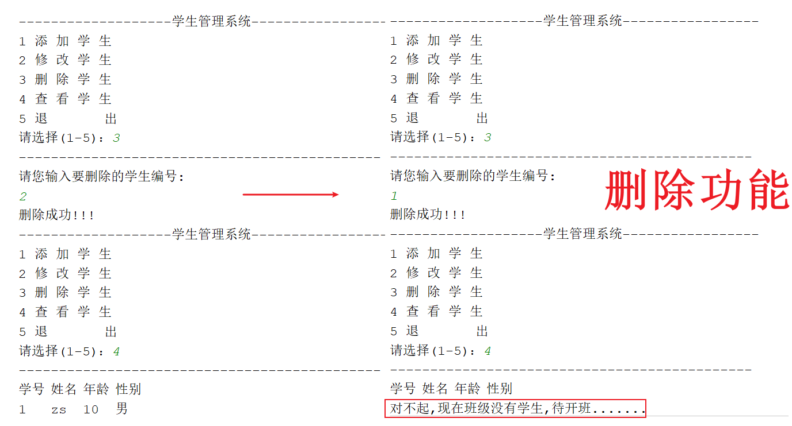
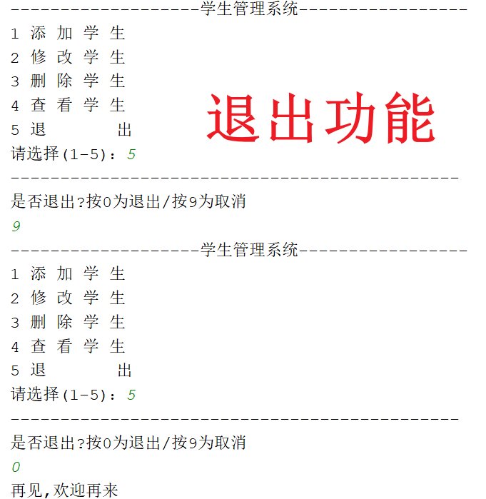
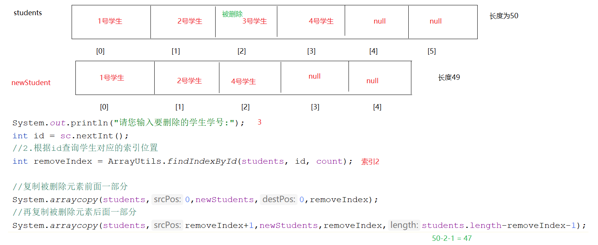

# JAVASE第一阶段项目_学生管理系统

# 1.项目介绍

```java
此项目是JavaSE第一阶段的项目,主要完成学生对象在数组中的增删改查,大家可以在此项目中发挥自己的想象力做完善,添加其他功能等操作,但是重点仍然是咱们前9个模块的知识点
```

# 2.项目展示

## 2.1.添加功能



## 2.2.查看功能



## 2.3.修改功能



## 2.4.删除功能



## 2.5.退出功能



# 3.功能实现

## 3.1.JavaBean_Student

```java
public class Student {
    //学号
    private int id;
    //姓名
    private String name;
    //年龄
    private int age;
    //性别
    private String sex;

    public Student() {
    }

    public Student(int id, String name, int age, String sex) {
        this.id = id;
        this.name = name;
        this.age = age;
        this.sex = sex;
    }

    public int getId() {
        return id;
    }

    public void setId(int id) {
        this.id = id;
    }

    public String getName() {
        return name;
    }

    public void setName(String name) {
        this.name = name;
    }

    public int getAge() {
        return age;
    }

    public void setAge(int age) {
        this.age = age;
    }

    public String getSex() {
        return sex;
    }

    public void setSex(String sex) {
        this.sex = sex;
    }
}
```

## 3.2.启动项目_Test01

```java
public class Test01 {
    public static void main(String[] args) {
        new StudentView().start();
    }
}

```

## 3.3.操作页面_StudentView

```java
public class StudentView {
    /*
       后面会反复键盘录入,所以我们没要执行一个方法就new一次Scanner
       所以将Scanner对象放到成员位置
     */
    Scanner sc = new Scanner(System.in);

    /*
      老数组,长度为 50,代表班级最多能放50个人
      后面每个功能都需要使用数组,所以可以将数组
      放到成员位置
     */
    Student[] students = new Student[50];

    /*
       定义一个count,记录数组中有多少个对象,遍历元素不能全部遍历,
       因为没有存对象的位置遍历出来是null,再调用getxxx方法,会出现空指针
       所以我们应该记录存储对象的个数,存多少个对象,就遍历多少次

       而且,后面可能会反复使用count,所以提到成员位置
     */
    int count = 0;

    /*
      新数组,一会删除元素的时候需要将删除后剩下的元素复制到新数组中
      因为数组定长,不能直接在原来的数组基础上随意改变长度
      由于一次删一个,所以新数组长度为老数组长度-1
      后面可能会反复使用新数组,所以定义到成员位置
     */
    Student[] newStudents = new Student[students.length-1];


    /*
      start方法用于展示页面以及调用对应的功能
     */
    public void start(){
       while(true){
           System.out.println("-----------学生管理系统-----------");
           System.out.println("1 添加学生");
           System.out.println("2 修改学生");
           System.out.println("3 删除学生");
           System.out.println("4 查看学生");
           System.out.println("5 退出系统");
           System.out.println("请选择(1-5):");

           int num = sc.nextInt();
           System.out.println("--------------------------------");

           switch (num){
               case 1:
                   addStudent();
                   break;
               case 2:
                   updateStudent();
                   break;
               case 3:
                   deleteStudent();
                   break;
               case 4:
                   findAllStudent();
                   break;
               case 5:
                   System.out.println("退出功能");
                   break;
           }
       }
    }

    private void findAllStudent() {
        System.out.println("查看功能");
    }

    private void deleteStudent() {
        System.out.println("删除功能");
    }

    private void updateStudent() {
        System.out.println("修改功能");
    }

    private void addStudent() {
        System.out.println("添加功能");
    }
}
 
```

## 3.4.工具类_ArrayUtils

```java
public class ArrayUtils {
    private ArrayUtils(){

    }

    public static int findIndexById(Student[] students,int id,int count){
        //遍历,查找
        for (int i = 0; i < count; i++) {
            if (id==students[i].getId()){
                return i;
            }
        }

        return -1;
    }
}
```

## 3.5.添加功能_addStudent

```java
    private void addStudent() {
        //1.键盘录入学生信息
        System.out.println("请您输入学生学号:");
        int id = sc.nextInt();
        System.out.println("请您输入学生姓名:");
        String name = sc.next();
        System.out.println("请您输入学生年龄:");
        int age = sc.nextInt();
        System.out.println("请您输入学生性别:");
        String sex = sc.next();
        //2.将学生信息封装到Student对象中
        Student student = new Student(id, name, age, sex);
        //3.将封装好的Student对象放到students数组中
        students[count] = student;
        //4.count++记录存储了多少个对象
        count++;
        System.out.println("添加成功!!!");
        
    }
```

## 3.6.查看功能_findAllStudent

```java
     private void findAllStudent() {
        System.out.println("学号"+"\t"+"姓名"+"\t"+"年龄"+"\t"+"性别");
        /*
          排序是为了防止:删除完之后再重新添加之前删除的序号对应的学生而发生乱序的情况
        */
        for (int j = 0; j < count-1; j++) {
            for (int i = 0; i < count-1-j; i++) {
                if (students[i].getId()>students[i+1].getId()){
                    Student temp = students[i];
                    students[i] = students[i+1];
                    students[i+1] = temp;
                }
            }
        }


        //如果count为0(证明没有添加过学生),证明没有学生
        if (count==0){
            System.out.println("对不起,现在班级没有学生,待开班.........");
        }else{
            //我们应该是添加了多少个学生,count就是几,就应该遍历几次
            for (int i = 0; i < count; i++) {
                System.out.println(students[i].getId()+"\t"+students[i].getName()+"\t"+students[i].getAge()+"\t"+students[i].getSex());
            }
        }

    }
```

## 3.7.修改功能_updateStudent

```java
    private void updateStudent() {
        //1.录入要修改的学生学号  id
        System.out.println("请您输入要修改的学生学号:");
        int id = sc.nextInt();
        /*
          2.注意:修改完之后不能直接将id当成索引去存储新的学生对象
            原因:id和学生在数组中的索引不是对应的
            解决:根据id查询对应的学生在数组中的索引位置
         */
        int updateIndex = ArrayUtils.findIndexById(students,id,count);

        System.out.println("请您输入学生姓名:");
        String name = sc.next();
        System.out.println("请您输入学生年龄:");
        int age = sc.nextInt();
        System.out.println("请您输入学生性别:");
        String sex = sc.next();
        Student student = new Student(id, name, age, sex);
        students[updateIndex] = student;
        System.out.println("修改成功!!!");
    }

```

## 3.8.删除功能_deleteStudent

```java
    private void deleteStudent() {
        //1.输入要删除的学生学号
        System.out.println("请您输入要删除的学生学号:");
        int id = sc.nextInt();
        //2.根据id查询学生对应的索引位置
        int removeIndex = ArrayUtils.findIndexById(students, id, count);

        //复制被删除元素前面一部分
        System.arraycopy(students,0,newStudents,0,removeIndex);
        //再复制被删除元素后面一部分
        System.arraycopy(students,removeIndex+1,newStudents,removeIndex,students.length-removeIndex-1);

        //将新数组的地址值给老数组
        students = newStudents;
        //删除完之后count--
        count--;
        System.out.println("删除成功");
    }
```



## 3.9.退出功能_switch

```java
 case 5:
      System.out.println("是否退出?按0为退出/按9为取消");
      int key = sc.nextInt();
      if (key == 0) {
          System.out.println("再见,欢迎再来");
          return;//结束方法
      } else if (key == 9) {
          break;
      }
```

