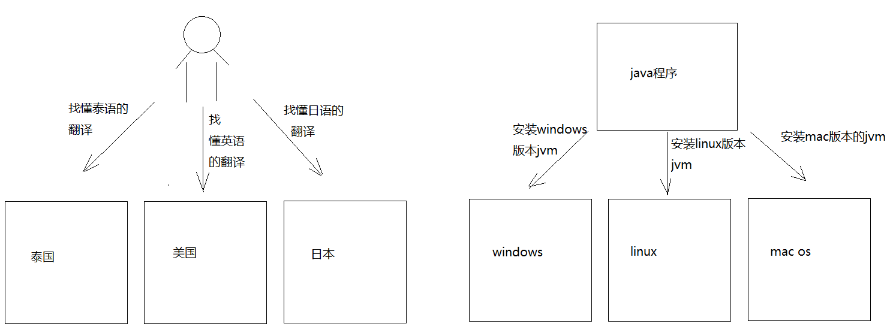
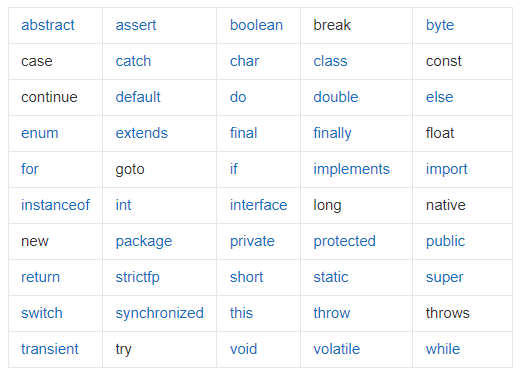

# day01.[环境变量,HelloWorld]

```java
1.会常用的dos命令
2.会安装java所需要的环境(jdk)
3.会配置java的环境变量
4.知道java开发三步骤
5.会java的入门程序(HelloWorld)
6.会三种注释方式
7.知道Java入门程序所需要注意的地方
8.知道println和print的区别
```

# 第一章 Java概述

## 1.1 JavaSE课程体系介绍

JavaSE知识图解


JavaSE知识模块介绍

* **第一部分：计算机编程语言核心结构：**`数据类型`、`运算符`、`流程控制`、`数组`、…  

  (没有为啥,按照格式定义)

* **第二部分：Java面向对象核心逻辑：**`类和对象`、`封装`、`继承`、`多态`、`抽象`、`接口`、…

  JAVA核心编程思想(面向对象),很多功能别人已经给我们实现好了,我们直接调用这个对象的功能就可以了,

  让代码变得简单了,简洁了

* **第三部分：JavaSE核心高级应用：**`集合`、`I/O`、`多线程`、`网络编程`、`反射机制`、…

* **第四部分：Java新特性：**`Lambda表达式`、`函数式编程`、`新Date/Time API`、`接口的默认、静态和私有方法`、…  

* **第五部分：MySQL/JDBC核心技术：**`SQL语句`、`数据库连接池`、`DBUtils`、`事务管理`、`批处理`、…

## 1.2 计算机语言介绍（了解）

### 计算机编程语言是什么

所谓计算机编程语言，就是人们使用编程语言对计算机下达的命令，让计算机完成人们需要的功能。

```java
翻译:所谓的计算机编程语言,就是计算机能看懂的语言,我们需要学习这些计算机编程语言,给计算机下达指令,让计算机给我们完成一些功能
```

### 计算机语言发展

* 第一代：机器语言(计算机很庞大,都是0和1组成的指令,而且需要同时按下多个键才能完成一个指令,而且用0和1组成的一个一个指令,所以工程师们就要记住0和1的各种组合以及对应的指令)

* 第二代：汇编语言(面向机器的语言,因为直接面对机器需要记一些 0 和1 的指令,很痛苦,所以就出现了很多助记词,比如:add.汇编语言现在还在使用,接近于机器语言,越接近机器语言,速度越快,而且最终还是转成0和1存储)

* 第三代：高级语言(更接近我们人类语言,常见的有很多,比如C语言,java等)

  ```java
  不管是第几代语言,最终都会向0和1靠近,因为CPU只认识0和1
  电脑上所有的内容,都是通过CPU将0和1转换而来的    
  ```

### 计算机语言排行榜


### 计算机语言走势


## 1.3 Java语言概述（了解）

### Java生态圈

**Java是目前应用最为广泛的软件开发平台之一。**随着Java以及Java社区的不断壮大，Java 也早已不再是简简单单的一门计算机语言了，它更是一个平台、一种文化、一个社区。

**作为一个平台，**Java虚拟机扮演着举足轻重的作用。除了 Java语言，任何一种能够被编译成字节码的计算机语言都属于Java这个平台。Groovy、Scala、 JRuby、Kotlin等都是Java平台的一部分，它们依赖于Java虚拟机，同时，Java平台也因为它们变得更加丰富多彩。而且Java还可以跨平台

**作为一种文化，**Java几乎成为了 “开源”的代名词。在Java程序中，有着数不清的开源软件和框架。如Tomcat、Struts, Hibernate, Spring,MyBatis等。就连JDK和JVM自身也有不少开源的实现，如OpenJDK、Apache Harmony。可以说，“共享”的精神在Java世界里体现得淋漓尽致。

**作为一个社区，**Java拥有全世界最多的技术拥护者和开源社区支持，有数不清的论坛和资料。从桌面应用软件、嵌入式开发到企业级应用、后台服务器、中间件，都可以看到Java的身影。其应用形式之复杂、参与人数之众多也令人咋舌。可以说，Java社区已经俨然成为了一个良好而庞大的生态系统。**其实这才是Java最大的优势和财富。**

### Java 是最好的语言吗？

不是，因为在每个领域都有更合适的编程语言。

- C 语言无疑是现代计算机软件编程语言的王者，几乎所有的操作系统都是 C 语言写成的。C里面有一个编译器,会将系统软件变成机器语言,让硬件识别,和硬件做交互.C++ 是面向对象的 C 语言，一直在不断的改进。


- JavaScript 是能运行在浏览器中的语言，丰富的前端界面离不开 Javascript 的功劳。近年来的 Node.js 又在后端占有一席之地。
- Python 用于系统管理，并通过高性能预编译的库，提供 API 来进行科学计算，文本处理等，是 Linux 必选的解释性语言。现在Python也被用于web开发、科学计算和统计、人工智能、网络爬虫等
- Ruby 强于 DSL（领域特定语言），程序员可以定义丰富的语义来充分表达自己的思想。
- Erlang 就是为分布式计算设计的，能保证在大规模并发访问的情况下，保持强壮和稳定性。
- Go 语言内置了并发能力，可以编译成本地代码。当前新的网络相关项目，很大比例是由 Go 语言编写的，如 Docker、Kubernetes 等。
- 编写网页用 PHP，函数式编程有 Lisp，编写 iOS 程序有 Swift/Objective-C。
- R的思想是：它可以提供一些集成的统计工具，但更大量的是它提供各种数学计算、统计计算的[函数](https://baike.baidu.com/item/函数/301912)，从而使使用者能灵活机动的进行数据分析，甚至创造出符合需要的新的统计计算方法 
- SQL 是用于访问和处理数据库的标准的计算机语言， 这类数据库包括：MySQL，Oracle, Sybase, SQL Server, DB2, Access 等等 


一句话概括，**能留在排行榜之上的语言，都是好的语言，在其所在的领域能做到最好。**

### Java语言发展历史

Java诞生于SUN（Stanford University Network），09年SUN被Oracle（甲骨文）收购。

Java之父是詹姆斯.高斯林(James Gosling)。


**詹姆斯·高斯林**等人于1990年代初开发Java语言的雏形，最初被命名为**Oak**，目标设置在**家用电器等小型系统的程序语言**，应用在**电视机、电话、闹钟、烤面包机**等家用电器的**控制和通信**。由于这些智能化家电的市场需求没有预期的高，Sun公司放弃了该项计划。随着1990年代互联网的发展，Sun公司看见Oak在互联网上应用的前景，于是改造了Oak，于1995年5月以Java的名称正式发布。Java伴随着互联网的迅猛发展而发展，逐渐成为重要的网络编程语言。

1996年发布JDK1.0版。

目前最新的版本是Java17。我们学习的Java8以及jdk17。

|   发行版本    |  发行时间  |                             备注                             |
| :-----------: | :--------: | :----------------------------------------------------------: |
|     Java      | 1995.05.23 |     Sun公司在Sun world会议上正式发布Java和HotJava浏览器      |
|   Java 1.0    | 1996.01.23 |             Sun公司发布了Java的第一个开发工具包              |
|   Java 1.1    | 1997.02.19 |                                                              |
|   Java 1.2    | 1998.12.08 |    拆分成：J2SE（标准版）、J2EE（企业版）、J2ME（小型版）    |
|   Java 1.3    | 2000.05.08 |                                                              |
|    Java1.4    | 2004.02.06 |                                                              |
| **Java 5.0**  | 2004.09.30 | ①版本号从1.4直接更新至5.0；②平台更名为JavaSE、JavaEE、JavaME |
|   Java 6.0    | 2006.12.11 |               2009.04.20 Oracle宣布收购SUN公司               |
|   Java 7.0    | 2011.07.02 |                                                              |
| **Java 8.0**  | 2014.03.18 |                                                              |
|   Java 9.0    | 2017.09.22 |    ①每半年更新一次；②Java 9.0开始不再支持windows 32位系统    |
|   Java 10.0   | 2018.03.21 |                                                              |
| **Java 11.0** | 2018.09.25 |           JDK安装包取消独立JRE安装包，长期支持版本           |
|   Java 12.0   | 2019.03.19 |                                                              |
|   Java 13.0   | 2019.9.18  |                                                              |
|   Java 14.0   | 2020.3.17  |                                                              |

```java
Google和Oracle的侵权事件:

Google 和 Oracle 纠缠多年的“Java 侵权案”又有了新的判决结果。Google 在此次对决中败诉，并可能需要支付高达88亿美元的赔偿金。这个案件还引发关于 API（应用程序编程接口）是否应该受版权保护的争议。

其实早在2010年8月，Oracle 就已经向法院起诉 Google 侵权，声称 Google 在开发 Android 平台时未经授权就使用了 Oracle 的 Java 应用编程接口数据包。

另外，虽然 Google 当年为避免版权问题而重写了 Java API，却意外地使用了和 Oracle JDK 相同的一小段代码，这使得 Google 陷入不利的局面。

正是由于 Google 在 Android 平台上使用 Java 时并未和 Sun 公司达成授权协议，造成了巨大的隐患，尤其是在 Oracle 收购 Sun 公司之后。
```


### Java技术体系平台

* JavaSE（Java Platform, Standard Edition标准版）：允许您在桌面和服务器上开发和部署Java应用程序。Java提供了丰富的用户界面、性能、多功能性、可移植性和当今应用程序所需的安全性。
* JavaEE（Java Platform, Enterprise Edition企业版）：是为开发企业环境下的应用程序提供的一套解决方案，主要针对于Web应用程序开发。
* JavaME（Java Platform, Micro Edition 小型版）：为互联网上的嵌入式和移动设备上运行的应用提供了一个健壮、灵活的环境：微控制器、传感器、网关、移动电话、个人数字助理（PDA）、电视机顶盒、打印机等等。JavaME包括灵活的用户界面、健壮的安全性、内置的网络协议，以及支持动态下载的网络和离线应用程序。基于JavaME的应用程序在许多设备上都是可移植的，但是利用了每个设备的本机功能。
  *  Java Embedded(Im'bedId): 用于解锁物联网的智能设备的价值：
     通过远程市场更新和刷新功能延长产品生命周期和价值；
     利用Java的可伸缩性、健壮性、可移植性和全套功能，提高生产效率，降低成本，缩短上市时间；
     在边缘启用快速数据功能；
  *  Java Card：使安全元件（如智能卡和其他防篡改安全芯片）能够承载采用Java技术的应用程序。Java card提供了一个安全的、可互操作的执行平台，它可以在一个资源受限的设备上存储和更新多个应用程序，同时保持最高的认证级别和与标准的兼容性。
  *  Java TV：是一种基于JavaME的技术，它为开发在tv和机顶盒设备上运行的java应用程序提供了一个性能良好、安全且易于实现的解决方案。使用Java TV运行时，开发人员可以轻松创建应用程序，例如电子节目指南（EPG）、视频点播（VOD）客户端、游戏和教育应用程序、用于访问Internet数据的应用程序（例如天气、新闻播报器、社交网络）以及大多数蓝光光盘标题上的用户界面和奖金内容。

## 1.4 什么是软件开发

```java
1.概述:
  软件开发是根据用户要求建造出软件系统或者系统中的软件部分的过程
  软件开发是一项包括需求捕捉、需求分析、设计、实现和测试的系统工程
  软件一般是用某种程序设计语言来实现的。通常采用软件开发工具可以进行开发
  
2.我们将来主要从事软件开发中各个环节的哪个环节呢?实现
  
3.我们将来主要用什么程序设计语言来开发呢? java语言 sql语言  js
```

# 第二章.Java语言前言

## 1.字节

```java
1.字节:计算机中存储数据的最小存储单元(计量单位),用byte或者B表示
  二进制位:用bit(比特)表示
  8个二进制位代表一个字节 
      
      
2.存储单元之间的转换:
  8bit = 1B
  1024B = 1KB
  1024KB = 1MB
  1024MB = 1GB
  1024GB = 1TB
      
  PB   EB  ZB ...    
```


## 2.常用的dos命令

```java
1.打开dos命令窗口:
  win+r -> 输入cmd -> 回车
```


| 作用                           | 命令                                                         |
| ------------------------------ | ------------------------------------------------------------ |
| 切换盘符                       | 盘符名: -> 回车<br>盘符名不区分大小写,但是计算机上必须有指定的盘符 |
| 查看当前路径下的文件或者文件夹 | dir                                                          |
| 进入到指定文件夹下             | cd 文件夹名字                                                |
| 进入到多级文件夹下             | cd 文件夹名字\文件夹名字                                     |
| 退到上一级目录                 | cd..或者 cd ..                                               |
| 直接退到磁盘位置(退到根目录)   | cd\或者cd \                                                  |
| 清屏                           | cls                                                          |
| 退出黑窗口                     | exit                                                         |
| 创建文件夹                     | mkdir 文件夹名                                               |
| 创建多级文件夹                 | mkdir 文件夹名\文件夹名                                      |
| 删除文件夹                     | rd 文件夹名<br>注意:删除的文件夹必须是空的<br>不走回收站     |
| 删除文件                       | del 文件名.后缀名<br>不走回收站                              |
| 批量删除文件                   | del *.后缀名                                                 |


> 1.如何区分正斜杠和反斜杠:
>
>    /:正斜杠
>
>   \:反斜杠
>
> 2.快速打开该目录对应的dos命令窗口:
>
>    a.选中路径
>
>    b.输入cmd -> 回车
>
> 3.按上下箭头,切换之前输入过的命令
>
> 4.在dos命令窗口中,可以输入文件夹名或者文件名的一部分,按 -> tab键 -> 自动补全文件夹名或者文件名

# 第三章.Java所需要的环境

## 1.jvm和跨平台

```java
1.jvm(java虚拟机):java运行程序的假想计算机,主要用来运行java程序的
2.跨平台:java代码可以在不同的操作系统上运行(一次编写,到处运行)
  跨:跨越
  平台:操作系统 -> windows linux mac os  
      
3.关系:java程序想要在不同的操作系统上运行,实现跨平台,就需要安装不同版本的jvm      
```



## 2.JDK和JRE

```java
1.jdk:(Java Development Kit):java开发工具包,包含了jre
  javac 编译工具
  java 运行工具
  jdb  调试工具
  jhat 内存分析工具
  ...  
2.jre:(Java Runtime Environment):java运行环境,包含了jvm以及后面开发用到的核心类库
    
3.jdk和jre以及jvm的关系:
  jdk包含了jre,jre包含了jvm,所以我们只需要安装jdk即可
```

> 但是从jdk9开始jdk目录中就没有单独的jre目录了,因为jre作为一个运行时,里面不需要包含太多的东西浪费空间,降低运行效率,在jdk9的时候引用模块化的技术,让开发者能按照自己的应用创建一个最小的运行时(比如一个微服务的部署应用仅仅需要一个非常小的runtime,而不是像以前一样不管应用复杂还是简单,都需要一个近百兆的jre运行)这样提高了运行效率

### 2.1.jdk安装

```java
1.下载:www.oracle.com
```


```java
 1.安装:双击 -> 选择安装路径(安装路径上不要有中文,不要有空格)
 2.一定要记住:以后所有开发相关的安装路径上都不要有中文和空格    
```


> 测试:进入到jdk的bin路径下,打开对应dos命令窗口
>
> 输入javac(编译命令)和java(运行命令)

### 2.2.环境变量的配置

```java
1.问题:将来我们需要创建一个java文件写代码,然后编译和运行的时候需要打开此java文件所在的目录,java文件的目录如果和javac以及java命令所在的bin目录不一致,那么javac和java命令就用不了了,毕竟javac和java命令在bin目录下,所以难道我们将来必须将所有的java文件都放到bin目录下吗?
  那么我们能不能在任意目录下都能使用javac和java命令呢?能,需要配置环境变量
    
2.配置环境变量的目的:在任意路径下都可以随意使用javac和java命令进行对java代码的编译和运行    
```

```java
方式1:直接将jdk的bin路径粘贴到path中 -> 不推荐
```


```java
方式2:极力推荐
     配置JAVA_HOME
```


> jdk安装之后,自带环境变量配置->javapath(可以删除)->推荐使用JAVA_HOME
>
> 可能出现的问题:电脑重启之后,环境变量失效了
>
>    1.解决问题1:点到环境变量中,啥都不要做,直接点一下确定
>
>    2.解决问题2:直接将bin路径粘进去
>
> 当然,后面学了idea之后,不会出现这种问题了

# 第四章.Java第一个程序的开发

## 1.开发三步骤

```java
1.编写:
  a.创建一个文本文档,将后缀名改成.java,变成一个java文件
  b.注意:我们需要将文件的后缀名显示出来  
      
2.编译:
  a.命令:javac java文件名.java
  b.注意:javac会将java文件编译,生成一个.class文件(字节码文件),jvm运行只认class文件
      
3.运行:
  a.命令:java class文件名(不需要带后缀名了)
```


## 2.编写HelloWorld

```java
public class Demo01HelloWorld{
	public static void main(String[] args){
		System.out.println("HelloWorld");
	}
}
```

```java
编译:
  javac java文件名.java
```

```java
运行:
  java class文件名(不要带后缀名了)
```


## 3.注释

```java
1.概述:对代码的解释说明
2.分类:
  a.单行注释:
    //注释内容

  b.多行注释:
    /*
      注释内容
    */

  c.文档注释:
    /**
      注释内容
    */
```

```java
//单行注释 class后面的名字要和java文件名一致
public class Demo01HelloWorld{
    /*
	  多行注释:
	    main是一个方法,是程序的入口,jvm运行程序要找main当入口
		执行程序
	*/
	public static void main(String[] args){
	    /**
		  文档注释:
		    下面的语句是输出语句
		*/
		System.out.println("HelloWorld");
	}
}
```

```java
1.文档注释作用:将来我们给别人一个开发好的类,如何让别人快速对我们写的代码了解呢?
  我们的文档注释中的内容可以根据javadoc命令生成一个文档(API文档)
  别人拿到这个文档,就能快速对此类以及类中实现的功能,进行快速了解
    
2.命令:javadoc -d 要生成的文件夹名字 -author -version 文件名.java    
```

```java
/**
  此类是一个java的入门程序
  @author 涛哥
  @version v1.0
*/
public class Demo02HelloWorld{
	/**
	  main是一个方法,是程序的入口
	  jvm执行java代码,都是从main方法开始执行
	*/
	public static void main(String[] args){
		System.out.println("helloworld");
	}
}
```

> 1.右键中没有创建文件或者文件夹的选项 -> 所在的磁盘有权限问题
>
> 2.右键盘符 -> 属性 -> 安全 -> 编辑 -> 修改权限(完全控制)

## 4.第一个Java程序中每一句话的解释以及注意事项

```java
/*
  1.public class Demo03HelloWorld:定义一个类
  2.class:代表的就是类,类是java程序最基本的组成单元,所有代码都需要在类中写
  3.class后面跟的名字叫做类名,类名要和java文件名保持一致
*/
public class Demo03HelloWorld{
	/*
	  public static void main(String[] args)
	  叫做main方法,是程序的入口
	  jvm执行代码,会从main方法开始执行
	*/
	public static void main(String[] args){
		//打印语句(输出语句),会将我们想要输出的内容打印到控制台上
		System.out.println("helloworld");
	}
}
```

```java
注意事项:
  1.类名要和java文件名保持一致
  2.程序中的标点符号必须是英文的  
  3.不要将main写成mian
  4.System和String的首字母s要大写
  5.每个单词写完来个空格增强代码的可读性
  6.括号要一对一对的写
  7.代码写完语句用;代表结束了,一句话来个分号,证明这是一个单独的语句    
```


## 6.关键字

```java
1.关键字:java提前定义好的,具有特殊含义的小写单词
2.怎么记:不用提前都背下来,关键字在高级记事本中颜色特殊,学到哪里记到哪里    
```



## 7.编写HelloWorld时要注意的问题

### 7.1字符编码问题

```java
1.编码:保存数据的过程就是编码的过程
2.解码:读数据的过程就是解码的过程
3.注意:
  a.编码和解码遵守的编码规范必须是一样的
  b.常见的两个编码规范:
    GBK:专门为我们中文所设计的编码
        ANSI代表的是GBK
        
        一个中文汉字在GBK中占2个字节
        
    UTF-8:一个中文汉字在UTF-8中占3个字节
        
  c.dos命令窗口默认编码:GBK       
```


### 7.2源文件名(java文件名)与类名一致问题？

```java
1.类名必须要和java文件名一致嘛?
  不是必须的
    
  如果类名和java文件名不一致,需要将class前面的public干掉
    
2.如果class前面带public,此时类名必须要和java文件名一致
    
3.一个java文件中可以写多个class类,但是只能有一个类带public
    
  但是建议不要随意在一个java文件中写多个class -> 一个java文件中就写一个class,而且带public的
    
4.main方法必须写在带public的类中    
```

> 小结:
>
>  1.一个java文件只写一个class,而且带public
>
>  2.类名和java文件名保持一致
>
>  3.main方法写在带public的类中

## 9.println和print区别

```java
相同点:都是输出语句
不同点:
  a.println:输出之后自带换行效果
  b.print:输出之后不带换行效果    
```

```java
public class Demo05HelloWorld{
	public static void main(String[] args){
		//System.out.println("床前明月光");
		//System.out.println("疑是地上霜");
		//System.out.println("举头望明月");
		//System.out.println("低头思故乡");
		System.out.print("床前明月光");
		System.out.print("疑是地上霜");
		System.out.print("举头望明月");
		System.out.print("低头思故乡");
		
	}
}

```

> 小技巧:
>
>   1.复制当前行:ctrl+d
>
>   2.一次操作多行:
>
> ​     a.预留出足够的空间
>
> ​     b.按住alt不放,鼠标往下拉,此时发现光标变长了

