#  模块二.变量  数据类型转换   运算符

```java
1.字节:计算机存储数据的最小存储单元(byte或者B)
  8bit = 1B -> 往后都是1024
2.常用的dos命令
  a.切换盘符   盘符名:
  b.查看       dir
  c.进入指定文件夹   cd 文件夹名     cd 文件夹名\文件夹名
  d.退到上一级   cd..
  e.退到根目录   cd\
  f.清屏      cls
  g.退出黑窗口   exit
  h.创建文件夹   mkdir 文件夹名      mkdir 文件夹名\文件夹名
  i.删除文件夹   rd 文件夹名     被删除的文件夹必须是空的,删除之后不走回收站
  j.删除文件     del 文件名.后缀名       del *.后缀名
      
3.jdk和jre以及jvm关系
  jdk包含jre,jre包含jvm
      
4.jvm和跨平台
  想要实现跨平台,就需要在不同的操作系统上安装不同版本的jvm
      
5.环境变量 -> JAVA_HOME
      
6.程序入门
  a.编写:
    public class 类名{
        public static void main(String[] args){
            System.out.println("helloworld");
        }
    }
  b.编译:
    javac java文件名.java
  c.运行:
    java class文件名
        
7.注释:对代码的解释说明
  单行注释: //
  多行注释: /**/
  文档注释: /***/

8.关键字:java提前定义好的,具有特殊含义的小写单词,在高级记事本中颜色特殊
    
9.常见问题
  a.编码问题:写代码以及运行遵守的编码要一致
  b.java文件名和类名一致问题
    带public的类类名要和java文件名一致
    一个java文件中最好写一个类
     
      
10.println和print区别
   相同点:都是输出语句
   不同点:println自带换行效果,print不带换行效果
       
第二大模块重点:常量 变量 类型转换 进制的转换
  1.常量的使用
  2.变量的使用
  3.会强制类型转换
```

# 第一章.常量

```java
1.概述:在代码的运行过程中,值不会发生改变的数据
2.分类:
  整数常量:所有整数
  小数常量:所有带小数点的
          2.5  1.5  2.0
  字符常量:带单引号的 ''  单引号中必须有且只能有一个内容
          '1'(算)   '11'(不算)   ''(不算)  'a1'(不算)
          ' '(算)   '  '(两个空格不算)
          '写一个tab键'(算)
      
  字符串常量:带双引号的 ""  双引号中内容随意
            ""   "helloworld"

  布尔常量:true(真) false(假) -> 这两个单词不要加双引号
          "true"(这样写属于字符串,不属于布尔常量)
      
  空常量:null  代表的是数据不存在    
```

```java
public class Demo01Constant{
	public static void main(String[] args){
		//整数常量
		System.out.println(1);
		System.out.println(-1);
		
		//小数常量
		System.out.println(1.5);
		System.out.println(1.0);
		
		//字符常量   单引号中必须有且只能有一个内容
		System.out.println('1');
		//System.out.println('11');错误
		System.out.println(' ');//一个空格算一个内容
		//System.out.println('    ');//四个空格算四个内容,所以不属于字符常量
		System.out.println('	');//tab键算一个内容
		
		//字符串常量
		System.out.println("本人是尚硅谷第一帅的男人");
		System.out.println("");
		
		//布尔常量
		System.out.println(true);
		System.out.println(false);
		
		//空常量 不能直接使用
		//System.out.println(null);
	}
}
```

```java
public class Demo02Constant{
	public static void main(String[] args){
		System.out.println(10+3);//13
		System.out.println(10-3);//7
		System.out.println(10*3);//30
		/*
		  /前后如果都是整数,结果只取整数部分
		  
		  /前后只要有一个数带小数点,结果就是正常小数了
		*/
		System.out.println(10/3);//3
		System.out.println(10.0/3);
		System.out.println(10/3.0);
	}
}
```

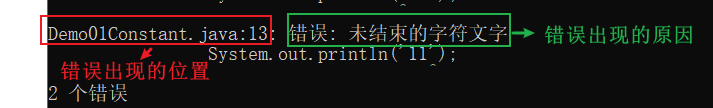

# 第二章.变量

| 数据类型     | 关键字         | 内存占用 | 取值范围                                                     |
| :----------- | :------------- | :------- | :----------------------------------------------------------- |
| 字节型       | byte           | 1个字节  | -128 至 127  定义byte变量时超出范围,废了                     |
| 短整型       | short          | 2个字节  | -32768 至 32767                                              |
| 整型         | int（默认）    | 4个字节  | -2^31^ 至 2^31^-1  正负21个亿<br>-2147483648——2147483647     |
| 长整型       | long           | 8个字节  | -2^63^ 至 2^63^-1   19位数字<br>-9223372036854775808到9223372036854775807 |
| 单精度浮点数 | float          | 4个字节  | 1.4013E-45 至 3.4028E+38                                     |
| 双精度浮点数 | double（默认） | 8个字节  | 4.9E-324 至 1.7977E+308                                      |
| 字符型       | char           | 2个字节  | 0 至 2^16^-1                                                 |
| 布尔类型     | boolean        | 1个字节  | true，false(可以做判断条件使用)                              |

## 1.变量的介绍以及使用

```java
1.变量的数据类型:
  基本数据类型:4类8种
      整型:byte short int long
      浮点型:float double
      字符型:char
      布尔型:boolean
          
  引用数据类型: 类 数组 接口 枚举 注解
      
2.概述:在代码的运行过程中,值会随着不同的情况而随时发生改变的数据
    
3.作用:一次接收一个数据
       将来定义一个变量,接收一个值,后续可能会根据不同的情况对此值进行修改,此时可以用变量
    
4.定义:
  a.数据类型 变量名 = 值;

  b.数据类型 变量名;
    变量名 = 值;

  c.连续定义三个相同类型的变量
    数据类型 变量名1,变量名2,变量名3;
    变量名1 = 值;
    变量名2 = 值;
    变量名3 = 值;

    比如:int i,j,k;
         i = 10;
         j = 20; 
         k = 30;


    数据类型 变量名1 = 值,变量名2 = 值,变量名3 = 值;
    比如: int i = 10,j = 20,k = 30;

    正确读法:先看等号右边的,再看等号左边的 -> 将等号右边的数据赋值给等号左边的变量
            哪怕等号右边有运算,我们都得先将等号右边的运算算出一个值来,最后赋值给等号左边的变量
        
5.注意:
  a.字符串不属于基本数据类型,属于引用数据类型,用String表示
    String是一个类,只不过字符串在定义的时候可以和基本数据类型格式一样
      
6.float和double的区别:
  a.float的小数位只有23位二进制,能表示的最大十进制为2的23次方(8388608),是7位数,所以float型代表的小数,小数位能表示7位
      
  b.double的小数位只有52位二进制,能表示的最大十进制为(4 503 599 627 370 496),是16位数,所以double型代表的小数,小数位能表示出16位
      
      
7.切记:将来开发不要用float或者double直接参与运算,因为直接参与运算会有精度损失问题    
```

```java
public class Demo03Var{
	public static void main(String[] args){
		//byte
		byte num1 = 100;
		System.out.println(num1);
		
		//short
		short num2 = 1000;
		num2 = 1001;
		System.out.println(num2);
		
		//int  整数的默认类型
		int num3 = 10000;
		num3 = 1;
		System.out.println(num3);
		
		//long -> 定义long型的变量后面加个L
		long num4 = 10L;
		System.out.println(num4);
		
		//float -> 定义float型变量的时候后面加个F
		float num5 = 2.5F;
		System.out.println(num5);
		
		//double -> 小数的默认类型
		double num6 = 2.5;
		System.out.println(num6);
		
		//char
		char num7 = 'A';
		System.out.println(num7);
		
		//boolean
		boolean num8 = true;
		boolean num9 = false;
		
		/*
		   num9 = false
		   num8 = num9 -> 将num9的值赋值给num8 -> 相当于num8 = false
		*/
		num8 = num9;
		System.out.println(num8);
		
		//String -> 是一个引用数据类型,属于类的一种,但是定义和基本类型一致
		String name = "金莲";
		System.out.println(name);
	}
}
```

```java
public class Demo04Var{
	public static void main(String[] args){
		int num1 = 10;
		int num2 = 3;
		
		int sum = num1+num2;
		System.out.println(sum);//13
		
		int sub = num1-num2;
		System.out.println(sub);//7
		
		//System.out.println(num1*num2);//30
		int mul = num1*num2;
		System.out.println(mul);//30
		
		/*
		  由于/前后都是整数,结果取整数部分,结果还赋值给一个整数变量
		*/
		int div = num1/num2;
		System.out.println(div);//3
		
		double div1 = num1/num2;//3.0
		System.out.println(div1);
	}
}
```

```java
public class Demo05Var{
	public static void main(String[] args){
		/*
		  转义字符:  \
		  
		  可以这样简单理解:
		    a.将普通字符转成具有特殊含义的字符
			b.将具有特殊含义的字符转成普通字符
		
		*/
		
		
		/*
		   n:普通字符
		   \n:换行符
		*/
		
		System.out.print("春眠不觉晓\n");
		System.out.print("处处闻啼鸟\n");
		System.out.print("夜来风雨声\n");
		System.out.print("花落知多少\n");
		
		/*
		   t:普通字符
		   \t:制表符 -> 就是tab键
		*/
		System.out.println("本人\t是尚硅谷第一帅");
		
		
		/*
		  用String表示一个路径
		  在java中两个\\代表一个\
		*/
		
		String path = "E:\\01_javase_video\\code";
		System.out.println(path);
	}
}
```

```java
public class Demo06Var{
	public static void main(String[] args){
		float a = 10;
		float b = 3;
		
		float result = a/b;
		System.out.println(result);//3.3333333
		
		
		double c = 10;
		double d = 3;
		double result02 = c/d;
		System.out.println(result02);//3.3333333333333335
		
		
		float x = 3.55F;
		float y = 2.12F;
		
		float result03 = x-y;
		System.out.println(result03);//1.4300001
		
	}
}
```

## 2.变量使用时的注意事项

```java
1.变量不初始化(第一次赋值)不能直接使用
2.在同一个作用域(一对大括号就是一个作用域)中不能定义重名的变量 
3.不同作用域中的数据尽量不要随意互相访问
  在小作用域中能直接访问大作用域中的变量
  在大作用域中不能直接访问小作用域中的变量
```

```java
public class Demo07Var{
	public static void main(String[] args){
		int i = 10;
		System.out.println(i);
		
		int j;
		
		j = 10;
		System.out.println(j);
		
		int k = 10;
		//int k = 20;//只要是变量名前带具体的数据类型就是重新定义
		System.out.println(k);
		
		{
		   int x = 1000;
           System.out.println(k);		   
		}
		
		//System.out.println(x);	
		
	}
}
```

## 3.练习

```java
定义一个人类,用变量表示 姓名 性别 年龄 身高 体重
```

```java
public class Demo08VarPerson{
	public static void main(String[] args){
		//姓名
		String name = "张三";
		//性别
		char sex = '男';
		//年龄
		int age = 20;
		//身高
		double height = 175.5;
		//体重
		double weight = 145.5;
		
		System.out.println(name);
		System.out.println(sex);
		System.out.println(age);
		System.out.println(height);
		System.out.println(weight);
	}
}
```

# 第三章.标识符

```java
1.概述:咱们给类,方法,变量取的名字
2.注意:
  a.硬性规定(必须遵守)
    标识符可以包含"英文字母","数字","$和_"
    标识符不能以数字开头  int i1 = 100(正确)  int 1i = 100(错误)
    标识符不能是关键字  int static = 100(错误)   int public = 100(错误)
      
  b.软性建议(可遵守可不遵守,但是建议遵守)
    给类取名字:遵循大驼峰式 -> 每个单词首字母大写
    给方法和变量取名字:遵循小驼峰式 -> 从第二个单词开始往后首字母大写
   
    见名知意
```

# 第四章.数据类型转换

```java
1.什么时候发生类型转换:
  a.等号左右两边类型不一致
  b.不同类型的数据做运算
      
2.分类:
  a.自动类型转换
    将取值范围小的数据类型赋值给取值范围大的数据类型 -> 小自动转大
    取值范围小的数据类型和取值范围大的数据类型数据做运算 -> 小自动转大
      
  b.强制类型转换
    当将取值范围大的数据类型赋值给取值范围小的数据类型 -> 需要强转
      
3.基本类型中按照取值范围从小到大排序:
  byte,short,char -> int -> long -> float -> double     
```

## 1.自动类型转换

```java
1.将取值范围小的数据类型赋值给取值范围大的数据类型 -> 小自动转大
2.取值范围小的数据类型和取值范围大的数据类型做运算 -> 小自动转大    
```

```java
public class Demo09DataType{
	public static void main(String[] args){
		/*
		  等号右边是整数,整数默认类型为int
		  等号左边是long型的变量
		  
		  将取值范围小的数据类型赋值给取值范围大的数据类型,发生了自动类型转换
		*/
		long num1 = 100;
		System.out.println(num1);
		
		
		int i = 10;
		double b = 2.5;
		
		/*
		   double = int+double
		   double  = double+double
		   int自动提升为了double,发生了自动类型转换
		*/
		double sum = i+b;
		System.out.println(sum);
	}
}
```

## 2.强制类型转换

```java
1.将取值范围大的数据类型赋值给取值范围小的数据类型
  取值范围小的数据类型 变量名 = 取值范围大的数据类型 -> 需要强转
    
2.怎么强转:
  取值范围小的数据类型 变量名 = (取值范围小的数据类型)取值范围大的数据类型
```

```java
public class Demo10DataType{
	public static void main(String[] args){
		/*
		  等号右边的数据是小数,小数默认类型为double
		  等号左边的变量是float型
		  
		  将取值范围大的赋值给取值范围小 -> 报错,需要强转
		*/
		//float num1 = 2.5;
		//float num1 = (float)2.5;
		float num1 = 2.5F;
		System.out.println(num1);
		
	}
}
```

## 3.强转的注意事项

```java
1.不要随意写成强转的格式,因为会有精度损失问题以及数据溢出现象,除非没有办法
2.byte,short定义的时候如果等号右边是整数常量,如果不超出byte和short的范围,不需要我们自己强转,jvm自动转型  
    
  byte,short如果等号右边有变量参与,byte和short自动提升为int,然后结果再次赋值给byte或者short的变量,需要我们自己手动强转
    
    
3.char类型数据如果参与运算,会自动提升为int型,如果char类型的字符提升为int型会去ASCII码表(美国标准交换代码)范围内去查询字符对应的int值,如果在ASCII码表范围内没有对应的int值,回去unicode码表(万国码)中找  
```

```java
public class Demo11DataType{
	public static void main(String[] args){
		//精度损失
		int i = (int)2.9;
		System.out.println(i);
		
		/*
		  数据溢出
		  int型占内存4个字节,4个字节变成二进制是32位
		  
		  100个亿: 10 0101 0100 0000 1011 1110 0100 0000 0000 -> 34位二进制
		  
		  100个亿的二进制位比int型的二进制位多出来2位,此时干掉最前面的2位
		  
		  101 0100 0000 1011 1110 0100 0000 0000
		  
		  101 0100 0000 1011 1110 0100 0000 0000->1410065408
		*/
		int j = (int)10000000000L;
		System.out.println(j);//1410065408
		
	    System.out.println("=========================");
		
		byte b = 10;
		System.out.println(b);
		
		b = (byte)(b+1);
		System.out.println(b);
		
		System.out.println("=========================");
		
		char c = '中';
		System.out.println(c+0);//20013
	}
}
```

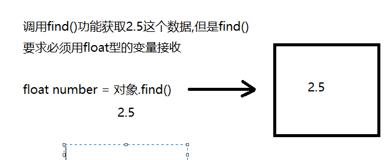

# 第五章.进制的转换(了解)

| 十进制 | 二进制 | 八进制 | 十六进制 |
| ------ | ------ | ------ | -------- |
| 0      | 0      | 0      | 0        |
| 1      | 1      | 1      | 1        |
| 2      | 10     | 2      | 2        |
| 3      | 11     | 3      | 3        |
| 4      | 100    | 4      | 4        |
| 5      | 101    | 5      | 5        |
| 6      | 110    | 6      | 6        |
| 7      | 111    | 7      | 7        |
| 8      | 1000   | 10     | 8        |
| 9      | 1001   | 11     | 9        |
| 10     | 1010   | 12     | a或A     |
| 11     | 1011   | 13     | b或B     |
| 12     | 1100   | 14     | c或C     |
| 13     | 1101   | 15     | d或D     |
| 14     | 1110   | 16     | e或E     |
| 15     | 1111   | 17     | f或F     |
| 16     | 10000  | 20     | 10       |

## 3.1 十进制转成二进制

```java
辗转相除法 -> 循环除以2,取余数
```

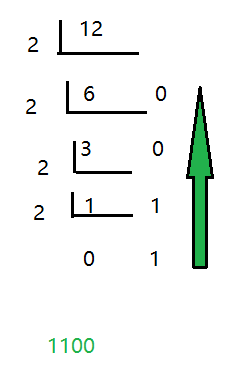

## 3.2 二进制转成十进制

```java
8421规则
```

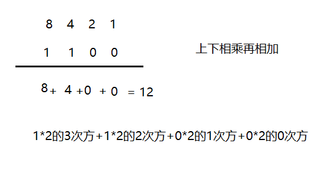

## 3.3 二进制转成八进制

```java
将二进制数分开  (3位为一组)
```

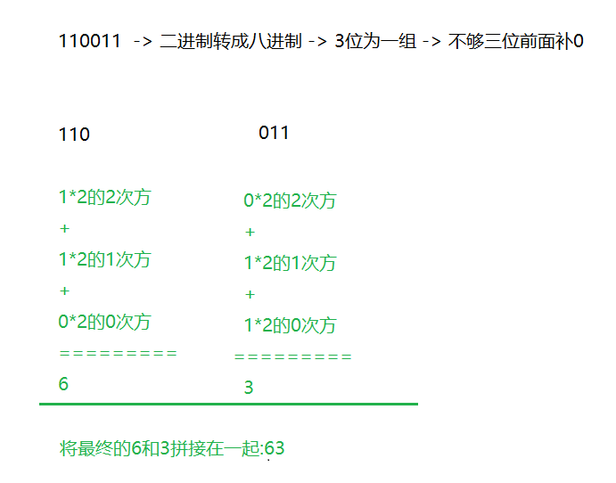

## 3.4 二进制转成十六进制

```java
 将二进制数分组-> 4位为一组
```

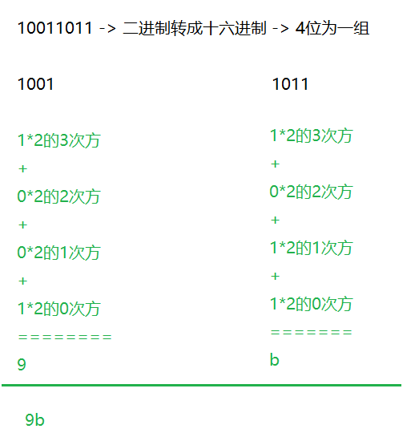

# 第六章.位运算符(了解)

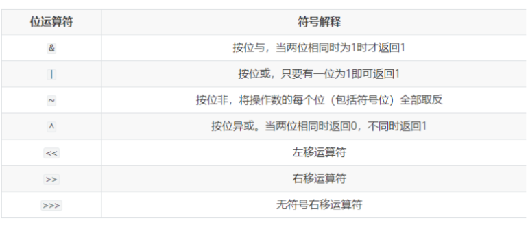

```java
1.符号的介绍:
  a. &(与) -> 有假则假
  b. |(或) -> 有真则真
  c. ~(非) -> 取反
  d. ^(异或) -> 符号前后结果一样为false,不一样为true
     true ^ true -> false
     false ^ false -> false
     true ^ false -> true
     false ^ true -> true
      
2.   1代表true   0代表false  
      
3.我们要知道计算机在存储数据的时候都是存储的数据的补码,计算也是用的数据的补码 
  但是我们最终看到的结果是原码换算出来的
      
  原码   反码   补码
      
4.正数二进制最高位为0;  负数二进制最高位为1
    
5.如果是正数  原码 反码 补码 一致
  比如:5的原码  反码  补码一致:
      0000 0000 0000 0000 0000 0000 0000 0101 -> 因为是正数,二进制最高位为0
          
  如果是负数,原码 反码 补码不一样了
       反码是原码的基础上最高位不变,剩下的0和1互换
       补码是在反码的基础上+1
          
  比如:-9
       原码: 1000 0000 0000 0000 0000 0000 0000 1001
       反码: 1111 1111 1111 1111 1111 1111 1111 0110
       补码: 1111 1111 1111 1111 1111 1111 1111 0111
```

#### （1）左移：<<

​	**运算规则**：左移几位就相当于乘以2的几次方

​	**注意：**当左移的位数n超过该数据类型的总位数时，相当于左移（n-总位数）位

```java
2<<2   结果等于8
快速算法:  2*(2的2次方)
```

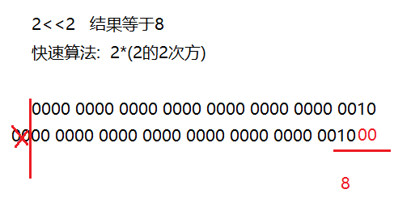

```java
-2<<2  等于-8
快速算法: -2*(2的2次方)
```

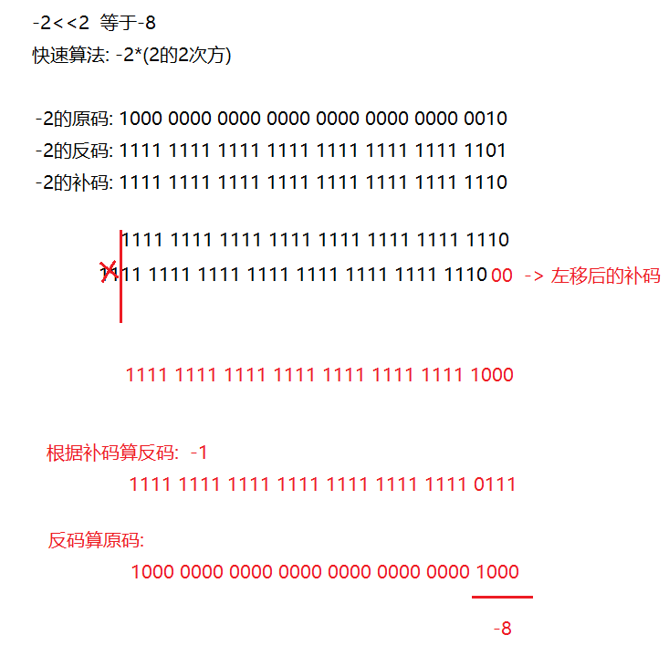

#### （2）右移：>>

快速运算：类似于除以2的n次，如果不能整除，**向下取整**

```java
9>>2  等于2
    
快速算法: 9除以(2的2次方)
```

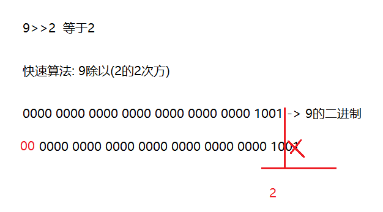

```java
-9>>2   等于-3
    
快速算法: -9除以(2的2次方)
```

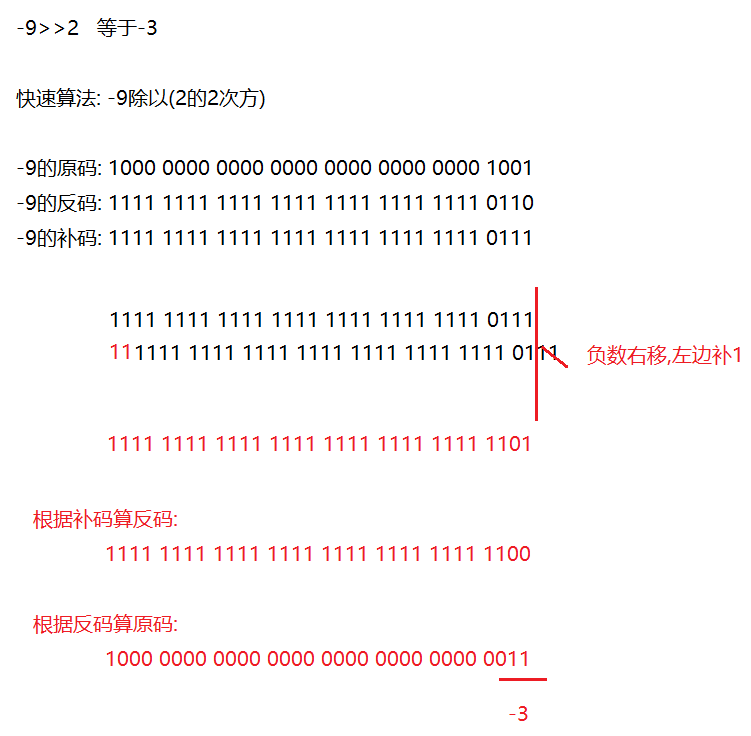

#### （3）无符号右移：>>>

运算规则：往右移动后，左边空出来的位直接补0，不管最高位是0还是1空出来的都拿0补

正数：和右移一样

```java
9>>>2 等于2
```

负数：右边移出去几位，左边补几个0，结果变为正数

```java
-9>>>2
结果为:1073741821    
```

> 笔试题: 8>>>32位 -> 相当于没有移动还是8
>
> ​              8>>>34位 -> 相当于往右移动2位

#### （4）按位与：&

小技巧:将0看成为false  将1看成true

运算规则：对应位都是1才为1,相当于符号左右两边都为true,结果才为true

1&1 结果为1

1&0 结果为0

0&1 结果为0

0&0 结果为0

```java
5&3 结果1
```

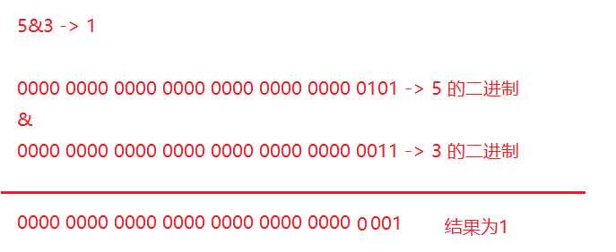

#### （5）按位或：|

运算规则：对应位只要有1即为1,相当于符号前后只要有一个为true,结果就是true

1|1    结果1

1|0    结果1

0|1    结果1

0|0    结果0

```
5|3    结果为7
```

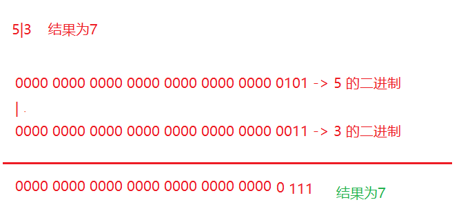

#### （6）按位异或：^

​	运算规则：对应位一样的为0,不一样的为1

1^1  结果为0  false

1^0  结果为1 true

0^1  结果为1  true

0^0  结果0   false

```java
5^3   结果为6
```

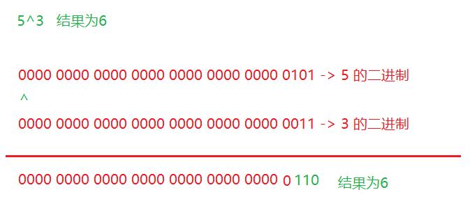

#### （7）按位取反

运算规则：~0就是1  

​			       ~1就是0

```java
~10   结果为-11
```

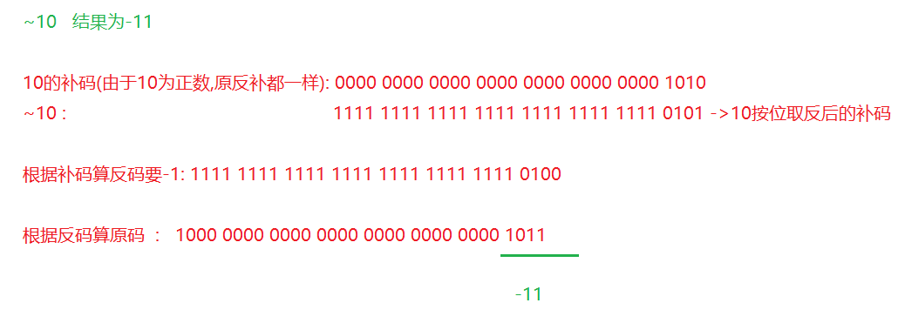

# 第七章.运算符的优先级(了解)

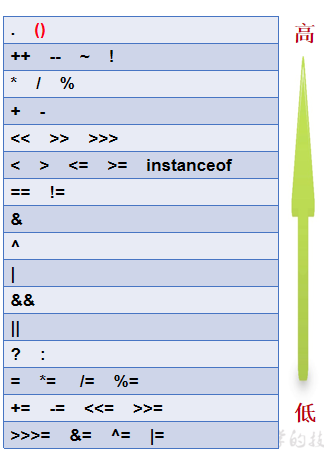

```java
提示说明：
（1）表达式不要太复杂
（2）先算的使用(),记住,如果想让那个表达式先运行,就加小括号就可以了
i<(n*m)
```
