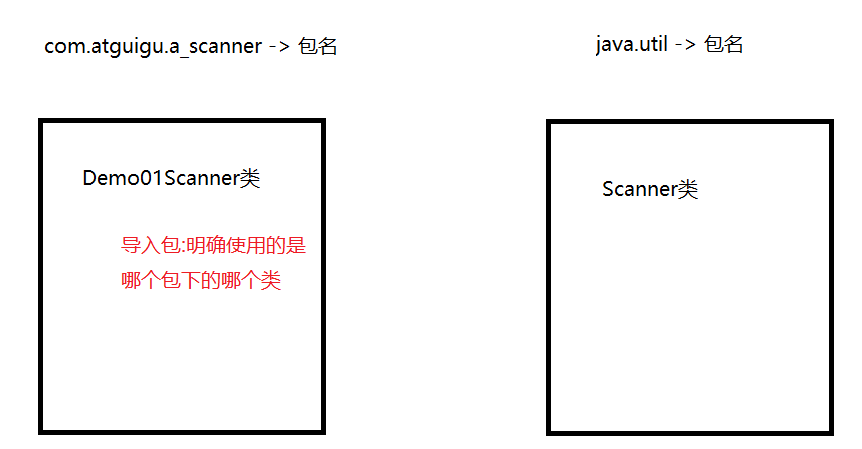
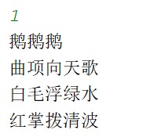
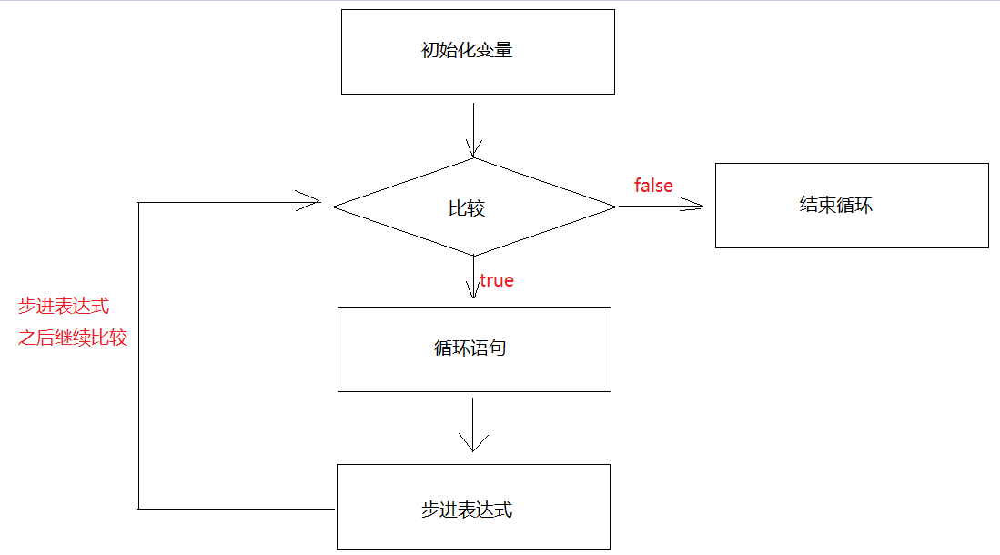
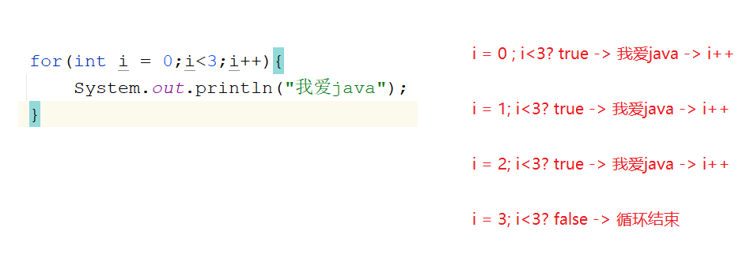
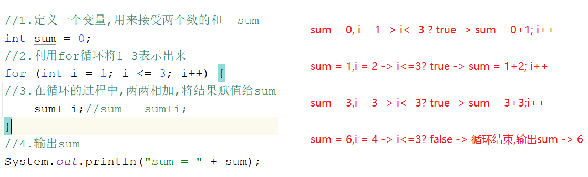

# 模块四_流程控制

```java
模块三重点回顾:
  1.idea -> 自己看
  2.算数运算符: + - * / %(取余数)
    +:字符串拼接 -> 内容直接往后拼接
        
    自增自减:++ --
        a.单独使用:符号在前在后都是先运算
        b.混合使用:符号在前先运算,再使用运算后的值
                  符号在后先使用原值,再运算
            
  3.赋值运算符:
    = += -= *= /= %=
  4.比较运算符:结果都是boolean型的
    == > < >= <= !=    
      
  5.逻辑运算符:连接boolean结果的,结果还是boolean
    &&(短路效果) ||(短路效果) !(取反)  ^
      
  6.三元运算符:
    a.格式:
      boolean表达式?表达式1:表达式2
    b.执行流程:先走boolean表达式,如果是true,就走?后面的表达式1,否则就走:后面的表达式2
        
模块四重点:
  1.会使用Scanner和Random
  2.会使用switch以及知道case的穿透性
  3.会使用if
  4.会使用for循环,while循环,嵌套循环
  
```

# 第一章.键盘录入_Scanner

```java
1.概述:是java定义好的一个类
2.作用:将数据通过键盘录入的形式放到代码中参与运行 
3.位置:java.util
4.使用:
  a.导包:通过导包找到要使用的类 -> 导包位置:类上
    import java.util.Scanner -> 导入的是哪个包下的哪个类
      
  b.创建对象
    Scanner 变量名 = new Scanner(System.in);

  c.调用方法,实现键盘录入
    变量名.nextInt() 输入整数int型的
    变量名.next() 输入字符串  String型的  
```



```java
public class Demo01Scanner {
    public static void main(String[] args) {
        //创建对象
        Scanner sc = new Scanner(System.in);
        //录入int型整数
        int data1 = sc.nextInt();
        System.out.println("data1 = " + data1);

        //录入String型字符串
        String data2 = sc.next();
        System.out.println("data2 = " + data2);
    }
}

====================================================
public class Demo02Scanner {
    public static void main(String[] args) {
        //创建对象
        Scanner sc = new Scanner(System.in);
        //录入int型整数
        int old1 = sc.nextInt();
        int old2 = sc.nextInt();
        int old3 = sc.nextInt();

        int temp = old1>old2?old1:old2;
        int max = temp>old3?temp:old3;
        System.out.println(max);
    }
}
    
```

> ```java
> 变量名.next():录入字符串 -> 遇到空格和回车就结束录入了
> 变量名.nextLine():录入字符串 -> 遇到回车就结束录入了
> ```
>
> ```java
> public class Demo03Scanner {
>     public static void main(String[] args) {
>         Scanner sc = new Scanner(System.in);
>         String data1 = sc.next();
>         String data2 = sc.nextLine();
>         System.out.println(data1);
>         System.out.println(data2);
>     }
> }
> ```
>
> ```java
> Exception in thread "main" java.util.InputMismatchException -> 输入类型不匹配异常
> 	at java.base/java.util.Scanner.throwFor(Scanner.java:939)
> 	at java.base/java.util.Scanner.next(Scanner.java:1594)
> 	at java.base/java.util.Scanner.nextInt(Scanner.java:2258)
> 	at java.base/java.util.Scanner.nextInt(Scanner.java:2212)
> 	at com.atguigu.a_scanner.Demo04Scanner.main(Demo04Scanner.java:8)
>     
> 原因:录入的数据和要求的数据类型不一致    
> ```
>

# 第二章.Random随机数

> 学习Random和学习Scanner方式方法一样

```java
1.概述:java自带的一个类
2.作用:可以在指定的范围内随机一个整数
3.位置:java.util
4.使用:
  a.导包:import java.util.Random
  b.创建对象:
    Random 变量名 = new Random()
  c.调用方法,生成随机数:
    变量名.nextInt() -> 在int的取值范围内随机一个整数
```

```java
public class Demo01Random {
    public static void main(String[] args) {
        //创建对象
        Random rd = new Random();
        int data = rd.nextInt();
        System.out.println("data = " + data);
    }
}
```

```java
在指定范围内随机一个数:
nextInt(int bound) -> 在0-(bound-1)
    
a.nextInt(10) -> 0-9
b.在1-10之间随机一个数: nextInt(10)+1 -> (0-9)+1 -> 1-10
c.在1-100之间随机一个数:nextInt(100)+1 -> (0-99)+1 -> 1-100
d.在100-999之间随机一个数: nextInt(900)+100 -> (0-899)+100 -> 100-999
```

```java
public class Demo02Random {
    public static void main(String[] args) {
        //创建对象
        Random rd = new Random();
        //在1-100之间随机
        int data1 = rd.nextInt(100)+1;
        System.out.println("data1 = " + data1);

        System.out.println("=====================");

        //在100-999之间随机一个数
        int data2 = rd.nextInt(900)+100;
        System.out.println("data2 = " + data2);
    }
}

```

# 第三章.switch(选择语句)

```java
学switch  if  循环必须要先掌握定义格式,然后掌握执行流程(带一个数进去,根据执行流程观察值的变化)
```

## 1.switch基本使用

```java
1.格式:
  switch(变量){
      case 常量值1:
          执行语句1;
          break;
          
      case 常量值2:
          执行语句2;
          break;
          
      case 常量值3:
          执行语句3;
          break;
          
      case 常量值4:
          执行语句4;
          break;
          ...
      default:
          执行语句n;
          break;
  }

2.执行流程:
  用变量接收的值和下面case后面的常量值匹配,匹配上哪个case就执行哪个case对应的执行语句
  如果以上所有case都没有匹配上,就走default对应的执行语句n
      
3.break关键字:代表的是结束switch语句 
    
4.注意:switch能匹配什么类型的数据:
  byte short int char 枚举类型 String类型
  
   
```

```java
public class Demo01Switch {
    public static void main(String[] args) {
        Scanner sc = new Scanner(System.in);
        System.out.println("请您输入一个整数:");
        int data = sc.nextInt();
        switch (data){
            case 1:
                System.out.println("鹅鹅鹅");
                break;
            case 2:
                System.out.println("曲项向天歌");
                break;
            case 3:
                System.out.println("白毛浮绿水");
                break;
            case 4:
                System.out.println("红掌拨清波");
                break;
            default:
                System.out.println("下面没有了");
                break;

        }

    }
}
```

## 2.case的穿透性

```java
1.如果没有break,就会出现case的穿透性,程序就一直往下穿透执行,直到遇到了break或者switch代码执行完毕了,就停止了
```

```java
public class Demo02Switch {
    public static void main(String[] args) {
        Scanner sc = new Scanner(System.in);
        int data = sc.nextInt();
        switch (data){
            case 1:
                System.out.println("鹅鹅鹅");

            case 2:
                System.out.println("曲项向天歌");

            case 3:
                System.out.println("白毛浮绿水");

            case 4:
                System.out.println("红掌拨清波");
                break;
            default:
                System.out.println("下面没有了");
                break;

        }
    }
}

```



```java
public class Demo03Switch {
    public static void main(String[] args) {
        Scanner sc = new Scanner(System.in);
        int month = sc.nextInt();
        switch(month){
            case 12:
                System.out.println("冬季");
                break;
            case 1:
                System.out.println("冬季");
                break;
            case 2:
                System.out.println("冬季");
                break;
            case 3:
                System.out.println("春季");
                break;
            case 4:
                System.out.println("春季");
                break;
            case 5:
                System.out.println("春季");
                break;
            case 6:
                System.out.println("夏季");
                break;
            case 7:
                System.out.println("夏季");
                break;
            case 8:
                System.out.println("夏季");
                break;
            case 9:
                System.out.println("秋季");
                break;
            case 10:
                System.out.println("秋季");
                break;
            case 11:
                System.out.println("秋季");
                break;
            default:
                System.out.println("什么情况,你家有这个月份?");
        }
    }
}
```

```java
public class Demo03Switch {
    public static void main(String[] args) {
        Scanner sc = new Scanner(System.in);
        int month = sc.nextInt();
        switch(month){
            case 12:
            case 1:
            case 2:
                System.out.println("冬季");
                break;

            case 3:
            case 4:
            case 5:
                System.out.println("春季");
                break;

            case 6:
            case 7:
            case 8:
                System.out.println("夏季");
                break;

            case 9:
            case 10:
            case 11:
                System.out.println("秋季");
                break;
            default:
                System.out.println("什么情况,你家有这个月份?");
        }
    }
}

```

# 第四章.分支语句

### 1.if的第一种格式

```java
1.格式:
  if(boolean表达式){
      执行语句;
  }

2.执行流程:
  先走if后面的boolean表达式,如果是true,就走if后面大括号中的执行语句,否则就不走
      
3.注意:
  if后面跟的是boolean表达式,只要是结果为boolean型的,都可以放在小括号中,哪怕直接写一个true或者false
```

```java
public class Demo01If {
    public static void main(String[] args) {
        Scanner sc = new Scanner(System.in);
        int data1 = sc.nextInt();
        int data2 = sc.nextInt();
        if (data1==data2){
            System.out.println("两个整数相等");
        }
    }
}
```

### 2.if的第二种格式

```java
1.格式:
  if(boolean表达式){
      执行语句1;
  }else{
      执行语句2;
  }
2.执行流程:
  a.先走if后面的boolean表达式,如果是true,就走if后面的执行语句1
  b.否则就走else后面的执行语句2    
```

```java
public class Demo02IfElse {
    public static void main(String[] args) {
        Scanner sc = new Scanner(System.in);
        int data1 = sc.nextInt();
        int data2 = sc.nextInt();
        if (data1==data2){
            System.out.println("两个整数相等");
        }else{
            System.out.println("两个整数不相等");
        }
    }
}
```

#### 2.1 练习

```java
任意给出一个整数，请用程序实现判断该整数是奇数还是偶数，并在控制台输出该整数是奇数还是偶数
```

```java
public class Demo03IfElse {
    public static void main(String[] args) {
        Scanner sc = new Scanner(System.in);
        int data = sc.nextInt();
        if (data%2==0){
            System.out.println("偶数");
        }else{
            System.out.println("奇数");
        }
    }
}
```

#### 2.2练习

```java
需求.利用if  else 求出两个数的较大值
```

```java
public class Demo04IfElse {
    public static void main(String[] args) {
        int i = 10;
        int j = 20;
        if (i>j){
            System.out.println(i);
        }else{
            System.out.println(j);
        }
    }
}

```

```java
public class Demo05IfElse {
    public static void main(String[] args) {
        int i = 10;
        int j = 20;
        int k = 30;

        //定义临时变量,接收前两个数的较大值
        int temp = 0;

        if (i>j){
            temp = i;
        }else{
            temp = j;
        }

        if (temp>k){
            System.out.println(temp);
        }else{
            System.out.println(k);
        }
    }
}
```

#### 2.3练习

```java
案例：从键盘输入年份，请输出该年的2月份的总天数。闰年2月份29天，平年28天。
闰年:
 a.能被4整除,但是不能被100整除  year%4==0 && year%100!=0
 b.或者能直接被400整除  year%400==0

步骤:
  1.创建Scanner对象,调用nextInt键盘录入一个年份 year
  2.判断(year%4==0 && year%100!=0) || (year%400==0)
  3.如果条件成立,就输出闰年2月29天,否则输出平年2月28天    
```

```java
public class Demo06IfElse {
    public static void main(String[] args) {
        //1.创建Scanner对象,调用nextInt键盘录入一个年份 year
        Scanner scanner = new Scanner(System.in);
        int year = scanner.nextInt();
        //2.判断(year%4==0 && year%100!=0) || (year%400==0)
        if ((year%4==0 && year%100!=0) || (year%400==0)){
        //3.如果条件成立,就输出闰年2月29天,否则输出平年2月28天
            System.out.println("闰年2月29天");
        }else{
            System.out.println("平年2月28天");
        }
    }
}
```

#### 2.4练习

```java

public class Demo07IfElse {
    public static void main(String[] args) {
        boolean num1 = false;
        boolean num2 = true;

        int i = 1;

        /*
           num1 = false
           num2 = true
           num1 = num2 -> 相当于将num2的true赋值给了num1
         */
        if (num1=num2){
            i++;
            System.out.println(i);//2
        }

        if (false){
            --i;
            System.out.println(i);
        }
    }
}

```

### 3.if的第三种格式

```java
1.格式:
  if(boolean表达式){
      执行语句1
  }else if(boolean表达式){
      执行语句2
  }else if(boolean表达式){
      执行语句3
  }...else{
      执行语句n
  }

2.执行流程:
  从if开始往下挨个判断,哪个if判断结果为true,就走哪个if对应的执行语句,如果以上所有的判断都是false,就走else对应的执行语句n
      
3.使用场景:2种情况以上的判断      
```

```java
public class Demo08ElseIf {
    public static void main(String[] args) {
        Scanner sc = new Scanner(System.in);
        int data1 = sc.nextInt();
        int data2 = sc.nextInt();
       /* if (data1>data2){
            System.out.println("data1大于data2");
        }else if(data1<data2){
            System.out.println("data1小于data2");
        }else{
            System.out.println("data1等于data2");
        }*/

        if (data1>data2){
            System.out.println("data1大于data2");
        }else if(data1<data2){
            System.out.println("data1小于data2");
        }else if (data1==data2){
            System.out.println("data1等于data2");
        }
    }
}

```

```java
注意:最后一种情况,不一定非得用else,但是必须要保证所有的情况都判断了
```

#### 3.1.练习

```java
需求:
 键盘录入一个星期数(1,2,...7)，输出对应的星期一，星期二，...星期日

输入  1      输出	星期一
输入  2      输出	星期二
输入  3      输出	星期三
输入  4      输出	星期四
输入  5      输出	星期五
输入  6      输出	星期六
输入  7      输出	星期日
输入  其它数字   输出      数字有误

```

```java
public class Demo09ElseIf {
    public static void main(String[] args) {
        Scanner sc = new Scanner(System.in);
        int week = sc.nextInt();
        /*if (week==1){
            System.out.println("周一");
        }else if (week==2){
            System.out.println("周二");
        }else if (week==3){
            System.out.println("周三");
        }else if (week==4){
            System.out.println("周四");
        }else if (week==5){
            System.out.println("周五");
        }else if (week==6){
            System.out.println("周六");
        }else if (week==7){
            System.out.println("周日");
        }else{
            System.out.println("是不是有点大病,没有这个星期!");
        }*/

        if (week<1 || week>7){
            System.out.println("是不是有点大病,没有这个星期!");
        }else{
            if (week==1){
                System.out.println("周一");
            }else if (week==2){
                System.out.println("周二");
            }else if (week==3){
                System.out.println("周三");
            }else if (week==4){
                System.out.println("周四");
            }else if (week==5){
                System.out.println("周五");
            }else if (week==6){
                System.out.println("周六");
            }else if (week==7){
                System.out.println("周日");
            }
        }
    }
}
```

#### 3.2练习

```java
根据最新的年龄段划分标准:
  0-6岁为婴幼儿
  7-12岁为少儿
  13-17岁为青少年
  18-45岁为青年
  46-69岁为中年
  69岁以上为老年
请键盘录入一个年龄,判断属于什么年龄段  
```

```java
public class Demo10ElseIf {
    public static void main(String[] args) {
        Scanner sc = new Scanner(System.in);
        int age = sc.nextInt();
       /* if (age>=0 && age<=6){
            System.out.println("婴幼儿");
        }else if (age>=7 && age<=12){
            System.out.println("少儿");
        }else if (age>=13 && age<=17){
            System.out.println("青少年");
        }else if(age>=18 && age<=45){
            System.out.println("青年");
        }else if(age>=46 && age<=69){
            System.out.println("中年");
        }else if (age>69 && age<=130){
            System.out.println("老年");
        }else {
            System.out.println("年龄不太符合实际");
        }*/

        if (age<0 || age>130){
            System.out.println("年龄不太符合实际");
        }else{
            if (age>=0 && age<=6){
                System.out.println("婴幼儿");
            }else if (age>=7 && age<=12){
                System.out.println("少儿");
            }else if (age>=13 && age<=17){
                System.out.println("青少年");
            }else if(age>=18 && age<=45){
                System.out.println("青年");
            }else if(age>=46 && age<=69){
                System.out.println("中年");
            }else if (age>69 && age<=130){
                System.out.println("老年");
            }
        }
    }
}

```

> switch和if的区别:debug
>
> 1.switch:会直接跳到相匹配的case
>
> 2.if:从上到下挨个判断 -> 实际开发主要用if做判断,灵活  

# 第五章.循环语句

```java
什么时候使用循环语句:
  当我们发现一件事或者一段代码在反复执行,我们就可以考虑使用循环语句了
```

## 1.for循环

```java
1.格式:
  for(初始化变量;比较;步进表达式){
      循环语句 -> 哪段代码循环执行,就将哪段代码放到此处
  }

2.执行流程:
  a.先走初始化变量
  b.比较,如果是true,走循环语句,走步进表达式(初始化的变量的值进行变化) 
  c.再比较,如果还是true,继续走循环语句,走步进表达式
  d.再比较,直到比较为false,循环结束了
```

 


```java
public class Demo01For {
    public static void main(String[] args) {
        for(int i = 0;i<3;i++){
            System.out.println("我爱java");
        }
    }
}

```




> 快捷键: 次数.fori

### 1.1练习

```java
for循环:求1-3之间的数据和,并把求和结果输出到控制台上
1+2+3
    
步骤:
  1.定义一个变量,用来接受两个数的和  sum
  2.利用for循环将1-3表示出来
  3.在循环的过程中,两两相加,将结果赋值给sum
  4.输出sum    
```

```java
public class Demo02For {
    public static void main(String[] args) {
        //1.定义一个变量,用来接受两个数的和  sum
        int sum = 0;
        //2.利用for循环将1-3表示出来
        for (int i = 1; i <= 3; i++) {
        //3.在循环的过程中,两两相加,将结果赋值给sum
            sum+=i;//sum = sum+i;
        }
        //4.输出sum
        System.out.println("sum = " + sum);
    }
}

```



### 1.2练习

```java
需求:求出1-100的偶数和

步骤:
  1.定义一个变量sum,接受两个偶数的和
  2.利用for循环将1-100表示出来
  3.判断,如果是偶数,相加,将加的结果赋值给sum
  4.输出sum    
```

```java
public class Demo03For {
    public static void main(String[] args) {
        //1.定义一个变量sum,接受两个偶数的和
        int sum = 0;
        //2.利用for循环将1-100表示出来
        for (int i = 1; i <= 100; i++) {
            //3.判断,如果是偶数,相加,将加的结果赋值给sum
            if (i % 2 == 0) {
                sum += i;
            }
        }
        //4.输出sum
        System.out.println("sum = " + sum);
    }
}

```

### 1.3练习

```java
统计一下1-100之间的偶数个数

步骤:
  1.定义一个变量count,用来计数
  2.利用for循环将1-100表示出来
  3.判断,如果是偶数,count++
  4.输出count    
```

```java
public class Demo04For {
    public static void main(String[] args) {
        //1.定义一个变量count,用来计数
        int count = 0;
        //2.利用for循环将1-100表示出来
        for (int i = 1; i <= 100; i++) {
            //3.判断,如果是偶数,count++
            if (i % 2 == 0) {
                count++;
            }
        }
        //4.输出count
        System.out.println("count = " + count);
    }
}
```

## 2.while循环

```java
1.格式:
  初始化变量;
  while(比较){
      循环语句;
      步进表达式
  }

2.执行流程:
  a.初始化变量
  b.比较,如果是true,就走循环语句,走步进表达式
  c.再比较,如果还是true,继续走循环语句,继续走步进表达式
  d.再比较,直到比较为false,循环结束
```

```java
public class Demo01While {
    public static void main(String[] args) {
        int i = 0;
        while(i<5){
            System.out.println("我爱java,我更爱钱");
            i++;
        }
    }
}
```

```java
public class Demo02While {
    public static void main(String[] args) {
        int sum = 0;
        int i = 1;
        while(i<=3){
           sum+=i;
           i++;
        }
        System.out.println("sum = " + sum);
    }
}
```

```java
public class Demo03While {
    public static void main(String[] args) {
        int sum = 0;
        int i = 1;
        while (i <= 100) {
            if (i % 2 == 0) {
                sum += i;
            }
            i++;
        }
        System.out.println("sum = " + sum);
    }
}
```

```java
public class Demo04While {
    public static void main(String[] args) {
        int count = 0;
        int i = 1;
        while (i <= 100) {
            if (i % 2 == 0) {
                count++;
            }
            i++;
        }
        System.out.println("count = " + count);
    }
}
```

### 1.1while练习

```java
需求：世界最高山峰是珠穆朗玛峰(8844.43米=8844430毫米)，假如我有一张足够大的纸，它的厚度是0.1毫米。请问，我折叠多少次，可以折成珠穆朗玛峰的高度? 27

步骤:
  1.定义一个变量表示山峰的高度  mountain
  2.定义一个变量表示纸的厚度    paper
  3.定义一个变量表示折纸的次数  count
  4.利用while循环循环比较,如果paper<mountain 就循环对折
    paper = paper*2;
    count++;
  5.输出count
```

```java
public class Demo05While {
    public static void main(String[] args) {
        //1.定义一个变量表示山峰的高度  mountain
        int mountain = 8844430;
        //2.定义一个变量表示纸的厚度    paper
        double paper = 0.1;
        //3.定义一个变量表示折纸的次数  count
        int count = 0;
        /*4.利用while循环循环比较,如果paper<mountain 就循环对折
          paper = paper*2;
          count++;*/
        while(paper<mountain){
            paper*=2;
            count++;
        }
        //5.输出count
        System.out.println("count = " + count);
    }
}
```

## 3.do...while循环(了解)

```java
1.格式:
  初始化变量;
  do{
      循环语句;
      步进表达式
  }while(比较);

2.执行流程:
  a.初始化变量
  b.走循环语句
  c.走步进表达式
  d.判断,如果是true,继续循环,直到比较为false,循环结束
      
3.特点:
  至少循环一次
```

```java
public class Demo01DoWhile {
    public static void main(String[] args) {
        int i = 0;
        do{
            System.out.println("我爱java");
            i++;
        }while(i<5);
    }
}
```

## 4.循环控制关键字

```java
1.break:
  a.在switch中代表结束switch语句
  b.在循环中代表结束循环 
      
2.continue:
  结束当前本次循环,直接进入下一次循环,直到条件为false为止
```

```java
public class Demo01BreakAndContinue {
    public static void main(String[] args) {
        for (int i = 1; i <= 5; i++) {
            if (i==3){
                //结束循环
                //break;
                //结束本次循环,进入下一次循环
                continue;
            }
            System.out.println("我爱java"+i);
        }
    }
}
```

## 5.死循环

```java
1.概述:
  一直循环
2.什么条件下一直循环:
  比较条件一直是true
  
```

```java
public class Demo01Endless {
    public static void main(String[] args) {
        int count = 0;
        for (int i = 0; i < 10;) {
            count++;
            System.out.println("我爱java"+count);
        }


       /* while(true){
            count++;
            System.out.println("我爱java"+count);
        }*/


    }
}
```

## 6.嵌套循环

```java
1.概述:循环中还有循环
2.执行流程:
  先执行外层循环,再进入内层循环,内层循环就一直循环,直到内层循环结束,外层循环进入下一次循环,直到外层循环都结束了,整体结束
```

```java
public class Demo02Nest {
    public static void main(String[] args) {
        for (int fen = 0; fen < 60; fen++) {
            for (int miao = 0; miao < 60; miao++) {
                System.out.println(fen+"分"+miao+"秒");
            }
        }
    }
}
```

```java
练习:打印矩形
```

```java
public class Demo03Nest {
    public static void main(String[] args) {
        //外层循环控制行
        for (int i = 0; i < 5; i++) {
            //内层循环控制列
            for (int j = 0; j < 5; j++) {
                System.out.print("* ");
            }
            System.out.println();
        }
    }
}
```

```java
练习:打印直角三角形
```

```java
* 
* * 
* * * 
* * * *   
```

```java
public class Demo04Nest {
    public static void main(String[] args) {
        for (int i = 1; i < 5; i++) {
            for (int j = 0;j<i;j++){
                System.out.print("* ");
            }
            System.out.println();
        }
    }
}

```

## 7.练习.猜数字小游戏

```java
1.创建Scanner和Random对象
2.调用Random中的nextInt(100)+1在1-100之间随机一个数  rdNumber
3.调用Scanner中的nextInt()方法 键盘录入一个要猜的数   scNumber
4.如果scNumber大于rdNumber,证明猜大了
5.如果scNumber小于rdNumber,证明猜小了
6.如果scNumber等于rdNumber,证明猜中了
```

```java
public class Demo01Exam {
    public static void main(String[] args) {
        //1.创建Scanner和Random对象
        Scanner sc = new Scanner(System.in);
        Random rd = new Random();
        //2.调用Random中的nextInt(100)+1在1-100之间随机一个数  rdNumber
        int rdNumber = rd.nextInt(100) + 1;
        while(true){
            //3.调用Scanner中的nextInt()方法 键盘录入一个要猜的数   scNumber
            System.out.println("请您猜一个数:");
            int scNumber = sc.nextInt();
            //4.如果scNumber大于rdNumber,证明猜大了
            if (scNumber>rdNumber){
                System.out.println("对不起,您猜大了!");
            }else if (scNumber<rdNumber){
                //5.如果scNumber小于rdNumber,证明猜小了
                System.out.println("对不起,您猜小了!");
            }else{
                //6.如果scNumber等于rdNumber,证明猜中了
                System.out.println("恭喜您,猜中了!");
                break;
            }
        }

    }
}
```

