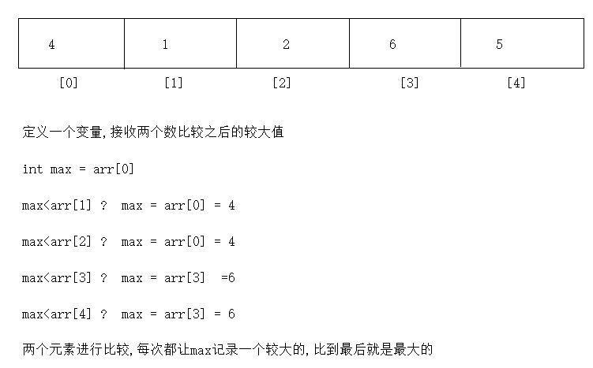

# day05.数组

```java
课前回顾:
   1.Scanner:
    a.导包: import java.util.Scanner
    b.创建对象:Scanner 名字 = new Scanner(System.in)
    c.调用方法:
      nextInt()录入一个整数
      next()录入一个字符串,遇到空格和回车就结束
      nextLine()录入一个字符串,遇到回车就结束
  2.switch:选择语句
    a.格式:
      switch(变量){
          case 常量值1:
              执行语句1;
              break;
          case 常量值2:
              执行语句2;
              break;
          ...
              default:
              执行语句n;
              break;
      }
    b.执行流程:用变量代表的值去精准匹配,配上哪个case就走哪个case对应的执行语句,如果都配不上,就走default
               
    c.没有break:会出现case的穿透性,一直穿透,直到遇到break或者switch结束为止

  3.if...else:
    a.格式:
      if(boolean表达式){
          执行语句1
      }else{
          执行语句2
      }
    b.执行流程:
      先走if后面的boolean表达式,如果是true,就走if后面的执行语句1,否则就走else后面的执行语句2
  4.else...if
    a.格式:
      if(boolean表达式){
          执行语句1
      }else if(boolean表达式){
          执行语句2
      }else if(boolean表达式){
          执行语句3
      }...else{
          执行语句n
      }
    b.执行流程:
      从上到下挨个判断,哪个条件为true,就走哪个if对应的执行语句,以上所有的if都没有匹配上,走else
          
 5.for循环:
   a.格式:
     for(初始化变量;比较;步进表达式){
         循环语句
     }
   b.执行流程:
     先初始化变量,比较,如果是true,走循环语句
     走步进表达式,再比较,如果还是true,继续循环,直到比较为false,循环结束
         
6.while循环:
   a.格式:
     初始化变量;
     while(比较){
         循环语句
         步进表达式
     }
   b.执行流程
     先初始化变量,比较,如果是true,走循环语句
     走步进表达式,再比较,如果还是true,继续循环,直到比较为false,循环结束
       
 7.do...while循环:
   a.格式:
     初始化变量;
     do{
         循环语句
         步进表达式
     }while(比较);
   b.执行流程:
     初始化变量;
     循环语句
     步进表达式
     比较,如果是true,继续循环,直到比较为false
 8.死循环:比较永远是true
 9.嵌套循环:

   先走外层循环,再走内层循环,内层循环就一直循环,直到内层循环结束了,外层循环再进入下一次循环,直到连外层循环都结束了,循环整体结束
       
 10.循环控制关键字:
   break:结束循环
   continue:结束本次循环进入下一次循环
       
 9.Random
   a.概述:java定义好的类
   b.作用:在指定的范围内随机一个数
   c.使用:
     导包-> import java.util.Random
     创建对象-> Random 对象名 = new Random()
     调用方法: 
        对象名.nextInt() 在int的取值范围内随机一个数
        对象名.nextInt(int bound) -> 在0-(bound-1)之间随机

模块五重点:
  1.数组的定义和特点
  2.数组的操作(存数据,取数据,遍历数据)
  3.二维数组(定义,取,存,遍历)
```

# 第一章.数组的定义

```java
1.问题:想将一个数据保存起来,我们可以使用变量,但是变量一次只能存储一个数据,所以我们想能不能一次存多个数据
    
2.数组概述:是一个容器,数组本身属于引用数据类型
    
3.作用:一次存储多个数据
    
4.特点:
  a.既可以存储基本类型的数据,还能存储引用类型的数据
  b.定长(定义数组时长度为多长,最多就能存多少个数据) 
      
5.定义:
  a.动态初始化:
    数据类型[] 数组名 = new 数据类型[长度]
    数据类型 数组名[] = new 数据类型[长度]    
    
    各部分解释:
      等号左边的数据类型:规定了数组中只能存储什么类型的元素
      []:代表的是数组,一个[]代表一维数组,两个[][]代表二维数组    
      数组名:自己取的名字,遵循小驼峰
      new:代表的是创建数组
      等号右边的数据类型:要和等号左边的数据类型一致
      [长度]:指定数组长度,规定了数组最多能存多少个数据    
          
  b.静态初始化
    数据类型[] 数组名 = new 数据类型[]{元素1,元素2...}  -> 不推荐使用 
    数据类型 数组名[] = new 数据类型[]{元素1,元素2...}  -> 不推荐使用    

  c.简化的静态初始化:
    数据类型[] 数组名 = {元素1,元素2...}-> 推荐使用
        
        
6.区别:
  a.动态初始化:定义的时候只指定了长度,没有存具体的数据
             当只知道长度,但不知道具体存啥数据时可以使用动态初始化
      
  
  b.静态初始化:定义的时候就直接知道存啥了   
```

```java
public class Demo01Array {
    public static void main(String[] args) {
        //动态初始化
        int[] arr1 = new int[3];
        String[] arr2 = new String[3];

        //静态初始化
        int[] arr3 = new int[]{1,2,3,4,5};

        //简化静态初始化
        int[] arr4 = {1,2,3,4,5};
        
        String[] arr5 = {"乾隆","和珅","纪晓岚"};
    }
}
```

# 第二章.数组操作

## 1.获取数组的长度

```java
1.格式:
  数组名.length
      
2.注意:
  length后面不要带小括号,因为length不是一个方法,而是数组中的一个属性
```

```java
public class Demo01Array {
    public static void main(String[] args) {
        //定义一个数组
        String[] arr1 = {"迪迦奥特曼","猫和老鼠","花园宝宝","海绵宝宝","圣斗士","百变小樱魔术卡","熊出没"};
        int len = arr1.length;
        System.out.println("len = " + len);
    }
}
```

## 2.索引

```java
1.概述:元素在数组中存储的位置
    
2.特点:
  a.索引唯一
  b.索引都是从0开始的,最大索引是数组长度-1 
      
3.注意:
  我们将来操作元素,必须通过索引来操作
  存数据,要指定索引
  取数据,要指定索引
  查数据,要指定索引
```


## 3.存储元素

```java
1.格式:
  数组名[索引值] = 值 -> 将等号右边的值放到数组指定的索引位置上
```

```java
public class Demo02Array {
    public static void main(String[] args) {
        int[] arr = new int[3];
        arr[0] = 100;//将100存到了arr这个数组的0索引上
        arr[1] = 200;//将200存到了arr这个数组的1索引上
        arr[2] = 300;//将300存到了arr这个数组的2索引上
        //arr[3] = 1000;

        System.out.println("============================");
        
        String[] arr1 = new String[3];
        arr1[0] = "东方不败";
        arr1[1] = "岳不群";
        arr1[2] = "林平之";
    }
}
```

```java
public class Demo03Array {
    public static void main(String[] args) {
        //键盘录入三个整数,存储到数组中
        int[] arr = new int[3];

        Scanner sc = new Scanner(System.in);

        /*
          先看等号右边的,先录入,将录入的数据保存到指定的索引位置上
         */
      /*  arr[0] = sc.nextInt();
        arr[1] = sc.nextInt();
        arr[2] = sc.nextInt();*/

       /* for (int i = 0; i < 3; i++) {
            arr[i] = sc.nextInt();
        }*/
        
        for (int i = 0; i < arr.length; i++) {
            arr[i] = sc.nextInt();
        }
        
    }
}

```

```java
public class Demo04Array {
    public static void main(String[] args) {
        //定义一个长度为3的数组
        int[] arr = new int[3];
        Random rd = new Random();

        //arr[0] = rd.nextInt(10);
        //arr[1] = rd.nextInt(10);
        //arr[2] = rd.nextInt(10);

        for (int i = 0;i<arr.length;i++){
            /*
              先看等号右边的,先随机一个数保存到指定的索引位置上
             */
            arr[i] = rd.nextInt(10);
        }
    }
}
```

## 4.获取元素

```java
1.地址值:
  数组在内存中的身份证号,唯一标识,我们可以通过这个唯一标识到内存中准确找到这个数,从而操作这个数组中的数据
      
2.注意:
  a.直接输出数组名,会直接输出数组在内存中的地址值 
  b.如果数组中没有存元素,那么直接获取索引上对应的元素也是有值的,只不过不是我们存储的数据,而是数组中的元素默认值
    整数: 0
    小数: 0.0
    字符: '\u0000' -> 空白字符 -> 对应的int值是0
    布尔: false
    引用: null    
```

```java
public class Demo05Array {
    public static void main(String[] args) {
        int[] arr = new int[3];
        arr[0] = 100;
        arr[1] = 200;
        arr[2] = 300;
        System.out.println(arr);//[I@135fbaa4 -> 地址值
        System.out.println(arr[0]);//输出0索引上的元素
        System.out.println(arr[1]);//输出1索引上的元素
        System.out.println(arr[2]);//输出2索引上的元素

        int[] arr1 = new int[3];
        arr1[0] = 1000;
        arr1[1] = 2000;
        arr1[2] = 3000;
        System.out.println(arr1);//[I@45ee12a7
        System.out.println(arr1[0]);//输出0索引上的元素
        System.out.println(arr1[1]);//输出1索引上的元素
        System.out.println(arr1[2]);//输出2索引上的元素

        System.out.println("=============================");

        int[] arr2 = new int[3];
        System.out.println(arr2[0]);//输出0索引上的元素    0
        System.out.println(arr2[1]);//输出1索引上的元素    0
        System.out.println(arr2[2]);//输出2索引上的元素    0

    }
}

```


```java
public class Demo06Array {
    public static void main(String[] args) {
        int[] arr = {1,2,3,4,5,6};
        //需求:将arr中的数据放到另外一个数组中

        /*
          如果我们想将arr中的数据复制到新数组中
          那么新数组的长度就应该是arr数组的长度
         */
        int[] newArr = new int[arr.length];

        System.out.println(newArr[0]);//默认值0
        System.out.println(newArr[1]);//默认值0
        System.out.println(newArr[2]);//默认值0
        System.out.println(newArr[3]);//默认值0
        System.out.println(newArr[4]);//默认值0
        System.out.println(newArr[5]);//默认值0

        
        /*
          将arr数组指定索引位置上的元素获取出来放到等号左边newArr数组的指定索引位置上
         */
        newArr[0] = arr[0];
        newArr[1] = arr[1];
        newArr[2] = arr[2];
        newArr[3] = arr[3];
        newArr[4] = arr[4];
        newArr[5] = arr[5];

        System.out.println(newArr[0]);
        System.out.println(newArr[1]);
        System.out.println(newArr[2]);
        System.out.println(newArr[3]);
        System.out.println(newArr[4]);
        System.out.println(newArr[5]);
    }
}

```

> arr[0] = arr1[0] 
>
> 如果数组名[索引值]在等号右边就代表获取
>
> 如果数组名[索引值]在等号左边就代表存值
>
> 比如 :
>
> a.int element = arr[0] -> 获取0索引上的元素,赋值给一个变量
>
> b.arr[0] = 100 -> 将100存储到0索引上
>
> c.arr[0] = arr1[0]  -> 将arr1的0索引上的元素获取出来,赋值给等号左边arr的0索引上

## 5.遍历数组

```java
1.遍历:将元素从数组中一个一个的获取出来
```

```java
public class Demo07Array {
    public static void main(String[] args) {
        int[] arr = {1, 2, 3, 4, 5, 6};
        /*for (int i = 0; i < 6; i++){
            System.out.println(arr[i]);
        }*/

       /* for (int i = 0; i < arr.length; i++){
            System.out.println(arr[i]);
        }*/
        
        /*
           快速遍历快捷键: 数组名.fori
         */
        for (int i = 0; i < arr.length; i++) {
            System.out.println(arr[i]);
        }
    }
}

```

> ```java
> 快速遍历快捷键: 数组名.fori
> ```
>
> ```java
> public class Demo08Array {
>     public static void main(String[] args) {
>         int[] arr = {1,2,3,4,5,6};
>         //需求:将arr中的数据放到另外一个数组中
> 
>         /*
>           如果我们想将arr中的数据复制到新数组中
>           那么新数组的长度就应该是arr数组的长度
>          */
>         int[] newArr = new int[arr.length];
> 
>         System.out.println(newArr[0]);//默认值0
>         System.out.println(newArr[1]);//默认值0
>         System.out.println(newArr[2]);//默认值0
>         System.out.println(newArr[3]);//默认值0
>         System.out.println(newArr[4]);//默认值0
>         System.out.println(newArr[5]);//默认值0
> 
> 
>         /*
>           将arr数组指定索引位置上的元素获取出来放到等号左边newArr数组的指定索引位置上
>          */
>        /* newArr[0] = arr[0];
>         newArr[1] = arr[1];
>         newArr[2] = arr[2];
>         newArr[3] = arr[3];
>         newArr[4] = arr[4];
>         newArr[5] = arr[5];*/
> 
> 
>         for (int i = 0; i < arr.length; i++) {
>             newArr[i] = arr[i];
>         }
> 
>         //遍历
>         for (int i = 0; i < newArr.length; i++) {
>             System.out.println(newArr[i]);
>         }
>     }
> }
> ```

# 第三章.操作数组时两个常见的问题

## 1.数组索引越界异常_ArrayIndexOutOfBoundsException

```java
1.原因:
  操作的索引超出了数组索引范围了
```

```java
public class Demo09Array {
    public static void main(String[] args) {
        int[] arr = new int[3];
        arr[0] = 100;
        arr[1] = 200;
        arr[2] = 300;
        //arr[3] = 400;//索引3超出了arr的索引范围

        //arr[-1] = 1000;//索引3超出了arr的索引范围

        for (int i = 0; i <= arr.length; i++) {
            System.out.println(arr[i]);//索引3超出了arr的索引范围
        }
    }
}
```

## 2.空指针异常_NullPointerException

```java
1.原因:
  当一个对象为null时,再调用此对象中的其他成员
```

```java
public class Demo10Array {
    public static void main(String[] args) {

        int[] arr = new int[3];
        System.out.println(arr.length);//3
        arr = null;
        System.out.println(arr.length);//NullPointerException
    }
}

```


> 以上两个问题我们只需要知道原因即可

# 第四章.数组练习

## 1.练习

```java
第一题:需求:求出数组中的元素最大值
步骤:
  1.定义一个max,接收两个元素之间的较大值
  2.遍历数组,将每一个元素获取出来进行比较
  3.判断,如果max小于遍历出来的元素,证明遍历出来的元素大,将大的元素赋值给max
  4.直接输出max    
   
```



```java
public class Demo01GetMax {
    public static void main(String[] args) {
        int[] arr = {5,3,5,7,4,6,8,9};
        //1.定义一个max,接收两个元素之间的较大值
        int max = arr[0];
        //2.遍历数组,将每一个元素获取出来进行比较
        for (int i = 1; i < arr.length; i++) {
        //3.判断,如果max小于遍历出来的元素,证明遍历出来的元素大,将大的元素赋值给max
            if (max<arr[i]){
                max = arr[i];
            }
        }
        //4.直接输出max
        System.out.println("max = " + max);
    }
}
```

## 2.练习

```java
随机产生10个[0,100]之间整数，统计既是3又是5，但不是7的倍数的个数
步骤:
 1.创建一个Random对象,用于搞随机数
 2.定义一个数组,长度为10
 3.定义一个变量count,用来统计个数
 4.遍历数组,判断元素是否符合指定条件,如果符合,count++
 5.输出count    
```

```java
public class Demo02Count {
    public static void main(String[] args) {
        //1.创建一个Random对象,用于搞随机数
        Random rd = new Random();
        //2.定义一个数组,长度为10
        int[] arr = new int[10];
        //3.定义一个变量count,用来统计个数
        int count = 0;

        for (int i = 0; i < arr.length; i++) {
            arr[i] = rd.nextInt(101);
        }

        for (int i = 0; i < arr.length; i++) {
        //4.遍历数组,判断元素是否符合指定条件,如果符合,count++
           if (arr[i]%3==0 && arr[i]%5==0 && arr[i]%7!=0){
               count++;
           }
        }
        //5.输出count
        System.out.println("count = " + count);
    }
}
```

## 3.练习

```java
用一个数组存储本组学员的姓名，从键盘输入，并遍历显示
```

```java
public class Demo03Print {
    public static void main(String[] args) {
        String[] arr = new String[3];
        Scanner sc = new Scanner(System.in);
        for (int i = 0; i < arr.length; i++) {
            System.out.println("请您输入第"+(i+1)+"个学员姓名:");
            arr[i] = sc.next();
        }

        for (int i = 0; i < arr.length; i++) {
            System.out.println(arr[i]);
        }
    }
}

```

## 4.练习

```java
需求:
  1.定义一个数组 int[] arr = {1,2,3,4}
  2.遍历数组,输出元素按照[1,2,3,4]
```

```java
public class Demo04PrintRegex {
    public static void main(String[] args) {
        int[] arr = {1, 2, 3, 4};
        System.out.print("[");
        for (int i = 0; i < arr.length; i++) {
            if (i == arr.length - 1) {
                System.out.print(arr[i] + "]");
            } else {
                System.out.print(arr[i] + ",");
            }
        }
    }
}

```

## 5.练习

```java
需求:随机50个1-100之间的整数,统计偶数个数
```

```java
public class Demo05Count {
    public static void main(String[] args) {
        //定义长度为50的数组
        int[] arr = new int[50];
        //创建Random对象
        Random rd = new Random();
        //存数据
        for (int i = 0; i < arr.length; i++) {
            arr[i] = rd.nextInt(100)+1;
        }

        //定义一个count,用于统计偶数个数
        int count = 0;
        for (int i = 0; i < arr.length; i++) {
            if (arr[i]%2==0){
                count++;
            }
        }

        System.out.println("count = " + count);
    }
}

```

## 6.练习

```java
键盘录入一个整数,找出整数在数组中存储的索引位置

步骤:
  1.创建Scanner对象
  2.定义数组,随便存几个数据
  3.遍历数组,在遍历的过程中判断是否和录入的数相等,如果相等,输出索引
```

```java
public class Demo06Search {
    public static void main(String[] args) {
        //1.创建Scanner对象
        Scanner sc = new Scanner(System.in);
        //2.定义数组,随便存几个数据
        int[] arr = {11,22,33,44,55,66,22};
        int data = sc.nextInt();
        //3.遍历数组,在遍历的过程中判断是否和录入的数相等,如果相等,输出索引
        for (int i = 0; i < arr.length; i++) {
            if (data==arr[i]){
                System.out.println(i);
            }
        }
    }
}
```

```java
问题升级:如果查不到,输出-1,代表没有查到
```

```java
public class Demo06Search {
    public static void main(String[] args) {
        //1.创建Scanner对象
        Scanner sc = new Scanner(System.in);
        //2.定义数组,随便存几个数据
        int[] arr = {11,22,33,44,55,66,22};
        int data = sc.nextInt();

        //定义一个变量,此变量用来表示是否有要查找的数据
        int flag = 0;


        //3.遍历数组,在遍历的过程中判断是否和录入的数相等,如果相等,输出索引
        for (int i = 0; i < arr.length; i++) {
            if (data==arr[i]){
                System.out.println(i);
                flag++;
            }
        }

        /*
           4.判断flag是否还为0,如果遍历完,比较完之后,出了for循环,flag还是0,证明在遍历的过程中没有走过if
         */
        if (flag==0){
            System.out.println(-1);
        }
    }
}
```

## 7.练习_数组复制

```

```


## 8.练习_数组扩容

```
数组扩容
    
需求:
  定义一个数组:int[] arr1 = {1,2,3,4,5}
             将数组由原来的长度扩容到10
```

```java
public class Demo04Array {
    public static void main(String[] args) {
        int[] oldArr = {1,2,3,4,5};
        //创建新数组
        int[] newArr = new int[10];

        //将老数组中的元素复制到新数组中

        for (int i = 0; i < oldArr.length; i++) {
            newArr[i] = oldArr[i];
        }

        //将新数组中的地址值给老数组
        oldArr = newArr;

        //遍历oldArr
        System.out.println(oldArr.length);

        System.out.println("==================");

        for (int i = 0; i < oldArr.length; i++) {
            System.out.println(oldArr[i]);
        }
    }
}
```


## 9.练习_数组合并

```java
数组合并
    
int[] arr1 = {1,2,3}
int[] arr2 = {4,5,6}
```

```java
public class Demo05Array {
    public static void main(String[] args) {
        int[] arr1 = {1,2,3};
        int[] arr2 = {4,5,6};

        //创建新数组
        int[] newArr = new int[arr1.length+arr2.length];

        for (int i = 0; i < arr1.length; i++) {
            newArr[i] = arr1[i];
        }

        /*
          由于已经保存了arr1的三个元素
          所以我们保存arr2的元素时,就不能从索引0开始了,不然从arr1中保存的元素会被arr2的元素覆盖

          arr2的元素需要从newArr的索引3开始保存
         */
        //先获取arr1的长度为3
        int len = arr1.length;

        for (int i = 0; i < arr2.length; i++) {

            /*
              newArr[3+0] = arr2[0] ;i++
              newArr[3+1] = arr2[1] ;i++
              newArr[3+2] = arr2[2] 
             */
            newArr[len+i] = arr2[i];
        }


        for (int i = 0; i < newArr.length; i++) {
            System.out.print(newArr[i]+"  ");
        }
    }
}

```


# 第五章.内存图

```java
1.内存:可以理解"内存条",任何程序,软件运行起来都会在内存中运行,占用内存,在java的世界中,将内存分为了5大块
    
2.分为哪5大块
  栈(重点)(Stack)
    主要运行方法,方法的运行都会去栈内存中运行,运行完毕之后,需要"弹栈",腾空间
    
  堆(重点):(Heap)
    每new一次,都会在堆内存中开辟空间,并为此空间自动分配一个地址值
    堆中的数据都是有默认值的
    整数:0
    小数:0.0
    字符: '\u0000'
    布尔:false
    引用:null    
        
  方法区(重点)(Method Area)
    代码的"预备区",记录了类的信息以及方法的信息

  本地方法栈(了解):专门运行native方法(本地方法)
    本地方法可以理解为对java功能的扩充 
    有很多功能java语言实现不了,所以就需要依靠本地方法完成
        
  寄存器(了解) -> 跟CPU有关
```


## 1.一个数组内存图


## 2.两个数组内存图

```java
我们创建了两个数组,在堆内存中开辟了两个不同的空间,此时修改一个数组中的元素不会影响到另外一个数组中的数据
```


## 3.两个数组指向同一片内存空间

```java
arr2不是new出来的,是arr1直接赋值的,arr1在内存中保存的是地址值,给了arr2,那么arr2的地址值和arr1就是一样的
所以此时arr1和arr2指向了堆内存中的同一片空间(同一个地址值,同一个数组),此时改变一个数组中的元素会影响到另外一个数组
```


# 第六章.二维数组

## 1.二维数组的定义格式

```java
1.概述:数组中的套多个数组
2.定义格式
  a.动态初始化
    数据类型[][] 数组名 = new 数据类型[m][n]
    数据类型 数组名[][] = new 数据类型[m][n]
    数据类型[] 数组名[] = new 数据类型[m][n]
    
    m:代表的是二维数组的长度
    n:代表的是二维数组中每一个一维数组的长度
    
    数据类型[][] 数组名 = new 数据类型[m][] -> 二维数组中的一维数组没有被创建  
        
  b.静态初始化
    数据类型[][] 数组名 = new 数据类型[][]{{元素1,元素2...},{元素1,元素2...},{元素1,元素2...}}
    数据类型 数组名[][] = new 数据类型[][]{{元素1,元素2...},{元素1,元素2...},{元素1,元素2...}}
    数据类型[] 数组名[] = new 数据类型[][]{{元素1,元素2...},{元素1,元素2...},{元素1,元素2...}}

  c.简化静态初始化:
    数据类型[][] 数组名 = {{元素1,元素2...},{元素1,元素2...},{元素1,元素2...}}
    数据类型 数组名[][] = {{元素1,元素2...},{元素1,元素2...},{元素1,元素2...}}
    数据类型[] 数组名[] = {{元素1,元素2...},{元素1,元素2...},{元素1,元素2...}}
```


```java
public class Demo01Array {
    public static void main(String[] args) {
        int[][] arr1 = new int[2][2];

        int[][] arr2 = new int[2][];

        System.out.println("======================");

        String[][] arr3 = {{"孙悟空","唐僧"},{"刘备","关羽","张飞"},{"宋江"},{"林黛玉","贾宝玉","王熙凤","薛宝钗"}};
    }
}
```

## 2.获取二维数组长度

```java
1.格式:
  数组名.length
      
2.获取每一个一维数组长度,需要先遍历二维数组,将每一个一维数组从二维数组中拿出来      
```

```java
public class Demo02Array {
    public static void main(String[] args) {
        String[][] arr = {{"张三","李四"},{"王五","赵六","田七"},{"猪八","牛九"}};
        System.out.println(arr.length);
        for (int i = 0; i < arr.length; i++) {
            /*
             arr[i]代表的是每一个一维数组
             */
            System.out.println(arr[i].length);
        }
    }
}

```

## 3.获取二维数组中的元素

```java
1.格式:
  数组名[i][j]
      
  i:代表的是一维数组在二维数组中的索引位置
  j:代表的是元素在一维数组中的索引位置
```

```java
public class Demo03Array {
    public static void main(String[] args) {
        String[][] arr = {{"张三","李四"},{"王五","赵六","田七"},{"猪八","牛九"}};
        System.out.println(arr[0][0]);
        System.out.println(arr[2][0]);
        System.out.println(arr[1][1]);
    }
}
```


## 4.二维数组中存储元素

```java
1.格式:
  数组名[i][j] = 值
      
  i:代表的是一维数组在二维数组中的索引位置
  j:代表的是元素在一维数组中的索引位置
```

```java
public class Demo04Array {
    public static void main(String[] args) {
        String[][] arr = new String[2][2];
        arr[0][0] = "张飞";
        arr[0][1] = "李逵";
        arr[1][0] = "刘备";
        arr[1][1] = "宋江";


        System.out.println(arr[0][0]);
        System.out.println(arr[0][1]);
        System.out.println(arr[1][0]);
        System.out.println(arr[1][1]);
    }
}

```

## 5.二维数组的遍历

```java
1.先遍历二维数组,将每一个一维数组遍历出来
2.再遍历每一个一维数组,将元素获取出来
```

```java
public class Demo05Array {
    public static void main(String[] args) {
        String[][] arr = new String[2][2];
        arr[0][0] = "张飞";
        arr[0][1] = "李逵";
        arr[1][0] = "刘备";
        arr[1][1] = "宋江";


        //遍历二维数组
        for (int i = 0; i < arr.length; i++) {
            /*
              arr[i]代表的每一个一维数组
             */
            for (int j = 0; j < arr[i].length; j++) {
                System.out.println(arr[i][j]);
            }
        }
    }
}

```

## 6.二维数组内存图

```java
public class Demo06Array {
    public static void main(String[] args) {
        int[][] arr1 = new int[3][];

        arr1[1] = new int[]{1,2,3};

        arr1[2] = new int[3];

        arr1[2][1] = 100;
    }
}
```


