# 模块六_方法  

```java
 模块五的重点回顾:
   1.概述:容器,本身属于引用数据类型
   2.特点:
     a.定长
     b.既可以存储基本数据类型的数据,还可以存储引用数据类型的数据
   3.定义:
     动态初始化: 数据类型[] 数组名 = new 数据类型[长度]
     静态初始化: 数据类型[] 数组名 = {元素1,元素2...}
   4.数组操作:
     a.获取数组长度: 数组名.length
     b.存储数据: 数组名[索引值] = 元素 -> 将元素存储到数组指定的索引位置上
     c.获取元素: 数组名[索引值]
     d.遍历: 数组名.fori
     e.索引:指的是元素在数组中存储的位置
       从0开始,最大索引是数组.length-1
       唯一,不能重复
   5.操作数组时容易出现的异常
     a.数组索引越界异常:ArrayIndexOutOfBoundsException
       原因:操作的索引超出了数组索引范围
     b.空指针异常:NullPointerException
       原因:对象为null,然后再去操作此对象
           
  6.内存:
    a.栈:方法的运行在栈
    b.堆:数组,对象都在堆,而且每new一次都会在堆中开辟一个空间,堆内存会为此空间分配一个地址值
    c.方法区:代码运行之前的预备区,存储class文件
    d.本地方法栈
    e.寄存器
        
  7.二维数组概述:数组中套了多个一维数组
    a.动态初始化定义:数据类型[][] 数组名 = new 数据类型[m][n]
      m:代表的是二维数组长度
      n:代表的是每一个一维数组长度
          
    b.静态初始化定义(简化形式):
      数据类型[][] 数组名 = {{元素1,元素2...},{元素1,元素2...},{元素1,元素2...}...}

 8.二维数组操作:
   a.获取长度:数组名.length
   b.存元素: 数组名[i][j] = 值
     i:代表的是一维数组在二维数组中的索引位置
     j:代表的是元素在一维数组中的索引位置
         
   c.获取元素:数组名[i][j]
   d.遍历:嵌套for 先将一维数组从二维数组中遍历出来,然后再遍历每一个一维数组
       
       
模块六重点:
  all
```

# 第一章.方法的使用

## 1.方法介绍以及简单方法定义(无参无返回值)

```java
1.问题描述:
  之前所有的代码都在main方法中写,如果我们将来将所有功能的代码都放到main方法中,会显得main方法代码太多,太乱,太臃肿-> 不好维护
      
  解决:将不同功能的代码放到不同的方法中,想执行某个功能,直接调用方法名就行了,对应的代码就自动执行起来了
      将来维护的时候,直接找到对应的方法,就可以对其直接修改维护
      
2.方法:
  拥有功能性代码的代码块
  将不同的功能放在不同的方法中,给每个方法取个名字,直接调用方法名,对应的方法就执行起来了,好维护
      
3.通用定义格式:
  修饰符 返回值类型 方法名(参数){
      方法体
      return 结果
  }

4.通过通用格式,分成四种方法来学习:
  a.无参无返回值方法
  b.有参无返回值方法
  c.无参有返回值方法
  d.有参有返回值方法
```

```java
1.无参无返回值方法定义:
  public static void 方法名(){
      方法体 -> 实现此方法的具体代码
  
  }

2.调用:直接调用
  在其他方法中: 方法名()
      
3.注意事项:
  a.void关键字代表无返回值,写了void,就不要在方法中写return 结果
  b.方法不调用不执行, main方法是jvm调用的
  c.方法之间不能互相嵌套,方法之间是平级关系
  d.方法的执行顺序只和调用顺序有关    
```

```java
public class Demo01Method {
    public static void main(String[] args) {
        farmer();
        cook();
        me();
        cook();
    }

    //农民伯伯
    public static void farmer(){
        System.out.println("播种");
        System.out.println("施肥");
        System.out.println("拔草");
        System.out.println("浇水");
        System.out.println("除虫");
        System.out.println("收割");
    }

    //厨师
    public static void cook(){
        System.out.println("洗菜");
        System.out.println("切菜");
        System.out.println("炒菜");
        System.out.println("装盘");
        System.out.println("上菜");
    }

    //我们自己
    public static void me(){
        System.out.println("洗手");
        System.out.println("吃菜");
    }
}
```

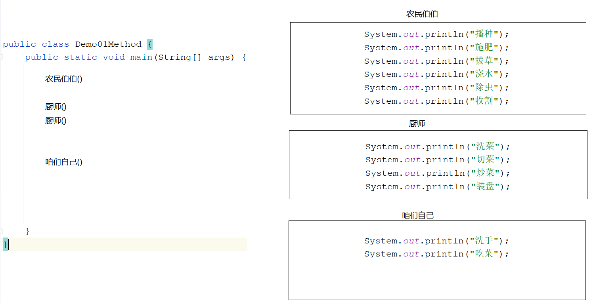

```java
定义一个方法,实现两个整数相加
```

```java
public class Demo02Method {
    public static void main(String[] args) {
        sum();
        System.out.println("哈哈哈哈哈");
    }
    public static void sum(){
        int a = 10;
        int b = 20;
        int sum = a+b;
        System.out.println("sum = " + sum);
    }
}

```

## 2.无参数无返回值的方法执行流程

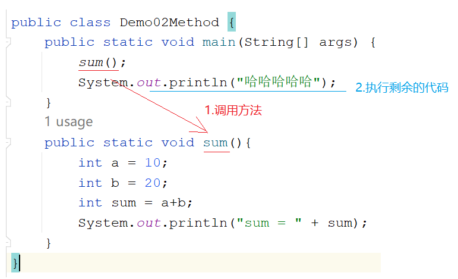

> 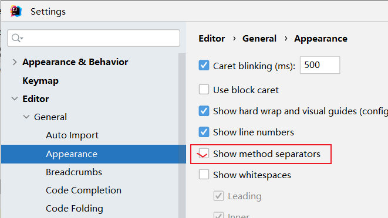

## 3.方法定义各部分解释

```java
1.通用格式:
  修饰符 返回值类型 方法名(参数){
      方法体
      return 结果
  }

2.各部分解释:
  a.修饰符: public static
  b.返回值类型:
    该方法最终返回的结果的数据类型
        比如: return 1 -> 方法上的返回值类型写int
             return 2.5 -> 方法上的返回值类型写double
             return "" -> 方法上的返回值类型写String
    如果没有返回值,不要写具体的返回值类型了,要写void
            
            
  c.方法名:见名知意(小驼峰式)
  d.参数:进入到方法内部参与执行的数据(数据类型 变量名,数据类型 变量名)
  e.方法体:实现该方法的具体代码    
  f.return 结果: 如果有返回值,可以利用return 将结果返回  
```

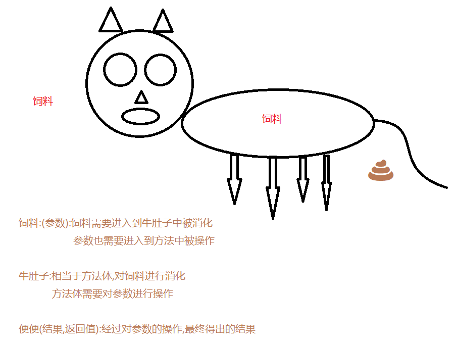

## 4.有参数无返回值的方法定义和执行流程

```java
1.格式:
  public static void 方法名(数据类型 变量名){
      方法体
  }

2.调用:
  直接调用:方法名(具体的值) -> 调用的时候要给参数赋值 
```

```java
需求:定义一个方法,实现两个整数相加
```

```java
public class Demo03Method {
    public static void main(String[] args) {
       sum(10,20);
    }

    public static void sum(int a,int b){
        int sum = a+b;
        System.out.println("sum = " + sum);
    }
}

```

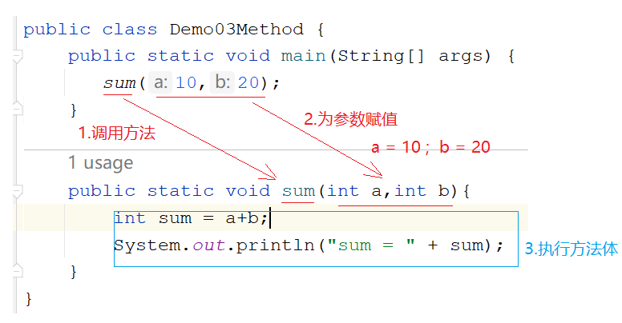

## 5.无参数有返回值定义以及执行流程

```java
1.格式:
  public static 返回值类型 方法名(){
      方法体
      return 结果
  }

2.调用: 返回值返回给了谁? 哪里调用返回给哪里
  a.打印调用:sout(方法名()) -> 不推荐使用
  b.赋值调用:调用完之后用一个变量接收返回值结果 -> 极力推荐
    数据类型 变量名 = 方法名()
```

```java
需求:定义一个方法,实现两个整数相加,将结果返回
```

```java
public class Demo04Method {
    public static void main(String[] args) {
        //打印调用 -> 涛哥不推荐
        System.out.println(sum());

        //赋值调用-> 极力推荐
        int result = sum();
        System.out.println("result = " + result);

    }

    public static int sum(){
        int a = 10;
        int b = 20;
        int sum = a+b;
        return sum;
        //return a+b;
    }
}

```

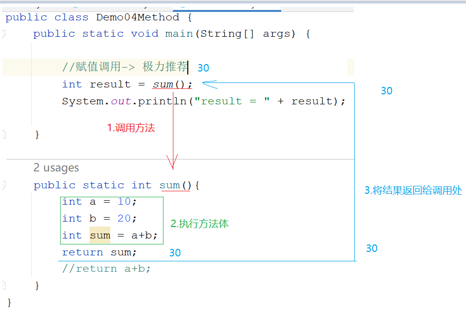

## 6.有参数有返回值定义以及执行流程

```java
1.格式:
  public static 返回值类型 方法名(参数){
      方法体
      return 结果
  }

2.调用:
  a.打印调用:
    sout(方法名(具体的值))
        
  b.赋值调用(极力推荐)
    数据类型 变量名 = 方法名(具体的值)    
```

```java
需求:定义一个方法,实现两个整数相加,将结果返回
```

```java
public class Demo05Method {
    public static void main(String[] args) {
        int sum = sum(10, 20);
        System.out.println("sum = " + sum);
    }
    public static int sum(int a,int b){
        int sum = a+b;
        return sum;
    }
}

```

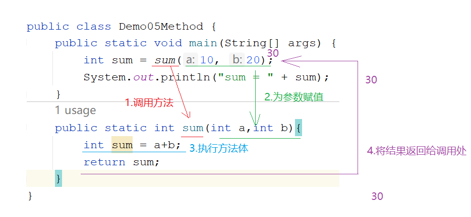

## 7.形式参数和实际参数区别

```java
1.形式参数(形参):在定义方法的时候形式上定义的参数,此参数还没有值
2.实际参数(实参):在调用方法的时候给形参赋予的具体的值
```

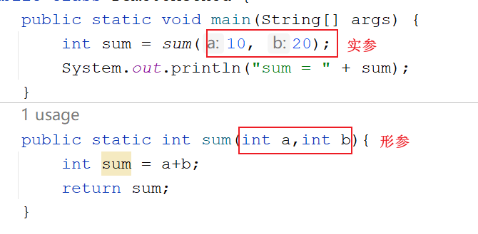

## 8.参数和返回值使用的时机

```java
1.参数:
  当想将方法A的数据传递到方法B时,那么定义方法B时就需要带个参数,在方法A中调用方法B时,可以将方法A中的数据通过参数传递到方法B中
      
2.返回值:
  调用方法A时,想要方法A的结果,去参与其他的操作,那么方法A就需要将自己的结果返回
```

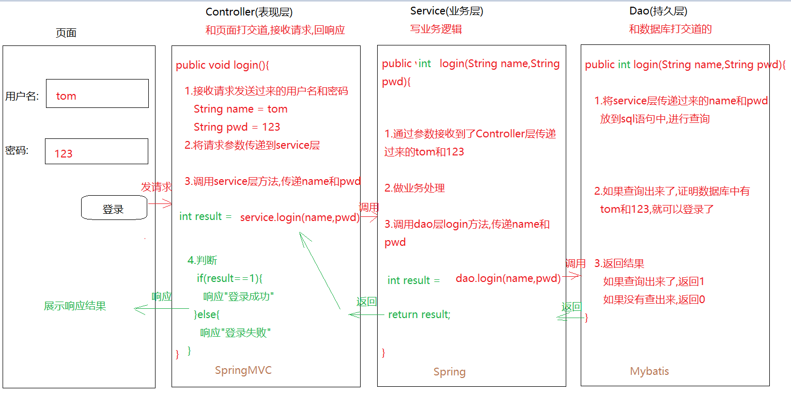

> 1.controller接收的请求参数需要一层一层传递到service层,service层需要将请求参数再传递到dao层
>
> 此时service的方法以及dao的方法都需要参数,去接收
>
> 2.dao层的结果需要传递给service,service再传递给controller层,此时dao层和service方法需要返回值

## 9.变量作为实参使用

```java
需求:定义一个方法,比较两个整数的大小,如果第一个比第二个大,返回true,否则返回false
```

```java
public class Demo07Method {
    public static void main(String[] args) {
        int i = 10;
        int j = 20;
        //传递的是i和j,但是我们真正传递的是i和j代表的数据,不是变量本身
        boolean result = compare(i, j);
        System.out.println("result = " + result);
    }
    public static boolean compare(int a,int b){
        if (a>b){
            return true;
        }else{
            return false;
        }
    }
}

```

# 第二章.方法注意事项终极版

```java
1.方法不调用不执行
2.方法的执行顺序只和调用顺序有关
3.方法之间不能互相嵌套
    
4.void不能和[return 结果]共存,但是void能和[return]共存
  a.void:代表没有返回值
  b.return 结果:就代表有返回值了
               先将结果返回,然后结束方法
      
  c.return:仅仅代表结束方法,不代表有返回值
  
5.一个方法中不能连续写多个return(也就是说一个方法不能都多个返回值)
      
6.调用方法的时候要看看下面有没有这个方法,没有的方法直接调用会报错      
      
```

```java
public class Demo08Method {
    public static void main(String[] args) {
        method01();
        //method04();
    }

    public static int method01(){
        return 1;
    }
    public static void method02(){
        return;
    }

    public static int method03(){
        return 1;
        //return 2;
    }
}
```

> ```java
> 初学者怎么写:
>      1.先定义,再调用
>      2.如果是没有返回值的方法,直接在被调用的方法内部输出结果
>      3.如果是带返回值的方法,就调用完毕之后,用一个变量去接收结果,输出这个变量
>      4.调用方法:
>         直接调用:方法名() 或者 方法名(实参) -> 只针对于无返回值的方法
>         打印调用:sout(方法名()) 或者 sout(方法名(实参)) -> 针对有返回值的方法 -> 不推荐使用
>         赋值调用:数据类型 变量名 = 方法名() 或者 数据类型 变量名 = 方法名(实参) -> 针对于有返回值的方法 -> 推荐使用
> ```
>
> ```java
> 怎么练习:
>   1.如果定义的方法没有返回值,写个void 不要写return 结果
>   2.如果定义的方法有返回值,就将void改成具体的返回值类型,在 方法体中最后写一个return 结果,将结果返回
>   3.如果方法有返回值,调用的时候推荐使用赋值调用,如果没有返回值,使用直接调用
>   4.练习的时候,只需要完成一个简单的需求(比如两个整数相加),针对此需求,定义4种方法,并成功调用         
> ```

# 第三章.方法练习

## 1.方法练习1(判断奇偶性)

```java
需求:
   键盘录入一个整数,将整数传递到另外一个方法中,在此方法中判断这个整数的奇偶性
   如果是偶数,方法返回"偶数"  否则返回"奇数"

方法三要素:
  方法名:要
  参数:要
  返回值:要
```

```java
public class Demo01Method {
    public static void main(String[] args) {
        Scanner sc = new Scanner(System.in);
        int data = sc.nextInt();
        String result = method(data);
        System.out.println("result = " + result);
    }
    /*
         键盘录入一个整数,将整数传递到另外一个方法中,在此方法中判断这个整数的奇偶性
         如果是偶数,方法返回"偶数"  否则返回"奇数"
     */

    public static String method(int data){
        if (data%2==0){
            return "偶数";
        }else{
            return "奇数";
        }
    }
}

```

## 2.方法练习2(1-100的和)

```java
需求 :  求出1-100的和,并将结果返回

方法名:要
参数:不要
返回值:要    
```

```java
public class Demo02Method {
    public static void main(String[] args) {
        int result = method();
        System.out.println("result = " + result);
    }

    public static int method() {
        int sum = 0;
        for (int i = 1; i <= 100; i++) {
            sum+=i;
        }
        return sum;
    }
}
```

## 3.方法练习3(不定次数打印)

```java
需求:
   定义一个方法,给这个方法传几,就让这个方法循环打印几次"我是一个有经验的JAVA开发工程师"

方法名:要
参数:要
返回值:不要
```

```java
public class Demo03Method {
    public static void main(String[] args) {
        method(3);
    }
    public static void method(int n){
        for (int i = 0; i < n; i++) {
            System.out.println("我是一个有经验的java开发工程师");
        }
    }
}
```

## 4.方法练习4(遍历数组)

```java
需求:
  在main方法中定义一个数组,将数组传递到另外一个方法中,在此方法中遍历数组
  
```

```java
public class Demo04Method {
    public static void main(String[] args) {
       int[] arr1 = {1,2,3};
       method(arr1);
    }

    /*
       调用method方法,传递的实参时int[]数组
       所以形参也应该用int型数组来接收
     */
    public static void method(int[] arr2){//int[] arr2 = arr1
        for (int i = 0; i < arr2.length; i++) {
            System.out.println(arr2[i]);
        }
    }

}
```

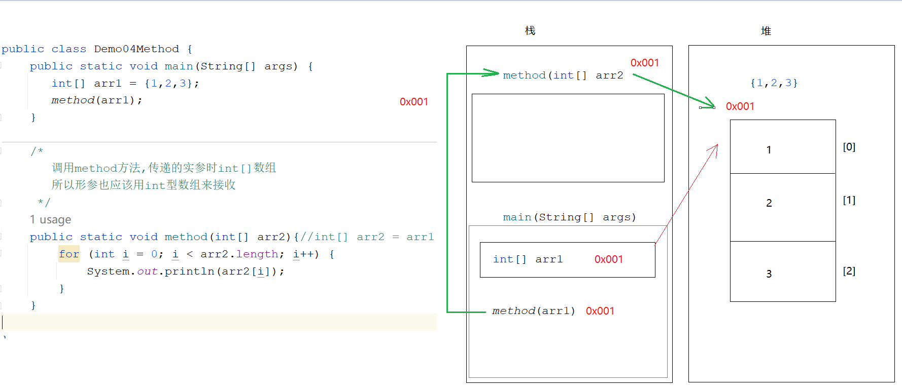

> 数组本身是引用数据类型,引用数据类型做方法参数传递,传递的是地址值

## 5.练习7

```java
数组作为返回值返回
```

```java
public class Demo05Method {
    public static void main(String[] args) {
        int[] arr2 = method();//int[] arr2 = arr1
        for (int i = 0; i < arr2.length; i++) {
            System.out.println(arr2[i]);
        }
    }

    public static int[] method(){
        int a = 10;
        int b = 20;
        int sum = a+b;

        int sub = a-b;

        int[] arr1 = {sum,sub};
        return arr1;//返回的是一个int[],那么返回值类型也应该是int[]
    }
}

```

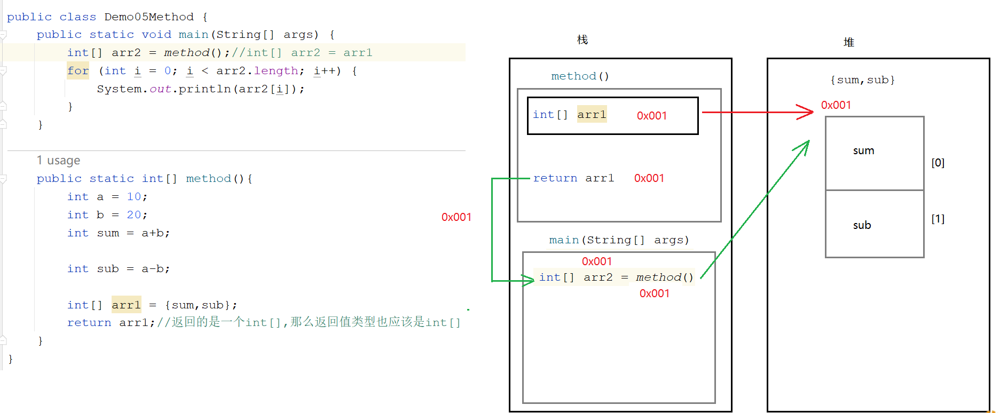

> 返回值为引用数据类型时,返回的是地址值

# 第四章.方法的重载(Overload)

```java
需求:定义三个方法,分别求2个整数相加,3个整数相加,4个整数相加
```

```java
public class Demo1OverLoad {
    public static void main(String[] args) {
        sum(10,20);
        sum(10,20,30);
        sum(10,20,30,40);
    }

    //两个整数相加
    public static void sum(int a,int b){
        System.out.println(a+b);
    }

    //三个整数相加
    public static void sum(int a,int b,int c){
        System.out.println(a+b+c);
    }

    //四个整数相加
    public static void sum(int a,int b,int c,int d){
        System.out.println(a+b+c+d);
    }
}

```

```java
1.概述:方法名相同,参数列表不同的方法
2.什么叫参数列表不同:
  a.参数个数不同
  b.参数类型不同
  c.参数类型顺序不同
      
3.判断两个方法是否为重载方法,和什么无关:
  a.和参数名无关
  b.和返回值无关
```

```java
public static void open(){}
public static void open(int a){}
static void open(int a,int b){}
public static void open(double a,int b){}
public static void open(int a,double b){}
public void open(int i,double d){}
public static void OPEN(){}
public static void open(int i,int j){}
```

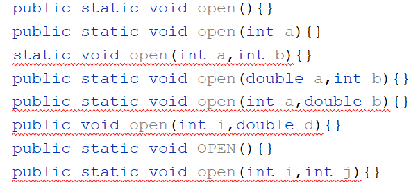

```java
如果定义方法功能一样,只不过实现细节不一样,就可以考虑定义成重载的方法
```


