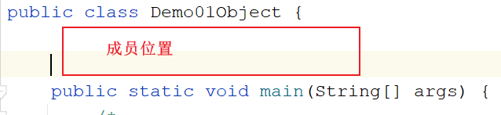
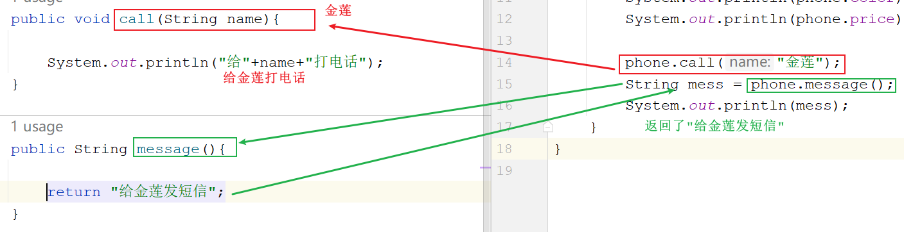
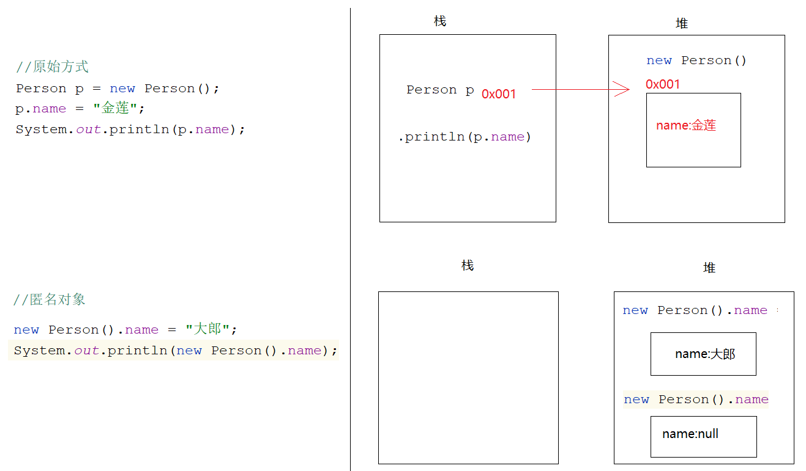
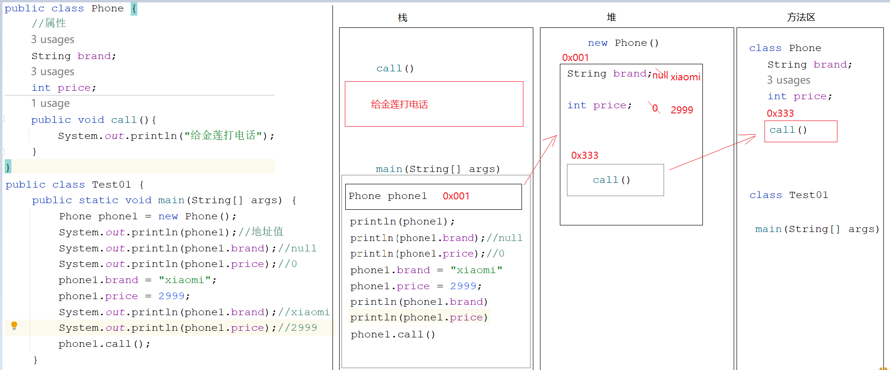
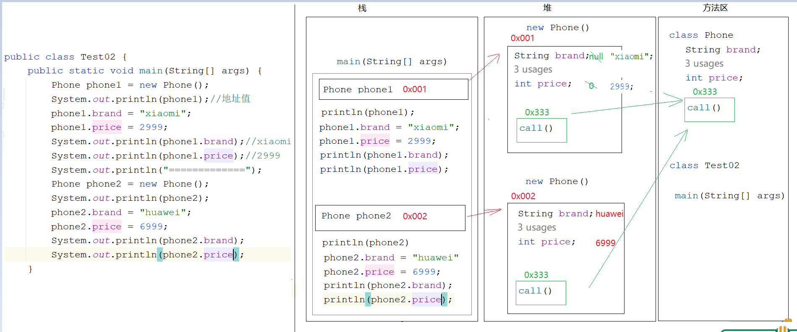
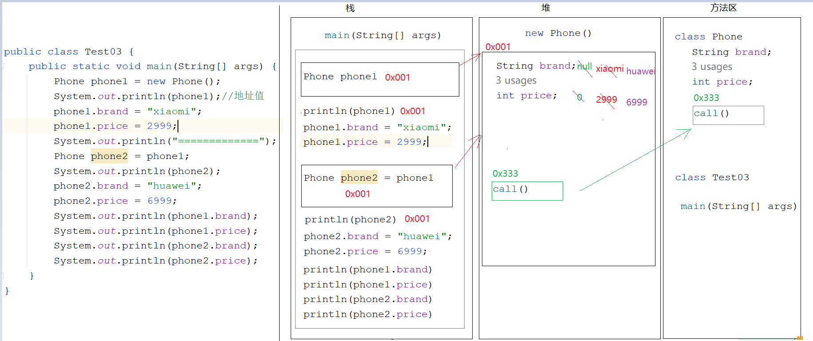

# 模块七_面向对象

```java
模块六回顾:
  1.概述:拥有功能性代码的代码块
    将来干开发一个功能就应该对应一个方法
  2.方法的通用定义格式:
    修饰符 返回值类型 方法名(参数){
        方法体
        return 结果
    }

    a.修饰符:public static
    b.返回值类型:方法最终返回的结果的数据类型
    c.方法名:给方法取的名字,见名知意,小驼峰式
    d.参数:进入到方法内部参与执行的数据
    e.方法体:具体实现该方法的具体代码
    f.return 结果:该方法操作完参数之后,最终返回的一个数据
        
  3.无参无返回值方法:
    a.定义:
      public static void 方法名(){
          方法体
      }
    b.调用:方法名()
        
  4.有参无返回值方法:
    a.定义:
      public static void 方法名(形参){
          方法体
      }

    b.调用:
      方法名(实参)
          
  5.无参有返回值方法:
    a.定义:
      public static 返回值类型 方法名(){
          方法体
          return 结果
      }

    b.调用:
      数据类型 变量名 = 方法名()
          
  6.有参有返回值方法:
    a.定义:
      public static 返回值类型 方法名(形参){
          方法体
          return 结果
      }

    b.调用:
      数据类型 变量名 = 方法名(实参)
          
  7.注意事项:
    a.方法不调用不执行,main方法是jvm调用的
    b.方法之间不能互相嵌套
    c.方法的执行顺序只和调用顺序有关
    d.void不能和return 结果共存,但是能和return共存
      void:代表没有返回值
      return 结果:代表有返回值,先将结果返回,再结束方法
      return:仅仅代表结束方法
          
    e.一个方法中不能连续写多个return
    f.调用方法是,需要看有没有此方法
          
          
  8.参数和返回值使用时机:
    a.参数:当想将一个方法中的数据,传递到另外一个方法中操作,就需要参数了
    b.返回值:如果调用者需要使用被调用者的结果,被调用者就需要将自己的结果返回
        
        
  9.方法的重载:
    a.概述:方法名相同,参数列表不同
    b.什么叫参数列表不同:
      参数个数不同,类型不同,类型顺序不同
    c.和什么无关:
      和参数名无关,和返回值无关
    
模块七重点:
  1.知道为啥使用面向对象思想编程
  2.知道怎么使用面向对象思想编程
  3.知道什么时候使用面向对象思想编程
  4.会利用代码去描述世间万物的分类
  5.会在一个类中访问另外一个类中的成员 -> new对象
  6.成员变量和局部变量的区别
```

# 第一章.类和对象

## 1.面向对象的介绍

```java
1.面向过程:自己的事情自己干,代表语言C语言
          洗衣服:每一步自己要亲力亲为 -> 找个盆,放点水,找个搓衣板,搓搓搓
2.面向对象:自己的事情别人帮忙去干,代表语言Java语言    
          洗衣服:自己的事情别人干 -> 全自动洗衣机
              
3.为啥要使用面向对象思想编程:懒
  很多功能别人都给我们实现好了,我们只需要直接拿过来使用即可,简化了我们自己的编写过程,减少了我们的代码量
    
4.什么时候使用面向对象思想编程:
  调用别人的功能时
  在一个类中想使用别的类中的成员时,就使用面向对象思想编程
  至于我们使用的功能人家怎么实现的,我们不需要关心,我们只需要知道怎么使用即可
      
5.怎么使用面向对象思想编程:
  a.new呀,new完点呀-> 点代表的是调用
  b.特殊:如果调用的成员带static关键字,我们不需要new,我们直接类名点即可
```

```java
public class Demo01Object {
    public static void main(String[] args) {
        /*
           我们想在Demo01Object类中使用Scanner类中的next方法实现录入字符串
           那么我们就需要使用面向对象思想编程

           对象:Scanner-> new出来的
           对象实现好的功能:next()

           我们只需要知道找来Scanner这个对象,就可以调用这个对象中实现好的next方法
           至于next方法怎么实现的,我们不需要关心
         */
        Scanner sc = new Scanner(System.in);
        String data = sc.next();
        System.out.println("data = " + data);

        System.out.println("===================================");

        /*
           我们想在Demo01Object类中使用Random类中的nextInt方法实现随机整数
           那么我们就需要使用面向对象思想编程

           对象:Random -> new出来的
           对象实现好的功能:nextInt()

           我们只需要知道找来Random这个对象,就可以调用Random中的nextInt方法
           至于nextInt怎么实现的,我们不需要关心
         */
        Random rd = new Random();
        int data2 = rd.nextInt();
        System.out.println("data2 = " + data2);

        System.out.println("====================================");

        int[] arr = {1,2,3,4};//[1,2,3,4]
       /* System.out.print("[");
        for (int i = 0; i < arr.length; i++) {
            if (i== arr.length-1){
                System.out.print(arr[i]+"]");
            }else{
                System.out.print(arr[i]+",");
            }
        }*/

        /*
           Arrays就是我们找来的对象
           toStrig就是此对象中实现好的功能
           我们只需要调用,怎么实现我们不关心
         */
        System.out.println(Arrays.toString(arr));

    }
}

```

## 2.类和对象

### 2.1类(实体类)_class

```java
1.测试类:带main方法的类,主要是运行代码的
2.实体类:是一类事物的抽象表示形式
        世间万物的分类:比如: 人类   狗类   猫类   鼠标类
```

```java
组成部分:
  1.属性(成员变量):这一类事物有啥
    a.定义位置:类中方法外  
    b.作用范围:作用于当前类
    c.定义格式: 数据类型 变量名
    d.默认值:
      整数:0
      小数:0.0
      字符:'\u0000'
      布尔:false
      引用:null
          
  2.行为(成员方法):这一类事物都能干啥
    只需要将模块六所学的方法中的static干掉,其他的都一样
```



```java
public class Person {
    //属性-> 成员变量
    String name;
    int age;
    
    //行为 -> 成员方法
    public void eat(){
        System.out.println("人要干饭");
    }
    
    public void drink(){
        System.out.println("人要喝水");
    }
}

```

> 描述动物类
>
> ```java
> public class Animal {
>     String kind;//品种
>     String color;//颜色
>     
>     public void eat(){
>         System.out.println("动物要吃饭");
>     }
>     
>     public void sleep(){
>         System.out.println("动物都睡觉");
>     }
>     
> }
> 
> ```
>
> 描述手机类
>
> ```java
> public class Phone {
>     //属性
>     String brand;
>     String color;
>     int price;
>     
>     //行为
>     public void call(String name){
>         System.out.println("给"+name+"打电话");
>     }
>     
>     public String message(){
>         return "给金莲发短信";
>     }
> }
> 
> ```

### 2.2对象

``` java
1.概述:一类事物的具体体现
2.使用:
  a.导包: import 包名.类名
    如果两个类在同一个包下,想要使用对方的成员不需要导包
    如果两个类不在同一个包下,想要使用对方的成员需要导包
      
    特殊包:java.lang -> 使用lang包下的类不需要导包 -> String
        
    友情提示:在学四种权限修饰符之前,尽量让两个类在同一个包下
        
  b.创建对象:想要使用哪个类中的成员,就new哪个类的对象
    类名 对象名 = new 类名() -> 比如: Person person = new Person()
      
  c.调用成员(成员变量,成员方法) -> 想要使用哪个类中的成员,就用哪个类的对象去点哪个成员
    对象名.成员变量名 = 值
    对象名.方法名() -> 调用的是无参无返回值方法
    对象名.方法名(实参) -> 调用的是有参无返回值方法
    数据类型 变量名 = 对象名.方法名() -> 调用的是无参有返回值方法
    数据类型 变量名 = 对象名.方法名(实参) -> 调用的是有参有返回值方法
```

```java
public class Person {
    //属性-> 成员变量
    String name;
    int age;

    //行为 -> 成员方法
    public void eat(){
        System.out.println("人要干饭");
    }

    public void drink(){
        System.out.println("人要喝水");
    }
}

```

```java
public class Demo01Person {
    public static void main(String[] args) {
        Person person = new Person();
        System.out.println(person.name);
        System.out.println(person.age);
        person.name = "金莲";
        person.age = 26;
        System.out.println(person.name);
        System.out.println(person.age);

        person.eat();
        person.drink();

    }
}

```

### 3.练习

```java
需求:用代码去描述一个手机类,在测试类中为手机类中的属性赋值,并且调用手机类中的功能
```

```java
public class Phone {
    //属性
    String brand;//品牌
    String color;//颜色
    int price;//价格

    //行为
    public void call(String name){

        System.out.println("给"+name+"打电话");
    }

    public String message(){

        return "给金莲发短信";
    }
}

================================================================

public class Demo02Phone {
    public static void main(String[] args) {
        Phone phone = new Phone();
        phone.brand = "苹果";
        phone.color = "黑色";
        phone.price = 7999;

        System.out.println(phone.brand);
        System.out.println(phone.color);
        System.out.println(phone.price);

        phone.call("金莲");
        String mess = phone.message();
        System.out.println(mess);
    }
}
```



## 3.匿名对象的使用

> ```java
> 1.int i = 10
>   a.int:是数据类型
>   b.i:变量名
>   c.等号右边的10:真正的数据
>       
> 2.Person p = new Person()
>   a.等号左边的Person:对象的类型,好比是int   
>   b.p:对象名
>   c.等号右边的new Person():真正的数据,是一个Person对象,将这个对象真正创建出来了    
> ```

```java
1.所谓的匿名对象:其实就是没有等号左边的部分,只有等号右边的部分(对象)
2.使用:
  new 对象().成员
      
3.注意:
  a.如果我们只想单纯的调用一个方法,让方法执行,我们可以考虑使用匿名对象
  b.但是如果涉及到赋值,千万不要用匿名对象    
```

```java
public class Person {
    String name;
    public void eat(){
        System.out.println("人要吃饭");
    }
}
```

```java
public class Demo01Person {
    public static void main(String[] args) {
        //原始方式
        Person p = new Person();
        p.name = "金莲";
        System.out.println(p.name);
        p.eat();

        System.out.println("=================");

        //匿名对象
        new Person().eat();

        new Person().name = "大郎";
        System.out.println(new Person().name);//null
    }
}

```



## 4.一个对象的内存图



## 5.两个对象的内存图



> phone1和phone2都是new出来的,所以在堆内存中产生了两个不同的空间,所以改变一个空间的数据不会 影响另外一个空间中的数据

## 6.两个对象指向同一片空间内存图



> phone2是phone1给的,phone1在内存中保存的是地址值,此时phone1和phone2地址值是一样的了,操作的是同一片空间的数据,所以改变一个对象的数据会影响到另外一个对象

# 第二章.成员变量和局部变量的区别

```java
1.定义位置不同(重点)
  a.成员变量:类中方法外
  b.局部变量:定义在方法之中或者参数位置
      
2.初始化值不同(重点)
  a.成员变量:有默认值的,所以不用先手动赋值,就可以直接使用
  b.局部变量:是没有默认值的,所以需要先手动赋值,再使用
      
3.作用范围不同(重点)
  a.成员变量:作用于整个类
  b.局部变量:只作用于自己所在的方法,其他方法使用不了
      
4.内存位置不同(了解)
  a.成员变量:在堆中,跟着对象走
  b.局部变量:在栈中,跟着方法走

5.生命周期不同(了解)
  a.成员变量:随着对象的创建而产生,随着对象的消失而消失
  b.局部变量:随着方法的调用而产生,随着方法的调用完毕而消失    
```

```java
public class Person {
    String name;//成员变量
    public void eat(){
        int i = 10;//局部变量
        System.out.println(i);

        System.out.println(name);//成员变量不用手动赋值可以直接使用,因为有默认值
    }

    public void drink(){
        int j;
        //System.out.println(j);//局部变量没有默认值,所以需要手动赋值再使用
        System.out.println(name);

        //System.out.println(i);//i是eat方法的局部变量,在drink中使用不了
    }
}
```

# 第三章.练习

```java
需求:定义一个类MyDate,属性有 year  month  day

     再定义一个类Citizen(公民类),属性有 name(String类型)  birthday(MyDate类型)  idCard(String),为这三个属性赋值,然后将值取出来
```

```java
public class MyDate {
    int year;
    int month;
    int day;
}

```

```java
public class Citizen {
    //姓名
    String name;  //默认值 null
    /*
      生日  MyDate类型

      MyDate属于自定义类型(引用数据类型)
      这种类型要操作之前必须要赋值
      怎么赋值?  需要new对象赋值
     */
    MyDate birthday = new MyDate(); // 默认值 null
    //身份证
    String idCard;  //默认值null
}

```

```java
public class Test01 {
    public static void main(String[] args) {
        Citizen citizen = new Citizen();
        citizen.name = "涛哥";
        citizen.idCard = "111111111";

        /*
           citizen.birthday获取的是MyDate对象
           再去点year获取的是MyDate对象中的year

           链式调用
         */
        citizen.birthday.year = 2000;
        citizen.birthday.month = 10;
        citizen.birthday.day = 10;

        System.out.println(citizen.name+","+citizen.birthday.year+","+citizen.idCard);

    }
}
```

> 给引用数据类型赋值,需要new对象(String比较特殊,可以直接=赋值)