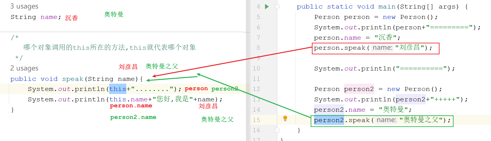
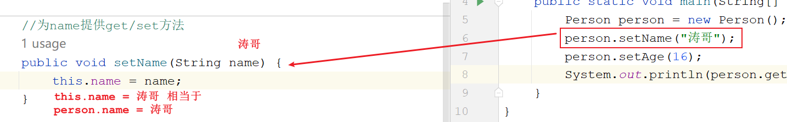
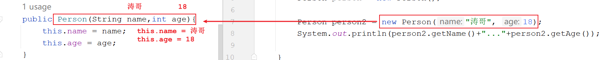
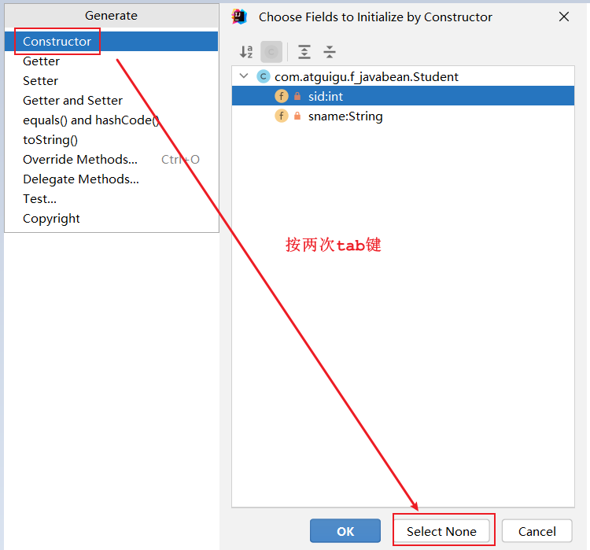
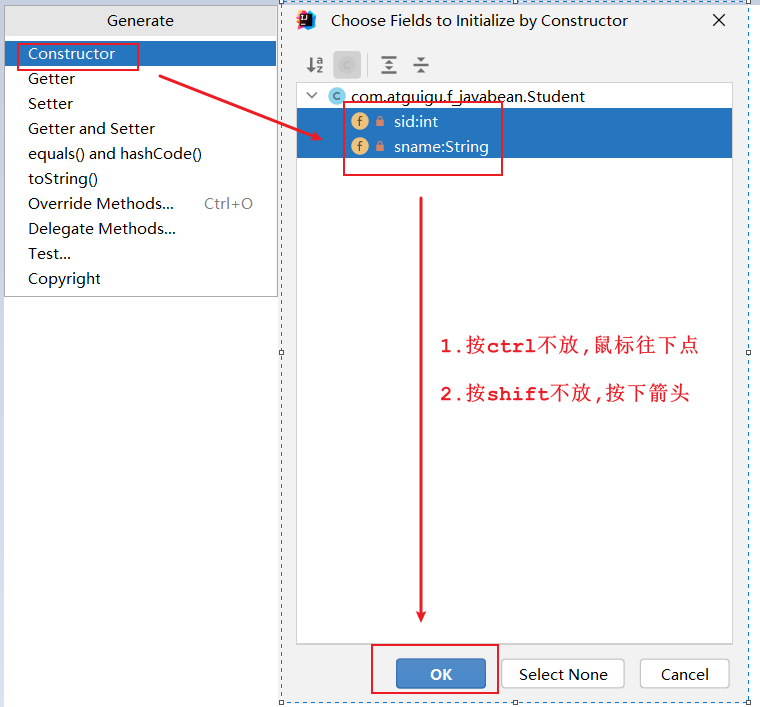
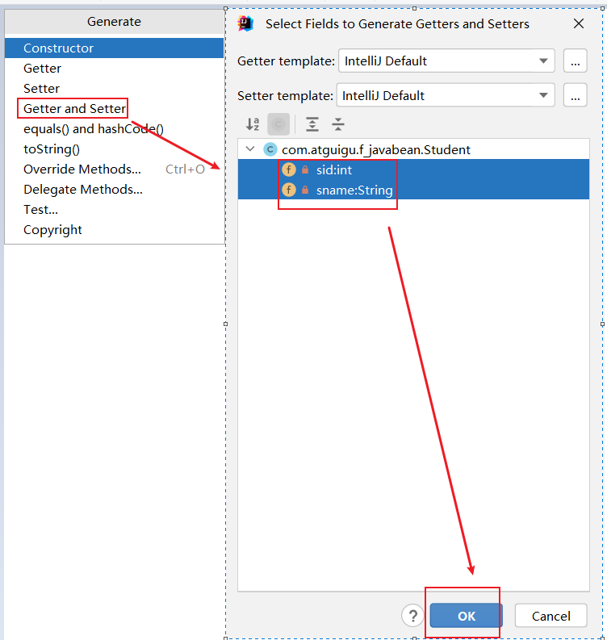
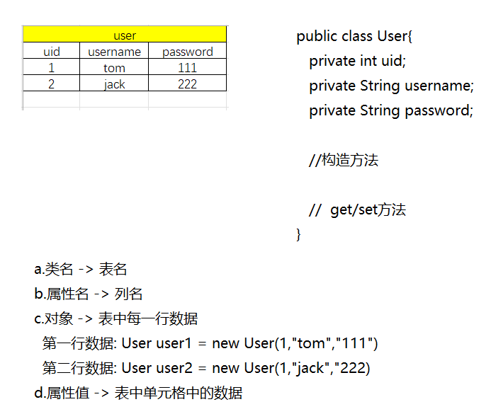
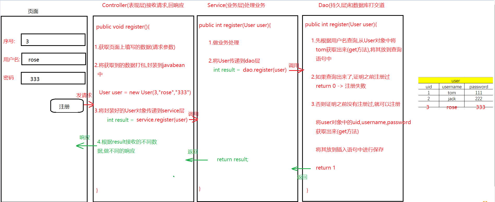

# 模块八_封装

```java
模块七回顾:
  1.面向对象:是java的核心编程思想,自己的事情找对象帮我们去做
            有很多功能,别人帮我们实现好了,我们只需要找来这个对象,就可以调用这个对象中实现好的功能
    a.啥时候使用面向对象思想编程:在一个类中想访问另外一个类的成员(成员变量,成员方法)
    b.怎么使用:
      new对象 ,点成员
      特殊 :类名直接调用 -> 调用的成员中必须带static关键字
  2.类和对象:
    a.类:实体类
        属性(成员变量)  行为(成员方法,不带static的方法)
    b.对象:
      导包:两个类在同一个包下,使用对方的成员不需要导包,相反需要导包
          lang包下的类使用时不需要导包
      创建对象:想要使用哪个类中的成员,就new哪个类的对象
              类名 对象名 = new 类名()
      调用:想要使用哪个类的成员,就用哪个类的对象调用哪个成员
           对象名.成员
          
  3.匿名对象:没有等号左边的代码只有new
    a.注意:涉及到赋值,不要使用
  
  4.成员变量和局部变量的区别
    a.定义位置不同:
      成员:类中方法外
      局部:方法中或者参数位置
    b.初始化值不同
      成员:有默认值
      局部:没有默认值
    c.作用范围不同
      成员:作用于整个类
      局部:只作用于方法内部
    d.内存位置不同
      成员:在堆中,跟着对象走
      局部:在栈中,跟着方法走
    e.生命周期不同
      成员:随着对象的创建而创建,随着对象的消失而消失
      局部:随着方法的调用而产生,随着方法的调用完毕而消失
          
模块八重点:
  1.要会使用private关键字修饰成员,并知道被private修饰之后作用(访问特点)是什么
  2.会使用set方法为属性赋值,使用get方法获取属性值
  3.会利用this关键字区分重名的成员变量和局部变量
  4.会利用空参构造创建对象,并知道空参构造作用
  5.会使用有参构造创建对象,并为属性赋值
  6.会快速生成一个标准的javabean类
```

# 第一章.封装

```java
将一个物品封装起来,外界不能直接使用了,提高了物品的安全性
```

## 1.封装的介绍以及使用

```java
1.面向对象三大特征:  [封装]     继承    多态
 
2.什么是封装思想:
  a.我们找来了一个对象(洗衣机),只需要按一下按钮就可以了(使用洗衣机功能的过程就是在使用面向对象思想编程的过程),每一个按钮下面都包含了很多内部结构的细节(细节被封装到按钮里面了->封装),在使用的时候有必要了解洗衣机的内部构造吗?我们没有必要去了解内部结构,我们只知道调用就可以了
      
    所以,洗衣机来说,将细节隐藏起来了,细节我们不要关注,会对外提供了一个公共的接口(按钮),供我们人类使用  
      
  b.隐藏对象内部的复杂性,只对外提供公开,公共的接口,便于外界调用,从而提高了系统的可扩展性,可维护性,安全性,通俗来说,把该隐藏的隐藏起来(细节),把该暴露的暴露出来(对外提供的供别人使用的接口),这就是封装思想 
      
  我们只需要调用这个接口(功能)即可,此接口背后封装起来的细节就开始执行了,但是我们不需要关注细节,只关注公共的接口怎么调用
      
  c.将细节隐藏起来,不让外界随便使用,但是我们可以提供一个公共的接口让外界间接使用隐藏起来的细节->封装思想  
```

```java
1.问题:
  定义成员变量,只要是new出来对象,就可以随便调用,随便赋值,哪怕是不合理的值我们也挡不住,怎么办?
  将属性封装起来(隐藏细节)
      
  a.关键字:private(私有化的) -> 被private修饰的成员只能在本类中使用,在别的类中使用不了
      
  b.注意:
    将代码放到一个方法中,也是封装的体现
    一个成员被private修饰也是封装的体现,只不过private最具代表性
        
  c.private的使用:
    修饰成员变量:private 数据类型 变量名
    修饰方法:将public改成private,其他的都一样
        
2.问题:属性被私有化了,外界直接调用不了了,那么此时属性就不能直接赋值取值了,所以需要提供公共的接口
       get/set方法
    
      set方法:为属性赋值
      get方法:获取属性值
```

```java
public class Person {
    private String name;
    private int age;

    //为name提供get/set方法
    public void setName(String xingMing) {
        name = xingMing;
    }

    public String getName() {
        return name;
    }

    //为age提供get/set方法
    public void setAge(int nianLing) {
        if (nianLing < 0 || nianLing > 150) {
            System.out.println("你脑子是不是秀逗啦!岁数不合理");
        } else {
            age = nianLing;
        }
    }

    public int getAge() {
        return age;
    }
}

```

```java
public class Test01 {
    public static void main(String[] args) {
        Person person = new Person();
        //person.name = "涛哥";
        //person.age = -18;

        //System.out.println(person.name);
        //System.out.println(person.age);

        person.setName("涛哥");
        person.setAge(18);

        String name = person.getName();
        int age = person.getAge();
        System.out.println(name+"..."+age);
    }
}
```


> 小结:
>
>    用private将属性封装起来,外界不能直接调用,保护了属性
>
>    对外提供一套公共的接口(set/get方法),让外界通过公共的接口间接使用封装起来的属性

## 2.this的介绍

```java
1.如果成员变量和局部变量重名时,我们遵循"就近原则",先访问局部变量
2.this概述:代表的是当前对象
3.作用:this可以区分重名的成员变量和局部变量
      this点出来的一定是成员的变量
    
4.this代表当前对象,那么具体代表哪个对象呢?
  哪个对象调用的this所在的方法,this就代表哪个对象
```

```java
public class Person {
    String name;

    /*
       哪个对象调用的this所在的方法,this就代表哪个对象
     */
    public void speak(String name){
        System.out.println(this+"........");
        System.out.println(this.name+"您好,我是"+name);
    }
}

```

```java
public class Test01 {
    public static void main(String[] args) {
        Person person = new Person();
        System.out.println(person+"=========");
        person.name = "沉香";
        person.speak("刘彦昌");

        System.out.println("==========");

        Person person2 = new Person();
        System.out.println(person2+"+++++");
        person2.name = "奥特曼";
        person2.speak("奥特曼之父");
    }
}
```



```java
public class Person {
    private String name;
    private int age;

    //为name提供get/set方法
    public void setName(String name) {
        this.name = name;
    }

    public String getName() {
        return name;
    }

    //为age提供get/set方法
    public void setAge(int age) {
        this.age = age;
    }

    public int getAge() {
        return age;
    }
}

```

```java
public class Test01 {
    public static void main(String[] args) {
        Person person = new Person();
        person.setName("涛哥");
        person.setAge(16);
        System.out.println(person.getName()+"..."+person.getAge());
    }
}

```



## 3.构造方法

```java
1.概述:方法名和类名一致并且能初始化对象的方法
2.分类:
  a.无参构造:没有参数
  b.有参构造:有参数,参数是为指定的属性赋值
  c.满参构造:给所有属性赋值 
      
  以上构造咱们不用记那么详细,我们就记有参和无参构造就可以了
      
3.特点:
  a.方法名和类名一致
  b.没有返回值,连void都没有
```

### 3.1空参构造

```java
1.格式:
  public 类名(){
      
  }
2.作用:
  new对象使用
      
3.特点:
  每个类中默认都有一个无参构造,不写也有,jvm会自动提供
      
4.使用:一new对象就是在调用构造方法      
```

### 3.2有参构造

```java
1.格式:
  public 类名(形参){
      为属性赋值
  }

2.作用:
  a.new对象
  b.为属性赋值
      
3.特点:
  jvm不会自动提供有参构造,但是将有参构造手写出来,jvm将不再提供无参构造,所以建议有参,无参的构造都手写上去
```

```JAVA
public class Person {
    private String name;
    private int age;

    //无参构造
    public Person(){
        System.out.println("我是无参构造");
    }

    //有参构造
    public Person(String name,int age){
        this.name = name;
        this.age = age;
    }

    public void setName(String name) {
        this.name = name;
    }

    public String getName() {
        return name;
    }

    public void setAge(int age) {
        this.age = age;
    }

    public int getAge() {
        return age;
    }
}

```

```JAVA
public class Test01 {
    public static void main(String[] args) {
        Person person = new Person();

        Person person2 = new Person("涛哥", 18);
        System.out.println(person2.getName()+"..."+person2.getAge());

    }
}
```



> 如何快速知道调用的成员是哪个类中的哪个成员呢?
>
>   按住ctrl不放,鼠标点击对应的成员 -> 会跳到对应的位置

## 4.标准JavaBean

JavaBean` 是 Java语言编写类的一种标准规范。符合`JavaBean` 的类，要求： 

（1）类必须是具体的(非抽象 abstract)和公共的，public class 类名

（2）并且具有无参数的构造方法，有参构造

（3）成员变量私有化，并提供用来操作成员变量的`set` 和`get` 方法。  

```java
com.atguigu.controller -> 专门放和页面打交道的类(表现层)
com.atguigu.service -> 专门放业务处理的类 (业务层)
com.atguigu.dao -> 专门放和数据库打交道的类(持久层)
com.atguigu.pojo -> 专门放javabean类
com.atguigu.utils -> 专门放工具类
```

```java
public class Person {
    private String name;
    private int age;

    //无参构造
    public Person(){
        
    }

    //有参构造
    public Person(String name,int age){
        this.name = name;
        this.age = age;
    }

    public void setName(String name) {
        this.name = name;
    }

    public String getName() {
        return name;
    }

    public void setAge(int age) {
        this.age = age;
    }

    public int getAge() {
        return age;
    }
}

```

```java
public class Test01 {
    public static void main(String[] args) {
        Person person = new Person();
        person.setName("金莲");
        person.setAge(26);
        System.out.println(person.getName()+"..."+person.getAge());

        Person person2 = new Person("涛哥", 18);
        System.out.println(person2.getName()+"..."+person2.getAge());

    }
}

```

编写符合`JavaBean` 规范的类，以学生类为例，标准代码如下：

```java
public class Student {
    private int sid;
    private String sname;

    public Student() {
    }

    public Student(int sid, String sname) {
        this.sid = sid;
        this.sname = sname;
    }

    public int getSid() {
        return sid;
    }

    public void setSid(int sid) {
        this.sid = sid;
    }

    public String getSname() {
        return sname;
    }

    public void setSname(String sname) {
        this.sname = sname;
    }
}

```

> 快速生成标准javabean通用快捷键:alt+insert
>
> 1. 生成无参构造:
>
>    
>
> 
>
> 2.生成有参构造
>
>   
>
> 3.生成get/set方法:
>
> 


```java
public class Test01 {
    public static void main(String[] args) {
        Student s1 = new Student();
        s1.setSid(1);
        s1.setSname("涛哥");
        System.out.println(s1.getSid()+"..."+s1.getSname());

        System.out.println("==============");

        Student s2 = new Student(2, "金莲");
        System.out.println(s2.getSid()+"..."+s2.getSname());
    }
}
```

> 小结:
>
>   1.知道private的作用嘛?私有的,别的类不能直接调用
>
>   2.知道空参构造作用嘛?new对象
>
>   3.知道有参构造作用嘛? new对象  为属性赋值
>
>   4.知道set方法作用嘛?   为属性赋值
>
>   5.知道get方法作用嘛?  获取属性值
>
>   6.知道this的作用嘛?  区分重名的成员变量和局部变量
>
>   7.知道快捷键生成标准javabean嘛? alt+insert

## 5.JavaBean怎么来的

```java
1.将来的javabean都是和数据库的表相关联
  a.类名 -> 表名
  b.属性名 -> 列名
  c.对象 -> 表中每一行数据
  d.属性值 -> 表中单元格中的数据
```






> 将页面填写的数据获取到,封装到javabean中,一层一层传递到dao层,然后将javabean中的属性值获取出来放到表中保存 -> 相等于是一个添加功能


> 将所有的数据查询出来,封装成一个一个的javabean对象,然后将封装好的javabean对象放到一个容器中,将此容器返回 给页面,在页面上遍历展示
