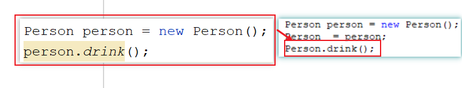

# 模块九_面向对象

```java
模块八重点:
  1.封装:
    a.将细节隐藏起来,不让外界直接调用,再提供公共接口,供外界通过公共接口间接使用隐藏起来的细节
    b.代表性的:
      将一段代码放到一个方法中(隐藏细节),通过方法名(提供的公共接口)去调用
      private关键字 -> 私有的,被private修饰之后别的类不能直接调用,只能在当前类中使用
          
    c.get/set方法
      set方法:为属性赋值
      get方法:获取属性值
          
    d.this关键字:代表当前对象,哪个对象调用this所在的方法this就代表哪个对象
      区分重名的成员变量和局部变量
        
  2.构造:
    a.无参构造:new对象
      特点:jvm会自动为每个类提供一个无参构造
    b.有参构造:new对象  为属性赋值
      特点:如果手写了有参构造,jvm将不再提供无参构造,所以建议都写上
          
  3.标准javabean:
    a.类必须是公共的,具体的
    b.必须有私有属性
    c.必须有构造方法(无参,有参)
    d.必须有get/set方法
        
    快捷键:alt+insert
        
模块九重点:
  1.会定义静态成员以及会调用静态成员
  2.会使用可变参数(会给可变参数传参)
  3.会二分查找(手撕)
  4.会冒泡排序(手撕)
  5.会debug的使用    
  
```

# 第一章.static关键字


## 1.static的介绍以及基本使用

```java
1.概述:static是一个静态关键字
2.使用:
   a.修饰一个成员变量:
     static 数据类型 变量名

   b.修饰一个方法:
      修饰符 static 返回值类型 方法名(形参){
             方法体
             return 结果
      }

3.调用静态成员:
   类名直接调用(不用new对象)

4.静态成员特点:
   a.静态成员属于类成员,不属于对象成员(非静态的成员属于对象成员)
   b.静态成员会随着类的加载而加载
   c.静态成员优先于非静态成员存在在内存中
   d.凡是根据静态成员所在的类创建出来的对象,都可以共享这个静态成员
```

```java
public class Student {
    String name;
    int age;
    static String classRoom;
}

```

```java
public class Test01 {
    public static void main(String[] args) {
        //先给静态成员赋个值
        Student.classRoom = "222";

        Student s1 = new Student();
        s1.name = "郭靖";
        s1.age = 28;
        //s1.classRoom = "111";

        System.out.println(s1.name+","+s1.age+","+Student.classRoom);

        System.out.println("==============");

        Student s2 = new Student();
        s2.name = "黄蓉";
        s2.age = 26;
        //s2.classRoom = "111";

        System.out.println(s2.name+","+s2.age+","+Student.classRoom);
    }
}

```

## 2.static修饰成员的访问特点

```java
1.在静态方法中能直接访问非静态成员嘛?  不能
  想要调用的话:new对象调用  
    
2.在非静态方法中能直接访问静态成员嘛? 能
  a.同类:
    直接调用
    类名调用
        
  b.不同类:
    类名调用
      
    
3.在静态方法中能直接访问静态成员嘛?能
  a.同类:
    直接调用
    类名调用
        
  b.不同类:
    类名调用
    
4.在非静态方法中能直接访问非静态成员嘛?能
  a.同类:
    直接调用
    new对象调用
        
  b.不同类:
    new对象调用
```



> 总结:
>
>  1.不管在不在同一个类中,非静态成员都可以new对象调用
>
>  2.不管在不在同一个类中,静态成员都可以类名调用

> ```java
> 问题1:既然static成员那么好使(类名直接调用),那么我们在实际开发中,能不能将所有的成员都定义成静态的呢?
>      不能
>     
> 原因:由于静态成员会随着类的加载而加载,如果将所有的成员都变成静态的,那么类一加载,静态成员都会进内存,会大量占用内存空间
>     
> 问题2:那么静态成员都啥时候定义呢?
>      一般情况下,我们在抽取工具类的时候可以将工具类中的所有成员都定义成静态的
>     
> 问题3:啥时候定义工具类?
>       比如我们在写代码的过程中,发现有的功能在反复实现,代码一样,功能一样,此时就可以抽取出来,形成工具类
> ```
>
> ```java
> public class ArraysUtils {
>     /*
>        构造方法用private修饰
> 
>        工具类中的成员都是静态的,静态成员都是类名调用,不需要new对象
>        所以工具类中的构造方法都是用private修饰
> 
>        如果构造方法被private修饰,那么在别的类中,就不能利用构造方法new对象
>      */
>     private ArraysUtils(){
> 
>     }
> 
> 
>     //定义一个方法,实现获取int数组最大值
>     public static int getMax(int[] arr){
>         int max = arr[0];
>         for (int i = 1; i < arr.length; i++) {
>             if (max<arr[i]){
>                 max = arr[i];
>             }
>         }
> 
>         return max;
>     }
> }
> 
> ```
>
> ```java
> public class Test01 {
>     public static void main(String[] args) {
>         int[] arr = {5,3,4,6,7,54,8};
>         int max = ArraysUtils.getMax(arr);
>         System.out.println("max = " + max);
>     }
> }
> 
> ```
>
> ```java
> public class Test02 {
>     public static void main(String[] args) {
>         int[] arr = {5,4,5,7,8,9};
>         int max = ArraysUtils.getMax(arr);
>         System.out.println("max = " + max);
>     }
> }
> 
> ```

# 第二章.可变参数

```java
1.需求:
  定义一个方法,实现n个整数相加
      
2.分析:
  方法参数位置,只明确了参数的类型,但是不明确参数个数,此时就可以定义成可变参数
```

## 1介绍和基本使用

```java
1.定义格式:
  数据类型...变量名
      
2.注意:
  a.可变参数的本质是一个数组
  b.参数位置不能连续写多个可变参数,而且当可变参数和其他普通参数一起使用时,可变参数需要放到参数列表最后   
```

```java
public class Demo01Var {
    public static void main(String[] args) {
        sum(1,2,3,4,5);
        sum1(1,1,2,3,4);
    }

    public static void sum(int...arr){
        int sum = 0;
        for (int i = 0; i < arr.length; i++) {
            sum+=arr[i];
        }
        System.out.println(sum);
    }
    
    public static void sum1(int i,int...arr){
        
    }
    
}
```


### 1.1字符串拼接

需求一：返回n个字符串拼接结果，如果没有传入字符串，那么返回空字符串""

```java
public class Demo02Var {
    public static void main(String[] args) {
        String result = concat("张无忌", "张翠山", "张三丰", "张三");
        System.out.println("result = " + result);
    }

    public static String concat(String...s){
        String str = "";
        for (int i = 0; i < s.length; i++) {
            str+=s[i];
        }

        return str;
    }
}

```

需求二：n个字符串进行拼接，每一个字符串之间使用某字符进行分隔，如果没有传入字符串，那么返回空字符串""

```java
比如:concat("-","张三丰","张翠山","张无忌") -> 返回 -> 张三丰-张翠山-张无忌
```

```java
public class Demo03Var {
    public static void main(String[] args) {
        String result = concat("-", "张三丰", "张翠山", "张无忌");
        System.out.println("result = " + result);
    }

    public static String concat(String regex, String... s) {
        String str = "";
        for (int i = 0; i < s.length; i++) {
            if (i == s.length - 1) {
                str += s[i];
            } else {
                str += s[i] + regex;
            }
        }

        return str;
    }
}

```

# 第三章.递归

```java
1.概述:方法内部自己调用自己
2.分类:
  a.直接递归
    public static void method(){
      method()
    }

 b.间接递归:
   A(){
       B()
   }
   B(){
       C()
   }
   C(){
       A()
   }

3.注意:
  a.递归必须要有出口,否则会出现"栈内存溢出"
  b.递归即使有出口,递归次数不不要太多    
```

```java
public class Demo01Recursion {
    public static void main(String[] args) {
        method();
    }
    public static void method(){
        method();
    }
}
```

### 示例一：需求:利用递归输出3到1

```java
public class Demo02Recursion {
    public static void main(String[] args) {
        method(3);
    }

    public static void method(int n){
        if (n==1){
            System.out.println(n);
            //结束方法
            return;
        }
        System.out.println(n);
        n--;
        method(n);
    }
}
```


### 示例二：求n!(n的阶乘)

``` java
1.需求:定义一个方法,完成3的阶乘
      3*2*1
2.分析:假如定义一个方法,代表n的阶乘 -> method(n) -> n接收几,就代表几的阶乘
  
  method(1)  1
  method(2)  2*1 -> 2*method(1)
  method(3)  3*2*1 -> 3*method(2)
    
  method(n) -> n*method(n-1)
```

```java
public class Demo03Recursion {
    public static void main(String[] args) {
        int method = method(3);
        System.out.println("method = " + method);
    }

    public static int method(int n){
       if (n==1){
           return 1;
       }
       return n*method(n-1);
    }
}
```


### 示例三：计算斐波那契数列（Fibonacci）的第n个值

```java
不死神兔
故事得从西元1202年说起，话说有一位意大利青年，名叫斐波那契。
在他的一部著作中提出了一个有趣的问题：假设一对刚出生的小兔一个月后就能长成大兔，再过一个月就能生下一对小兔，并且此后每个月都生一对小兔，一年内没有发生死亡
问：一对刚出生的兔子，一年内繁殖成多少对兔子? 
```

规律：一个数等于前两个数之和，比如: 1 1 2 3 5 8 13 21 34 55....  


```java
1.假设:定义一个方法,叫做method,参数传递month,代表月份
    
2.分析:
  method(1)     1
  method(2)     1
  method(3)     2 -> method(1)+method(2)
  method(4)     3 -> method(2)+method(3)
  method(5)     5 -> method(3)+method(4)   
      
  method(n) -> method(n-2)+method(n-1)
```

```java
public class Demo04Recursion {
    public static void main(String[] args) {
        int method = method(12);
        System.out.println("method = " + method);
    }

    public static int method(int n){
       if (n==1 || n==2){
           return 1;
       }
       return method(n-1)+method(n-2);
    }
}
```

# 第四章.数组常见算法

## 1.数组翻转

```java
1.概述:数组对称索引位置上的元素互换
```


```java
public class Demo01Reverse {
    public static void main(String[] args) {
        int[] arr = {1,2,3,4,5,6,7};
        for (int min = 0,max = arr.length-1;min<max;min++,max--){
            int temp = arr[min];
            arr[min] = arr[max];
            arr[max] = temp;
        }

        for (int i = 0; i < arr.length; i++) {
            System.out.print(arr[i]+" ");
        }
    }
}
```

## 2.冒泡排序

```java
 数组的排序，是将数组中的元素按照大小进行排序，默认都是以升序的形式进行排序，数组排序的方法很多，我们讲解的是数组的冒泡排序。

  排序，都要进行数组 元素大小的比较，再进行位置的交换。冒泡排序法是采用数组中相邻元素进行比较换位。
  arr[i](前一个元素)   arr[i+1](后一个元素)
```

### 2.1 代码实现

```java
public class Demo02Bubble {
    public static void main(String[] args) {
        //定义一个数组,长度为5,最大索引为4
        int[] arr = {5,4,3,2,1};

        /*
           第一圈
             越界原因:当i变化到4的时候-> arr[4]>arr[5] -> 直接操作了5索引,所以越界了
             越界解决:我们可以让arr.length-1
                     如果arr.length-1-> 比较就是i<4 -> 此时i最大可以变化到3
                     当i变化到3时 -> arr[3]>arr[4] -> 正好是最后两个元素进行比较
         */
        /*for (int i = 0; i < arr.length-1-0; i++) {
            if (arr[i]>arr[i+1]){
                int temp = arr[i];
                arr[i] = arr[i+1];
                arr[i+1] = temp;
            }
        }*/

        //第二圈
        /*for (int i = 0; i < arr.length-1-1; i++) {
            if (arr[i]>arr[i+1]){
                int temp = arr[i];
                arr[i] = arr[i+1];
                arr[i+1] = temp;
            }
        }*/

        //第三圈
        /*for (int i = 0; i < arr.length-1-2; i++) {
            if (arr[i]>arr[i+1]){
                int temp = arr[i];
                arr[i] = arr[i+1];
                arr[i+1] = temp;
            }
        }*/

        //第四圈
        /*for (int i = 0; i < arr.length-1-3; i++) {
            if (arr[i]>arr[i+1]){
                int temp = arr[i];
                arr[i] = arr[i+1];
                arr[i+1] = temp;
            }
        }*/


        /*
           外层循环代表比较了几圈
           n-1圈
         */
        for (int j = 0; j < arr.length-1; j++) {
            /*
              内层循环代表每一圈比较的次数
              每圈都少比较一次
             */
            for (int i = 0; i < arr.length-1-j; i++) {
                if (arr[i]>arr[i+1]){
                    int temp = arr[i];
                    arr[i] = arr[i+1];
                    arr[i+1] = temp;
                }
            }
        }


        for (int i = 0; i < arr.length; i++) {
            System.out.print(arr[i]+" ");
        }
    }
}

```

## 3.二分查找

```java
1.前提:数组中的数据必须是有序的
2.查询思想:
  a.老式查询:遍历数组,一个一个比较 -> 查询效率慢
  b.二分查找:每次找中间索引对应的元素进行比较查询(每一次查询少一半数据)
```


```java
public class Demo03Binary {
    public static void main(String[] args) {
        int[] arr = {1,2,3,4,5,6,7,8,9};
        int index = binary(arr, 60);
        System.out.println(index);
    }

    public static int binary(int[] arr,int data){
        //定义三个变量,分别代表最大索引,最小索引,中间索引
        int min = 0;
        int max = arr.length-1;
        int mid = 0;
        //查找
        while(min<=max){
            mid = (min+max)/2;
            if (data>arr[mid]){
                min = mid+1;
            }else if(data<arr[mid]){
                max = mid-1;
            }else{
                return mid;
            }
        }

        return -1;
    }
}
```

# 第五章.对象数组

## 1.对象数组

```java
1.需求:定义一个长度为3的数组,存储3个Person对象,遍历数组,将三个Person对象中的属性值获取出来
```

```java
public class Person {
    private String name;
    private int age;

    public Person() {
    }

    public Person(String name, int age) {
        this.name = name;
        this.age = age;
    }

    public String getName() {
        return name;
    }

    public void setName(String name) {
        this.name = name;
    }

    public int getAge() {
        return age;
    }

    public void setAge(int age) {
        this.age = age;
    }
}

```

```java
public class Demo01ObjectArray {
    public static void main(String[] args) {
        /*
           Person p = new Person();

           1.定义一个存储int型数据的数组:int[]
           2.定义一个存储double型的数组:double[]
           3.定义一个存储String型的数组:String[]
           4.定义一个存储Person型的数组:Person[]
         */
        //定义数组
        Person[] arr = new Person[3];

        //创建三个对象
        Person p1 = new Person("金莲",26);
        Person p2 = new Person("涛哥",18);
        Person p3 = new Person("张三",20);

        //将三个对象保存到数组中
        arr[0] = p1;
        arr[1] = p2;
        arr[2] = p3;

        /*
           遍历
           当i = 0  arr[0] 就是 p1对象
           当i = 1  arr[1] 就是 p2对象
           当i = 2  arr[2] 就是 p3对象
         */
        for (int i = 0; i < arr.length; i++) {
            //Person p = arr[i];
            System.out.println(arr[i].getName()+"..."+arr[i].getAge());
        }
    }
}

```


### 练习1

```java
（1）定义学生类Student

	声明姓名和成绩成员变量

（2）测试类ObjectArrayTest的main中创建一个可以装3个学生对象的数组，并且按照学生成绩排序，显示学生信息
```

```java
public class Student {
    private String name;
    private int score;

    public Student() {
    }

    public Student(String name, int score) {
        this.name = name;
        this.score = score;
    }

    public String getName() {
        return name;
    }

    public void setName(String name) {
        this.name = name;
    }

    public int getScore() {
        return score;
    }

    public void setScore(int score) {
        this.score = score;
    }
}

```

```java
public class Demo02ObjectArray {
    public static void main(String[] args) {
        Student[] students = new Student[3];
        students[0] = new Student("金莲",26);
        students[1] = new Student("大郎",50);
        students[2] = new Student("涛哥",18);

        for (int j = 0; j < students.length-1; j++) {
            for (int i = 0; i < students.length-1-j; i++) {
                if (students[i].getScore()>students[i+1].getScore()){
                    Student temp = students[i];
                    students[i] = students[i+1];
                    students[i+1] = temp;
                }
            }
        }

        for (int i = 0; i < students.length; i++) {
            System.out.println(students[i].getName()+"..."+students[i].getScore());
        }
    }
}

```

# 第六章.方法参数

## 1.基本数据类型做方法参数传递

```java
基本类型做方法参数传递,传递的是值,不是变量本身
方法运行:压栈
方法运行完毕:弹栈 -> 释放栈内存
```

```java
public class Demo01Param {
    public static void main(String[] args) {
        int a = 10;
        int b = 20;
        method(a,b);
        System.out.println(a);//10
        System.out.println(b);//20
    }
    public static void method(int a,int b){
        a+=10;
        b+=20;
        System.out.println(a);//20
        System.out.println(b);//40
    }
}

```


## 2.引用数据类型做方法参数传递

```java
引用数据类型做方法参数传递时,传递的是地址值
```

```java
public class Demo02Param {
    public static void main(String[] args) {
        int[] arr = {10,20};
        method(arr);
        System.out.println(arr[0]);//20
        System.out.println(arr[1]);//40
    }

    public static void method(int[] arr){
        arr[0]+=10;
        arr[1]+=20;
        System.out.println(arr[0]);//20
        System.out.println(arr[1]);//40
    }
}
```


# 第七章.命令行参数(了解)

通过命令行给main方法的形参传递的实参称为命令行参数


```java
public class TestCommandParam{
	//形参：String[] args
	public static void main(String[] args){
		for(int i=0; i<args.length; i++){
			System.out.println("第" + (i+1) + "个参数的值是：" + args[i]);
		}
	}
}
```

运行命令：

```command
java TestCommandParam
```

```command
java TestCommandParam 1 2 3
```

```command
java TestCommandParam hello atguigu
```


# 第八章.其他操作

## 1.快速生成方法

```java
1.初学者要求先定义,再调用;不是初学者,就可以先调用,再定义方法
  a.快捷键:alt+回车
      
2.快速将一段代码抽取到一个方法中:
  a.选中要抽取的方法
  b.按ctrl+alt+m      
```

## 2.debug调试

```java
1.概述:调试代码的一种手段
    
2.作用:
  a.能清楚的看到每个变量在代码执行过程中的变化
  b.找错
      
3.使用:
  a.在想要开始debug的那一行左边点击一下,出现红色小圆点(断点)
  b.右键-> 点击debug    
```


