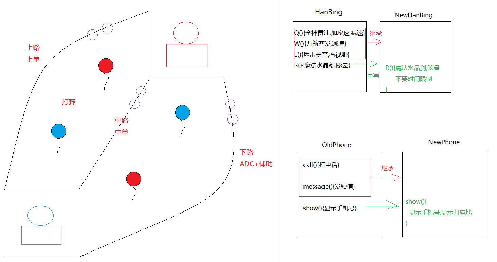
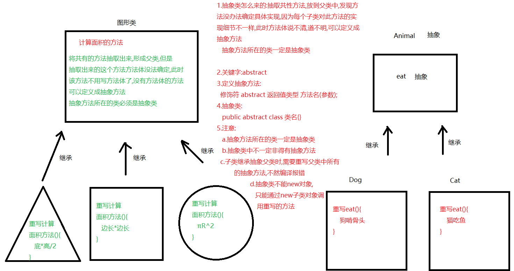

# 模块十_面向对象

```java
模块十重点:
  1.知道继承的好处
  2.会使用继承
  3.知道继承之后成员变量以及成员方法的访问特点
  4.会方法的重写,以及知道方法重写的使用场景
  5.会使用this关键字调用当前对象中的成员
  6.会使用super关键字调用父类中的成员
  7.会定义抽象方法以及抽象类
  8.会重写抽象方法
```

# 第一章.继承

## 1.什么是继承

```java
1.父类怎么形成的:我们的定义了多个类,发现这些类中有很多重复性的代码,我们就定义了一个父类,将相同的代码抽取出来放到父类中,其他的类直接继承这个父类,就可以直接使用父类中的内容了

2.怎么去继承: extends
   子类 extends 父类

3.注意:
  a.子类可以继承父类中私有和非私有成员,但是不能使用父类中私有成员
  
  b.构造方法不能继承

4.继承怎么学:
   a.继承不要从是否"拥有"方面来学习
      要从是否能"使用"方面来学习
```


## 2.继承如何使用

```java
1.定义一个父类,在其中定义重复性的代码
2.定义一个子类继承父类 -> extends
  子类 extends 父类
3.创建子类对象,直接使用父类中非私有成员    
```

```java
public class Employee {
    String name;
    int age;

    public void work(){
        System.out.println("工作");
    }

    private void eat(){
        System.out.println("员工要干饭");
    }
}

```

```java
public class Teacher extends Employee{

}

```

```java
public class Manager extends Employee{
}

```

```java
public class Test01 {
    public static void main(String[] args) {
        Teacher teacher = new Teacher();
        teacher.name = "涛哥";
        teacher.age = 18;
        System.out.println(teacher.name+"..."+teacher.age);
        teacher.work();
        //teacher.eat();子类继承父类之后不能使用父类私有成员,只能使用父类非私有成员

        System.out.println("============");

        Manager manager = new Manager();
        manager.name = "金莲";
        manager.age = 18;
        System.out.println(manager.name+"..."+manager.age);
        manager.work();
    }
}

```

## 3.继承中,成员变量和成员方法的访问特点

### 3.1  成员变量

#### 3.1.1 子类和父类中的成员变量不重名:

```java
public class Fu {
    int numFu = 100;
}

```

```java
public class Zi extends Fu{
    int numZi = 10;
}
```

```java
public class Test01 {
    public static void main(String[] args) {
        //创建父类对象
        Fu fu = new Fu();
        System.out.println(fu.numFu);//父类中的numFu
        //System.out.println(fu.numZi);//不能直接调用子类特有的成员

        System.out.println("=================");
        //创建子类对象
        Zi zi = new Zi();
        System.out.println(zi.numZi);
        System.out.println(zi.numFu);//继承了父类,可以使用父类中非私有成员
    }
}

```

```java
总结:看等号左边是谁,先调用谁中的成员  
    如果等号左边是父类类型,只能调用父类中的成员变量,如果等号左边是子类类型,既能调用子类的,还能调用父类中继承过来的非私有成员
```

#### 2.1.2.子类和父类中的成员变量重名

```java
public class Fu {
    int numFu = 100;

    int num = 10000;
}
```

```java
public class Zi extends Fu{
    int numZi = 10;

    int num = 1000;
}

```

```java
public class Test01 {
    public static void main(String[] args) {
        //创建父类对象
        Fu fu = new Fu();
        System.out.println(fu.numFu);//父类中的numFu
        //System.out.println(fu.numZi);//不能直接调用子类特有的成员
        System.out.println(fu.num);//父类的

        System.out.println("=================");
        //创建子类对象
        Zi zi = new Zi();
        System.out.println(zi.numZi);
        System.out.println(zi.numFu);//继承了父类,可以使用父类中非私有成员
        System.out.println(zi.num);//子类的
    }
}
```

> 总结:继承前提下,成员变量访问特点口诀:
>
> ​         看等号左边是谁,先调用谁中的成员,子类没有,找父类

### 2.2 成员方法

```java
public class Fu {
    public void methodFu(){
        System.out.println("我是父类中的methodFu");
    }

    public void method(){
        System.out.println("我是父类中的method方法");
    }
}
```

```java
public class Zi extends Fu{
    public void methodZi(){
        System.out.println("我是子类中的methodZi方法");
    }

    public void method(){
        System.out.println("我是子类中的method方法");
    }
}
```

```java
public class Test01 {
    public static void main(String[] args) {
        Fu fu = new Fu();
        fu.methodFu();
       // fu.methodZi(); 不能直接调用子类特有的方法
        fu.method();//父类中的method方法

        System.out.println("=====================");
        Zi zi = new Zi();
        zi.methodZi();
        zi.methodFu();//继承父类之后,能调用父类非私有成员
        zi.method();//子类中的method方法

        System.out.println("===================");

        Fu fu1 = new Zi();
        fu1.method();//调用的是子类中的method方法
    }
}

```

> 成员方法:看new的是谁,先调用谁中的方法,子类没有,找父类
>
> 
>
> 继承中,成员变量访问特点:看等号左边是谁,先调用谁中的成员变量
>
> ​             成员方法访问特点:看new的是谁,先调用谁中的方法

## 4.方法的重写

```java
1.概述:子类中有一个和父类方法名以及参数列表相同的方法
2.前提:继承
3.访问:看new的是谁,先调用谁中的,如果new的是子类,调用调用子类重写的方法,子类没有,找父类
4.检测是否为重写方法:在该方法上写
  @Override  
```

```java
public class Fu {
    public void methodFu(){
        System.out.println("我是父类中的methodFu方法");
    }
    public void method(){
        System.out.println("我是父类中的method方法");
    }
}
```

```java
public class Zi extends Fu{
    public void methodZi(){
        System.out.println("我是子类中的methodZi方法");
    }

    @Override
    public void method(){
        System.out.println("我是子类中的method方法");
    }
```

```java
public class Test01 {
    public static void main(String[] args) {
        Fu fu = new Fu();
        fu.methodFu();//自己的methodFu方法
        fu.method();//new的是父类对象,那么调用的就是父类中的method

        System.out.println("================");

        Zi zi = new Zi();
        zi.methodZi();
        zi.methodFu();
        zi.method();//子类中的method方法
    }
}

```

### 4.1.注意事项

```java
1.子类重写父类方法之后,权限必须要保证大于等于父类权限(权限指的是访问权限)
  public -> protected -> 默认 -> private
2.子类方法重写父类方法,方法名和参数列表要一样
3.私有方法不能被重写,构造方法不能被重写,静态方法不能被重写
4.子类重写父类方法之后,返回值类型应该是父类方法返回值类型的子类类型    
```

```JAVA
public class Fu {
    public void methodFu(){
        System.out.println("我是父类中的methodFu方法");
    }
    public void method(){
        System.out.println("我是父类中的method方法");
    }

    void method01(){

    }

   /* public static void method02(){

    }*/

    public Fu method03(){
        return null;
    }
}
```

```java
public class Zi extends Fu{
    public void methodZi(){
        System.out.println("我是子类中的methodZi方法");
    }

    @Override
    public void method(){
        System.out.println("我是子类中的method方法");
    }

    @Override
   public void method01(){

    }

   /* public static void method02(){

    }*/

    @Override
    public Zi method03(){
      return null;
    }
}
```

### 4.2.使用场景

```java
1.使用场景:功能升级改造,子类需要对父类中已经实现好的功能进行重新改造
```



```java
public class OldPhone {
    public void call(){
        System.out.println("打电话");
    }

    public void message(){
        System.out.println("发短信");
    }

    public void show(){
        System.out.println("显示手机号");
    }
}
```

```java
public class NewPhone extends OldPhone{
    public void show(){
        System.out.println("显示手机号");
        System.out.println("显示归属地");
    }
}

```

```java

public class Test01 {
    public static void main(String[] args) {
        NewPhone newPhone = new NewPhone();
        newPhone.call();
        newPhone.message();
        newPhone.show();
    }
}

```

# 第二章.super和this

## 1.继承中构造方法的特点

```java
1.注意:new子类对象时,会先初始化父类(先走父类无参构造方法)
2.原因:
  每个构造方法的第一行,默认都会有一个super(),不写jvm自动提供一个
  super()代表的是父类无参构造      
```

```java
public class Fu {
    public Fu(){
        System.out.println("我是父类中的无参构造");
    }
}

```

```java
public class Zi extends Fu{
    public Zi(){
        //super();
        System.out.println("我是子类中的无参构造");
    }

    public Zi(int i){
        //super();
        System.out.println("我是子类中的有参构造");
    }
}
```

```java
public class Test {
    public static void main(String[] args) {
        Zi zi = new Zi();
        System.out.println("===========");
        Zi zi1 = new Zi(10);
    }
}
```

## 2.super和this的具体使用

### 2.1 super的具体使用

```java
1.概述:代表的是父类引用
2.作用:可以调用父类中的成员
3.使用:
  a.调用父类构造方法-> 在子类中的构造中写
    super() -> 调用父类无参构造
    super(实参)  -> 调用父类有参构造
      
  b.调用父类成员变量:
    super.成员变量名
        
  c.调用父类成员方法:
    super.成员方法名(实参)
```

```java
public class Fu {
    int num = 10;
    public Fu(){
        System.out.println("我是父类中的无参构造");
    }

    public Fu(int data){
        System.out.println("我是父类中的有参构造");
    }

    public void method(){
        System.out.println("我是父类中的method方法");
    }
}

```

```java
public class Zi extends Fu{
    int num = 100;
    public Zi(){
        super();//调用父类中的无参构造
        System.out.println("我是子类中的无参构造");
    }

    public Zi(int num){
        super(10);//调用父类的有参构造
        System.out.println("我是子类中的有参构造");
    }

    public void method(){
        super.method();//调用父类的method方法
        System.out.println("我是子类中的method方法");
        System.out.println(num);//子类自己的
        System.out.println(super.num);//调用父类的num
    }
}

```

```java
public class Test01 {
    public static void main(String[] args) {
        Zi zi = new Zi();
        System.out.println("============");
        Zi zi1 = new Zi(10);
        System.out.println("============");
        Zi zi2 = new Zi();
        zi2.method();

    }
}
```

### 2.2 this的具体使用

```java
1.this概述:代表的是当前对象(哪个对象调用的this所在的方法,this就代表哪个对象)
2.作用:
  a.区分重名的成员变量和局部变量
  b.调用当前对象中的成员
3.使用:
  a.调用当前对象的构造:在构造中写
    this():调用当前对象的无参构造
    this(实参):调用当前对象的有参构造
  b.调用当前对象的成员变量:
    this.成员变量名
  c.调用当前对象的成员方法:
    this.成员方法名(实参)
4.注意:
  不管是super还是this,只要在构造中使用,都必须在第一行,所以二者不能同时手写出来
```

```java
public class Person {
    int num = 10;
    public Person(){
        //this(10);
        System.out.println("我是Person中的无参构造");
    }

    public Person(int data){
        //super();super和this不能同时再构造中出现
        this();
        System.out.println("我是Person中的有参构造");
    }

    public void method(){
        int num = 20;
        System.out.println(num);//20
        System.out.println(this.num);//10
        this.method01();
        System.out.println("我是Person类中的method方法");
    }

    public void method01(){
        System.out.println("我是Person类中的method01方法");
    }
}

```

```java
public class Test01 {
    public static void main(String[] args) {
        Person person = new Person();
        System.out.println("========");
        Person person1 = new Person(10);
        System.out.println("========");
        Person person2 = new Person();
        person2.method();
    }
}
```

## 3.继承的特点

```java
1.继承只支持单继承,不能多继承
  public class A extends B,C{}  -> 错误
2.继承支持多层继承
  public class A extends B{}
  public class B extends C{}
3.一个父类可以有多个子类
  public class A extends C{}
  public class B extends C{}

4.构造方法不能继承,也不能重写
  私有方法可以继承,但是不能被重写
  静态方法可以继承,但是不能被重写
```

```java
public class Fu {
    public void method01(){
        System.out.println("method01方法");
    }

    private void method02(){
        System.out.println("method02方法");
    }

    public static void method03(){
        System.out.println("method03方法");
    }
}

```

```java
public class Zi extends Fu{
    @Override
    public void method01(){
        System.out.println("重写的method01方法");
    }

/*    @Override
    private void method02(){
        System.out.println("method02方法");
    }*/
}

```

```java
public class Test01 {
    public static void main(String[] args) {
        Zi zi = new Zi();
        zi.method03();
        Zi.method03();
    }
}
```

## 4.问题:如何为父类中private的成员变量赋值(经验值)

### 4.1.利用set赋值

```java
public class Employee {
    private String name;
    private int age;

    public Employee() {
    }

    public Employee(String name, int age) {
        this.name = name;
        this.age = age;
    }

    public String getName() {
        return name;
    }

    public void setName(String name) {
        this.name = name;
    }

    public int getAge() {
        return age;
    }

    public void setAge(int age) {
        this.age = age;
    }

    public void work(){
        System.out.println("工作");
    }
}

```

```java
public class Teacher extends Employee{
}
```

```java
        Teacher teacher = new Teacher();
        teacher.setName("涛哥");
        teacher.setAge(18);
        System.out.println(teacher.getName()+"..."+teacher.getAge());
```

### 4.2.利用构造方法赋值

```java
public class Employee {
    private String name;
    private int age;

    public Employee() {
    }

    public Employee(String name, int age) {
        this.name = name;
        this.age = age;
    }

    public String getName() {
        return name;
    }

    public void setName(String name) {
        this.name = name;
    }

    public int getAge() {
        return age;
    }

    public void setAge(int age) {
        this.age = age;
    }

    public void work(){
        System.out.println("工作");
    }
}

```

```java
public class Manager extends Employee{
    public Manager() {
    }

    public Manager(String name, int age) {
        super(name, age);
    }
}
```

```java
        Manager manager = new Manager("金莲", 24);
        System.out.println(manager.getName()+"..."+manager.getAge());
```


# 第三章.抽象



## 1.抽象的介绍

```java
   1.抽象类怎么来的？
     抽取共性方法,放到父类中,发现方法没法实现,因为每个子类对此方法的实现方式细节不一样
此时方法体说不清道不明,可以定义成抽象方法
    抽象方法所在的类一定是抽象类


   2.关键字: abstract

   3.抽象方法:
      修饰符 abstract 返回值类型 方法名(参数);

   4.抽象类:
       public  abstract class 类名{}

   5.注意:
       a.抽象方法所在的类一定是抽象类
       b.抽象类中不一定非得有抽象方法
       c.子类继承父类之后,需要重写父类
          中所有的抽象方法,不然编译报错
       d.抽象类不能new对象,只能通过new子类对象调动重写方法
           
   6.可以将抽象类看成是一类事物的标准,要求只要是属于这一类的,都必须要拥有抽象类中的方法,必须要给我实现,怎么证明拥有了,怎么证明实现了呢?-> 重写
     至于这个方法怎么实现,就看子类重写之后怎么写方法体了
```

```java
public abstract class Animal {
   public abstract void eat();
   public abstract void drink();
}
```

```java
public class Dog extends Animal{
    @Override
    public void eat() {
        System.out.println("狗啃骨头");
    }

    @Override
    public void drink() {
        System.out.println("狗喝水");
    }
}
```

```java
public class Cat extends Animal{
    @Override
    public void eat() {
        System.out.println("猫吃鱼");
    }

    @Override
    public void drink() {
        System.out.println("猫喝水");
    }
}

```

```java
public class Test01 {
    public static void main(String[] args) {
        Dog dog = new Dog();
        dog.eat();
        dog.drink();
        System.out.println("===================");
        Cat cat = new Cat();
        cat.eat();
        cat.drink();
    }
}
```

## 2.抽象的注意事项

```java
1.抽象类不能直接new对象,只能创建非抽象子类的对象
2.抽象类中不一定非得有抽象方法,但是抽象方法所在的类一定抽象类
3.抽象类的子类,必须重写父类中的所有抽象方法,否则,编译报错,除非该子类也是抽象类
4.抽象类中可以有成员变量,构造,成员方法
5.抽象类中可以有构造方法,是供子类创建对象时,初始化父类属性使用的    
```

```java
public abstract class Employee {
    private String name;
    private int age;

    public Employee() {
    }

    public Employee(String name, int age) {
        this.name = name;
        this.age = age;
    }

    public String getName() {
        return name;
    }

    public void setName(String name) {
        this.name = name;
    }

    public int getAge() {
        return age;
    }

    public void setAge(int age) {
        this.age = age;
    }

    public abstract void work();
}
```

```java
public class Teacher extends Employee{
    public Teacher() {
    }

    public Teacher(String name, int age) {
        super(name, age);
    }

    @Override
    public void work() {
        System.out.println("涛哥在讲java");
    }
}
```

```java
public class Test01 {
    public static void main(String[] args) {
        Teacher t1 = new Teacher("涛哥", 18);
        System.out.println(t1.getName()+"..."+t1.getAge());
    }
}

```

# 第四章.综合案例

```java
某IT公司有多名员工，按照员工负责的工作不同，进行了部门的划分（研发部、维护部）。
研发部(Developer)根据所需研发的内容不同，又分为 JavaEE工程师 、Android工程师 ；
维护部(Maintainer)根据所需维护的内容不同，又分为 网络维护工程师(Network) 、硬件维护工程师(Hardware) 。

公司的每名员工都有他们自己的员工编号、姓名，并要做它们所负责的工作。

工作内容:

- JavaEE工程师： 员工号为xxx的 xxx员工，正在研发电商网站
- Android工程师：员工号为xxx的 xxx员工，正在研发电商的手机客户端软件
- 网络维护工程师：员工号为xxx的 xxx员工，正在检查网络是否畅通
- 硬件维护工程师：员工号为xxx的 xxx员工，正在修复电脑主板

请根据描述，完成员工体系中所有类的定义，并指定类之间的继承关系。进行XX工程师类的对象创建，完成工作方法的调用。
```


## 方式1:利用set赋值

```java
public abstract class Employee {
    private int id;
    private String name;

    public Employee() {
    }

    public Employee(int id, String name) {
        this.id = id;
        this.name = name;
    }

    public int getId() {
        return id;
    }

    public void setId(int id) {
        this.id = id;
    }

    public String getName() {
        return name;
    }

    public void setName(String name) {
        this.name = name;
    }

    public abstract void work();
}

```

```java
public abstract class Developer extends Employee{
}

```

```java
public class JavaEE extends Developer{
    @Override
    public void work() {
        //System.out.println("员工号为:"+getId()+"的"+getName()+"正在开发网站");
        System.out.println("员工号为:"+this.getId()+"的"+this.getName()+"正在开发网站");
    }
}
```

```java
public class Android extends Developer{
    @Override
    public void work() {
        //System.out.println("员工号为:"+getId()+"的"+getName()+"正在开发app");
        System.out.println("员工号为:"+this.getId()+"的"+this.getName()+"正在开发app");
    }
}
```

```java
public class Test01 {
    public static void main(String[] args) {
        JavaEE javaEE = new JavaEE();
        javaEE.setId(1);
        javaEE.setName("涛哥");
        javaEE.work();
        System.out.println("===============");
        Android android = new Android();
        android.setId(2);
        android.setName("金莲");
        android.work();
    }
}
```

## 方式2:利用构造赋值

```java
public abstract class Employee {
    private int id;
    private String name;

    public Employee() {
    }

    public Employee(int id, String name) {
        this.id = id;
        this.name = name;
    }

    public int getId() {
        return id;
    }

    public void setId(int id) {
        this.id = id;
    }

    public String getName() {
        return name;
    }

    public void setName(String name) {
        this.name = name;
    }

    public abstract void work();
}

```

```java
public abstract class Developer extends Employee{
    public Developer() {
    }

    public Developer(int id, String name) {
        super(id, name);
    }
}

```

```java
public class JavaEE extends Developer{
    public JavaEE() {
    }

    public JavaEE(int id, String name) {
        super(id, name);
    }

    @Override
    public void work() {
        //System.out.println("员工号为:"+getId()+"的"+getName()+"正在开发网站");
        System.out.println("员工号为:"+this.getId()+"的"+this.getName()+"正在开发网站");
    }
}

```

```java
public class Android extends Developer{

    public Android() {
    }

    public Android(int id, String name) {
        super(id, name);
    }

    @Override
    public void work() {
        //System.out.println("员工号为:"+getId()+"的"+getName()+"正在开发app");
        System.out.println("员工号为:"+this.getId()+"的"+this.getName()+"正在开发app");
    }
}


```

```java
public class Test02 {
    public static void main(String[] args) {
        JavaEE javaEE = new JavaEE(1, "涛哥");
        javaEE.work();
        System.out.println("===============");
        Android android = new Android(2, "金莲");
        android.work();
    }
}

```

