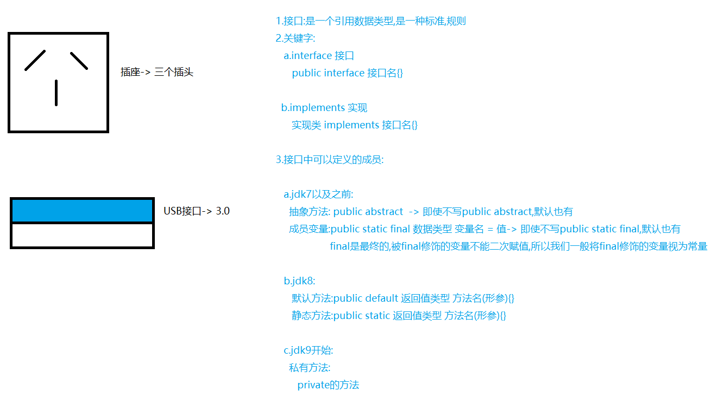
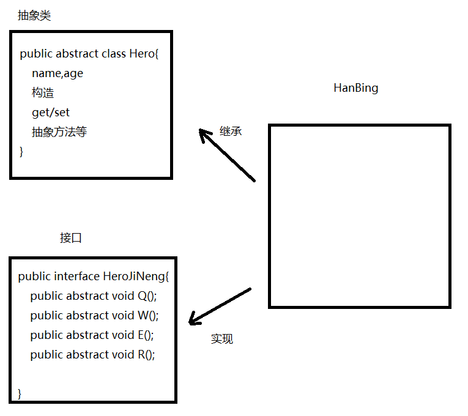
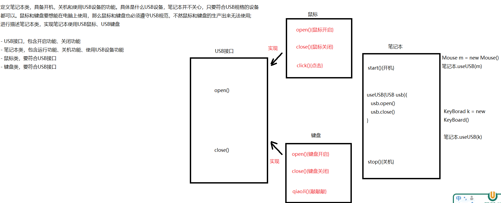

# 模块11_面向对象

```java
模块十回顾:
  1.继承:子类继承父类,可以直接使用父类中非私有成员,子类不用写重复性代码
  2.关键字: extends 
  3.成员访问特点:
    a.成员变量:看等号左边是谁
    b.成员方法:看new的是谁
  4.方法的重写:子类中有一个和父类从方法名以及参数列表上一样的方法
    a.检测:@Override
    b.使用场景:功能的升级
  5.继承中构造的特点:
    new子类对象先初始化父类
  6.super:代表的是父类引用
    a.调用父类构造:super()   super(实参)
    b.调用父类成员变量: super.成员变量名
    c.调用父类成员方法:super.成员方法名(实参)
  7.this:代表的是当前对象(哪个对象调用的this所在的方法,this就代表哪个对象)
    a.作用:区分重名的成员变量和局部变量
    b.使用:
      调用当前对象构造:this()  this(实参)
      调用当前对象成员变量:this.成员变量名
      调用当前对象成员方法:this.成员方法名(实参)
    c.注意:在构造中使用this和super,都必须要在第一行,所以两者不能同时出现
  8.继承的特点:
    a.继承只支持单继承,不支持多继承
    b.继承支持多层继承
    c.一个父类可以拥有多个子类
        
  9.抽象:
    a.抽象方法: 修饰符 abstract 返回值类型 方法名(形参)
    b.抽象类:public abstract class 类名{}
    c.特点:
      抽象方法所在的类一定是抽象类
      抽象类中不一定非得有抽象方法
      子类继承抽象父类时,需要重写抽象方法
      抽象类不能new对象,只能new子类对象
      抽象类中啥都可以有,私有属性,构造,其他方法等
      抽象类中的构造是供创建子类对象时初始化父类属性使用的
          
模块11重点:
  1.会定义接口
  2.会在接口中定义抽象方法,默认方法,静态方法,成员变量
  3.会调用接口中的成员
  4.知道多态的前提    
  5.会利用多态的方式new对象
  6.要知道使用多态的好处
  7.会在多态的前提下,向下转型
  8.会利用instanceof判断类型    
```

# 第一章.接口

## 1.接口的介绍



## 2.接口的定义以及使用

```java
1.接口:是一个引用数据类型,是一种标准,规则
2.关键字:
   a.interface 接口
      public interface 接口名{}
   
  b.implements 实现
      实现类 implements 接口名{}

3.接口中可以定义的成员:
   
   a.jdk7以及之前:
     抽象方法: public abstract  -> 即使不写public abstract,默认也有
     成员变量:public static final 数据类型 变量名 = 值-> 即使不写public static final,默认也有
                    final是最终的,被final修饰的变量不能二次赋值,所以我们一般将final修饰的变量视为常量

   b.jdk8:
      默认方法:public default 返回值类型 方法名(形参){}
      静态方法:public static 返回值类型 方法名(形参){}

   c.jdk9开始:
     私有方法:
        private的方法
```

```java
1.定义接口:
  public interface 接口名{}
2.实现:
  public class 实现类类名 implements 接口名{}
3.使用:
  a.实现类实现接口
  b.重写接口中的抽象方法
  c.创建实现类对象(接口不能直接new对象)
  d.调用重写的方法    
```

```java
public interface USB {
    public abstract void open();
    public abstract void close();
}

```

```java
public class Mouse implements USB{
    @Override
    public void open() {
        System.out.println("鼠标打开");
    }

    @Override
    public void close() {
        System.out.println("鼠标关闭");
    }
}

```

```java
public class Test01 {
    public static void main(String[] args) {
        Mouse mouse = new Mouse();
        mouse.open();
        mouse.close();
    }
}

```

## 3.接口中的成员

### 3.1抽象方法

```java
1.定义格式:
  public abstract 返回值类型 方法名(形参);
2.注意:
  不写public abstract 默认也有
3.使用:
  a.定义实现类,实现接口
  b.重写抽象方法
  c.创建实现类对象,调用重写的方法
```

```java
public interface USB {
    public abstract void open();
    String close();
}
```

```java
public class Mouse implements USB{
    @Override
    public void open() {
        System.out.println("鼠标打开");
    }

    @Override
    public String close() {
        return "鼠标关闭";
    }
}
```

```java
public class Test01 {
    public static void main(String[] args) {
        Mouse mouse = new Mouse();
        mouse.open();
        String result = mouse.close();
        System.out.println("result = " + result);
    }
}

```

### 3.2默认方法

```java
1.格式:
  public default 返回值类型 方法名(形参){
      方法体
      return 结果
  }
2.使用:
  a.定义实现类,实现接口
  b.默认方法可重写,可不重写
  c.创建实现类对象,调用默认方法     
```

```java
public interface USB {
   //默认方法
    public default void methodDef(){
        System.out.println("我是默认方法");
    }
}

```

```java
public class Mouse implements USB {
    @Override
    public void methodDef(){
        System.out.println("我是重写接口中的默认方法");
    }
}

```

```java
public class Test01 {
    public static void main(String[] args) {
        Mouse mouse = new Mouse();
        mouse.methodDef();
    }
}
```

### 3.3静态方法

```java
1.定义格式:
  public static 返回值类型 方法名(形参){
      方法体
      return 结果
  } 

2.使用:
  接口名直接调用
      
```

```java
public interface USB {
   //默认方法
    public default void methodDef(){
        System.out.println("我是默认方法");
    }

    //静态方法
    public static void methodSta(){
        System.out.println("我是接口中的静态方法");
    }
}
```

```java
public class Test01 {
    public static void main(String[] args) {
        Mouse mouse = new Mouse();
        mouse.methodDef();

        System.out.println("=============");

        USB.methodSta();
    }
}

```

> 默认方法和静态方法 -> 可以作为临时加的一个小功能来使用

### 3.4成员变量

### 3.4成员变量

```java
1.格式:
  public static final 数据类型 变量名 = 值
2.相关知识点:final
  final代表最终的,被它修饰的变量,不能二次赋值,可以视为常量
3.特点:
  不写public static final 默认也有
4.使用:
  接口名直接调用
5.注意:
  a.被static final修饰的成员变量需要手动赋值
  b.习惯上我们会将static final修饰的成员变量名大写
```

```java
public interface USB {
    public static final int NUM1 = 100;
    int NUM2 = 200;//不写public static final 默认也有
}
```

```java
public class Test01 {
    public static void main(String[] args) {
        System.out.println(USB.NUM1);
        System.out.println(USB.NUM2);
    }
}
```

## 4.接口的特点

```java
1.接口可以多继承 -> 一个接口可以继承多个接口
  public interface InterfaceA extends InterfaceB,InterfaceC{}
2.接口可以多实现 -> 一个实现类可以实现一个或者多个接口
  public class InterfaceImpl implements InterfaceA,InterfaceB{}
3.一个子类可以继承一个父类的同时实现一个或者多个接口
  public class Zi extends Fu implements  InterfaceA,InterfaceB{}

4.注意:
  继承也好,实现接口也罢,只要是父类中或者接口的抽象方法,子类或者实现类都要重写
```

> 当一个类实现多个接口时,如果接口中的抽象方法有重名且参数一样的,只需要重写一次
>
> ```java
> public interface InterfaceA {
>     public abstract void method();
> }
> 
> public interface InterfaceB {
>     public abstract void method();
> }
> 
> public class InterfaceImpl implements InterfaceA,InterfaceB{
>     @Override
>     public void method() {
>         System.out.println("重写的method方法");
>     }
> }
> ```
>
> 当一个类实现多个接口时,如果多个接口中默认方法有重名的,且参数一样的,必须重写一次默认方法
>
> ```java
> public interface InterfaceA {
>     public abstract void method();
> 
>     public default void methodDef(){
>         System.out.println("我是接口A中的默认方法");
>     }
> }
> 
> public interface InterfaceB {
>     public abstract void method();
> 
>     /*    public default void methodDef(){
>             System.out.println("我是接口B中的默认方法");
>         }*/
>     public default void methodDef(int a) {
>         System.out.println("我是接口B中的默认方法");
>     }
> }
> 
> public class InterfaceImpl implements InterfaceA,InterfaceB{
>     @Override
>     public void method() {
>         System.out.println("重写的method方法");
>     }
> 
> /*    @Override
>     public void methodDef() {
>         System.out.println("重写后的默认方法");
>     }*/
> }
> 
> 
> public class Test01 {
>     public static void main(String[] args) {
>         InterfaceImpl anInterface = new InterfaceImpl();
>         anInterface.methodDef();
>         anInterface.methodDef(10);
>     }
> }
> 
> ```

## 5.接口和抽象类的区别

```java
相同点:
  a.都位于继承体系的顶端,用于被其他类实现或者继承
  b.都不能new
  c.都包含抽象方法,其子类或者实现类都必须重写这些抽象方法
      
不同点:
  a.抽象类:一般作为父类使用,可以有成员变量,构造,成员方法,抽象方法等
  b.接口:成员单一,一般抽取接口,抽取的都是方法,视为功能的大集合
  c.类不能多继承,但是接口可以
```



# 第二章.多态

```java
1.面向对象三大特征:封装   继承   多态
2.怎么学:
  a.不要从字面意思上理解多态这两个字,要从使用形式上掌握
  b.要知道多态的好处
  c.要知道多态的前提    
```

## 1.多态的介绍

```java
1.前提:
  a.必须有子父类继承或者接口实现关系
  b.必须有方法的重写(没有重写,多态没有意义),多态主要玩儿的是重写方法
  c.new对象:父类引用指向子类对象
    Fu fu = new Zi() -> 理解为大类型接收了一个小类型的数据 ->比如  double b = 10
2.注意:
  多塔下不能直接调用子类特有功能
```

## 2.多态的基本使用

```java
public abstract class Animal {
    public abstract void eat();
}

```

```java
public class Dog extends Animal{
    @Override
    public void eat() {
        System.out.println("狗啃骨头");
    }

    //特有方法
    public void lookDoor(){
        System.out.println("狗会看门");
    }
}
```

```java
public class Cat extends Animal{
    @Override
    public void eat() {
        System.out.println("猫吃鱼");
    }

    //特有方法
    public void catchMouse(){
        System.out.println("猫会捉老鼠");
    }
}
```

```java
public class Test01 {
    public static void main(String[] args) {
        //原始方式
        Dog dog = new Dog();
        dog.eat();//重写的
        dog.lookDoor();//特有的

        Cat cat = new Cat();
        cat.eat();//重写的
        cat.catchMouse();//特有的

        System.out.println("==================");
        //多态形式new对象
        Animal animal = new Dog();//相当于double b = 10
        animal.eat();//重写的 animal接收的是dog对象,所以调用的是dog中的eat
//      animal.lookDoor();   多态前提下,不能直接调用子类特有成员

        Animal animal1 = new Cat();
        animal1.eat();//cat重写的


    }
}

```

## 3.多态的条件下成员的访问特点

### 3.1成员变量

```java
public class Fu {
    int num = 1000;
}
```

```java
public class Zi extends Fu{
    int num = 100;
}
```

```java
public class Test01 {
    public static void main(String[] args) {
        Fu fu = new Zi();
        System.out.println(fu.num);
    }
}
```

```java
看等号左边是谁,先调用谁中的成员变量
```

### 3.2成员方法

```java
public class Fu {
    int num = 1000;
    public void method(){
        System.out.println("我是父类中的method方法");
    }
}

```

```java
public class Zi extends Fu{
    int num = 100;

    public void method(){
        System.out.println("我是子类中的method方法");
    }
}

```

```java
public class Test01 {
    public static void main(String[] args) {
        Fu fu = new Zi();
        System.out.println(fu.num);//父类中的num
        fu.method();//子类中重写的method方法
    }
}

```

```java
看new的是谁,先调用谁中的成员方法,子类没有,找父类
```

## 4.多态的好处(为什么学多态)

```java
1.问题描述:
  如果使用原始方式new对象(等号左右两边一样),既能调用重写的,还能调用继承的,还能调用自己特有的成员
  但是多态方式new对象,只能调用重写的,不能直接调用子类特有的成员,那为啥还要用多态呢?
      
2.多态方式和原始方式new对象的优缺点:
  原始方式:
    a.优点:既能调用重写的,还能调用父类非私有的,还能调用自己特有的
    b.缺点:扩展性差
        
  多态方式:
    a.优点:扩展性强
    b.缺点:不能直接调用子类特有功能
        
      Fu fu = new Zi()
      double b = 10;
      b = 100L;
      
```

```java
public abstract class Animal {
    public abstract void eat();
}

```

```java
public class Dog extends Animal {
    @Override
    public void eat() {
        System.out.println("狗啃骨头");
    }

    //特有方法
    public void lookDoor(){
        System.out.println("狗会看门");
    }
}
```

```java
public class Cat extends Animal {
    @Override
    public void eat() {
        System.out.println("猫吃鱼");
    }

    //特有方法
    public void catchMouse(){
        System.out.println("猫会捉老鼠");
    }
}

```

```java
public class Test01 {
    public static void main(String[] args) {
        Dog dog = new Dog();
        dog.eat();//重写的
        dog.lookDoor();//特有的

        //dog = new Cat();
        System.out.println("=============");
        method(dog);

        Cat cat = new Cat();
        method(cat);

       /* houzi houzi = new houzi();
        method(houzi);

        bird bird = new bird();
        method(bird);*/
    }

    public static void method(Dog dog){
        dog.eat();
        dog.lookDoor();
    }

    public static void method(Cat cat){
        cat.eat();
        cat.catchMouse();
    }

   /* public static void method(houzi houzi){
        cat.eat();
        cat.catchMouse();
    }*/
}

```

```java
public class Test02 {
    public static void main(String[] args) {
        /*
           double b = 10;
           b = 100L;
         */
        Animal animal = new Dog();
        animal.eat();

        animal = new Cat();
        animal.eat();
        System.out.println("=================");

        Dog dog = new Dog();
        method(dog);

        Cat cat = new Cat();
        method(cat);

    }

    /*
       形参传递父类类型,调用此方法父类类型可以接收任意它的子类对象
       传递哪个子类对象,就指向哪个子类对象,就调用哪个子类对象重写的方法
     */
    public static void method(Animal animal){//Animal animal = dog   Animal animal = cat
        animal.eat();
    }
}

```

>  形参传递父类类型,调用此方法父类类型可以接收任意它的子类对象
>  传递哪个子类对象,就指向哪个子类对象,就调用哪个子类对象重写的方法

## 5.多态中的转型

### 5.1向上转型

```java
1.父类引用指向子类对象
  好比是: double b = 1;
```

### 5.2向下转型

```java
1.向下转型:好比强转,将大类型强制转成小类型
2.表现方式:
  父类类型 对象名1 = new 子类对象() -> 向上转型 -> double b = 1
  子类类型 对象名2 = (子类类型)对象名1 -> 向下转型 -> int i = (int)b
      
3.想要调用子类特有功能,我们就需要向下转型      
```

```java
public abstract class Animal {
    public abstract void eat();
}
```

```java
public class Cat extends Animal {
    @Override
    public void eat() {
        System.out.println("猫吃鱼");
    }

    //特有方法
    public void catchMouse(){
        System.out.println("猫会捉老鼠");
    }
}
```

```java
public class Dog extends Animal {
    @Override
    public void eat() {
        System.out.println("狗啃骨头");
    }

    //特有方法
    public void lookDoor(){
        System.out.println("狗会看门");
    }
}

```

```java
public class Test01 {
    public static void main(String[] args) {
        //多态new对象  向上转型
        Animal animal = new Dog();
        animal.eat();//dog重写的
        //animal.lookDoor();//多态不能调用子类特有功能

        //向下转型
        Dog dog = (Dog) animal;
        dog.eat();
        dog.lookDoor();
    }
}
```

## 6.转型可能会出现的问题

```java
1.如果等号左右两边类型不一致,会出现类型转换异常(ClassCastException)
2.解决:
  在向下转型之前,先判断类型
3.怎么判断类型: instanceof
  判断结果是boolean型
    
4.使用:
  对象名 instanceof 类型 -> 判断的是关键字前面的对象是否符合关键字后面的类型
```

```java
public abstract class Animal {
    public abstract void eat();
}
```

```java
public class Dog extends Animal {
    @Override
    public void eat() {
        System.out.println("狗啃骨头");
    }

    //特有方法
    public void lookDoor(){
        System.out.println("狗会看门");
    }
}

```

```java
public class Cat extends Animal {
    @Override
    public void eat() {
        System.out.println("猫吃鱼");
    }

    //特有方法
    public void catchMouse(){
        System.out.println("猫会捉老鼠");
    }
}

```

```java
public class Test01 {
    public static void main(String[] args) {
        Dog dog = new Dog();
        method(dog);

        System.out.println("===============");

        Cat cat = new Cat();
        method(cat);
    }

    public static void method(Animal animal){//animal = dog    animal = cat
      /*  animal.eat();
        *//*
           这里会出现类型转换异常(ClassCastException)
           原因:当调用method,传递Cat对象时,animal代表的就是cat对象
               此时我们将代表cat对象的animal强转成了dog
               此时等号左右两边类型不一致了,所以出现了类型转换异常
         *//*
        Dog dog = (Dog) animal;
        dog.lookDoor();*/

        if (animal instanceof Dog){
            Dog dog = (Dog) animal;
            dog.eat();
            dog.lookDoor();
        }

        if (animal instanceof Cat){
            Cat cat = (Cat) animal;
            cat.eat();
            cat.catchMouse();
        }
    }
}
```

## 7.综合练习

```java
定义笔记本类，具备开机，关机和使用USB设备的功能。具体是什么USB设备，笔记本并不关心，只要符合USB规格的设备都可以。鼠标和键盘要想能在电脑上使用，那么鼠标和键盘也必须遵守USB规范，不然鼠标和键盘的生产出来无法使用;
进行描述笔记本类，实现笔记本使用USB鼠标、USB键盘

- USB接口，包含开启功能、关闭功能
- 笔记本类，包含运行功能、关机功能、使用USB设备功能
- 鼠标类，要符合USB接口
- 键盘类，要符合USB接口
```



```java
public interface USB {
    public abstract void open();
    public abstract void close();
}
```

```java
public class Mouse implements USB{
    @Override
    public void open() {
        System.out.println("鼠标开启");
    }

    @Override
    public void close() {
        System.out.println("鼠标关闭");
    }

    //特有方法
    public void click(){
        System.out.println("来呀,快点我");
    }
}

```

```java
public class KeyBoard implements USB{
    @Override
    public void open() {
        System.out.println("键盘开启");
    }

    @Override
    public void close() {
        System.out.println("键盘关闭");
    }

    //特有功能
    public void input(){
        System.out.println("来呀,敲我呀!");
    }
}
```

```java
public class NoteBook {
    //开机
    public void start(){
        System.out.println("开机");
    }

    //使用USB
    /*
       USB usb = mouse  多态
       USB usb = keyBoard 多态
     */
    public void useUSB(USB usb){
        if (usb instanceof Mouse){
            Mouse mouse = (Mouse) usb;
            mouse.open();
            mouse.click();
            mouse.close();
        }else{
            KeyBoard keyBoard = (KeyBoard) usb;
            keyBoard.open();
            keyBoard.input();
            keyBoard.close();
        }
        //usb.open();
        //usb.close();
    }

    //关机
    public void stop(){
        System.out.println("关机");
    }
}

```

```java
public class Test01 {
    public static void main(String[] args) {
        NoteBook noteBook = new NoteBook();
        Mouse mouse = new Mouse();
        noteBook.start();
        noteBook.useUSB(mouse);
        noteBook.stop();

        System.out.println("===========");
        KeyBoard keyBoard = new KeyBoard();
        noteBook.start();
        noteBook.useUSB(keyBoard);
        noteBook.stop();
    }
}
```
