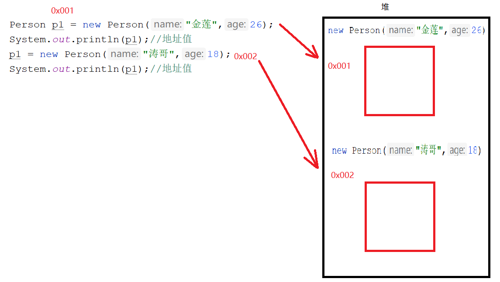
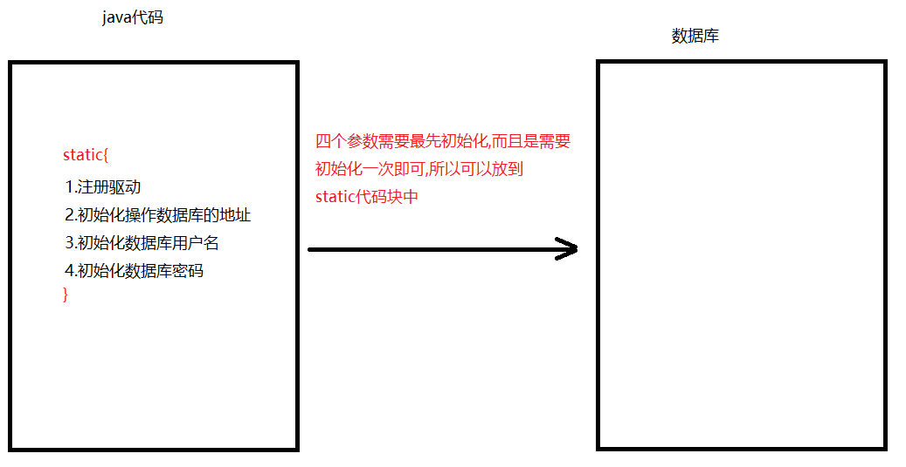
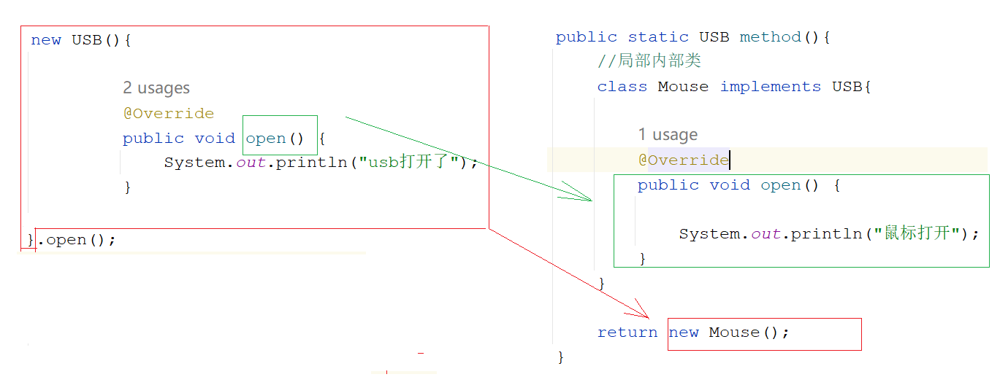
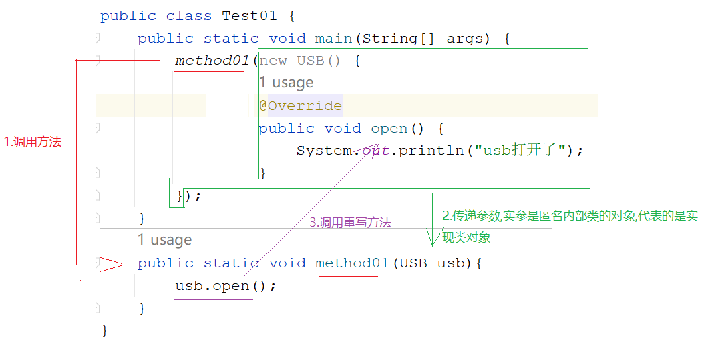
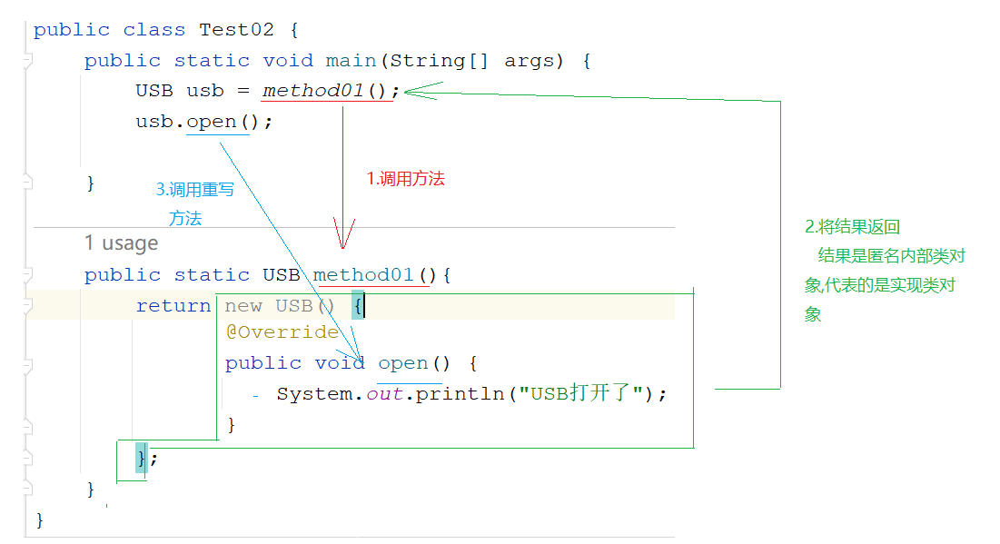

# 模块12.面向对象

```java
模块11回顾:
  1.接口:
    a.interface 接口
    b.implements 实现
  2.成员:
    a.抽象方法 -> 需要在实现类中重写
    b.默认方法 -> public default 返回值类型 方法名(参数){} -> 实现类中可重写可不重写
    c.静态方法 -> public static 返回值类型 方法名(参数){} -> 接口名直接调用
    d.成员变量 -> public static final 数据类型 变量名 = 值 -> 接口名直接调用
  3.接口的特点:
    a.接口支持多继承
    b.接口支持多实现
    c.一个子类可以继承一个父类的同时实现一个或者多个接口
  4.多态:
    a.前提:
      必须有子父类继承关系以及接口实现关系
      必须有方法的重写
      父类引用指向子类对象
    b.好处:扩展性强 -> 用父类类型接口,可以传递任意它的子类对象,接收哪个子类对象就指向哪个子类对象,就调用哪个子类对象重写后的方法
      弊端:不能直接调用子类特有方法
    c.转型:
      向上转型:父类引用指向子类对象
      向下转型:将父类类型转成子类类型,就可以调用子类特有功能
    d.成员的访问特点:
      成员变量:看等号左边是谁
      成员方法:看new的是谁
    e.转型时容易出现的问题:类型转换异常ClassCastException
    f.判断类型: instanceof
        
模块12重点:
  1.知道final修饰成员之后特点
  2.会使用静态代码块以及知道静态代码块的使用场景
  3.会使用匿名内部类
```

# 第一章.权限修饰符

## 1 概述

在Java中提供了四种访问权限，使用不同的访问权限修饰符修饰时，被修饰的内容会有不同的访问权限，

- public：公共的,最高权限,被public修饰的成员,在哪里都能访问

- protected：受保护的

- default：:默认的 注意  不写权限修饰符就是默认权限,不能直接把default写出来

- private：私有的,只能在自己的类中直接访问

  我们只需要知道一个成员被这四个权限修饰符修饰在4种情况下能不能访问就行了

## 2 不同权限的访问能力

|                | public | protected | default（空的） | private |
| -------------- | ------ | --------- | --------------- | ------- |
| 同类           | yes    | yes       | yes             | yes     |
| 同包不同类     | yes    | yes       | yes             | no      |
| 不同包子父类   | yes    | yes       | no              | no      |
| 不同包非子父类 | yes    | no        | no              | no      |

public具有最大权限,private有最小权限

编写代码时,如果没有特殊的考虑,建议这样使用权限:

```java
1.属性:用private -> 封装思想
2.成员方法public -> 便于调用
3.构造public -> 便于new对象
```

# 第二章.final关键字

```java
1.概述:最终的
2.使用:
  a.修饰一个类
  b.修饰一个方法
  c.修饰一个局部变量
  d.修饰一个成员变量
  e.修饰一个对象
      
3.怎么学final:只需要知道被final修饰之后特点是啥即可
```

## 1.final修饰类

```java
1.格式:
  public final class 类名{}
2.特点:
  被final修饰的类不能被继承
```

```java
public final class Animal {
}
```

```java
public class Dog /*extends Animal*/{
}
```

## 2.final修饰方法

```java
1.格式:
  修饰符 final 返回值类型 方法名(形参){
      方法体
      return 结果
  }
2.特点:
  被final修饰的方法,不能被重写
      
3.注意:
  final和abstract不能同时修饰一个方法
```

```java
public abstract class Animal {
    public final void eat(){
        System.out.println("动物要干饭");
    }

    //public abstract final void drink();
}
```

```java
public class Dog extends Animal{
/*    public void eat(){
        System.out.println("狗啃骨头");
    }*/

}

```

## 3.final修饰局部变量

```java
1.格式:
  final 数据类型 变量名 = 值
2.特点:
  被final修饰的变量不能二次赋值
```

```java
public class Test01 {
    public static void main(String[] args) {
        final int i = 10;
        //i = 20; 被final修饰的变量不能二次赋值
        
        final int j;
        j = 100;
        //j = 200;
                
    }
}
```

## 4.final修饰对象

```java
1.格式:
  final 数据类型 对象名 = new 对象();
2.特点:
  被final修饰的对象,地址值不能改变,但是对象中的属性值可以改变
```

```java
public class Person {
    private String name;
    private int age;

    public Person() {
    }

    public Person(String name, int age) {
        this.name = name;
        this.age = age;
    }

    public String getName() {
        return name;
    }

    public void setName(String name) {
        this.name = name;
    }

    public int getAge() {
        return age;
    }

    public void setAge(int age) {
        this.age = age;
    }
}

```

```java
public class Test02 {
    public static void main(String[] args) {
        //Person p1 = new Person("金莲",26);
        //System.out.println(p1);//地址值
        //p1 = new Person("涛哥",18);
        //System.out.println(p1);//地址值

        final Person p1 = new Person("金莲",26);
        System.out.println(p1);//地址值
        //p1 = new Person("涛哥",18);
        //System.out.println(p1);//地址值

        p1.setName("大郎");
        p1.setAge(30);
        System.out.println(p1.getName()+"..."+p1.getAge());
    }
}
```



## 5.final修饰成员变量

```java
1.格式:
  final 数据类型 变量名 = 值
2.特点:
  a.需要手动赋值
  b.不能二次赋值
```

```java
public class Student {
    final String name = "广坤";

    public Student() {
    }

    //有参构造现在属于二次赋值了
    /*public Student(String name) {
        this.name = name;
    }*/

    public String getName() {
        return name;
    }
    //set方法现在属于二次赋值了
    /*public void setName(String name) {
        this.name = name;
    }*/
}

```

# 第三章.代码块

### 1.构造代码块

```java
1.格式:
  {
      代码
  }

2.执行特点:优先于构造方法执行,每new一次,就会执行一次
```

```java
public class Person {
    public Person(){
        System.out.println("我是无参构造方法");
    }

    //构造代码块
    {
        System.out.println("我是构造代码块");
    }
}
```

```java
public class Test01 {
    public static void main(String[] args) {
        Person p1 = new Person();
        Person p2 = new Person();
    }
}
```

### 2.静态代码块

```java
1.格式:
  static{
      代码
  }

2.执行特点:
  静态代码块优先于构造代码块和构造方法执行的,而且只执行一次
```

```java
public class Person {
    public Person(){
        System.out.println("我是无参构造方法");
    }

    //构造代码块
    {
        System.out.println("我是构造代码块");
    }

    //静态代码块
    static{
        System.out.println("我是静态代码块");
    }
}
```

```java
public class Test01 {
    public static void main(String[] args) {
        Person p1 = new Person();
        Person p2 = new Person();
    }
}
```

### 3.静态代码块使用场景

```java
如果想让一些数据最先初始化,而且只需要初始化一次,就可以将这些数据放到静态代码块中
```




# 第四章.内部类

```java
1.什么时候使用内部类:
  当一个事物的内部,还有一个部分需要完整的结构去描述,而这个内部的完整结构又只为外部事物提供服务,那么整个内部的完成结构最好使用内部类
      
  比如:人类都有心脏,人类本身需要用属性,行为去描述,那么人类内部的心脏也需要心脏特殊的属性和行为去描述,此时心脏就可以定义成内部类,人类中的一个心脏类
      
2.在java中允许一个类的定义位于另外一个类内部,前者就称之为内部类,后者称之为外部类
  class A{
      class B{
          
      }
  }

  类A就是类B的外部类
  类B就是类A的内部类
      
3.分类:
  成员内部类(静态,非静态)
  局部内部类
  匿名内部类(重点)
```

## 1 静态成员内部类

```java
1.格式:直接在定义内部类的时候加上static关键字
  public class A{
      static class B{
          
      }
  }

2.注意:
  a.内部类可以定义属性,方法,构造等
  b.静态内部类可以被final或者abstract修饰
    被final修饰之后,不能被继承
    被abstract修饰之后,不能new
  c.静态内部类不能调用外部的非静态成员
  d.内部类还可以被四种权限修饰符修饰
      
3.调用静态内部类成员:
  外部类.内部类 对象名 = new 外部类.内部类()
```

```java
public class Person {
    public void eat(){
        System.out.println("人要干饭");
    }

    static class Heart{
        public void jump(){
            System.out.println("心脏哐哐哐跳");
        }
    }
}
```

```java
public class Test01 {
    public static void main(String[] args) {
       // 外部类.内部类 对象名 = new 外部类.内部类()
        Person.Heart heart = new Person.Heart();
        heart.jump();
    }
}

```

## 2 非静态成员内部类

```java
1.格式:直接在定义内部类的时候加上static关键字
  public class A{
      class B{
          
      }
  }

2.注意:
  a.内部类可以定义属性,方法,构造等
  b.静态内部类可以被final或者abstract修饰
    被final修饰之后,不能被继承
    被abstract修饰之后,不能new
  c.静态内部类不能调用外部的非静态成员
  d.内部类还可以被四种权限修饰符修饰
      
3.调用非静态内部类成员:
  外部类.内部类 对象名 = new 外部类().new 内部类()
```

```java
public class Person {
    public void eat(){
        System.out.println("人要干饭");
    }

    class Heart{
        public void jump(){
            System.out.println("心脏哐哐哐跳");
        }
    }
}
```

```java
public class Test01 {
    public static void main(String[] args) {
       // 外部类.内部类 对象名 = new 外部类().new 内部类()
        Person.Heart heart = new Person(). new Heart();
        heart.jump();
    }
}
```

> 外部类的成员变量和内部类的成员变量以及内部类的局部变量重名时,怎么区分?
>
> ```java
> public class Student {
>     String name = "金莲";
>     class Heart{
>         String name = "大郎";
>         public void display(String name){
>             System.out.println(name);//内部类的局部变量
>             System.out.println(this.name);//内部类的成员变量
>             System.out.println(Student.this.name);//外部类的成员变量
>         }
>     }
> }
> 
> 
> public class Test02 {
>     public static void main(String[] args) {
>         Student.Heart heart = new Student().new Heart();
>         heart.display("涛哥");
>     }
> }
> 
> ```

## 3.局部内部类

### 3.1.局部内部类基本操作

```java
1.可以定义在方法中,代码块中,构造中
```

```java
public class Person {
    public void eat(){
        class Heart{
            public void jump(){
                System.out.println("心脏哐哐哐的跳");
            }
        }

        new Heart().jump();
    }
}

```

```java
public class Test01 {
    public static void main(String[] args) {
        Person person = new Person();
        person.eat();
    }
}

```

### 3.2.局部内部类实际操作

#### 3.2.1.接口类型作为方法参数传递和返回

> 1.接口作为方法参数,传递实参时,传递的是实现类对象
>
> 2.接口作为返回值类型返回,实际返回的是实现类对象

```java
public interface USB {
    public abstract void open();
}
```

```java
public class Mouse implements USB{
    @Override
    public void open() {
        System.out.println("鼠标打开");
    }
}
```

```java
public class Test01 {
    public static void main(String[] args) {
        Mouse mouse = new Mouse();
        method(mouse);
        System.out.println("================");

        USB usb = method01();//USB usb = new Mouse();
        usb.open();
    }

    /*
       接口作为方法参数,传递实参时,传递的是实现类对象
     */
    public static void method(USB usb){//USB usb = mouse -> 多态
        usb.open();
    }

    /*
      接口作为返回值类型返回,实际返回的是实现类对象
    */
    public static USB method01(){
        //Mouse mouse = new Mouse();
        //return mouse;
        return new Mouse();
    }
}

```

#### 3.2.2.抽象类作为方法参数和返回值

> 1.抽象类作为方法参数传递,传递实参时,传递的是其子类对象
>
> 2.抽象类作为方法返回值类型返回时,实际返回的是其子类对象

```java
public abstract class Animal {
    public abstract void eat();
}
```

```java
public class Dog extends Animal{
    @Override
    public void eat() {
        System.out.println("狗啃骨头");
    }
}
```

```java
public class Test02 {
    public static void main(String[] args) {
        Dog dog = new Dog();
        method01(dog);
        System.out.println("=================");
        Animal animal = method02();//Animal animal = new Dog()
        animal.eat();
    }

    public static void method01(Animal animal){//Animal animal = dog
        animal.eat();
    }

    public static Animal method02(){
        return new Dog();
    }
}

```

#### 3.2.3.普通类做方法参数和返回值

> 普通类作为方法参数传递,传递的是对象
>
> 普通类作为方法返回值返回,返回的是对象

```java
public class Person {
    public void eat(){
        System.out.println("人要干饭");
    }
}

```

```java
public class Test03 {
    public static void main(String[] args) {
        Person person = new Person();
        method01(person);
        System.out.println("==================");
        Person person1 = method02();//Person person1 = new Person()
        person1.eat();
    }
    public static void method01(Person person){
        person.eat();
    }

    public static Person method02(){
        return new Person();
    }
}

```

#### 3.2.4.局部内部类实际操作

```java
public interface USB {
    void open();
}

```

```java
public class Test01 {
    public static void main(String[] args) {
        USB usb = method();//USB usb = new Mouse()
        usb.open();
    }

    public static USB method(){
        //局部内部类
        class Mouse implements USB{

            @Override
            public void open() {
                System.out.println("鼠标打开");
            }
        }

        return new Mouse();
    }
}
```

## 4.匿名内部类(重点)

> 所谓的匿名内部类,可以理解为没有显式声明出类名的内部类

```java
1.问题描述:我们如果想实现接口,简单使用一次抽象方法,我们就需要创建一个实现类,实现这个接口,重写抽象方法,还要new实现类对象,所以我们在想如果就单纯的想使用一次接口中的方法,我们能不能不这么麻烦呢?可以
  a.创建实现类,实现接口
  b.重写方法
  c.创建实现类对象
  d.调用方法
    
2.如果就想单纯的使用一下接口中的方法,我们就没必要经过以上四步了,我们可以四合一
    
3.匿名内部类怎么学:就按照一种格式来学,这一种格式就代表了实现类对象或者子类对象
    
4.格式:
  new 接口/抽象类(){
      重写方法
  }.重写的方法();

  =================================

  类名 对象名 = new 接口/抽象类(){
      重写方法
  }
  对象名.重写的方法();
```

```java
public interface USB {
    void open();
    void close();
}
```

```java
public class Test01 {
    public static void main(String[] args) {
        new USB(){

            @Override
            public void open() {
                System.out.println("usb打开了");
            }

            @Override
            public void close() {
                System.out.println("usb关闭了");
            }
        }.open();

        System.out.println("===================");

        USB usb = new USB() {
            @Override
            public void open() {
                System.out.println("USB打开了");
            }

            @Override
            public void close() {
                System.out.println("USB关闭了");
            }
        };
        usb.open();
        usb.close();
    }
}

```



> 1.什么时候使用匿名内部类:
>
> ​    当简单调用一次接口中的方法,我们就可以使用匿名内部类
>
> 2.将一种格式代表实现类对象或者子类对象来看待,来学习
>
> 3.匿名内部类会编译生成的,咱们不要管,我们只需要利用咱们讲的格式去new对象,调用重写的方法即可

### 4.1 匿名内部类复杂用法_当参数传递

```java
public interface USB {
    void open();
}
```

```java
public class Test01 {
    public static void main(String[] args) {
        method01(new USB() {
            @Override
            public void open() {
                System.out.println("usb打开了");
            }
        });
    }
    public static void method01(USB usb){
        usb.open();
    }
}
```



### 4.2 匿名内部类复杂用法_当返回值返回

```java
public interface USB {
    void open();
}

```

```java
public class Test02 {
    public static void main(String[] args) {
        USB usb = method01();
        usb.open();

    }

    public static USB method01(){
        return new USB() {
            @Override
            public void open() {
                System.out.println("USB打开了");
            }
        };
    }
}

```

 


