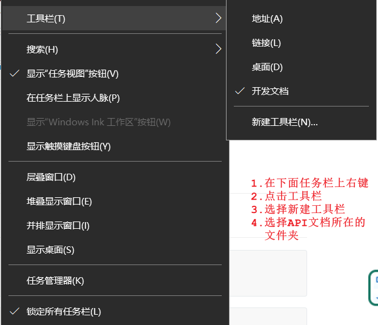
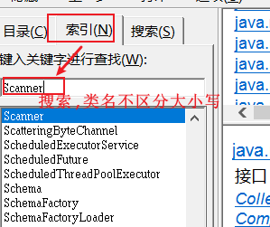
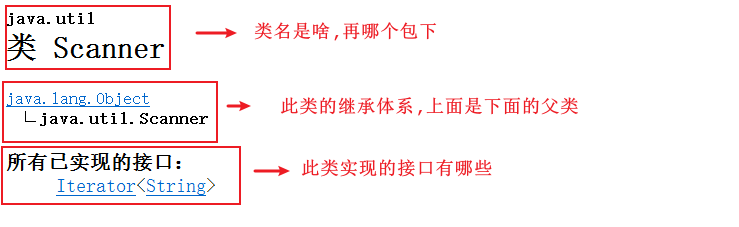
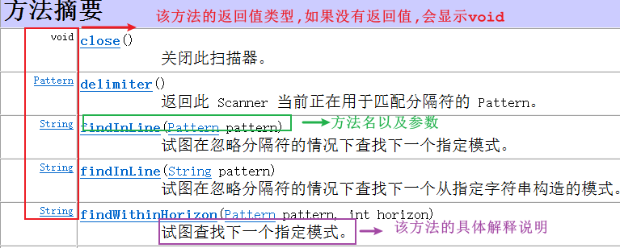
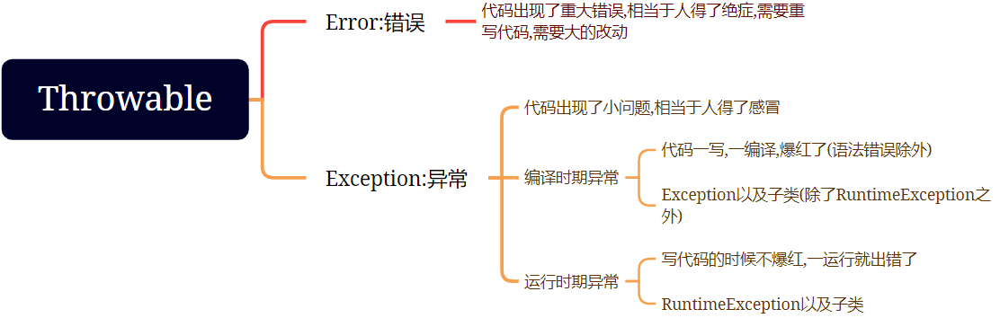
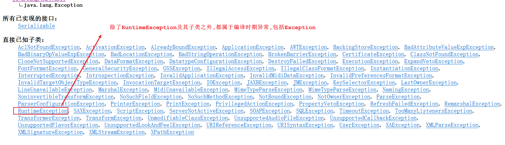
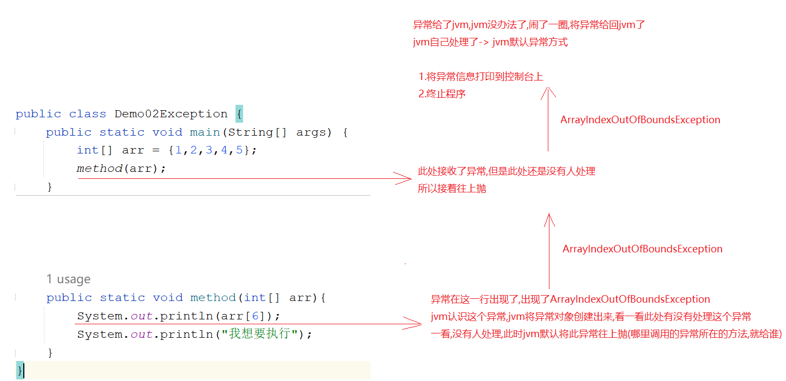
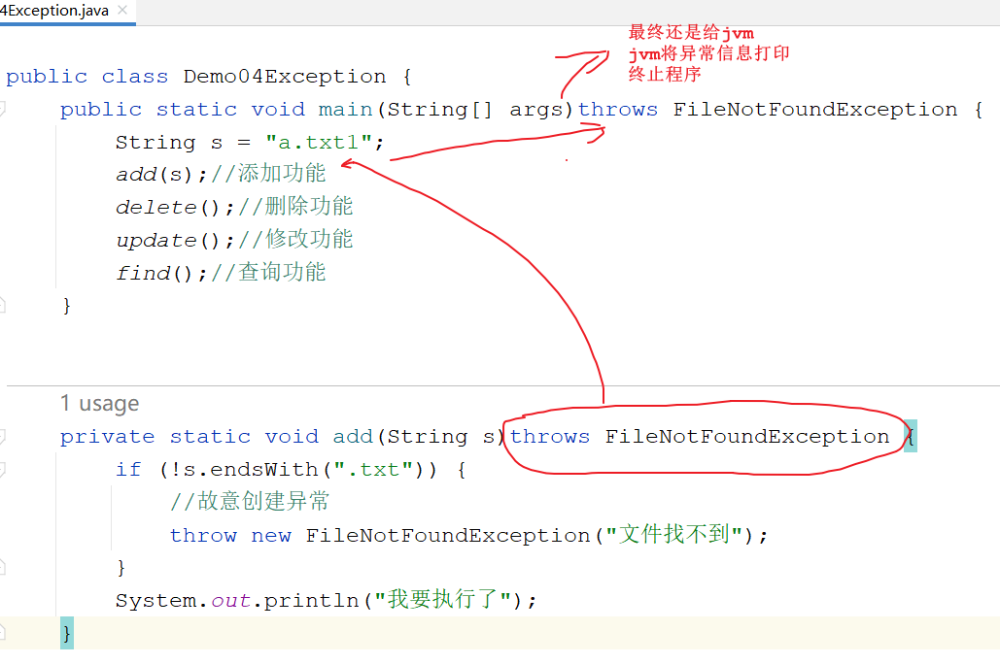
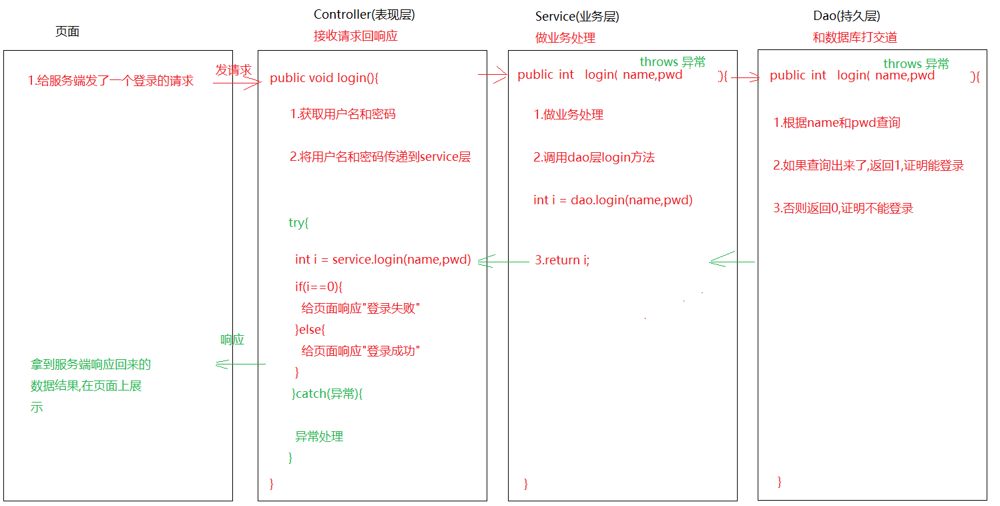
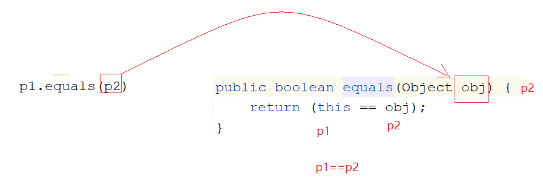

# 模块13.异常_Object

```java
模块十二回顾:
  1.权限修饰符:
    public -> protected -> 默认 -> private
    
    a.构造一般用public :便于new对象
    b.成员方法一般用public:便于调用
    c.属性一般用private:封装思想
        
  2.final:最终的
    a.修饰类:不能被继承的
    b.修饰方法:不能被重写
    c.修饰局部变量:不能被二次赋值
    d.修饰对象:地址值不能改变,但是对象中的属性值可以改变
    e.修饰成员变量:需要手动赋值,不能二次赋值
        
  3.代码块:
    a.构造代码块:
      {}
      优先于构造方法执行,每new一次,构造代码块就执行一次
    b.静态代码块:
      static{
          
      }
      优先于构造代码块和构造方法执行的,只执行一次
          
   静态代码块>构造代码块>构造方法 -> 从执行顺序上来看
          
    
 4.匿名内部类:
   a.格式1:
     new 接口/抽象类(){
         重写方法
     }.重写的方法();

   b.格式2:
     接口/抽象类 对象名 = new 接口/抽象类(){
         
         重写的方法
     }
     对象名.重写的方法();

模块13重点:
  1.分清楚什么是编译时期异常,什么是运行时期异常
  2.知道处理异常的2种方式
  3.知道finally关键字的使用场景
  4.知道Object是啥
  5.知道Object中toString以及equals方法的作用
  6.知道重写完Object中的toString以及equals方法的作用
```

# 第一章.API文档

```java
1.什么叫做API:Application Programming Interface,简称API,又称之为应用编程接口
             说白了:定义出来的类以及接口,以及其中的方法等
2.为了方便我们去查询开发好的接口以及类,以及其中的方法,会对应提供一个文档 -> API文档
                 
3.API文档作用:查询我们要使用的对象,以及方法,是我们程序员的"字典"  
```











# 第二章.异常

## 1.异常介绍

```java
1.概述:代码出现了不正常的现象;在java中,异常都是一个一个的类                
```





```java
public class Demo01Exception {
    public static void main(String[] args) throws ParseException {
        //错误Error -> StackOverflowError
        //method();

        //运行时期异常 -> ArrayIndexOutOfBoundsException
        int[] arr1 = new int[3];
        //System.out.println(arr1[4]);
        
        /*
          编译时期异常:
           注意看:编译时期异常是我们代码写错了嘛?不是,当我们调用方法的时候
           该方法底层给我们抛了一个编译时期异常,所以导致我们一调用此方法
           一编译,就爆红了
           当我们一旦触发了这个异常,jvm就会将异常信息打印到控制台上,给程序员们看
         */
        SimpleDateFormat sdf = new SimpleDateFormat("yyyy-MM-dd HH:mm:ss");
        String time = "2000-10-10 10:10:10";
        Date date = sdf.parse(time);
        System.out.println(date);
    }

    public static void method(){
        method();
    }
}

```

## 2.异常出现的过程



## 3.创建异常对象(了解)

> 创建异常对象,只是为了后面学习如何处理异常,其他的暂时没有啥意义

```java
1.关键字:throw
2.格式: throw new 异常
```

```java
public class Demo03Exception {
    public static void main(String[] args) {
        String s = "a.tx1t";
        method(s);
    }
    public static void method(String s){
        if (!s.endsWith(".txt")){
            //故意创建异常对象,用throw说明此处有异常
            throw new NullPointerException();
        }
        System.out.println("我要执行了");
    }
}
```

## 4.异常处理方式(重点)

### 4.1 异常处理方式一_throws

```java
1.格式:在方法参数和方法体之间位置上写
  throws 异常
2.意义:处理异常
  将异常往上抛
```

```java
public class Demo04Exception {
    public static void main(String[] args)throws FileNotFoundException {
        String s = "a.txt1";
        add(s);//添加功能
        delete();//删除功能
        update();//修改功能
        find();//查询功能
    }


    private static void add(String s)throws FileNotFoundException {
        if (!s.endsWith(".txt")) {
            //故意创建异常
            throw new FileNotFoundException("文件找不到");
        }
        System.out.println("我要执行了");
    }

    private static void find() {
        System.out.println("查询功能");
    }

    private static void update() {
        System.out.println("修改功能");
    }

    private static void delete() {
        System.out.println("删除功能");
    }
}
```



### 4.2 异常处理方式一_throws多个异常

```java
1.格式:throws 异常1,异常2
    
2.注意:
  如果throws的多个异常之间有子父类继承关系,我们可以直接throws父类异常
  如果不知道多个异常之间是否有子父类继承关系,我们可以直接throws Exception    
```

```java
public class Demo05Exception {
    public static void main(String[] args)throws /*FileNotFoundException,*//*IOException*/Exception {
        String s = null;
        add(s);//添加功能
        delete();//删除功能
        update();//修改功能
        find();//查询功能
    }


    private static void add(String s)throws /*FileNotFoundException,*//*IOException*/Exception {
        if (s==null){
            //故意造异常
            throw new IOException("IO异常");
        }
        if (!s.endsWith(".txt")) {
            //故意创建异常
            throw new FileNotFoundException("文件找不到");
        }
        System.out.println("我要执行了");
    }

    private static void find() {
        System.out.println("查询功能");
    }

    private static void update() {
        System.out.println("修改功能");
    }

    private static void delete() {
        System.out.println("删除功能");
    }

}
```

### 4.3 异常处理方式二_try...catch

```java
1.格式:
  try{
      可能出现异常的代码
  }catch(异常 对象名){
      处理异常的代码-> 将来开发会将异常信息保存到日志文件中
  }
```

```java
public class Demo06Exception {
    public static void main(String[] args){
        String s = "a.txt1";
        try{
            //int[] arr = null;
            //System.out.println(arr.length);//NullPointerException
            add(s);//添加功能
        }catch (FileNotFoundException e){
            System.out.println(e);
        }

        delete();//删除功能
        update();//修改功能
        find();//查询功能
    }


    private static void add(String s)throws FileNotFoundException {
        if (!s.endsWith(".txt")) {
            //故意创建异常
            throw new FileNotFoundException("文件找不到");
        }
        System.out.println("我要执行了");
    }

    private static void find() {
        System.out.println("查询功能");
    }

    private static void update() {
        System.out.println("修改功能");
    }

    private static void delete() {
        System.out.println("删除功能");
    }

}

```

### 4.4.异常处理方式二_多个catch

```java
1.格式:
  try{
      可能出现异常的代码
  }catch(异常 对象名){
      处理异常的代码-> 将来开发会将异常信息保存到日志文件中
  }catch(异常 对象名){
      处理异常的代码-> 将来开发会将异常信息保存到日志文件中
  }catch(异常 对象名){
      处理异常的代码-> 将来开发会将异常信息保存到日志文件中
  }catch(异常 对象名){
      处理异常的代码-> 将来开发会将异常信息保存到日志文件中
  }...
      
2.注意:
  如果catch的多个异常之间有子父类继承关系,我们可以直接catch父类异常
  如果不知道多个异常之间是否有子父类继承关系,我们也可以直接catch Exception    
```

```java
public class Demo07Exception {
    public static void main(String[] args) {
        String s = null;
       /* try {
            add(s);//添加功能
        }catch (FileNotFoundException e){
            System.out.println(e);
        }catch (IOException e){
            System.out.println(e);
        }*/

        /*try {
            add(s);//添加功能
        }catch (IOException e){
            System.out.println(e);
        }*/

        try {
            add(s);//添加功能
        }catch (Exception e){
            e.printStackTrace();//将详细的异常信息打印到控制台上
        }
        delete();//删除功能
        update();//修改功能
        find();//查询功能
    }


    private static void add(String s) throws FileNotFoundException, IOException {
        if (s == null) {
            //故意造异常
            throw new IOException("IO异常");
        }
        if (!s.endsWith(".txt")) {
            //故意创建异常
            throw new FileNotFoundException("文件找不到");
        }
        System.out.println("我要执行了");
    }

    private static void find() {
        System.out.println("查询功能");
    }

    private static void update() {
        System.out.println("修改功能");
    }

    private static void delete() {
        System.out.println("删除功能");
    }

}

```

## 5.finally关键字

```java
1.概述:代表的是不管是否触发了异常,都会执行的代码块
  特殊情况:如果之前执行了System.exit(0)终止当前正在执行的java虚拟机
2.使用:都是配合try...catch使用
  try{
      可能出现异常的代码
  }catch(异常 对象名){
      处理异常的代码-> 将来开发会将异常信息保存到日志文件中
  }finally{
      不管是否有异常,都会执行的代码
  }  
```

```java
public class Demo08Exception {
    public static void main(String[] args){
        String s = "a.txt";
        try {
            add(s);//添加功能
        } catch (FileNotFoundException e) {
            e.printStackTrace();
        }finally {
            System.out.println("我必须滴执行");
        }
    }


    private static void add(String s)throws FileNotFoundException {
        if (!s.endsWith(".txt")) {
            //故意创建异常
            throw new FileNotFoundException("文件找不到");
        }
        System.out.println("我要执行了");
    }
}

```

```java
public class Demo09Exception {
    public static void main(String[] args) {
        int result = method();
        System.out.println(result);
    }

    public static int method() {
        try {
            String s = null;
            System.out.println(s.length());//空指针异常
            return 2;
        } catch (Exception e) {
            return 1;
        } finally {
            System.out.println("我一定要执行");
            //return 3;
        }
    }
}
```

> finally的使用场景:
>
>   1.关闭资源
>
>   2.原因:对象如果没有用了,GC(垃圾回收器)回收,用来回收堆内存中的垃圾,释放内存,但是有一些对象GC回收不了,比如:连接对象(Connection),IO流对象,Socket对象,这些对象GC回收不了,就需要我们自己手动回收,手动关闭
>
> ​      将来不能回收的对象new完之后,后续操作不管是否操作成功,是否有异常,我们都需要手动关闭,此时我们就可以将关闭资源的代码放到finally中
>
> ```java
> public class Test {
>  public static void main(String[] args) {
>      FileWriter fw = null;
>      try {
>          fw = new FileWriter("day13_exception_object\\1.txt");
>          fw.write("哈哈哈");//假如这里写失败或者写成功了
>      } catch (IOException e) {
>          throw new RuntimeException(e);
>      }finally {
>          if (fw!=null){
>              try {
>                  fw.close();
>              } catch (IOException e) {
>                  throw new RuntimeException(e);
>              }
>          }
> 
>      }
>  }
> }
> ```

## 6.抛异常时注意的事项

```java
1.如果父类中的方法抛了异常,那么子类重写之后要不要抛?
  可抛可不抛  
2.如果父类中的方法没有抛异常,那么子类重写之后要不要抛?  
  不要抛  
```

```java
public class Demo10Exception {
    public static void main(String[] args) {

    }
    class A{
        public void method()/*throws Exception*/{

        }
    }

    class B extends A{
        @Override
        public void method()/*throws Exception*/{

        }
    }
}
```

## 7.try_catch和throws的使用时机

```java
1.如果处理异常之后,还想让后续的代码正常执行,我们使用try...catch
2.如果方法之间是递进关系(调用),我们可以先throws,但是到了最后需要用try...catch做一个统一的异常处理
```



> 1.编译时期异常是必须要处理的,不处理爆红,没法往下写
>
>    a.throws
>
>    b.try...catch
>
> 2.运行时期异常我们一般不处理,一旦出现运行时期异常,肯定是代码写的有问题,我们直接修改代码细节就行啦

## 8.自定义异常

```java
1.需求:键盘录入一个用户名,实现登录功能,如果登录失败,抛出LoginUserException
```

```java
public class LoginUserException extends Exception{
    public LoginUserException() {
    }

    public LoginUserException(String message) {
        super(message);
    }
}

```

```java
public class Demo11Exception {
    public static void main(String[] args) throws LoginUserException {
        //1.定义一个用户名,代表已经注册的用户
        String username = "root";
        //2.创建Scanner对象,录入用户名
        Scanner sc = new Scanner(System.in);
        System.out.println("请您输入要登录的用户名:");
        String name = sc.next();
        //3.判断用户名是否和已经存在的用户名一致
        if (name.equals(username)){
            System.out.println("登录成功了");
        }else{
            throw new LoginUserException("登录失败了,用户名或者密码有问题");
        }
    }
}

```

> 1.定义一个类
>
> 2.如果继承Exception 就是编译时期异常
>
> 3.如果继承RuntimeException,就是运行时期异常

## 9.打印异常信息的三个方法

```java
Throwable类中的方法:
  String toString()  :输出异常类型和设置的异常信息
  String getMessage(): 输出设置的异常信息  
  void printStackTrace():打印异常信息是最全的:包括异常类型,信息,以及出现的行数等      
```

```java
public class Demo11Exception {
    public static void main(String[] args) {
        //1.定义一个用户名,代表已经注册的用户
        String username = "root";
        //2.创建Scanner对象,录入用户名
        Scanner sc = new Scanner(System.in);
        System.out.println("请您输入要登录的用户名:");
        String name = sc.next();
        //3.判断用户名是否和已经存在的用户名一致
        if (name.equals(username)) {
            System.out.println("登录成功了");
        } else {
            try {
                throw new LoginUserException("登录失败了,用户名或者密码有问题");
            }catch (Exception e){
                //System.out.println(e.toString());
                //System.out.println(e.getMessage());
                e.printStackTrace();
            }
        }
    }
}
```

# 第三章.Object类

```java
1.概述:所有类的根类(父类),所有的类都会直接或者间接继承Object类
```

## 1.Object中的toString

```java
1.Object中的toString方法:返回该对象的字符串表示形式
    public String toString() {
        return getClass().getName() + "@" + Integer.toHexString(hashCode());
    }

2.注意:
  a.如果没有重写Object中的toString方法,直接输出对象名会默认调用Object中的toString方法,直接输出地址值
  b.如果重写了Object中的toString方法,再输出地址值,重写没有意义,所以重写完toString之后,应该返回对象的内容  
      
3.总结:
  如果直接输出对象名不想输出地址值,就重写Object中的toString方法
```

```java
public class Person {
    private String name;
    private int age;

    public Person() {
    }

    public Person(String name, int age) {
        this.name = name;
        this.age = age;
    }

    public String getName() {
        return name;
    }

    public void setName(String name) {
        this.name = name;
    }

    public int getAge() {
        return age;
    }

    public void setAge(int age) {
        this.age = age;
    }

    @Override
    public String toString() {
        return "Person{" +
                "name='" + name + '\'' +
                ", age=" + age +
                '}';
    }
}
```

```java
public class Test01 {
    public static void main(String[] args) {
        Person p1 = new Person("金莲", 26);
        System.out.println(p1);//com.atguigu.b_object.Person@4eec7777
        System.out.println(p1.toString());//com.atguigu.b_object.Person@4eec7777

        System.out.println("==============");

        ArrayList<String> list = new ArrayList<>();
        list.add("张三");
        list.add("李四");
        list.add("王五");
        System.out.println(list);//[张三, 李四, 王五]
        System.out.println(list.toString());//[张三, 李四, 王五]
    }
}
```

> 快速生成toString
>
> alt+insert -> 选择toString -> 直接下一步

## 2.Object中的equals

```java
1.概述:比较两个对象的地址值是否相等
    public boolean equals(Object obj) {
        return (this == obj);
    }

    == 针对于基本数据类型来说,比较的是值 
    == 针对于引用数据类型来说,比较的是地址值
        
2.注意:
  a.如果没有重写Object中的equals方法,那么就会调用Object中的equals方法,比较对象的地址值
  b.如果重写了Object中的equals方法,那么就会调用重写后的equals方法,应该比较对象的内容
```

```java
public class Person {
    private String name;
    private int age;

    public Person() {
    }

    public Person(String name, int age) {
        this.name = name;
        this.age = age;
    }

    public String getName() {
        return name;
    }

    public void setName(String name) {
        this.name = name;
    }

    public int getAge() {
        return age;
    }

    public void setAge(int age) {
        this.age = age;
    }

    @Override
    public String toString() {
        return "Person{" +
                "name='" + name + '\'' +
                ", age=" + age +
                '}';
    }

    /*
       问题1:obj直接调用name和age调用不了,因为Object接收了Person类型的对象
            属于多态,多态前提下不能直接调用子类特有内容
       解决问题1:向下转型

       问题2:如果传递的不是Person类型,就会出现类型转换异常
       解决问题2:先判断类型,如果是Person类型,再强转成Person

       问题3:如果传递null呢?,就不用判断类型了,直接给false

       问题4:如果传递自己呢?就不用判断非空了,也不同判断类型了,直接给true
     */
   /* public boolean equals(Object obj){
        if (this==obj){
            return true;
        }

        if (obj==null){
            return false;
        }

        if (obj instanceof Person){
            Person p = (Person) obj;
            return this.name.equals(p.name)&&this.age==p.age;
        }
        return false;

    }*/

    @Override
    public boolean equals(Object o) {
        if (this == o) return true;
        if (o == null || getClass() != o.getClass()) return false;
        Person person = (Person) o;
        return age == person.age && Objects.equals(name, person.name);
    }
    
}
```

```java
public class Test02 {
    public static void main(String[] args) {
        Person p1 = new Person("金莲", 26);
        Person p2 = new Person("金莲", 26);
        System.out.println(p1==p2);//false
        System.out.println(p1.equals(p2));//false & true
        System.out.println("==============");


        ArrayList<String> list = new ArrayList<>();
        System.out.println(p1.equals(list));

        System.out.println("==============");

        System.out.println(p1.equals(null));

        System.out.println("==============");
        System.out.println(p1.equals(p1));

        System.out.println("====================");

        String s1 = new String("abc");
        String s2 = new String("abc");
        System.out.println(s1.equals(s2));//true
    }
}

```



> 小结:
>
>   1.如果直接输出对象名不想输出地址值,重写toString方法
>
>   2.如果想比较两个对象的内容,就重写一下equals方法
>
>   3.怎么重写:alt+insert -> 选toString 或者equals and hashcode -> 啥也不要管 -> 一路下一步即可

## 3.Object中的clone方法

```java
1.作用:复制一个属性值一样的新对象
2.使用:
  需要被克隆的对象实现Cloneable
  重写clone方法
```

```java
public class Person implements Cloneable{
    private String name;
    private int age;

    public Person() {
    }

    public Person(String name, int age) {
        this.name = name;
        this.age = age;
    }

    public String getName() {
        return name;
    }

    public void setName(String name) {
        this.name = name;
    }

    public int getAge() {
        return age;
    }

    public void setAge(int age) {
        this.age = age;
    }

    @Override
    public String toString() {
        return "Person{" +
                "name='" + name + '\'' +
                ", age=" + age +
                '}';
    }

    /*
       问题1:obj直接调用name和age调用不了,因为Object接收了Person类型的对象
            属于多态,多态前提下不能直接调用子类特有内容
       解决问题1:向下转型

       问题2:如果传递的不是Person类型,就会出现类型转换异常
       解决问题2:先判断类型,如果是Person类型,再强转成Person

       问题3:如果传递null呢?,就不用判断类型了,直接给false

       问题4:如果传递自己呢?就不用判断非空了,也不同判断类型了,直接给true
     */
   /* public boolean equals(Object obj){
        if (this==obj){
            return true;
        }

        if (obj==null){
            return false;
        }

        if (obj instanceof Person){
            Person p = (Person) obj;
            return this.name.equals(p.name)&&this.age==p.age;
        }
        return false;

    }*/

    @Override
    public boolean equals(Object o) {
        if (this == o) return true;
        if (o == null || getClass() != o.getClass()) return false;
        Person person = (Person) o;
        return age == person.age && Objects.equals(name, person.name);
    }

    @Override
    protected Object clone() throws CloneNotSupportedException {
        return super.clone();
    }
}
```

```java
public class Test03 {
    public static void main(String[] args) throws CloneNotSupportedException {
        Person p2 = new Person("涛哥", 16);
        Object o = p2.clone();
        Person p3 = (Person) o;//克隆了一个新对象

        System.out.println(p2==p3);//比较地址值  false
        System.out.println(p2.equals(p3));//true
    }
}

```

# 第四章.经典接口

## 1.java.lang.Comparable

我们知道基本数据类型的数据（除boolean类型外）需要比较大小的话，之间使用比较运算符即可，但是引用数据类型是不能直接使用比较运算符来比较大小的。那么，如何解决这个问题呢？

Java给所有引用数据类型的大小比较，指定了一个标准接口，就是java.lang.Comparable接口：

```java
package java.lang;

public interface Comparable{
    int compareTo(Object obj);
}
```

那么我们想要使得我们某个类的对象可以比较大小，怎么做呢？步骤：

第一步：哪个类的对象要比较大小，哪个类就实现java.lang.Comparable接口，并重写方法

* 方法体就是你要如何比较当前对象和指定的另一个对象的大小

第二步：对象比较大小时，通过对象调用compareTo方法，根据方法的返回值决定谁大谁小。

* this对象（调用compareTo方法的对象）减 指定对象（传入compareTo()的参数对象）大于0,返回正整数
* this对象（调用compareTo方法的对象）减 指定对象（传入compareTo()的参数对象）小于0 返回负整数
* this对象（调用compareTo方法的对象）减 指定对象（传入compareTo()的参数对象）等于0 返回零

代码示例：

```java
public class Student implements Comparable{
    private String name;
    private int score;

    public Student() {

    }

    public Student(String name, int score) {
        this.name = name;
        this.score = score;
    }

    public String getName() {
        return name;
    }

    public void setName(String name) {
        this.name = name;
    }

    public int getScore() {
        return score;
    }

    public void setScore(int score) {
        this.score = score;
    }

    @Override
    public String toString() {
        return "Student{" +
                "name='" + name + '\'' +
                ", score=" + score +
                '}';
    }

    /*
      this:代表students[i]
      o:代表students[i+1]

      如果students[i].getScore()-students[i+1].getScore()>0
         证明数组中的前面一个对象比后面一个对象的分数高
     */
    @Override
    public int compareTo(Object o) {
        Student s = (Student) o;
        return this.getScore()- s.getScore();
    }
}
```

测试类

```java
public class Test01 {
    public static void main(String[] args) {
        //创建一个数组
        Student[] students = new Student[3];
        Student s1 = new Student("张三", 100);
        Student s2 = new Student("李四", 60);
        Student s3 = new Student("王五", 80);
        students[0] = s1;
        students[1] = s2;
        students[2] = s3;

        for (int j = 0; j<students.length-1;j++){
            for (int i = 0;i<students.length-1-j;i++){
                //如果students[i]比students[i+1]大,就排序换位置
                if (students[i].compareTo(students[i+1])>0){
                    Student temp = students[i];
                    students[i] = students[i+1];
                    students[i+1] = temp;
                }
            }
        }

        //遍历
        for (int i = 0; i < students.length; i++) {
            System.out.println(students[i]);
        }
    }
}

```

## 2.java.util.Comparator

思考：

（1）如果一个类，没有实现Comparable接口，而这个类你又不方便修改（例如：一些第三方的类，你只有.class文件，没有源文件），那么这样类的对象也要比较大小怎么办？

（2）如果一个类，实现了Comparable接口，也指定了两个对象的比较大小的规则，但是此时此刻我不想按照它预定义的方法比较大小，但是我又不能随意修改，因为会影响其他地方的使用，怎么办？

JDK在设计类库之初，也考虑到这种情况了，所以又增加了一个java.util.Comparator接口。

```java
package java.util;

public interface Comparator{
    int compare(Object o1,Object o2);
}
```

那么我们想要比较某个类的两个对象的大小，怎么做呢？步骤：

第一步：编写一个类，我们称之为比较器类型，实现java.util.Comparator接口，并重写方法

* 方法体就是你要如何指定的两个对象的大小

第二步：比较大小时，通过比较器类型的对象调用compare()方法，将要比较大小的两个对象作为compare方法的实参传入，根据方法的返回值决定谁大谁小。

* o1对象减o2大于0返回正整数
* o1对象减o2小于0返回负整数
* o1对象减o2等于0返回零

```java
public class Student implements Comparator {
    private String name;
    private int score;

    public Student() {

    }

    public Student(String name, int score) {
        this.name = name;
        this.score = score;
    }

    public String getName() {
        return name;
    }

    public void setName(String name) {
        this.name = name;
    }

    public int getScore() {
        return score;
    }

    public void setScore(int score) {
        this.score = score;
    }

    @Override
    public String toString() {
        return "Student{" +
                "name='" + name + '\'' +
                ", score=" + score +
                '}';
    }


    /*
       o1代表students[i]
       o2代表students[i+1]

       如果o1的分数大于o2的分数-> compare方法返回正整数
       如果o1的分数小于o2的分数-> compare方法返回负整数
       如果o1的分数等于o2的分数-> compare方法返回0
     */
    @Override
    public int compare(Object o1, Object o2) {
        Student s1 = (Student) o1;
        Student s2 = (Student) o2;
        return s1.getScore()-s2.getScore();
    }

}

```

```java
public class Test01 {
    public static void main(String[] args) {
        //创建一个数组
        Student[] students = new Student[3];
        Student s1 = new Student("张三", 100);
        Student s2 = new Student("李四", 60);
        Student s3 = new Student("王五", 80);
        students[0] = s1;
        students[1] = s2;
        students[2] = s3;

        Student student = new Student();

        for (int j = 0; j<students.length-1;j++){
            for (int i = 0;i<students.length-1-j;i++){
                //如果students[i]比students[i+1]大,就排序换位置
                if (student.compare(students[i],students[i+1])>0){
                    Student temp = students[i];
                    students[i] = students[i+1];
                    students[i+1] = temp;
                }
            }
        }

        //遍历
        for (int i = 0; i < students.length; i++) {
            System.out.println(students[i]);
        }
    }
}

```

