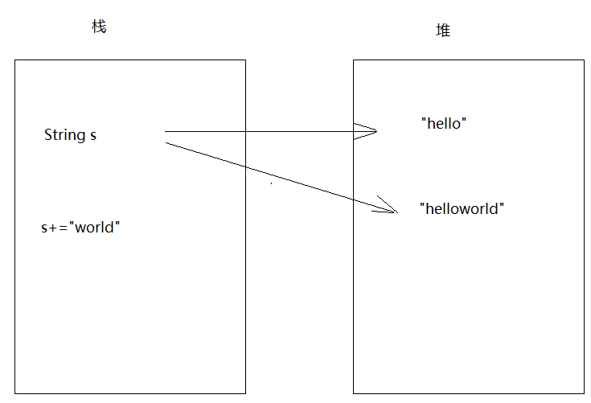
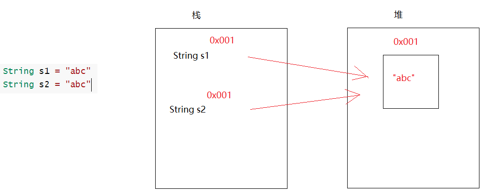
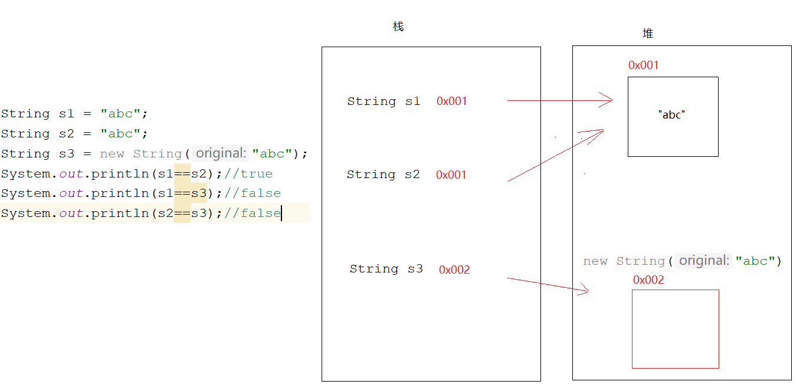
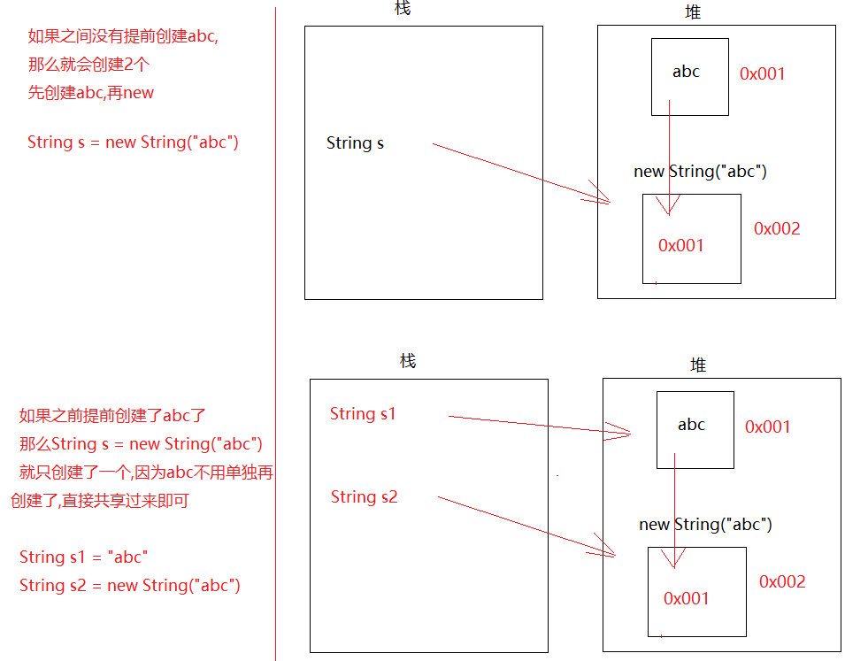
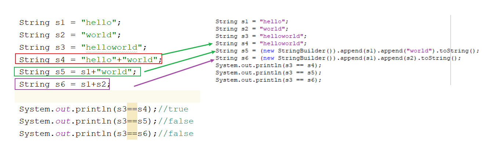

# 模块14.基础API

```java
模块13回顾:
  1.异常:
    a.分类:Throwable
      Error:错误
      Exception:异常
          编译时期异常:一编译,就爆红(主要还是调用了某个方法,某个方法底层抛了一个编译时期异常)
                      Exception以及子类(除了RuntimeException之外)
          运行时期异常:一运行就报错
                     RuntimeException以及子类
 2.异常处理:
   throws
   try...catch
     
 3.finally:不管是否有异常都会执行的代码,要配合try...catch使用
     
   finally的使用场景:关闭资源使用
       
 4.自定义异常:
   a.定义一个类,继承Excption,变成了编译时期异常
              继承RuntimeException,变成了运行时期异常
   b.提供构造方法,便于设置异常信息
       
 5.Object:所有类的根类,任何类都会直接或者间接继承Object类
   a.toString方法:
     没有重写,直接输出对象名,调用的是Object中的toString方法,输出地址值
     重写了,直接输出对象名,默认调用重写的toString方法,输出对象内容
   b.equals方法:
     没有重写,比较对象地址值
     重写了,比较对象内容
         
   c.clone方法:需要实现Cloneable接口,重写clone方法
     复制一个地址值不一样,属性值一样的对象
         
 6.经典接口:
   Comparable
   Comparator
       
 
模块14重点:
  all
```

# 第一章.String

## 1.String介绍

```java
1.概述:String 类代表字符串
2.特点:
  a.Java 程序中的所有字符串字面值（如 "abc" ）都作为此类的实例(对象)实现
    凡是带双引号的,都是String的对象
    String s = "abc"
    "abc"就是对象;String就是对象的数据类型;s就是对象名
        
  b.字符串是常量,它们的值在创建之后不能更改
    String s = "hello"
    s+="world" -> 会产生新对象
        
  c.String 对象是不可变的，所以可以共享
    String s1 = "abc"
    String s2 = "abc"
```







## 2.String的实现原理

```java
1.jdk8的时候:String底层是一个被final修饰的char数组-> private final char[] value;
2.jdk9开始到之后:底层是一个被final修饰的byte数组-> private final byte[] value;

  一个char类型占2个字节
  一个byte类型占1个字节 -> 省内存空间  
```

```java
字符串定义完之后,数组就创建好了,被final一修饰,数组的地址值直接定死
```

## 3.String的创建

```java
1.String()  -> 利用String的无参构造创建String对象
2.String(String original) -> 根据字符串创建String对象
3.String(char[] value) -> 根据char数组创建String对象
4.String(byte[] bytes) -> 通过使用平台的默认字符集解码指定的 byte 数组，构造一个新的 String
                          a.平台:操作系统
                          b.操作系统默认字符集:GBK
                            GBK:一个中文占2个字节
                            UTF-8:一个中文占3个字节
                            而且,中文对应的字节一般都是负数
                                
                            代码在idea中写的,idea启动的时候,会自动加一个启动参数,此启动参数为UTF-8
                            -Dfile.encoding=UTF-8    
    
5.简化形式:
  String 变量名 = ""
```

```java
public class Demo02String {
    public static void main(String[] args) {
        //1.String()  -> 利用String的无参构造创建String对象
        String s1 = new String(); //
        System.out.println(s1);
        //2.String(String original) -> 根据字符串创建String对象
        String s2 = new String("abc");
        System.out.println(s2);
        //3.String(char[] value) -> 根据char数组创建String对象
        char[] chars = {'a','b','c'};
        String s3 = new String(chars);
        System.out.println(s3);
        /*
          4.String(byte[] bytes) -> 通过使用平台的默认字符集解码指定的 byte 数组，
                                    构造一个新的 String
         */
        byte[] bytes1 = {97,98,99};
        String s4 = new String(bytes1);
        System.out.println(s4);

        byte[] bytes2 = {-97,-98,-99};
        String s5 = new String(bytes2);
        System.out.println(s5);

        byte[] bytes3 = {-28,-67,-96};
        String s6 = new String(bytes3);
        System.out.println(s6);

        //5.简化形式
        String s7 = "abc";
        System.out.println(s7);
    }
}

```

```java
1.String(char[] value, int offset, int count)->将char数组的一部分转成String对象 
         value:要转String的char数组
         offset:从数组的哪个索引开始转
         count:转多少个
2.String(byte[] bytes, int offset, int length)->将byte数组的一部分转成String对象 
         bytes:要转String的byte数组
         offset:从数组的哪个索引开始转
         length:转多少个
```

```java
public class Demo03String {
    public static void main(String[] args) {
       /* 1.String(char[] value, int offset, int count)->将char数组的一部分转成String对象
        value:要转String的char数组
        offset:从数组的哪个索引开始转
        count:转多少个*/
        char[] chars = {'a','b','c','d','e','f'};
        String s1 = new String(chars,1,3);
        System.out.println(s1);
       /* 2.String(byte[] bytes, int offset, int length)->将byte数组的一部分转成String对象
        bytes:要转String的byte数组
        offset:从数组的哪个索引开始转
        length:转多少个*/
        byte[] bytes = {97,98,99,100,101};
        String s2 = new String(bytes,0,2);
        System.out.println(s2);
    }
}

```

## 4.String 面试题

```java
public class Demo04String {
    public static void main(String[] args) {
        String s1 = "abc";
        String s2 = "abc";
        String s3 = new String("abc");
        System.out.println(s1==s2);//true
        System.out.println(s1==s3);//false
        System.out.println(s2==s3);//false
    }
}
```



```java
问1:String s = new String("abc")共有几个对象? 2个
    一个new本身   一个是"abc"
    
问2:String s = new String("abc")共创建了几个对象?  1个或者2个
    就看abc有没有提前创建出来了
```



## 5.字符串常见问题

```Java
public class Demo05String {
    public static void main(String[] args) {
        String s1 = "hello";
        String s2 = "world";
        String s3 = "helloworld";
        String s4 = "hello"+"world";
        String s5 = s1+"world";
        String s6 = s1+s2;

        System.out.println(s3==s4);//true
        System.out.println(s3==s5);//false
        System.out.println(s3==s6);//false
    }
}

```

> 1.字符串拼接,如果等号右边是字符串字面值拼接,不会产生新对象
>
>   2.字符串拼接,如果等号右边有变量参数拼接,会产生新字符串对象
>
>   

# 第二章.String的方法

## 1.判断方法

```java
boolean equals(String s) -> 比较字符串内容
boolean equalsIgnoreCase(String s) -> 比较字符串内容,忽略大小写           
```

```java
public class Demo01String {
    public static void main(String[] args) {
        String s1 = "abc";
        String s2 = new String("abc");
        String s3 = "Abc";
        System.out.println(s1==s2);//比较地址值了

        //boolean equals(String s) -> 比较字符串内容
        System.out.println(s1.equals(s2));
        //boolean equalsIgnoreCase(String s) -> 比较字符串内容,忽略大小写
        System.out.println(s1.equalsIgnoreCase(s3));

        System.out.println("=========================");
        String s4 = "123";
        String s5 = "一二三";
        System.out.println(s4.equalsIgnoreCase(s5));//false
        String s6 = "壹贰叁";
        System.out.println(s5.equalsIgnoreCase(s6));//false
    }
}

```

## 2.练习1

```java
已知用户名和密码，请用程序实现模拟用户登录。总共给三次机会，登录成功与否，给出相应的提示
步骤:
  1.先定义两个字符串,表示注册过的用户名和密码
  2.创建Scanner对象,键盘录入用户名和密码
  3.比较,如果输入的用户名和密码跟已经注册过的用户名和密码内容一样,就登录成功,否则就登录失败
```

```java
public class Demo02String {
    public static void main(String[] args) {
        //1.先定义两个字符串,表示注册过的用户名和密码
        String username = "root";
        String password = "123";
        //2.创建Scanner对象,键盘录入用户名和密码
        Scanner sc = new Scanner(System.in);
        for (int i = 0; i < 3; i++) {
            System.out.println("请您输入用户名:");
            String name = sc.next();
            System.out.println("请您输入密码:");
            String pwd = sc.next();
            //3.比较,如果输入的用户名和密码跟已经注册过的用户名和密码内容一样,就登录成功,否则就登录失败
            if (name.equals(username) && pwd.equals(password)) {
                System.out.println("登录成功");
                break;
            } else {
                if (i == 2) {
                    System.out.println("账号冻结");
                } else {
                    System.out.println("登录失败!");
                }
            }
        }
    }
}

```

> ```java
> package com.atguigu.b_stringmethod;
> 
> import java.util.Objects;
> 
> public class Demo03String {
>     public static void main(String[] args) {
>         //String s = "abc";
>         String s = null;
>         //method(s);
> 
>         String s1 = null;
>         String s2 = "abc";
>         method01(s1,s2);
>     }
> 
>     /*
>       工具类:Objects
>       方法:判断两个对象是否相等 -> 自带防空指针作用
>           public static boolean equals(Object a, Object b) {
>              return (a == b) || (a != null && a.equals(b));
>           }
> 
>      */
>     private static void method01(String s1, String s2) {
>       if (Objects.equals(s1,s2)){
>           System.out.println("是abc");
>       }else{
>           System.out.println("不是abc");
>       }
>     }
> 
>     /*
>       如果传递过来的对象是null,再去点其他方法,就会空指针
>       解决:不要让一个字符串变量去点,用确定的字符串去点,可以防空
>      */
>     private static void method(String s) {
>         /*if (s.equals("abc")){
>             System.out.println("是abc");
>         }else{
>             System.out.println("不是abc");
>         }*/
>         if ("abc".equals(s)){
>             System.out.println("是abc");
>         }else{
>             System.out.println("不是abc");
>         }
>     }
> }
> ```
>

## 3.获取功能

```java
int length() -> 获取字符串长度
String concat(String s)-> 字符串拼接,返回新串儿
char charAt(int index) -> 根据索引获取对应的字符
int indexOf(String s) -> 获取指定字符串在大字符串中第一次出现的索引位置
String subString(int beginIndex) -> 截取字符串,从指定索引开始截取到最后,返回新串儿
String subString(int beginIndex,int endIndex) -> 截取字符串,从beginIndex开始到endIndex结束
                                                 含头不含尾,返回新串儿
```

```java
public class Demo04String {
    public static void main(String[] args) {
        String s1 = "abcdefg";
        //int length() -> 获取字符串长度
        System.out.println(s1.length());
        //String concat(String s)-> 字符串拼接,返回新串儿
        System.out.println(s1.concat("haha"));
        //char charAt(int index) -> 根据索引获取对应的字符
        System.out.println(s1.charAt(0));
        //int indexOf(String s) -> 获取指定字符串在大字符串中第一次出现的索引位置
        System.out.println(s1.indexOf("a"));
        //String subString(int beginIndex) -> 截取字符串,从指定索引开始截取到最后,返回新串儿
        System.out.println(s1.substring(3));
        //String subString(int beginIndex,int endIndex) -> 截取字符串,从beginIndex开始到endIndex结束
        //含头不含尾,返回新串儿
        System.out.println(s1.substring(1,6));

    }
}
```

## 4.练习2

```java
遍历字符串
```

```java
public class Demo05String {
    public static void main(String[] args) {
        String s = "abcdefg";
        for (int i = 0; i < s.length(); i++) {
            System.out.println(s.charAt(i));
        }
    }
}

```

## 5.转换功能

```java
1.char[] toCharArray() -> 将字符串转成char数组
2.byte[] getBytes() -> 将字符串转成byte数组
3.String replace(CharSequence c1,CharSequence c2)-> 替换字符
                 CharSequence->String的接口
    
4.byte[] getBytes(String charsetName) -> 按照指定的编码将字符串转成byte数组    
```

```java
public class Demo06String {
    public static void main(String[] args) throws UnsupportedEncodingException {
        String s = "abcdefg";
        //1.char[] toCharArray() -> 将字符串转成char数组
        char[] chars = s.toCharArray();
        for (int i = 0; i < chars.length; i++) {
            System.out.println(chars[i]);
        }
        System.out.println("===============");
        //2.byte[] getBytes() -> 将字符串转成byte数组
        byte[] bytes = s.getBytes();
        for (int i = 0; i < bytes.length; i++) {
            System.out.println(bytes[i]);
        }
        System.out.println("===============");
        //3.String replace(CharSequence c1,CharSequence c2)-> 替换字符 CharSequence->String的接口
        System.out.println(s.replace("a","z"));

        System.out.println("===============");
        //4.byte[] getBytes(String charsetName) -> 按照指定的编码将字符串转成byte数组
        byte[] bytes1 = "你好".getBytes("GBK");
        for (int i = 0; i < bytes1.length; i++) {
            System.out.println(bytes1[i]);
        }

    }
}

```

## 7.练习4

```java
键盘录入一个字符串，统计该字符串中大写字母字符，小写字母字符，数字字符出现的次数(不考虑其他字符)
步骤:
  1.创建Scanner对象,键盘录入
  2.定义三个变量,用来统计
  3.调用next方法录入一个字符串,遍历字符串,将每一个字符拿出来
  4.统计大写字母
    A-Z -> 65-90
    比如:B -> 66 -> 在65-90之间,证明就是大写字母
  5.统计小写字母
    a-z -> 97-122
    比如:b -> 98 -> 在97-122之间,证明就是小写字母
  6.统计数字:
    0-9 -> 48-57
    比如:字符1 -> 49 -> 在48-57之间,证明就是数字
  7.将统计结果打印出来
```

```java
public class Demo07String {
    public static void main(String[] args) {
        //1.创建Scanner对象,键盘录入
        Scanner sc = new Scanner(System.in);
        //2.定义三个变量,用来统计
        int big = 0;
        int small = 0;
        int number = 0;
        //3.调用next方法录入一个字符串,遍历字符串,将每一个字符拿出来
        String data = sc.next();
        char[] chars = data.toCharArray();
        for (int i = 0; i < chars.length; i++) {
            char num = chars[i];

             /*4.统计大写字母
                  A-Z -> 65-90
                  比如:B -> 66 -> 在65-90之间,证明就是大写字母*/
            if (num>='A' && num<='Z'){
                big++;
            }
             /*5.统计小写字母
                  a-z -> 97-122
                  比如:b -> 98 -> 在97-122之间,证明就是小写字母*/
            if (num>='a' && num<='z'){
                small++;
            }
             /*6.统计数字:
                  0-9 -> 48-57
                  比如:字符1 -> 49 -> 在48-57之间,证明就是数字*/
            if (num>='0' && num<='9'){
                number++;
            }
        }

        //7.将统计结果打印出来
        System.out.println("大写有"+big+"个");
        System.out.println("小写有"+small+"个");
        System.out.println("数字有"+number+"个");
    }
}

```

## 8.分割功能

```java
1.String[] split(String regex)->按照指定的规则分割字符串
  注意:regex写的是正则表达式 -> . 在正则表达式中代表任意一个字符
```

```java
public class Demo08String {
    public static void main(String[] args) {
        String s = "abc,txt";
        String[] split = s.split(",");
        for (int i = 0; i < split.length; i++) {
            System.out.println(split[i]);
        }

        System.out.println("===============");
        String s2 = "haha.hehe";
        String[] split1 = s2.split("\\.");
        for (int i = 0; i < split1.length; i++) {
            System.out.println(split1[i]);
        }
    }
}

```

# 第三章.其他方法

```java
1.boolean contains(String s) -> 判断老串儿中是否包含指定的串儿
2.boolean endsWith(String s) -> 判断老串儿是否以指定的串儿结尾
3.boolean startsWith(String s) -> 判断老串儿是否以指定的串儿开头
4.String toLowerCase()-> 将字母转成小写
5.String toUpperCase() -> 将字母转成大写
6.String trim() -> 去掉字符串两端空格
```

```java
public class Demo09String {
    public static void main(String[] args) {
        String s = "abcdefg";
        //1.boolean contains(String s) -> 判断老串儿中是否包含指定的串儿
        System.out.println(s.contains("a"));
        //2.boolean endsWith(String s) -> 判断老串儿是否以指定的串儿结尾
        System.out.println(s.endsWith("g"));
        //3.boolean startsWith(String s) -> 判断老串儿是否以指定的串儿开头
        System.out.println(s.startsWith("a"));
        //4.String toLowerCase()-> 将字母转成小写
        System.out.println("ADbcda".toLowerCase());
        //5.String toUpperCase() -> 将字母转成大写
        System.out.println("dafadRWERW".toUpperCase());
        //6.String trim() -> 去掉字符串两端空格
        System.out.println(" hadfhad hdsfha  sfhdsh ".trim());

        System.out.println("==================");
        System.out.println(" hadfhad hdsfha  sfhdsh ".replace(" ",""));
    }
}

```

# 第四章.StringBuilder类

## 1.StringBuilder的介绍

```java
1.概述:一个可变的字符序列,此类提供了一个与StringBuffer兼容的一套API,但是不保证同步(线程不安全,效率高)
2.作用:主要是字符串拼接
3.问题:
  a.刚讲完String,String也能做字符串拼接,直接用+即可,但是为啥还要用StringBuilder去拼接呢?
  b.原因:
    String每拼接一次,就会产生新的字符串对象,就会在堆内存中开辟新的空间,如果拼接次数多了,会占用内存,效率比较底
        
    StringBuilder,底层自带一个缓冲区(没有被final修饰的byte数组)拼接字符串之后都会在此缓冲区中保存,在拼接的过程中,不会随意产生新对象,节省内存
        
4.StringBuilder的特点:
  a.底层自带缓冲区,此缓冲区是没有被final修饰的byte数组,默认长度为16
  b.如果超出了数组长度,数组会自动扩容
    创建一个新长度的新数组,将老数组的元素复制到新数组中,然后将新数组的地址值重新赋值给老数组
  c.默认每次扩容老数组的2倍+2
    如果一次性添加的数据超出了默认的扩容数组长度(2倍+2),比如存了36个字符,超出了第一次扩容的34,就按照实际数据个数为准,就是以36扩容
```

## 2.StringBuilder的使用

```java
1.构造:
  StringBuilder()
  StringBuilder(String str)    
```

```java
public class Demo01StringBuilder {
    public static void main(String[] args) {
        StringBuilder sb = new StringBuilder();
        System.out.println(sb);

        StringBuilder sb1 = new StringBuilder("abc");
        System.out.println(sb1);

    }
}
```

```java
常用方法:
  StringBuilder append(任意类型数据) -> 字符串拼接,返回的是StringBuilder自己
  StringBuilder reverse()-> 字符串翻转,返回的是StringBuilder自己
  String toString() -> 将StringBuilder转成String-> 用StringBuilder拼接字符串是为了效率,为了不占内存,那么拼完之后我们后续可能会对拼接好的字符串进行处理,就需要调用String中的方法,所以需要将StringBuilder转成String 
```

```java
public class Demo02StringBuilder {
    public static void main(String[] args) {
        StringBuilder sb = new StringBuilder();
        StringBuilder sb1 = sb.append("张无忌");
        System.out.println(sb1);
        System.out.println(sb);
        System.out.println(sb==sb1);

        System.out.println("==============");
        //链式调用
        sb.append("赵敏").append("周芷若").append("小昭");
        System.out.println(sb);

        sb.reverse();
        System.out.println(sb);

        String s = sb.toString();
        System.out.println(s);
    }
}

```

```java
练习:键盘录入一个字符串,判断此字符串是否为"回文内容"  
    比如: abcba  上海自来水来自海上
```

```java
public class Demo03StringBuilder {
    public static void main(String[] args) {
        //1.创建Scanner对象
        Scanner sc = new Scanner(System.in);
        String data = sc.next();
        //2.创建StringBuilder对象
        StringBuilder sb = new StringBuilder(data);
        //3.翻转
        sb.reverse();
        //4.将StringBuilder转成String
        String s = sb.toString();
        if (data.equals(s)){
            System.out.println("是回文内容");
        }else{
            System.out.println("不是回文内容");
        }

    }
}
```

## 3.练习

```java
定义一个数组,以[元素1, 元素2, 元素3..]的形式输出,用StringBuilder拼接
```

```java
自己做
```

> String:拼接字符串效率低,每拼接一次,都会产生一个新的字符串对象,耗费内存资源
>
> StringBuilder和StringBuffer区别:
>
> a.相同点:
>
>    用法一样,作用一样
>
> b.不同点:
>
>    StringBuilder:拼接效率比StringBuffer高
>
> ​                            线程不安全
>
>    StringBuffer:效率比较底,线程安全
>
> 拼接效率:StringBuilder>StringBuffer>String