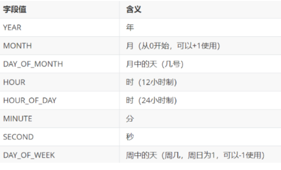
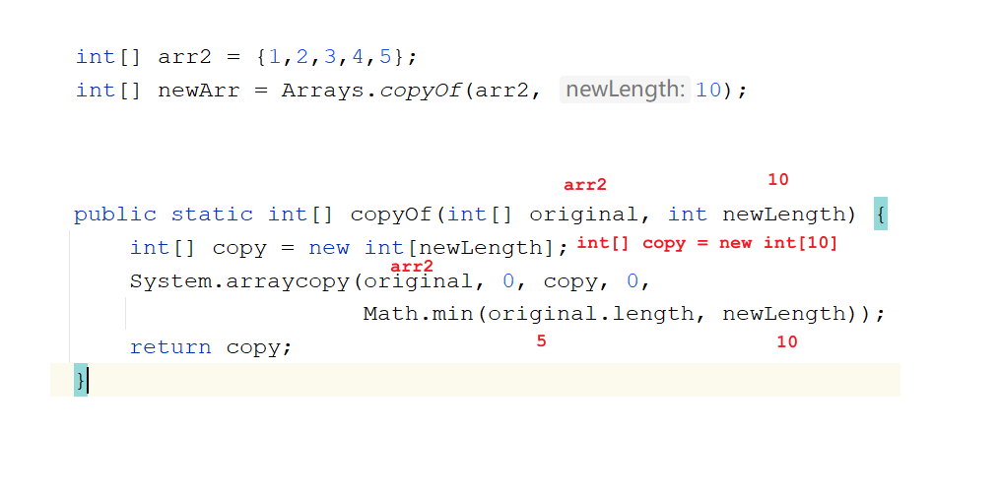
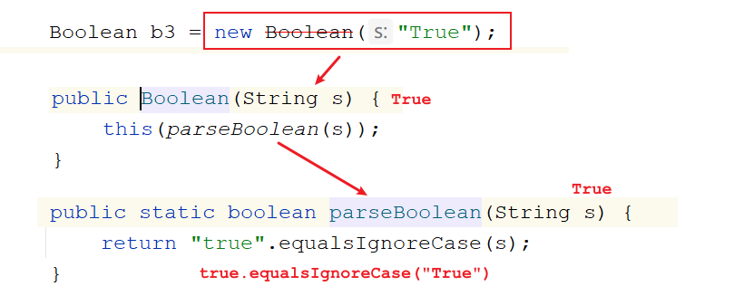
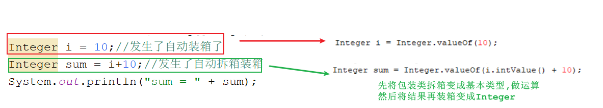
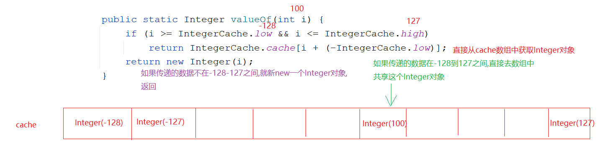
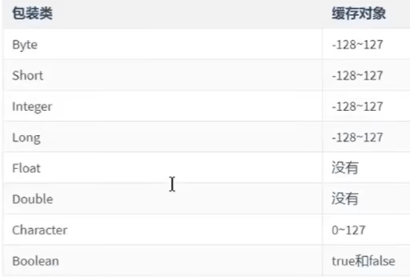

# 模块15.常用API

``` java
模块14回顾:
  String:
    1.构造:
      String()  String(String s) String(char[] chars) String(byte[] bytes)
      String(char[] chars,int offset,int count) String(byte[] chars,int offset,int count)
   
    2.判断方法:
      equals   equalsIgnoreCase
          
    3.获取方法:
      length()  concat(String s)  charAt(int index) indexOf(String s) subString(开始索引)
      subString(开始索引,结束索引) -> 含头不含尾
          
    4.转换方法:
      toCharArray()  getBytes()   getBytes(String charsetName) replace(c1,c2)
       
    5.分割方法:
      split(String regex)
          
    6.其他方法:
      contains(String s) endsWith(String s) statsWith(String s) toLowerCase()
      toUpperCase() trim()
          
       
  StringBuilder:
    1.append(任意类型数据)
    2.reverse()
    3.toString()
        
模块十五重点:
   1.会BigInteger和BigDecimal操作
   2.会Date和SimpleDateFormat的操作
   3.会System中的常用方法 -> 主要是数组复制
   4.会Arrays中的常用方法
   5.会利用包装类定义一个标准的javabean
   6.会包装类和String之间的转换
```

# 第一章.Math类

## 1.Math类介绍

```java
1.概述:数学工具类
2.作用:主要用于数学运算
3.特点:
  a.构造方法私有了
  b.方法都是静态的
4.使用:
  类名直接调用
```

## 2.Math类方法

```java
static int abs(int a) -> 求参数的绝对值
static double ceil(double a) -> 向上取整
static double floor(double a) ->向下取整
static long round(double a)  -> 四舍五入
static int max(int a, int b) ->求两个数之间的较大值 
static int min(int a, int b) ->求两个数之间的较小值
```

```java
public class Demo01Math {
    public static void main(String[] args) {
        //static int abs(int a) -> 求参数的绝对值
        System.out.println(Math.abs(-10));
        //static double ceil(double a) -> 向上取整
        System.out.println(Math.ceil(3.6));
        //static double floor(double a) ->向下取整
        System.out.println(Math.floor(3.6));
        //static long round(double a)  -> 四舍五入
        System.out.println(Math.round(3.6));
        System.out.println(Math.round(-2.8));
        //static int max(int a, int b) ->求两个数之间的较大值
        System.out.println(Math.max(10,20));
        //static int min(int a, int b) ->求两个数之间的较小值
        System.out.println(Math.min(10,20));
    }
}
```

# 第二章.BigInteger

## 1.BigInteger介绍

```java
1.问题描述:我们操作数据,将来的数据有可能非常大,大到比long还要大,这种数据我们一般称之为"对象"
2.作用:
  处理超大整数
3.构造:
  BigInteger(String val) -> 参数的格式必须是数字形式
4.方法:
  BigInteger add(BigInteger val)  返回其值为 (this + val) 的 BigInteger
  BigInteger subtract(BigInteger val) 返回其值为 (this - val) 的 BigInteger
  BigInteger multiply(BigInteger val)  返回其值为 (this * val) 的 BigInteger
  BigInteger divide(BigInteger val)    返回其值为 (this / val) 的 BigInteger   
```

## 2.BigInteger使用

```java
public class Demo02BigInteger {
    public static void main(String[] args) {
        BigInteger b1 = new BigInteger("121212121212121212121212121212121212121");
        BigInteger b2 = new BigInteger("121212121212121212121212121212121212121");
        //BigInteger add(BigInteger val)  返回其值为 (this + val) 的 BigInteger
        System.out.println(b1.add(b2));
        //BigInteger subtract(BigInteger val) 返回其值为 (this - val) 的 BigInteger
        System.out.println(b1.subtract(b2));
        //BigInteger multiply(BigInteger val)  返回其值为 (this * val) 的 BigInteger
        System.out.println(b1.multiply(b2));
        //BigInteger divide(BigInteger val)    返回其值为 (this / val) 的 BigInteger
        System.out.println(b1.divide(b2));
    }
}
```

>  int intValue() 将BigInteger转成int
>
>  long longValue() 将BigInteger 转成 long
>
>  BigInteger上限:42亿的21亿次方,内存根本扛不住,所以我们可以认为BigInteger无上限

# 第三章.BigDecimal类

## 1.BigDecimal介绍

```java
1.问题描述:我们知道直接用float或者double做运算会出现精度损失的问题,所以将来设计到钱,我们就不能用float或者double直接做运算
    
2.作用:主要是解决float和double直接做运算出现的精度损失问题
    
3.构造方法:
  BigDecimal(String val)  -> val必须要是数字形式
      
4.常用方法:
  static BigDecimal valueOf(double val)  -> 此方法初始化小数时可以传入double型数据
  BigDecimal add(BigDecimal val)  返回其值为 (this + val) 的 BigDecimal
  BigDecimal subtract(BigDecimal val) 返回其值为 (this - val) 的 BigDecimal
  BigDecimal multiply(BigDecimal val)  返回其值为 (this * val) 的 BigDecimal
  BigDecimal divide(BigDecimal val)    返回其值为 (this / val) 的 BigDecimal 
  BigDecimal divide(BigDecimal divisor, int scale, int roundingMode)  
                    divisor:除号后面的那个数
                    scale:指定保留几位小数
                    roundingMode:取舍方式
                                 static int ROUND_UP -> 向上加1
                                 static int ROUND_DOWN -> 直接舍去
                                 static int ROUND_HALF_UP -> 四舍五入
      
5.注意:
  如果除不尽,会报错,出现运算异常
```

## 2.BigDecimal使用

```java
public class Demo03BigDecimal {
    public static void main(String[] args) {
        //big01();
        //big02();
        big03();
    }

    private static void big03() {
        BigDecimal b1 = new BigDecimal("3.55");
        BigDecimal b2 = new BigDecimal("2.12");
        BigDecimal divide = b1.divide(b2, 2, BigDecimal.ROUND_UP);
        System.out.println("divide = " + divide);
        double v = divide.doubleValue();
        System.out.println("v = " + v);
    }

    private static void big02() {
        BigDecimal b1 = new BigDecimal("3.55");
        //BigDecimal b2 = new BigDecimal("2.12");
        BigDecimal b2 = BigDecimal.valueOf(2.12);

        //BigDecimal add(BigDecimal val)  返回其值为 (this + val) 的 BigDecimal
        BigDecimal add = b1.add(b2);
        System.out.println("add = " + add);
        //BigDecimal subtract(BigDecimal val) 返回其值为 (this - val) 的 BigDecimal
        BigDecimal subtract = b1.subtract(b2);
        System.out.println("subtract = " + subtract);
        //BigDecimal multiply(BigDecimal val)  返回其值为 (this * val) 的 BigDecimal
        BigDecimal multiply = b1.multiply(b2);
        System.out.println("multiply = " + multiply);
        //BigDecimal divide(BigDecimal val)    返回其值为 (this / val) 的 BigDecimal
        BigDecimal divide = b1.divide(b2);
        System.out.println("divide = " + divide);

    }

    private static void big01() {
        float a = 3.55F;
        float b = 2.12F;

        float result = a-b;
        System.out.println("result = " + result);//1.4300001
    }
}


```

> double doubleValue()  将此BigDecimal转成double

## 3.BigDecimal除法过时方法解决

```java
1.注意:如果调用的成员上面有一个横线,证明此成员过时了,底层会有一个注解@Deprecated修饰,但是过时的成员还能使用,只不过被新的成员代替了,不推荐使用了
    
2.方法:
  divide(BigDecimal divisor, int scale, RoundingMode roundingMode) 
         divisor:代表除号后面的数据
         scale:保留几位小数
         roundingMode:取舍方式-> RoundingMode是一个枚举,里面的成员可以类名直接调用
                                UP:向上加1 
                                DOWN:直接舍去 
                                HALF_UP:四舍五入 
```

```java
    private static void big04() {
        BigDecimal b1 = new BigDecimal("3.55");
        BigDecimal b2 = new BigDecimal("2.12");
        BigDecimal divide = b1.divide(b2, 2, RoundingMode.HALF_UP);
        System.out.println("divide = " + divide);
    }
```

# 第四章.Date日期类

## 1.Date类的介绍

```java
 1.概述:表示特定的瞬间,精确到毫秒
 2.常识:
   a.1000毫秒 = 1秒
   b.时间原点:1970年1月1日 0时0分0秒(UNIX系统起始时间),叫做格林威治时间,在0时区上
   c.时区:北京位于东八区,一个时区经度差15度,时间相差一个小时,所以北京时间比时间原点所在时区时间差8个小时
   d.北京经纬度:东经116 北纬39.56 -> 温带大陆性季风气候
   e.赤道   本初子午线(0度经线)    
```

## 2.Date类的使用

```java
1.构造:
  Date() -> 获取当前系统时间
  Date(long time) -> 获取指定时间,传递毫秒值 -> 从时间原点开始算   
```

```java
    private static void date01() {
        //Date() -> 获取当前系统时间
        Date date1 = new Date();
        System.out.println("date1 = " + date1);
        //Date(long time) -> 获取指定时间,传递毫秒值 -> 从时间原点开始算
        Date date2 = new Date(1000L);
        System.out.println("date2 = " + date2);
    }
```

## 3.Date类的常用方法

```java
1.void setTime(long time) -> 设置时间,传递毫秒值-> 从时间原点开始算
2.long getTime()->获取时间,返回毫秒值
```

```java
        private static void date02() {
            Date date = new Date();
            //1.void setTime(long time) -> 设置时间,传递毫秒值-> 从时间原点开始算
            date.setTime(1000L);
            //2.long getTime()->获取时间,返回毫秒值
            System.out.println(date.getTime());
        }
```

# 第五章.Calendar日历类

## 1.Calendar介绍

```java
1.概述:日历类,抽象类
2.获取:Calendar中的方法:
      static Calendar getInstance() 
3.月份对比:
  国外: 0 1 2 3 4 5 6 7 8 9  10 11
  国内: 1 2 3 4 5 6 7 8 9 10 11 12    
```



```java
常用方法:
  int get(int field) ->返回给定日历字段的值
  void set(int field, int value)  :将给定的日历字段设置为指定的值
  void add(int field, int amount) :根据日历的规则,为给定的日历字段添加或者减去指定的时间量
  Date getTime():将Calendar转成Date对象
      
field:代表的是日历字段-> 年 月 日 星期等,都是静态的    
```

```java
    private static void calendar02() {
        Calendar calendar = Calendar.getInstance();//多态
        //int get(int field) ->返回给定日历字段的值
        int year = calendar.get(Calendar.YEAR);
        System.out.println("year = " + year);
        //void set(int field, int value)  :将给定的日历字段设置为指定的值
        //calendar.set(Calendar.YEAR,2028);
        //System.out.println(calendar.get(Calendar.YEAR));
        //void add(int field, int amount) :根据日历的规则,为给定的日历字段添加或者减去指定的时间量
        calendar.add(Calendar.YEAR,-1);
        System.out.println(calendar.get(Calendar.YEAR));
        //Date getTime():将Calendar转成Date对象
        Date date = calendar.getTime();
        System.out.println("date = " + date);
    }
```

> 扩展方法:
>
> ```java
> void set(int year, int month, int date) -> 直接设置年月日
> 
> 需求:键盘录入一个年份,判断这一年是闰年,还是平年
> 步骤:
>   1.创建Calendar对象
>   2.创建Scanner对象,键盘录入一个年份
>   3.调用set方法,传递年,月,日
>     set(年,2,1) -> 国外是0-11,所以设置成2月就是代表3月  
>   4.将day减1天(3月1日减1天,就是2月最后一天,知道2月最后一天了,就知道是平年还是闰年了)
>   5.获取day判断平年还是闰年,输出结果    
> ```
>
> ```java
> private static void calendar03() {
>         //1.创建Calendar对象
>         Calendar calendar = Calendar.getInstance();
>         //2.创建Scanner对象,键盘录入一个年份
>         Scanner sc = new Scanner(System.in);
>         int year = sc.nextInt();
>         //3.调用set方法,传递年,月,日
>         //set(年,2,1) -> 国外是0-11,所以设置成2月就是代表3月
>         calendar.set(year,2,1);
>         //4.将day减1天(3月1日减1天,就是2月最后一天,知道2月最后一天了,就知道是平年还是闰年了)
>         calendar.add(Calendar.DATE,-1);
>         int day = calendar.get(Calendar.DATE);
>         //5.获取day判断平年还是闰年,输出结果
>         if (day==29){
>             System.out.println("闰年");
>         }else{
>             System.out.println("平年");
>         }
> 
>     }
> ```

# 第六章.SimpleDateFormat日期格式化类

## 1.SimpleDateFormat介绍

```java
1.概述:日期格式化类
2.构造:
  SimpleDateFormat(String pattern)
3.pattern代表啥:代表的是我们自己指定的日期格式
  字母不能改变,但是中间的连接符我们可以改变 
  
  yyyy-MM-dd HH:mm:ss  
    
```

| 时间字母表示 | 说明 |
| ------------ | ---- |
| y            | 年   |
| M            | 月   |
| d            | 日   |
| H            | 时   |
| m            | 分   |
| s            | 秒   |

## 2.SimpleDateFormat常用方法

```java
1.String format(Date date) -> 将Date对象按照指定的格式转成String 
2.Date parse(String source)-> 将符合日期格式的字符串转成Date对象      
```

```java
public class Demo03SimpleDateFormat {
    public static void main(String[] args) throws ParseException {
        SimpleDateFormat sdf = new SimpleDateFormat("yyyy-MM-dd HH:mm:ss");
        //1.String format(Date date) -> 将Date对象按照指定的格式转成String
        String time1 = sdf.format(new Date());
        System.out.println("time1 = " + time1);
        //2.Date parse(String source)-> 将符合日期格式的字符串转成Date对象
        String time2 = "2000-10-10 10:10:10";
        Date date = sdf.parse(time2);
        System.out.println("date = " + date);
    }
}
```

# 第七章.JDK8新日期类

## 1. LocalDate 本地日期

### 1.1.获取LocalDate对象

```java
1.概述:LocalDate是一个不可变的日期时间对象，表示日期，通常被视为年月日
2.获取:
  static LocalDate now()  -> 创建LocalDate对象
  static LocalDate of(int year, int month, int dayOfMonth)  -> 创建LocalDate对象,设置年月日   
```

```java
public class Demo04LocalDate {
    public static void main(String[] args) {
        //static LocalDate now()  -> 创建LocalDate对象
        LocalDate localDate = LocalDate.now();
        System.out.println("localDate = " + localDate);
        //static LocalDate of(int year, int month, int dayOfMonth)  -> 创建LocalDate对象,设置年月日
        LocalDate localDate1 = LocalDate.of(2000, 10, 10);
        System.out.println("localDate1 = " + localDate1);
    }
}
```

### 1.2.LocalDateTime对象

```java
1.LocalDateTime概述:LocalDateTime是一个不可变的日期时间对象，代表日期时间，通常被视为年 - 月 - 日 - 时 - 分 - 秒。
 
2.获取:
static LocalDateTime now()  创建LocalDateTime对象
static LocalDateTime of(int year, Month month, int dayOfMonth, int hour, int minute, int second) 创建LocalDateTime对象,设置年月日时分秒
```

```java
public class Demo05LocalDateTime {
    public static void main(String[] args) {
        //static LocalDateTime now()  创建LocalDateTime对象
        LocalDateTime localDateTime = LocalDateTime.now();
        System.out.println("localDateTime = " + localDateTime);
        //static LocalDateTime of(int year, Month month, int dayOfMonth, int hour, int minute, int second) 创建LocalDateTime对象,设置年月日时分秒
        LocalDateTime localDateTime1 = LocalDateTime.of(2000, 10, 10, 10, 10, 10);
        System.out.println("localDateTime1 = " + localDateTime1);
    }
}
```

### 1.3.获取日期字段的方法 : 名字是get开头

```java
int getYear()->获取年份
int getMonthValue()->获取月份
int getDayOfMonth()->获取月中的第几天
```

```java
private static void get() {
        LocalDate localDate = LocalDate.now();
        //int getYear()->获取年份
        System.out.println(localDate.getYear());
        //int getMonthValue()->获取月份
        System.out.println(localDate.getMonthValue());
        //int getDayOfMonth()->获取月中的第几天
        System.out.println(localDate.getDayOfMonth());
    }
```

### 1.4.设置日期字段的方法 : 名字是with开头

```java
LocalDate withYear(int year):设置年份
LocalDate withMonth(int month):设置月份
LocalDate withDayOfMonth(int day):设置月中的天数
```

```java
    private static void with() {
        LocalDate localDate = LocalDate.now();
        //LocalDate withYear(int year):设置年份
        //LocalDate localDate1 = localDate.withYear(2000);
        //System.out.println(localDate1);

        //LocalDate withMonth(int month):设置月份
        //LocalDate localDate2 = localDate1.withMonth(10);
        //System.out.println("localDate2 = " + localDate2);
        //LocalDate withDayOfMonth(int day):设置月中的天数

        //LocalDate localDate3 = localDate2.withDayOfMonth(10);
        //System.out.println("localDate3 = " + localDate3);

        LocalDate localDate1 = localDate.withYear(2000).withMonth(10).withDayOfMonth(10);
        System.out.println("localDate1 = " + localDate1);
    }
```

### 1.5.日期字段偏移

```java
设置日期字段的偏移量,方法名plus开头,向后偏移
设置日期字段的偏移量,方法名minus开头,向前偏移
```

```java
    /*
      向后偏移 -> plus开头方法
      向前偏移 -> minus开头方法
     */
    private static void plusAndMinus() {
        LocalDate localDate = LocalDate.now();
       // LocalDate localDate1 = localDate.plusYears(1L);
       // System.out.println("localDate1 = " + localDate1);
        LocalDate localDate1 = localDate.minusYears(1L);
        System.out.println("localDate1 = " + localDate1);

    }
```

## 2.Period和Duration类

### 2.1 Period 计算日期之间的偏差

```java
方法:
  static Period between(LocalDate d1,LocalDate d2):计算两个日期之间的差值
  
  getYears()->获取相差的年
  getMonths()->获取相差的月
  getDays()->获取相差的天
```

```java
    private static void period() {
        LocalDate local1 = LocalDate.of(2022, 12, 12);
        LocalDate local2 = LocalDate.of(2021, 11, 11);

        Period period = Period.between(local2, local1);

        System.out.println(period.getYears());
        System.out.println(period.getMonths());
        System.out.println(period.getDays());
    }
```

### 2.2 Duration计算时间之间的偏差

```java
1.static Duration between(Temporal startInclusive, Temporal endExclusive)  -> 计算时间差
2.Temporal : 是一个接口
  实现类:LocalDate LocalDateTime
      
3.参数需要传递 Temporal 的实现类对象, 注意要传递LocalDateTime
  因为Duration计算精确时间偏差,所以需要传递能操作精确时间的 LocalDateTime
      
      
4.利用Dutation获取相差的时分秒 -> to开头
  toDays() :获取相差天数
  toHours(): 获取相差小时
  toMinutes():获取相差分钟
  toMillis():获取相差秒(毫秒)
```

```java
    private static void duration() {
        LocalDateTime local1 = LocalDateTime.of(2022, 12, 12,12,12,12);
        LocalDateTime local2 = LocalDateTime.of(2021, 11, 11,11,11,11);
        Duration duration = Duration.between(local2, local1);
        System.out.println(duration.toDays());
        System.out.println(duration.toHours());
        System.out.println(duration.toMinutes());
        System.out.println(duration.toMillis());
    }

```

> 如果计算年月日 ,就用Period
>
> 如果计算时分秒,就用Duration

## 3.DateTimeFormatter日期格式化类

```java
1.获取:
  static DateTimeFormatter ofPattern(String pattern)   -> 获取对象,指定格式
2.方法:
  String format(TemporalAccessor temporal)-> 将日期对象按照指定的规则转成String 
                TemporalAccessor:接口,子接口有Temporal
                Temporal的实现类:LocalDate LocalDateTime    
                    
  TemporalAccessor parse(CharSequence text)-> 将符合规则的字符串转成日期对象 
                   如果想将TemporalAccessor转成我们常见的LocalDateTime日期对象,就需要用到LocalDateTime中的静态方法:
                   static LocalDateTime from(TemporalAccessor temporal)  
```

```java
    private static void parse() {
        DateTimeFormatter dtf = DateTimeFormatter.ofPattern("yyyy-MM-dd HH:mm:ss");
        String time = "2000-10-10 10:10:10";
        TemporalAccessor temporalAccessor = dtf.parse(time);
        //System.out.println(temporalAccessor);
        LocalDateTime localDateTime = LocalDateTime.from(temporalAccessor);
        System.out.println("localDateTime = " + localDateTime);
    }
```

# 第八章.System类

```java
1.概述:系统相关类,是一个工具类
2.特点:
  a.构造私有,不能利用构造方法new对象
  b.方法都是静态的
3.使用:
 类名直接调用
```

| 方法                                                         | 说明                                                         |
| ------------------------------------------------------------ | ------------------------------------------------------------ |
| static long currentTimeMillis()                              | 返回以毫秒为单位的当前时间,可以测效率                        |
| static void exit(int status)                                 | 终止当前正在运行的 Java 虚拟机                               |
| static void arraycopy(Object src, int srcPos, Object dest, int destPos, int length | 数组复制<br>src:源数组<br>srcPos:从源数组的哪个索引开始复制<br>dest:目标数组<br>ldestPos:从目标数组哪个索引开始粘贴<br>length:复制多少个元素 |

```java
public class Demo01System {
    public static void main(String[] args) {
        //currentTimeMillis();
        //exit();
        arraycopy();
    }

    /*
      static void arraycopy(Object src, int srcPos, Object dest, int destPos, int length)
             src:源数组
             srcPos:从源数组的哪个索引开始复制
             dest:目标数组
             destPos:从目标数组的哪个索引开始粘贴
             length:复制多少个元素
     */
    private static void arraycopy() {
        int[] arr1 = {1,2,3,4,5};
        int[] arr2 = new int[10];
        System.arraycopy(arr1,0,arr2,0,5);
        for (int i = 0; i < arr2.length; i++) {
            System.out.print(arr2[i]+" ");
        }

    }

    private static void exit() {
        for (int i = 0; i < 100; i++) {
            if (i==5){
                System.exit(0);
            }
            System.out.println("helloworld"+i);
        }
    }

    private static void currentTimeMillis() {
        long time = System.currentTimeMillis();
        System.out.println("time = " + time);
    }
}
```

# 第九章.Arrays数组工具类

```java
1.概述:数组工具类
2.特点:
  a.构造私有
  b.方法静态
3.使用:类名直接调用
```

| 方法                                               | 说明                                        |
| -------------------------------------------------- | ------------------------------------------- |
| static String toString(int[] a)                    | 按照格式打印数组元素<br>[元素1, 元素2, ...] |
| static void sort(int[] a)                          | 升序排序                                    |
| static int binarySearch(int[] a, int key)          | 二分查找(前提是升序)                        |
| static int[] copyOf(int[] original, int newLength) | 数组扩容                                    |

```java
public class Demo02Arrays {
    public static void main(String[] args) {
        int[] arr = {5,3,4,6,5,4,7};
        System.out.println(Arrays.toString(arr));

        System.out.println("==============");
        Arrays.sort(arr);
        System.out.println(Arrays.toString(arr));

        System.out.println("==============");
        int[] arr1 = {1,2,3,4,5,6,7};
        int index = Arrays.binarySearch(arr1, 3);
        System.out.println("index = " + index);

        System.out.println("==============");
        int[] arr2 = {1,2,3,4,5};
        int[] newArr = Arrays.copyOf(arr2, 10);
        System.out.println(Arrays.toString(newArr));
        
        arr2 = newArr;
        System.out.println(Arrays.toString(arr2));

    }
}
```



# 第十章.包装类

## 1.基本数据类型对应的引用数据类型(包装类)

```java
1.概述:就是基本类型对应的类(包装类),我们需要将基本类型转成包装类,从而让基本类型拥有类的特性(说白了,将基本类型转成包装类之后,就可以使用包装类中的方法操作数据)
    
2.为啥要学包装类:
  a.将来有一些特定场景,特定操作,比如调用方法传递包装类
    比如:ArrayList集合,里面有一个方法add(Integer i),此时我们不能调用add方法之后直接传递基本类型,因为引用类型不能直接接收基本类型的值,就需要先将基本类型转成包装类,传递到add方法中
  b.将来我们还可以将包装类转成基本类型:
    包装类不能直接使用+ - * /,所以需要将包装类转成基本类型,才能使用+ - * /
```

| 基本类型 | 包装类    |
| -------- | --------- |
| byte     | Byte      |
| short    | Short     |
| int      | Integer   |
| long     | Long      |
| float    | Float     |
| double   | Double    |
| char     | Charactor |
| boolean  | Boolean   |

## 2.Integer的介绍以及使用

### 2.1.Integer基本使用

```java
1.概述:Integer是int的包装类
2.构造:  不推荐使用了,但是还能用
  Integer(int value)
  Integer(String s) s必须是数字形式
```

```java
public class Demo01Integer {
    public static void main(String[] args) {
        Integer i1 = new Integer(10);
        System.out.println("i1 = " + i1);

        Integer i2 = new Integer("10");
        System.out.println("i2 = " + i2);

        System.out.println("================");

        Boolean b1 = new Boolean("true");
        System.out.println("b1 = " + b1);

        Boolean b2 = new Boolean("false");
        System.out.println("b2 = " + b2);

        Boolean b3 = new Boolean("True");
        System.out.println("b3 = " + b3);
    }
}
```



```java
1.装箱:将基本类型转成对应的包装类
2.方法:
  static Integer valueOf(int i)  
  static Integer valueOf(String s)  
```

```java
public class Demo02Integer {
    public static void main(String[] args) {
        Integer i1 = Integer.valueOf(10);
        System.out.println("i1 = " + i1);

        Integer i2 = Integer.valueOf("100");
        System.out.println("i2 = " + i2);
    }
}
```

```java
1.拆箱:将包装类转成基本类型
2.方法:
  int intValue();
```

```java
public class Demo03Integer {
    public static void main(String[] args) {
        Integer i1 = Integer.valueOf(10);
        System.out.println("i1 = " + i1);

        int i = i1.intValue();
        System.out.println("(i+10) = " + (i + 10));
    }
}
```

### 2.2.自动拆箱装箱

```java
1.拆箱和装箱很多时候都是自动完成的
```

```java
public class Demo04Integer {
    public static void main(String[] args) {
        Integer i = 10;//发生了自动装箱了
        Integer sum = i+10;//发生了自动拆箱装箱
        System.out.println("sum = " + sum);
    }
}
```



> ```java
> public class Demo05Integer {
> public static void main(String[] args) {
>   Integer i1 = 100;
>   Integer i2 = 100;
>   System.out.println(i1==i2);
> 
>   Integer i3 = 128;
>   Integer i4 = 128;
>   System.out.println(i3==i4);
> }
> }
> ```
>
> 
>
> 
>
> 

## 3.基本类型和String之间的转换

### 3.1 基本类型往String转

```java
1.方式1:
  + 拼接
2.方式2:String中的静态方法
  static String valueOf(int i) 
```

```java
  private static void method01() {
        int i = 10;
        String s1 = i+"";
        System.out.println(s1+1);

        System.out.println("============");

        String s = String.valueOf(10);
        System.out.println(s+1);
    }
```

### 3.2 String转成基本数据类型

```java
每个包装类中都有一个类似的方法:  parseXXX
```

| 位置    | 方法                                  | 说明                    |
| ------- | ------------------------------------- | ----------------------- |
| Byte    | static byte parseByte(String s)       | 将String转byte类型      |
| Short   | static short parseShort(String s)     | 将String转成short类型   |
| Integer | static int parseInt(String s)         | 将String转成int类型     |
| Long    | static long parseLong(String s)       | 将String转成long类型    |
| Float   | static float parseFloat(String s)     | 将String转成float类型   |
| Double  | static double parseDouble(String s)   | 将String转成double类型  |
| Boolean | static boolean parseBoolean(String s) | 将String转成boolean类型 |

```java
    private static void method02() {
        int number = Integer.parseInt("1111");
        System.out.println(number+1);
    }
```

> ```java
> 1.在实际开发过程中如何定义一个标准javabean
>   定义javabean的时候一般会将基本类型的属性定义成包装类型的属性  
> ```
>
> ```java
> public class User {
>     //private int uid;//用户id
>     private Integer uid;//用户id
>     private String username;//用户名
>     private String password;//密码
> 
>     public User() {
>     }
> 
>     public User(Integer uid, String username, String password) {
>         this.uid = uid;
>         this.username = username;
>         this.password = password;
>     }
> 
>     public Integer getUid() {
>         return uid;
>     }
> 
>     public void setUid(Integer uid) {
>         this.uid = uid;
>     }
> 
>     public String getUsername() {
>         return username;
>     }
> 
>     public void setUsername(String username) {
>         this.username = username;
>     }
> 
>     public String getPassword() {
>         return password;
>     }
> 
>     public void setPassword(String password) {
>         this.password = password;
>     }
> }
> ```
>
> ```java
> 1.举例:如果uid为Integer型,默认值是null
> 2.将来javabean中的数据都是和数据库表联系起来的,我们可以将javabean中的数据添加到表中
>   如果表中的uid为主键自增的,此时添加语句时uid中的数据不用我们单独维护赋值了,添加语句的sql语句就可以这样写:
>   insert into user(uid,username,password) values (NULL,'金莲','36666');
> 
> 3.到时候,我们需要将javabean中封装的数据获取出来放到sql语句中,如果uid为主键自增,而且javabean中的uid为包装类型,默认值为NULL,这样就不用单独维护uid的值了,也不用先给javabean中的uid赋值,然后在保存到数据库中了,咱们就可以直接使用uid的默认值,将默认值放到sql语句的uid列中
>     
> 4.而且将javabean中的属性变成包装类,还可以使用包装类中的方法去操作此属性值    
> ```

