# 模块16.多线程

```java
模块15回顾:
  1.Math:数学工具类
    abs ceil floor round max min
  2.BigInteger:处理超大整数
    a.构造:BigInteger(String s)
    b.方法:
      add  subtract multiply divide
          
  3.BigDecimal:处理小数直接做运算而产生的精度损失问题
    a.构造:BigDecimal(String s)
    b.方法: add  subtract multiply divide valueOf(double b)   
           divide(BigDecimal b,保留几位小数,取舍方式) 
  4.Date:日期类
    a.构造:
      Date()  Date(long time)
    b.方法:
      long getTime()获取时间对应的毫秒值
      void setTime(long time) 设置时间,从时间原点开始算
  5.Calendar:日历类
    a.获取:getInstance()
    b.方法:
      get(指定的时间字段)
      set(指定字段,值)
      add(指定的时间字段,值) -> 设置时间偏移量
      getTime()将Calendar转成Date
  6.SimpleDateFormat:日期格式化类
    a.构造:SimpleDateFormat(String pattern)
    b.方法:
      format parse
  7.jdk8新日期类:
    a.LocalDate:操作年月日
      now of
    b.LocalDateTime:操作年月日时分秒
      now of
    c.获取字段:get开头
    d.设置字段:with开头
    e.时间偏移
      plus开头 -> 向后偏移
      minus开头 -> 向前偏题
    f.计算时间偏差:
      Period
      Duration
      
      between方法
    g.DateTimeFormatter:日期格式化类
      获取:ofPattern()
      方法: format parse
  8.System类:
    arrayCopy(源数组,第源数组第几个索引开始复制,目标数组,从目标数组第几个索引开始粘贴,粘贴多少个)
  9.Arrays数组工具类:
    toString(数组)按照格式打印数组
    binarySearch(数组,要查找的元素) -> 二分查找
    sort(数组)升序排序
    copyOf(数组,指定新数组长度) -> 数组扩容
        
 10.包装类:基本类型对应的包装类
    byte     Byte
    short    Short
    int      Integer
    long     Long
    float    Float  
    double   Double
    char     Charactor
    boolean  Boolean
     
 11.Integer:
    a.构造:
      Integer(int i)
      Integer(String s)
    b.装箱:
      valueOf(int i)
      valueOf(String s)
    c.拆箱:
      intValue()
 12.基本类型和String之间的转换
    a.基本转String
      +""    valueOf()
    b.String转基本
      包装类中的parsexxx()
 13.javabean:定义的时候基本类型的属性要改成包装类
     
模块16重点:
  1.会使用多线程方法,主要是start()
  2.会使用继承Thread的方式创建多线程
  3.会使用实现Runnable接口的方式实现多线程
  4.会使用同步代码块解决线程不安全问题
  5.会使用同步方法解决线程不安全问题
```

# 第一章.多线程基本了解

## 1.多线程_线程和进程

```java
进程:在内存中执行的应用程序
```

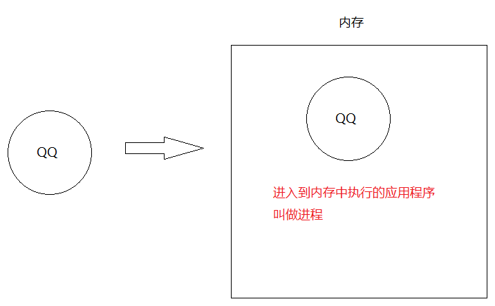

```java
线程:是进程中最小的执行单元
线程作用:负责当前进程中程序的运行.一个进程中至少有一个线程,一个进程还可以有多个线程,这样的应用程序就称之为多线程程序
    
简单理解:一个功能就需要一条线程取去执行    
```

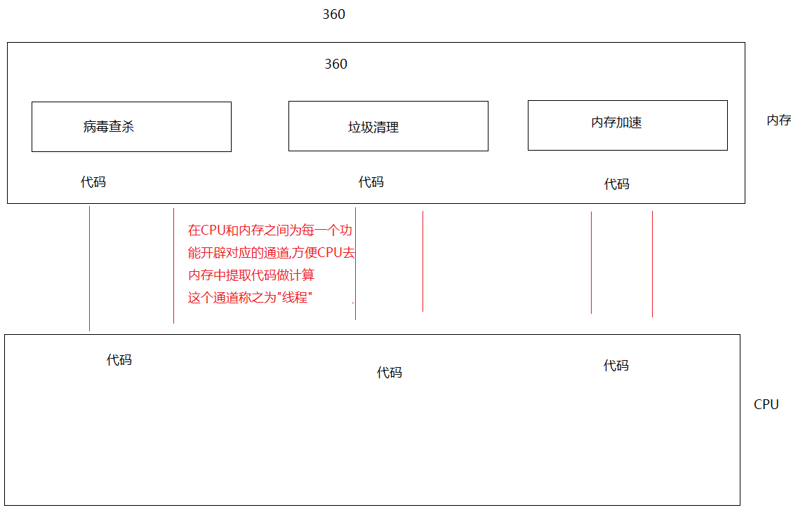

> 1.使用场景: 软件中的耗时操作 -> 拷贝大文件, 加载大量的资源
>
> ​                     所有的聊天软件
>
> ​                     所有的后台服务器
>
> ​    一个线程可以干一件事,我们就可以同时做多件事了,提高了CPU的利用率

## 2.并发和并行

```java
并行:在同一个时刻,有多个执行在多个CPU上(同时)执行(好比是多个人做不同的事儿)
    比如:多个厨师在炒多个菜
```

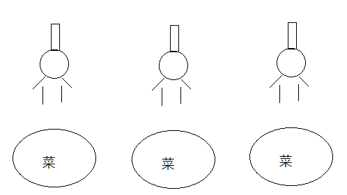

```java
并发:在同一个时刻,有多个指令在单个CPU上(交替)执行
    比如:一个厨师在炒多个菜
```

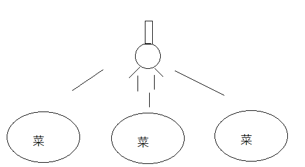

```java
细节:
  1.之前CPU是单核,但是在执行多个程序的时候好像是在同时执行,原因是CPU在多个线程之间做高速切换
  2.现在咱们的CPU都是多核多线程的了,比如2核4线程,那么CPU可以同时运行4个线程,此时不同切换,但是如果多了,CPU就要切换了,所以现在CPU在执行程序的时候并发和并行都存在    
```

## 3.CPU调度

```java
1.分时调度:值的是让所有的线程轮流获取CPU使用权,并且平均分配每个线程占用CPU的时间片
2.抢占式调度:多个线程轮流抢占CPU使用权,哪个线程先抢到了,哪个线程先执行,一般都是优先级高的先抢到CPU使用权的几率大,我们java程序就是抢占式调度    
```

## 4.主线程介绍

```java
主线程:CPU和内存之间开辟的转门为main方法服务的线程
```

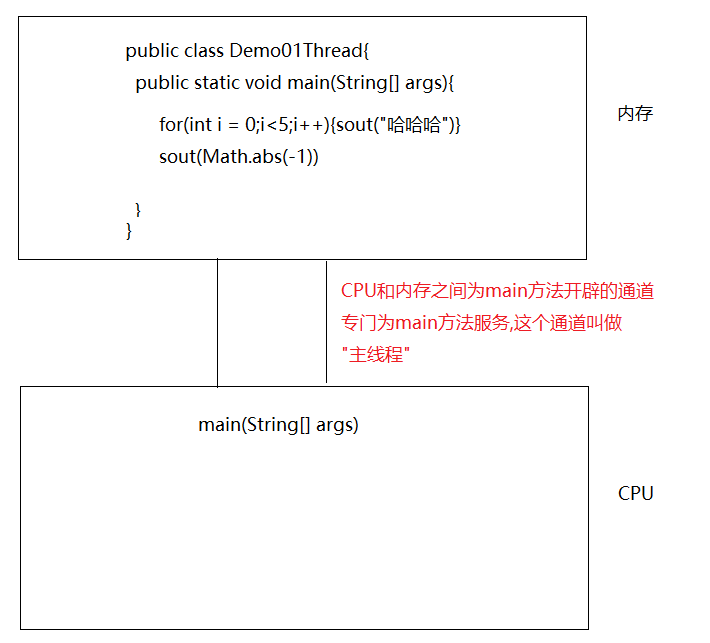

# 第二章.创建线程的方式(重点)

## 1.第一种方式_extends Thread

```java
1.定义一个类,继承Thread
2.重写run方法,在run方法中设置线程任务(所谓的线程任务指的是此线程要干的具体的事儿,具体执行的代码)
3.创建自定义线程类的对象 
4.调用Thread中的start方法,开启线程,jvm自动调用run方法
```

```java
public class Test01 {
    public static void main(String[] args) {
        //创建线程对象
        MyThread t1 = new MyThread();
        //调用start方法,开启线程,jvm自动调用run方法
        t1.start();

        for (int i = 0; i < 10; i++) {
            System.out.println("main线程..........执行了"+i);
        }
    }
}
```

```java
public class MyThread extends Thread{
    @Override
    public void run() {
        for (int i = 0; i < 10; i++) {
            System.out.println("MyThread...执行了"+i);
        }
    }
}
```

## 2.多线程在内存中的运行原理

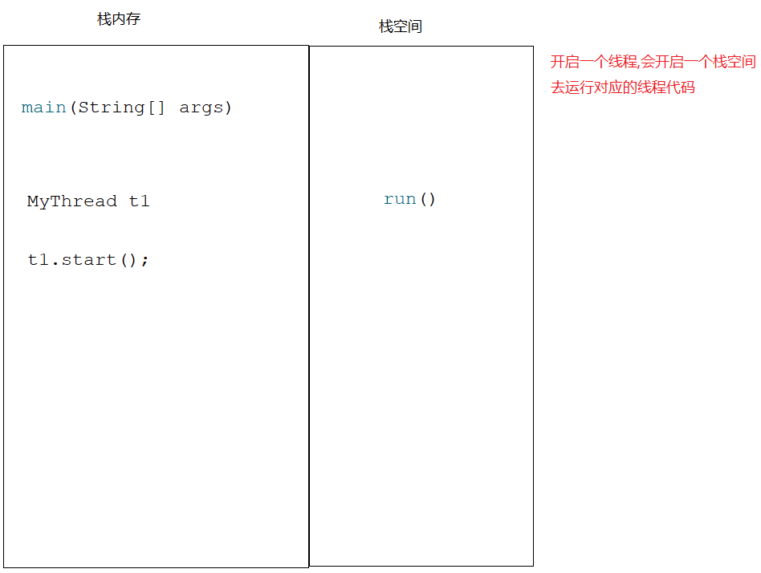

```java
注意:同一个线程对象不能连续调用多次start,如果想要再次调用start,那么咱们就new一个新的线程对象
```

## 3.Thread类中的方法

```java
void start() -> 开启线程,jvm自动调用run方法
void run()  -> 设置线程任务,这个run方法是Thread重写的接口Runnable中的run方法
String getName()  -> 获取线程名字
void setName(String name) -> 给线程设置名字
static Thread currentThread() -> 获取正在执行的线程对象(此方法在哪个线程中使用,获取的就是哪个线程对象)   
static void sleep(long millis)->线程睡眠,超时后自动醒来继续执行,传递的是毫秒值    
```

```java
public class MyThread extends Thread{
    @Override
    public void run() {
        for (int i = 0; i < 10; i++) {
            //线程睡眠
            try {
                Thread.sleep(1000L);
            } catch (InterruptedException e) {
                throw new RuntimeException(e);
            }
            System.out.println(Thread.currentThread().getName()+"...执行了"+i);
        }
    }
}

```

```java
public class Test01 {
    public static void main(String[] args) throws InterruptedException {
        //创建线程对象
        MyThread t1 = new MyThread();

        //给线程设置名字
        t1.setName("金莲");

        //调用start方法,开启线程,jvm自动调用run方法
        t1.start();

        for (int i = 0; i < 10; i++) {
            Thread.sleep(1000L);
            System.out.println(Thread.currentThread().getName()+"线程..........执行了"+i);
        }
    }
}

```

> 问题:为啥在重写的run方法中有异常只能try,不能throws
>
> 原因:继承的Thread中的run方法没有抛异常,所以在子类中重写完run方法之后就不能抛,只能try

## 4.Thread中其他的方法

```java
void setPriority(int newPriority)   -> 设置线程优先级,优先级越高的线程,抢到CPU使用权的几率越大,但是不是每次都先抢到
    
int getPriority()  -> 获取线程优先级
    
void setDaemon(boolean on)  -> 设置为守护线程,当非守护线程执行完毕,守护线程就要结束,但是守护线程也不是立马结束,当非守护线程结束之后,系统会告诉守护线程人家结束了,你也结束吧,在告知的过程中,守护线程会执行,只不过执行到半路就结束了
    
static void yield() -> 礼让线程,让当前线程让出CPU使用权
   
void join() -> 插入线程或者叫做插队线程    
```

### 4.1.线程优先级

```java
public class MyThread1 extends Thread{
    @Override
    public void run() {
        for (int i = 0; i < 10; i++) {
            System.out.println(Thread.currentThread().getName()+"执行了......"+i);
        }
    }
}
```

```java
public class Test01 {
    public static void main(String[] args) {
        MyThread1 t1 = new MyThread1();
        t1.setName("金莲");

        MyThread1 t2 = new MyThread1();
        t2.setName("阿庆");

        /*
           获取两个线程的优先级
           MIN_PRIORITY = 1 最小优先级 1
           NORM_PRIORITY = 5 默认优先级 5
           MAX_PRIORITY = 10 最大优先级 10
         */
        //System.out.println(t1.getPriority());
        //System.out.println(t2.getPriority());

        //设置优先级
        t1.setPriority(1);
        t2.setPriority(10);

        t1.start();
        t2.start();
    }
}

```

### 4.2.守护线程

```java
public class Test01 {
    public static void main(String[] args) {
        MyThread1 t1 = new MyThread1();
        t1.setName("金莲");

        MyThread2 t2 = new MyThread2();
        t2.setName("阿庆");

        //将t2设置成守护线程
        t2.setDaemon(true);

        t1.start();
        t2.start();
    }
}

```

```java
public class MyThread1 extends Thread{
    @Override
    public void run() {
        for (int i = 0; i < 10; i++) {
            System.out.println(Thread.currentThread().getName()+"执行了......"+i);
        }
    }
}
```

```java
public class MyThread2 extends Thread{
    @Override
    public void run() {
        for (int i = 0; i < 100; i++) {
            System.out.println(Thread.currentThread().getName()+"执行了..."+i);
        }
    }
}

```

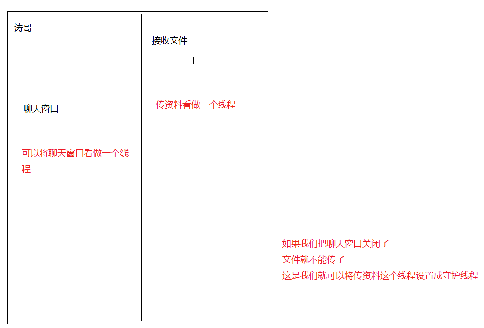

### 4.3.礼让线程

```java
场景说明:如果两个线程一起执行,可能会执行一会儿线程A,再执行一会线程B,或者可能线程A执行完毕了,线程B在执行
        那么我们能不能让两个线程尽可能的平衡一点 -> 尽量让两个线程交替执行
注意:只是尽可能的平衡,不是绝对的你来我往,有可能线程A线程执行,然后礼让了,但是回头A又抢到CPU使用权了    
```

```java
public class Test01 {
    public static void main(String[] args) {
        MyThread1 t1 = new MyThread1();
        t1.setName("金莲");

        MyThread1 t2 = new MyThread1();
        t2.setName("阿庆");


        t1.start();
        t2.start();
    }
}
```

```java
public class MyThread1 extends Thread{
    @Override
    public void run() {
        for (int i = 0; i < 10; i++) {
            System.out.println(Thread.currentThread().getName()+"执行了......"+i);
            Thread.yield();
        }
    }
}

```

### 4.4.插入线程

```java
public class MyThread1 extends Thread{
    @Override
    public void run() {
        for (int i = 0; i < 10; i++) {
            System.out.println(Thread.currentThread().getName()+"执行了......"+i);
        }
    }
}
```

```java
public class Test01 {
    public static void main(String[] args) throws InterruptedException {
        MyThread1 t1 = new MyThread1();
        t1.setName("金莲");
        t1.start();

        /*
          表示把t1插入到当前线程之前,t1要插到main线程之前,所以当前线程就是main线程
         */
        t1.join();

        for (int i = 0; i < 10; i++) {
            System.out.println(Thread.currentThread().getName()+"执行了......"+i);
        }
    }
}
```

## 5.第二种方式_实现Runnable接口

```java
1.创建类,实现Runnable接口
2.重写run方法,设置线程任务
3.利用Thread类的构造方法:Thread(Runnable target),创建Thread对象(线程对象),将自定义的类当参数传递到Thread构造中 -> 这一步是让我们自己定义的类成为一个真正的线程类对象
4.调用Thread中的start方法,开启线程,jvm自动调用run方法    
```

```java
public class Test01 {
    public static void main(String[] args) {
        MyRunnable myRunnable = new MyRunnable();

        /*
           Thread(Runnable target)
         */
        Thread t1 = new Thread(myRunnable);
        //调用Thread中的start方法,开启线程
        t1.start();

        for (int i = 0; i < 10; i++) {
            System.out.println(Thread.currentThread().getName()+"...执行了"+i);
        }
    }
}
```

```java
public class MyRunnable implements Runnable{
    @Override
    public void run() {
        for (int i = 0; i < 10; i++) {
            System.out.println(Thread.currentThread().getName()+"...执行了"+i);
        }
    }
}
```

## 6.两种实现多线程的方式区别

```java
1.继承Thread:继承只支持单继承,有继承的局限性
2.实现Runnable:没有继承的局限性, MyThread extends Fu implements Runnable
```

## 7.第三种方式_匿名内部类创建多线程

> 严格意义上来说,匿名内部类方式不属于创建多线程方式其中之一,因为匿名内部类形式建立在实现Runnable接口的基础上完成的

```java
匿名内部类回顾: 
  1.new 接口/抽象类(){
      重写方法
  }.重写的方法();

  2.接口名/类名 对象名 = new 接口/抽象类(){
      重写方法
  }
    对象名.重写的方法();
```

```java
public class Test02 {
    public static void main(String[] args) {
        /*
          Thread(Runnable r)
          Thread(Runnable target, String name) :name指的是给线程设置名字
         */

        new Thread(new Runnable() {
            @Override
            public void run() {
                for (int i = 0; i < 10; i++) {
                    System.out.println(Thread.currentThread().getName()+"...执行了"+i);
                }
            }
        },"阿庆").start();

        new Thread(new Runnable() {
            @Override
            public void run() {
                for (int i = 0; i < 10; i++) {
                    System.out.println(Thread.currentThread().getName()+"...执行了"+i);
                }
            }
        },"金莲").start();
    }
}

```

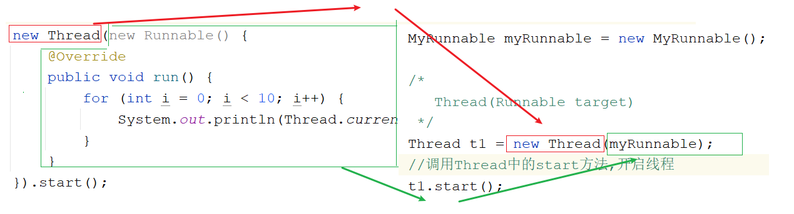

# 第三章.线程安全

```java
1.什么时候发生:当多个线程访问同一个资源时,导致了数据有问题
```

## 1.线程安全问题-->线程不安全的代码

```java
public class MyTicket implements Runnable{
    //定义100张票
    int ticket = 100;

    @Override
    public void run() {
        while(true){
            if (ticket>0){
                System.out.println(Thread.currentThread().getName()+"买了第"+ticket+"张票");
                ticket--;
            }
        }
    }
}

```

```java
public class Test01 {
    public static void main(String[] args) {
        MyTicket myTicket = new MyTicket();

        Thread t1 = new Thread(myTicket, "赵四");
        Thread t2 = new Thread(myTicket, "刘能");
        Thread t3 = new Thread(myTicket, "广坤");

        t1.start();
        t2.start();
        t3.start();
    }
}
```

```java
原因:CPU在多个线程之间做高速切换导致的
```

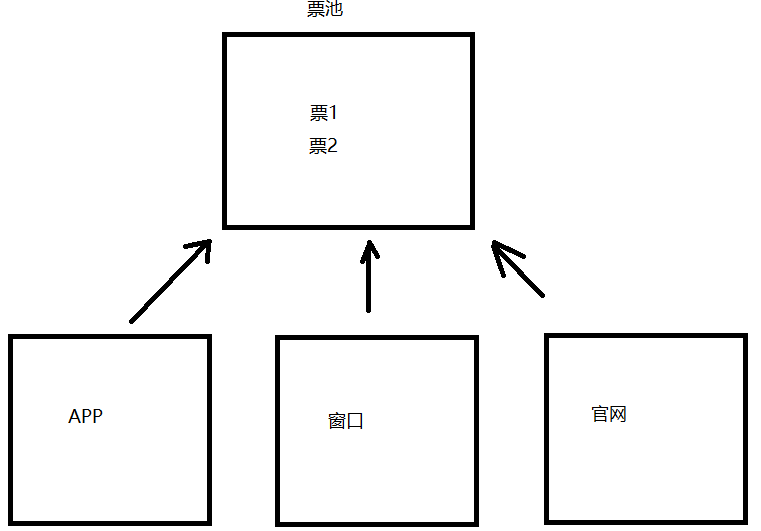

## 2.解决线程安全问题的第一种方式(使用同步代码块)

```java
1.格式:
  synchronized(任意对象){
      线程可能出现不安全的代码
  }
2.任意对象:就是我们的锁对象
3.执行:
  一个线程拿到锁之后,会进入到同步代码块中执行,在此期间,其他线程拿不到锁,就进不去同步代码块,需要在同步代码块外面等待排队,需要等着执行的线程执行完毕,出了同步代码块,相当于释放锁了,等待的线程才能抢到锁,才能进入到同步代码块中执行
```

```java
public class MyTicket implements Runnable{
    //定义100张票
    int ticket = 100;

    //任意new一个对象
    Object obj = new Object();

    @Override
    public void run() {
        while(true){
            try {
                Thread.sleep(100L);
            } catch (InterruptedException e) {
                throw new RuntimeException(e);
            }
            synchronized (obj){
                if (ticket>0){
                    System.out.println(Thread.currentThread().getName()+"买了第"+ticket+"张票");
                    ticket--;
                }
            }

        }
    }
}
```

```java
public class Test01 {
    public static void main(String[] args) {
        MyTicket myTicket = new MyTicket();

        Thread t1 = new Thread(myTicket, "赵四");
        Thread t2 = new Thread(myTicket, "刘能");
        Thread t3 = new Thread(myTicket, "广坤");

        t1.start();
        t2.start();
        t3.start();
    }
}
```

## 3.解决线程安全问题的第二种方式:同步方法

### 3.1.普通同步方法_非静态

``` java
1.格式:
  修饰符 synchronized 返回值类型 方法名(参数){
      方法体
      return 结果
  }
2.默认锁:this
```

```java
public class MyTicket implements Runnable{
    //定义100张票
    int ticket = 100;

    @Override
    public void run() {
        while(true){
            try {
                Thread.sleep(100L);
            } catch (InterruptedException e) {
                throw new RuntimeException(e);
            }
           //method01();
            method02();
        }
    }

   /* public synchronized void method01(){
        if (ticket>0){
            System.out.println(Thread.currentThread().getName()+"买了第"+ticket+"张票");
            ticket--;
        }
    }*/
   public void method02(){
       synchronized(this){
           System.out.println(this+"..........");
           if (ticket>0){
               System.out.println(Thread.currentThread().getName()+"买了第"+ticket+"张票");
               ticket--;
           }
       }

   }

}

```

```java
public class Test01 {
    public static void main(String[] args) {
        MyTicket myTicket = new MyTicket();
        System.out.println(myTicket);

        Thread t1 = new Thread(myTicket, "赵四");
        Thread t2 = new Thread(myTicket, "刘能");
        Thread t3 = new Thread(myTicket, "广坤");

        t1.start();
        t2.start();
        t3.start();
    }
}

```

### 3.2.静态同步方法

```java
1.格式:
  修饰符 static synchronized 返回值类型 方法名(参数){
      方法体
      return 结果
  }
2.默认锁:class对象
```

```java
public class MyTicket implements Runnable{
    //定义100张票
    static int ticket = 100;

    @Override
    public void run() {
        while(true){
            try {
                Thread.sleep(100L);
            } catch (InterruptedException e) {
                throw new RuntimeException(e);
            }
           //method01();
            method02();
        }
    }

    /*public static synchronized void method01(){
        if (ticket>0){
            System.out.println(Thread.currentThread().getName()+"买了第"+ticket+"张票");
            ticket--;
        }
    }*/
   public static void method02(){
       synchronized(MyTicket.class){
           if (ticket>0){
               System.out.println(Thread.currentThread().getName()+"买了第"+ticket+"张票");
               ticket--;
           }
       }

   }
}
```

```java
public class Test01 {
    public static void main(String[] args) {
        MyTicket myTicket = new MyTicket();

        Thread t1 = new Thread(myTicket, "赵四");
        Thread t2 = new Thread(myTicket, "刘能");
        Thread t3 = new Thread(myTicket, "广坤");

        t1.start();
        t2.start();
        t3.start();
    }
}

```

# 第四章.死锁(了解)

## 1.死锁介绍(锁嵌套就有可能产生死锁)

```java
指的是两个或者两个以上的线程在执行的过程中由于竞争同步锁而产生的一种阻塞现象;如果没有外力的作用,他们将无法继续执行下去,这种情况称之为死锁
```

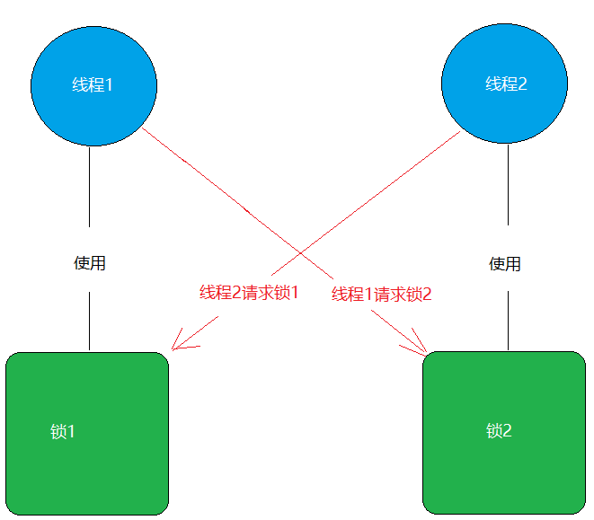

```java
根据上图所示:线程1正在持有锁1,但是线程1必须再拿到锁2,才能继续执行
而线程2正在持有锁2,但是线程2需要再拿到锁1,才能继续执行
此时两个线程处于互相等待的状态,就是死锁,在程序中的死锁将出现在同步代码块的嵌套中
```

## 2.死锁的分析

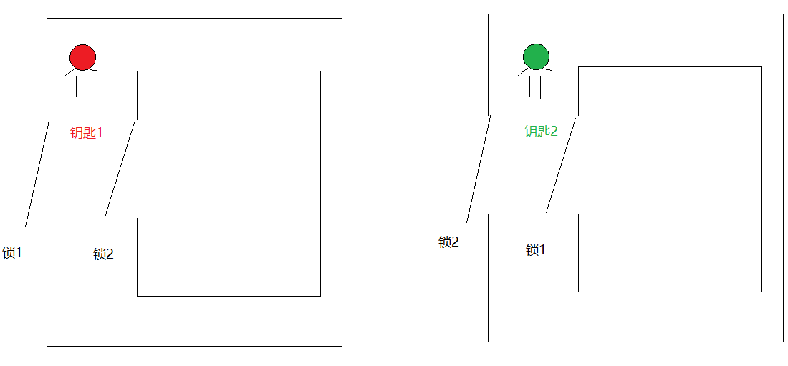

## 3.代码实现

```java
public class LockA {
    public static LockA lockA = new LockA();
}

```

```java
public class LockB {
    public static LockB lockB = new LockB();
}
```

```java
public class DieLock implements Runnable{
    private boolean flag;

    public DieLock(boolean flag) {
        this.flag = flag;
    }

    @Override
    public void run() {
        if (flag){
            synchronized (LockA.lockA){
                System.out.println("if...lockA");
                synchronized (LockB.lockB){
                    System.out.println("if...lockB");
                }
            }
        }else{
            synchronized (LockB.lockB){
                System.out.println("else...lockB");
                synchronized (LockA.lockA){
                    System.out.println("else...lockA");
                }
            }
        }
    }
}

```

```java
public class Test01 {
    public static void main(String[] args) {
        DieLock dieLock1 = new DieLock(true);
        DieLock dieLock2 = new DieLock(false);

        new Thread(dieLock1).start();
        new Thread(dieLock2).start();
    }
}


```

> 只需要知道死锁出现的原因即可(锁嵌套),以后尽量避免锁嵌套
>

# 第五章.线程状态

## 1.线程状态介绍

```java
  当线程被创建并启动以后，它既不是一启动就进入了执行状态，也不是一直处于执行状态。在线程的生命周期中，有几种状态呢？在API中java.lang.Thread.State这个枚举中给出了六种线程状态：
  这里先列出各个线程状态发生的条件，下面将会对每种状态进行详细解析。
```

| 线程状态                | 导致状态发生条件                                             |
| ----------------------- | ------------------------------------------------------------ |
| NEW(新建)               | 线程刚被创建，但是并未启动。还没调用start方法。              |
| Runnable(可运行)        | 线程可以在java虚拟机中运行的状态，可能正在运行自己代码，也可能没有，这取决于操作系统处理器。 |
| Blocked(锁阻塞)         | 当一个线程试图获取一个对象锁，而该对象锁被其他的线程持有，则该线程进入Blocked状态；当该线程持有锁时，该线程将变成Runnable状态。 |
| Waiting(无限等待)       | 一个线程在等待另一个线程执行一个（唤醒）动作时，该线程进入Waiting状态。进入这个状态后是不能自动唤醒的，必须等待另一个线程调用notify或者notifyAll方法才能够唤醒。 |
| Timed Waiting(计时等待) | 同waiting状态，有几个方法有超时参数，调用他们将进入Timed Waiting状态。这一状态将一直保持到超时期满或者接收到唤醒通知。带有超时参数的常用方法有Thread.sleep 、Object.wait。 |
| Terminated(被终止)      | 因为run方法正常退出而死亡，或者因为没有捕获的异常终止了run方法而死亡。或者调用过时方法stop() |

## 2.线程状态图

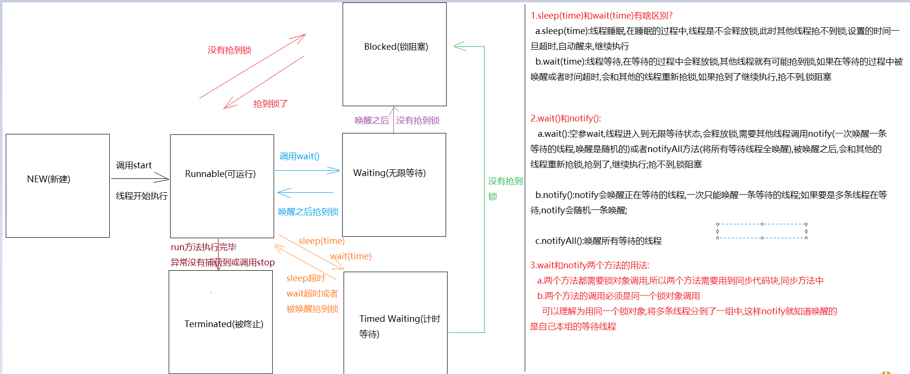

