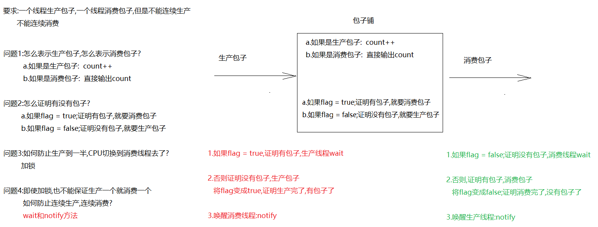
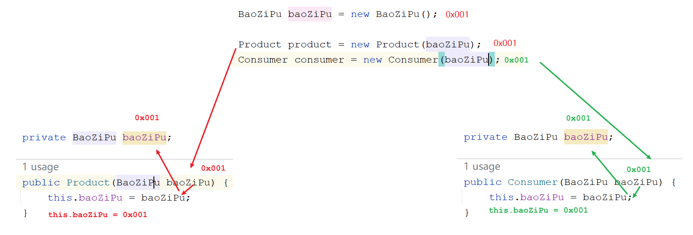
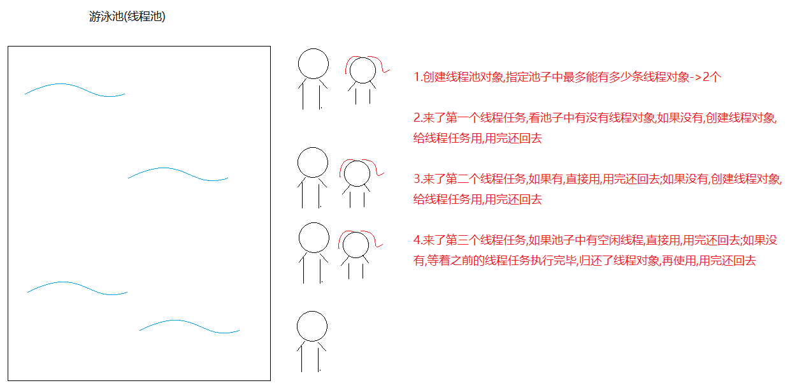

# 模块17. 多线程

```java
模块16回顾:
  1.创建多线程:
    继承Thread
          a.定义一个类,继承Thread
          b.重写run方法,设置线程任务
          c.创建自定义线程对象
          d.调用start方法,开启线程,jvm自动执行run方法
    实现Runnable接口:
          a.定义一个类,实现Runnable
          b.重写run方法,设置线程任务
          c.创建自定义线程对象,传递到Thread对象中
          d.调用start方法,开启线程,jvm自动调用run方法
    匿名内部类形式创建:
          new Thread(new Runnable(){
              重写run
          }).start();

  2.Thread中的方法:
    a.start():开启线程,jvm自动调用run方法
    b.getName():获取线程名字
    c.setName(String name):设置线程名字
    d.currentThread():获取当前正在执行的线程对象
    e.sleep(long time):线程睡眠
    f.setPriority(int n) :设置线程优先级
    g.getPriority():获取线程优先级
    h.setDaemon(true):设置为守护线程
    i.yield():礼让线程
    j:join():插队线程
        
  3.线程安全:
    a.同步代码块:
      synchronized(锁对象){
          
      }

    b.同步方法: -> 在定义方法的时候加上synchronized关键字
      非静态:默认锁this
      静态的:默认锁class对象
          
模块17重点:
  1.会用wait和notify两个方法
  2.会使用Lock锁对象
  3.会利用Callable接口实现多线程
  4.会使用线程池完成多线程
    
```

# 第一章.等待唤醒机制

## 1.等待唤醒案例分析(线程之间的通信)

```java
要求:一个线程生产,一个线程消费,不能连续生产,不能连续消费 -> 等待唤醒机制(生产者,消费者)(线程之间的通信)
```

| 方法             | 说明                                                         |
| ---------------- | ------------------------------------------------------------ |
| void wait()      | 线程等待,等待的过程中线程会释放锁,需要被其他线程调用notify方法将其唤醒,重新抢锁执行 |
| void notify()    | 线程唤醒,一次唤醒一个等待线程;如果有多条线程等待,则随机唤醒一条等待线程 |
| void notifyAll() | 唤醒所有等待线程                                             |

> wait和notify方法需要锁对象调用,所以需要用到同步代码块中,而且必须是同一个锁对象



## 2.等待唤醒案例实现

```java
/*
   count和flag可以定义成包装类
   但是要记得给count和flag手动赋值
   不然对于本案例来说,容易出现空指针异常
 */
public class BaoZiPu {
    //代表包子的count
    private int count;
    //代表是否有包子的flag
    private boolean flag;

    public BaoZiPu() {
    }

    public BaoZiPu(int count, boolean flag) {
        this.count = count;
        this.flag = flag;
    }

    /*
       getCount 改造成消费包子方法
       直接输出count
     */
    public void getCount() {
        System.out.println("消费了..............第"+count+"个包子");
    }

    /*
       setCount 改造成生产包子
       count++
     */
    public void setCount() {
        count++;
        System.out.println("生产了...第"+count+"个包子");
    }

    public boolean isFlag() {
        return flag;
    }

    public void setFlag(boolean flag) {
        this.flag = flag;
    }
}

```

```java
public class Product implements Runnable{
    private BaoZiPu baoZiPu;

    public Product(BaoZiPu baoZiPu) {
        this.baoZiPu = baoZiPu;
    }

    @Override
    public void run() {
        while(true){

            try {
                Thread.sleep(100L);
            } catch (InterruptedException e) {
                throw new RuntimeException(e);
            }

            synchronized (baoZiPu){
                //1.判断flag是否为true,如果是true,证明有包子,生产线程等待
                if (baoZiPu.isFlag()==true){
                    try {
                        baoZiPu.wait();
                    } catch (InterruptedException e) {
                        throw new RuntimeException(e);
                    }
                }

                //2.如果flag为false,证明没有包子,开始生产
                baoZiPu.setCount();
                //3.改变flag状态,为true,证明生产完了,有包子了
                baoZiPu.setFlag(true);
                //4.唤醒消费线程
                baoZiPu.notify();
            }
        }
    }
}

```

```java
public class Consumer implements Runnable{
    private BaoZiPu baoZiPu;

    public Consumer(BaoZiPu baoZiPu) {
        this.baoZiPu = baoZiPu;
    }

    @Override
    public void run() {
        while(true){

            try {
                Thread.sleep(100L);
            } catch (InterruptedException e) {
                throw new RuntimeException(e);
            }

            synchronized (baoZiPu){
                //1.判断flag是否为false,如果是false,证明没有包子,消费线程等待
                if (baoZiPu.isFlag()==false){
                    try {
                        baoZiPu.wait();
                    } catch (InterruptedException e) {
                        throw new RuntimeException(e);
                    }
                }

                //2.如果flag为true,证明有包子,开始消费
                baoZiPu.getCount();
                //3.改变flag状态,为false,证明消费完了,没 有包子了
                baoZiPu.setFlag(false);
                //4.唤醒生产线程
                baoZiPu.notify();
            }
        }
    }
}

```

```java
public class Test01 {
    public static void main(String[] args) {
        BaoZiPu baoZiPu = new BaoZiPu();

        Product product = new Product(baoZiPu);
        Consumer consumer = new Consumer(baoZiPu);

        Thread t1 = new Thread(product);
        Thread t2 = new Thread(consumer);

        t1.start();
        t2.start();
    }
}
```


## 3.用同步方法改造等待唤醒案例

```java
/*
   count和flag可以定义成包装类
   但是要记得给count和flag手动赋值
   不然对于本案例来说,容易出现空指针异常
 */
public class BaoZiPu {
    //代表包子的count
    private int count;
    //代表是否有包子的flag
    private boolean flag;

    public BaoZiPu() {
    }

    public BaoZiPu(int count, boolean flag) {
        this.count = count;
        this.flag = flag;
    }

    /*
       getCount 改造成消费包子方法
       直接输出count
     */
    public synchronized void getCount() {
        //1.判断flag是否为false,如果是false,证明没有包子,消费线程等待
        if (this.flag == false) {
            try {
                this.wait();
            } catch (InterruptedException e) {
                throw new RuntimeException(e);
            }
        }

        //2.如果flag为true,证明有包子,开始消费
        System.out.println("消费了..............第" + count + "个包子");

        //3.改变flag状态,为false,证明消费完了,没 有包子了
        this.flag = false;
        //4.唤醒生产线程
        this.notify();
    }

    /*
       setCount 改造成生产包子
       count++
     */
    public synchronized void setCount() {
        //1.判断flag是否为true,如果是true,证明有包子,生产线程等待
        if (this.flag == true) {
            try {
                this.wait();
            } catch (InterruptedException e) {
                throw new RuntimeException(e);
            }
        }

        //2.如果flag为false,证明没有包子,开始生产
        count++;
        System.out.println("生产了...第" + count + "个包子");
        //3.改变flag状态,为true,证明生产完了,有包子了
        this.flag = true;
        //4.唤醒消费线程
        this.notify();
    }

    public boolean isFlag() {
        return flag;
    }

    public void setFlag(boolean flag) {
        this.flag = flag;
    }
}

```

```java
public class Product implements Runnable{
    private BaoZiPu baoZiPu;

    public Product(BaoZiPu baoZiPu) {
        this.baoZiPu = baoZiPu;
    }

    @Override
    public void run() {
        while(true){

            try {
                Thread.sleep(100L);
            } catch (InterruptedException e) {
                throw new RuntimeException(e);
            }
            baoZiPu.setCount();
        }
    }
}

```

```java
public class Consumer implements Runnable{
    private BaoZiPu baoZiPu;

    public Consumer(BaoZiPu baoZiPu) {
        this.baoZiPu = baoZiPu;
    }

    @Override
    public void run() {
        while(true){

            try {
                Thread.sleep(100L);
            } catch (InterruptedException e) {
                throw new RuntimeException(e);
            }

            baoZiPu.getCount();
        }
    }
}

```

```java
public class Test01 {
    public static void main(String[] args) {
        BaoZiPu baoZiPu = new BaoZiPu();

        Product product = new Product(baoZiPu);
        Consumer consumer = new Consumer(baoZiPu);

        Thread t1 = new Thread(product);
        Thread t2 = new Thread(consumer);

        t1.start();
        t2.start();
    }
}
```

# 第二章.多等待多唤醒

## 1.解决多生产多消费问题(if改为while,将notify改为notifyAll)

```java
public class Test01 {
    public static void main(String[] args) {
        BaoZiPu baoZiPu = new BaoZiPu();

        Product product = new Product(baoZiPu);
        Consumer consumer = new Consumer(baoZiPu);

        new Thread(product).start();
        new Thread(product).start();
        new Thread(product).start();

        new Thread(consumer).start();
        new Thread(consumer).start();
        new Thread(consumer).start();
    }
}

```

```java
/*
   count和flag可以定义成包装类
   但是要记得给count和flag手动赋值
   不然对于本案例来说,容易出现空指针异常
 */
public class BaoZiPu {
    //代表包子的count
    private int count;
    //代表是否有包子的flag
    private boolean flag;

    public BaoZiPu() {
    }

    public BaoZiPu(int count, boolean flag) {
        this.count = count;
        this.flag = flag;
    }

    /*
       getCount 改造成消费包子方法
       直接输出count
     */
    public synchronized void getCount() {
        //1.判断flag是否为false,如果是false,证明没有包子,消费线程等待
        while (this.flag == false) {
            try {
                this.wait();
            } catch (InterruptedException e) {
                throw new RuntimeException(e);
            }
        }

        //2.如果flag为true,证明有包子,开始消费
        System.out.println("消费了..............第" + count + "个包子");

        //3.改变flag状态,为false,证明消费完了,没 有包子了
        this.flag = false;
        //4.唤醒所有等待线程
        this.notifyAll();
    }

    /*
       setCount 改造成生产包子
       count++
     */
    public synchronized void setCount() {
        //1.判断flag是否为true,如果是true,证明有包子,生产线程等待
        while (this.flag == true) {
            try {
                this.wait();
            } catch (InterruptedException e) {
                throw new RuntimeException(e);
            }
        }

        //2.如果flag为false,证明没有包子,开始生产
        count++;
        System.out.println("生产了...第" + count + "个包子");
        //3.改变flag状态,为true,证明生产完了,有包子了
        this.flag = true;
        //4.唤醒所有等待线程
        this.notifyAll();
    }

    public boolean isFlag() {
        return flag;
    }

    public void setFlag(boolean flag) {
        this.flag = flag;
    }
}

```

```java
public class Product implements Runnable{
    private BaoZiPu baoZiPu;

    public Product(BaoZiPu baoZiPu) {
        this.baoZiPu = baoZiPu;
    }

    @Override
    public void run() {
        while(true){

            try {
                Thread.sleep(100L);
            } catch (InterruptedException e) {
                throw new RuntimeException(e);
            }
            baoZiPu.setCount();
        }
    }
}

```

```java
public class Consumer implements Runnable{
    private BaoZiPu baoZiPu;

    public Consumer(BaoZiPu baoZiPu) {
        this.baoZiPu = baoZiPu;
    }

    @Override
    public void run() {
        while(true){

            try {
                Thread.sleep(100L);
            } catch (InterruptedException e) {
                throw new RuntimeException(e);
            }

            baoZiPu.getCount();
        }
    }
}

```

# 第三章.Lock锁

## 1.Lock对象的介绍和基本使用

```java
1.概述:Lock是一个接口
2.实现类:ReentrantLock 
3.方法:
  lock() 获取锁
  unlock() 释放锁
```

```java
public class MyTicket implements Runnable {
    //定义100张票
    int ticket = 100;

    //创建Lock对象
    Lock lock = new ReentrantLock();

    @Override
    public void run() {
        while (true) {
            try {
                Thread.sleep(100L);

                //获取锁
                lock.lock();
                if (ticket > 0) {
                    System.out.println(Thread.currentThread().getName() + "买了第" + ticket + "张票");
                    ticket--;
                }
            } catch (InterruptedException e) {
                throw new RuntimeException(e);
            }finally {
                //释放锁
                lock.unlock();
            }

        }
    }
}

```

```java
public class Test01 {
    public static void main(String[] args) {
        MyTicket myTicket = new MyTicket();

        Thread t1 = new Thread(myTicket, "赵四");
        Thread t2 = new Thread(myTicket, "刘能");
        Thread t3 = new Thread(myTicket, "广坤");

        t1.start();
        t2.start();
        t3.start();
    }
}

```

> ```java
> synchronized:不管是同步代码块还是同步方法,都需要在结束一对{}之后,释放锁对象
> Lock:是通过两个方法控制需要被同步的代码,更灵活
> ```

# 第四章.Callable接口_实现多线程方式三

```java
1.概述:Callable<V>是一个接口,类似于Runnable
2.方法:
  V call()  -> 设置线程任务的,类似于run方法
3.call方法和run方法的区别:
  a.相同点:都是设置线程任务的
  b.不同点:
    call方法有返回值,而且有异常可以throws
    run方法没有返回值,而且有异常不可以throws
        
4.<V> 
  a.<V>叫做泛型
  b.泛型:用于指定我们操作什么类型的数据,<>中只能写引用数据类型,如果泛型不写,默认是Object类型数据
  c.实现Callable接口时,指定泛型是什么类型的,重写的call方法返回值就是什么类型的
      
5.获取call方法返回值: FutureTask<V>
  a. FutureTask<V> 实现了一个接口: Future <V>
  b. FutureTask<V>中有一个方法:
     V get() -> 获取call方法的返回值
```

```java
public class MyCallable implements Callable<String> {

    @Override
    public String call() throws Exception {
        return "涛哥和金莲...的故事";
    }
}
```

```java
public class Test {
    public static void main(String[] args) throws ExecutionException, InterruptedException {
        MyCallable myCallable = new MyCallable();
        /*
           FutureTask(Callable<V> callable)
         */
        FutureTask<String> futureTask = new FutureTask<>(myCallable);

        //创建Thread对象-> Thread(Runnable target)
        Thread t1 = new Thread(futureTask);
        t1.start();

        //调用get方法获取call方法返回值
        System.out.println(futureTask.get());
    }
}

```

# 第五章.线程池_实现多线程方式四



```java
1.问题:之前来一个线程任务,就需要创建一个线程对象去执行,用完还要销毁线程对象,如果线程任务多了,就需要频繁创建线程对象和销毁线程对象,这样会耗费内存资源,所以我们就想线程对象能不能循环利用,用的时候直接拿线程对象,用完还回去
```

```java
1.如何创建线程池对象:用具类-> Executors
2.获取线程池对象:Executors中的静态方法:
  static ExecutorService newFixedThreadPool(int nThreads)  
  a.参数:指定线程池中最多创建的线程对象条数
  b.返回值ExecutorService 是线程池,用来管理线程对象
      
3.执行线程任务: ExecutorService中的方法
  Future<?> submit(Runnable task) 提交一个Runnable任务用于执行 
  Future<T> submit(Callable<T> task) 提交一个Callable任务用于执行 
    
4.submit方法的返回值:Future接口
  用于接收run方法或者call方法返回值的,但是run方法没有返回值,所以可以不用Future接收,执行call方法需要用Future接收
    
  Future中有一个方法:V get()  用于获取call方法返回值
    
5. ExecutorService中的方法:
   void shutdown()  启动有序关闭，其中先前提交的任务将被执行，但不会接受任何新任务
```

```java
public class MyRunnable implements Runnable{
    @Override
    public void run() {
        System.out.println(Thread.currentThread().getName()+"...执行了");
    }
}
```

```java
public class Test01 {
    public static void main(String[] args) {
        //创建线程池对象
        ExecutorService es = Executors.newFixedThreadPool(2);
        es.submit(new MyRunnable());
        es.submit(new MyRunnable());
        es.submit(new MyRunnable());

        //es.shutdown();//关闭线程池对象
    }
}
```

```java
public class MyCallable implements Callable<Integer> {
    @Override
    public Integer call() throws Exception {
        return 1;
    }
}
```

```java
public class Test02 {
    public static void main(String[] args) throws ExecutionException, InterruptedException {
        ExecutorService es = Executors.newFixedThreadPool(2);
        Future<Integer> future = es.submit(new MyCallable());
        System.out.println(future.get());
    }
}

```

## 练习

```java
需求:创建两个线程任务,一个线程任务完成1-100的和,一个线程任务返回一个字符串
```

```java
public class MyString implements Callable<String> {
    @Override
    public String call() throws Exception {
        return "那一夜,你没有拒绝我,那一夜,你伤害了我";
    }
}
```

```java
public class MySum implements Callable<Integer> {
    @Override
    public Integer call() throws Exception {
        int sum = 0;
        for (int i = 1; i <= 100; i++) {
            sum+=i;
        }
        return sum;
    }
}
```

```java
public class Test01 {
    public static void main(String[] args) throws ExecutionException, InterruptedException {
        //创建线程池对象
        ExecutorService es = Executors.newFixedThreadPool(2);
        Future<String> f1 = es.submit(new MyString());
        Future<Integer> f2 = es.submit(new MySum());
        System.out.println(f1.get());
        System.out.println(f2.get());
    }
}
```

# 第六章.定时器_Timer

```java
1.概述:定时器
2.构造:
  Timer()
3.方法:
  void schedule(TimerTask task, Date firstTime, long period)  
                task:抽象类,是Runnable的实现类
                firstTime:从什么时间开始执行
                period: 每隔多长时间执行一次,设置的是毫秒值    
```

```java
public class Demo01Timer {
    public static void main(String[] args) {
        Timer timer = new Timer();
        timer.schedule(new TimerTask() {
            @Override
            public void run() {
                System.out.println("金莲对涛哥说:涛哥,快起床了~~~");
            }
        },new Date(),2000L);
    }
}
```

