# 模块18.集合

```java
模块17重点回顾:
  1.wait和notify
    a.wait:线程等待,在等待过程中释放锁,需要其他线程调用notify唤醒
    b.notify:唤醒一条等待的线程,如果多条线程等待,随机一条唤醒
    c.notifyAll:唤醒所有等待线程
  2.Lock:锁
    方法:lock()获取锁   unlock()释放锁
  3.线程池:Executors
    a.获取:static ExecutorService newFixedThreadPool(int nThread)
    b.提交线程任务:
      submit(Runnable r) 
      submit(Callable c)
    c.Future:接收run或者call方法的返回值
    d.shutDown()关闭线程池
  4.Callable:类似于Runnable
    a.方法:call()设置线程任务,类似于run方法,但是call可以throws异常,以及有返回值
    b.接收返回值:FutureTask 实现了Future接口
      get()获取call方法的返回值
        
模块18重点:
  1.知道集合的特点以及作用
  2.会使用Collection接口中的方法
  3.会使用迭代器迭代集合
  4.会ArrayList以及LinkedList的使用
  5.会使用增强for遍历集合
```

# 第一章.集合框架(单列集合)

```java
1.之前我们学了保存数据的有:变量,数组,但是数组定长,所以如果添加一个数据或者删除一个数据,数组并不好使,需要创建新数组,所以接下来我们学一个长度可变的容器,集合
    
2.集合的特点
  a.只能存储引用数据类型的数据
  b.长度可变
  c.集合中有大量的方法,方便我们操作
    
3.分类:
  a.单列集合:一个元素就一个组成部分:
    list.add("张三")
  b.双列集合:一个元素有两部分构成:  key 和 value
    map.put("涛哥","金莲") -> key,value叫做键值对  
    
```

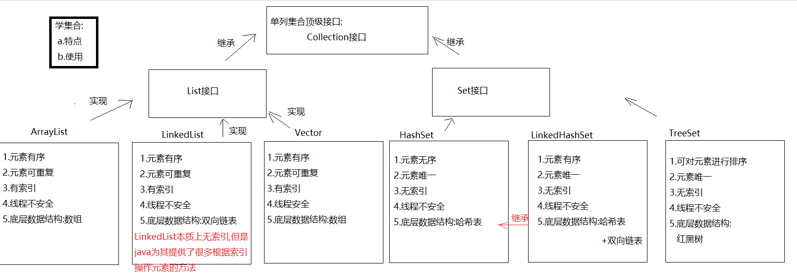

# 第二章.Collection接口

```java
1.概述:单列集合的顶级接口
2.使用:
  a.创建:
    Collection<E> 对象名 = new 实现类对象<E>()
  b.<E>:泛型,决定了集合中能存储什么类型的数据,可以统一元素类型
        泛型中只能写引用数据类型,如果不写,默认Object类型,此时什么类型的数据都可以存储了
        <int> 不行
        <Integer> 行
        <Person> 行
      
  c.泛型细节:
    我们等号前面的泛型必须写,等号后面的泛型可以不写,jvm会根据前面的泛型推导出后面的泛型是啥
      
3.常用方法:
  boolean add(E e) : 将给定的元素添加到当前集合中(我们一般调add时,不用boolean接收,因为add一定会成功)
  boolean addAll(Collection<? extends E> c) :将另一个集合元素添加到当前集合中 (集合合并)
  void clear():清除集合中所有的元素
  boolean contains(Object o)  :判断当前集合中是否包含指定的元素
  boolean isEmpty() : 判断当前集合中是否有元素->判断集合是否为空
  boolean remove(Object o):将指定的元素从集合中删除
  int size() :返回集合中的元素个数。
  Object[] toArray(): 把集合中的元素,存储到数组中  
```

```java
public class Demo01Collection {
    public static void main(String[] args) {
        Collection<String> collection = new ArrayList<>();
        //boolean add(E e) : 将给定的元素添加到当前集合中(我们一般调add时,不用boolean接收,因为add一定会成功)
        collection.add("萧炎");
        collection.add("萧薰儿");
        collection.add("彩鳞");
        collection.add("小医仙");
        collection.add("云韵");
        collection.add("涛哥");
        System.out.println(collection);
        //boolean addAll(Collection<? extends E> c) :将另一个集合元素添加到当前集合中 (集合合并)
        Collection<String> collection1 = new ArrayList<>();
        collection1.add("张无忌");
        collection1.add("小昭");
        collection1.add("赵敏");
        collection1.add("周芷若");
        collection1.addAll(collection);
        System.out.println(collection1);

        //void clear():清除集合中所有的元素
        collection1.clear();
        System.out.println(collection1);
        //boolean contains(Object o)  :判断当前集合中是否包含指定的元素
        boolean result01 = collection.contains("涛哥");
        System.out.println("result01 = " + result01);
        //boolean isEmpty() : 判断当前集合中是否有元素->判断集合是否为空
        System.out.println(collection1.isEmpty());
        //boolean remove(Object o):将指定的元素从集合中删除
        collection.remove("涛哥");
        System.out.println(collection);
        //int size() :返回集合中的元素个数。
        System.out.println(collection.size());
        //Object[] toArray(): 把集合中的元素,存储到数组中
        Object[] arr = collection.toArray();
        System.out.println(Arrays.toString(arr));
    }
}
```

# 第三章.迭代器

## 1.迭代器基本使用

```java
1.概述:Iterator接口
2.主要作用:遍历集合
3.获取:Collection中的方法:
  Iterator<E> iterator()
4.方法:
  boolean hasNext()  -> 判断集合中有没有下一个元素
  E next()  ->获取下一个元素    
```

```java
public class Demo01Iterator {
    public static void main(String[] args) {
        ArrayList<String> list = new ArrayList<>();
        list.add("楚雨荨");
        list.add("慕容云海");
        list.add("端木磊");
        list.add("上官瑞谦");
        list.add("叶烁");
        //获取迭代器对象
        Iterator<String> iterator = list.iterator();
        while(iterator.hasNext()){
            String element = iterator.next();
            System.out.println(element);
        }
    }
}

```

> 注意:next方法在获取的时候不要连续使用多次
>
> ```java
> public class Demo02Iterator {
>     public static void main(String[] args) {
>         ArrayList<String> list = new ArrayList<>();
>         list.add("楚雨荨");
>         list.add("慕容云海");
>         list.add("端木磊");
>         list.add("上官瑞谦");
>         list.add("叶烁");
>         //获取迭代器对象
>         Iterator<String> iterator = list.iterator();
>         while(iterator.hasNext()){
>             String element = iterator.next();
>             System.out.println(element);
>             //String element2 = iterator.next();
>             //System.out.println(element2);
>         }
>     }
> }
> 
> ```
>
> NoSuchElementException:没有可操作的元素异常

## 2.迭代器迭代过程

```java
int cursor; //下一个元素索引位置
int lastRet = -1;//上一个元素索引位置
```

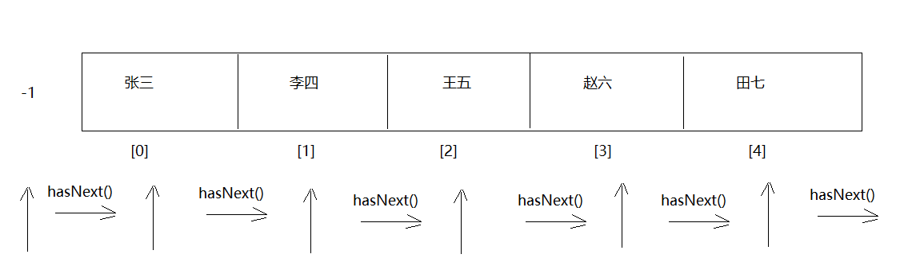

## 3.迭代器底层原理

```java
1.获取Iterator的时候怎么获取的:
  Iterator iterator = list.iterator()
  我们知道Iterator是一个接口,等号右边一定是它的实现类对象
  问题:Iterator接收的到底是哪个实现类对象呢? -> ArrayList中的内部类Itr对象    
```

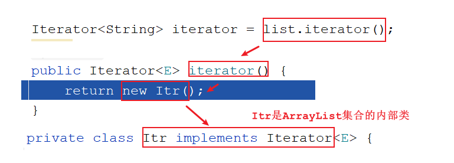

> 注意:只有ArrayList使用迭代器的时候Iterator接口才会指向Itr,其他的集合使用迭代器Iterator就指向的不是Itr了
>
> ```java
> HashSet<String> set = new HashSet<>();
> Iterator<String> iterator1 = set.iterator();
> ```
>
> 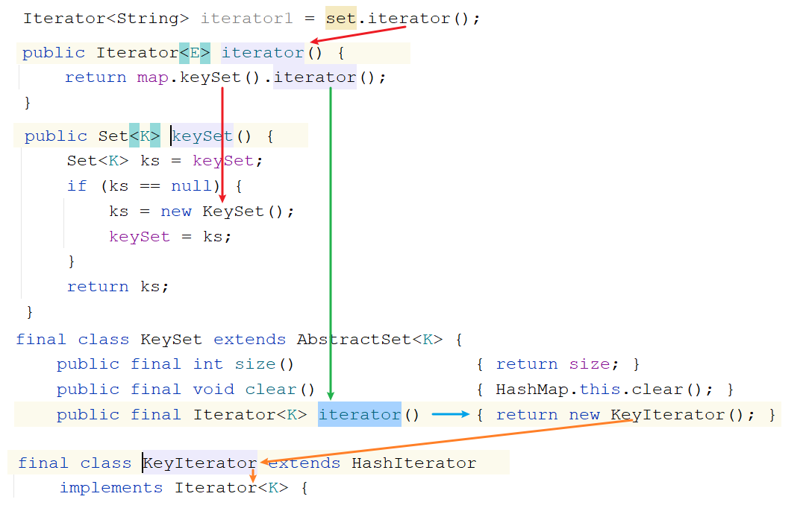

## 4.并发修改异常

```java
需求:定义一个集合,存储 唐僧,孙悟空,猪八戒,沙僧,遍历集合,如果遍历到猪八戒,往集合中添加一个白龙马
```

```java
public class Demo03Iterator {
    public static void main(String[] args) {
        //需求:定义一个集合,存储 唐僧,孙悟空,猪八戒,沙僧,遍历集合,如果遍历到猪八戒,往集合中添加一个白龙马
        ArrayList<String> list = new ArrayList<>();
        list.add("唐僧");
        list.add("孙悟空");
        list.add("猪八戒");
        list.add("沙僧");

        Iterator<String> iterator = list.iterator();
        while(iterator.hasNext()){
            String element = iterator.next();
            if ("猪八戒".equals(element)){
                list.add("白龙马");
            }
        }
        System.out.println(list);
    }
}

```

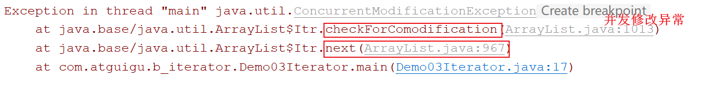

```java
String element = iterator.next();
=========================================
private class Itr implements Iterator<E> {
        int cursor;       // index of next element to return
        int lastRet = -1; // index of last element returned; -1 if no such
    
        /*
          modCount: 实际操作次数
          expectedModCount:预期操作次数
        */
        int expectedModCount = modCount;
    
        @SuppressWarnings("unchecked")
        public E next() {
            checkForComodification();
        } 
    
        final void checkForComodification() {
            if (modCount != expectedModCount)
                throw new ConcurrentModificationException();
        }
}    
```

```java
结论:当预期操作次数和实际操作次数不相等了,会出现"并发修改异常"
```

```java
我们干了什么事儿,让实际操作次数和预期操作次数不相等了
```

```java
list.add("白龙马")
====================================
public boolean add(E e) {
    modCount++;//实际操作次数+1
}  
====================================
最终结论:我们调用了add方法,而add方法底层只给modCount++,但是再次调用next方法的时候,并没有给修改后的modCount重新赋值给expectedModCount,导致next方法底层的判断判断出实际操作次数和预期操作次数不相等了,所以抛出了"并发修改异常"    
```

> ArrayList中的方法:ListIterator<E> listIterator()  
>
> ```java
> public class Demo03Iterator {
>     public static void main(String[] args) {
>         //需求:定义一个集合,存储 唐僧,孙悟空,猪八戒,沙僧,遍历集合,如果遍历到猪八戒,往集合中添加一个白龙马
>         ArrayList<String> list = new ArrayList<>();
>         list.add("唐僧");
>         list.add("孙悟空");
>         list.add("猪八戒");
>         list.add("沙僧");
> 
>         //Iterator<String> iterator = list.iterator();
>         ListIterator<String> listIterator = list.listIterator();
>         while(listIterator.hasNext()){
>             String element = listIterator.next();
>             if ("猪八戒".equals(element)){
>                 listIterator.add("白龙马");
>             }
>         }
>         System.out.println(list);
>     }
> }
> ```
>
> 使用迭代器迭代集合的过程中,不要随意修改集合长度,容易出现并发修改异常

# 第四章.数据结构

```properties
数据结构是一种具有一定逻辑关系，在计算机中应用某种存储结构，并且封装了相应操作的数据元素集合。它包含三方面的内容，逻辑关系、存储关系及操作。
```

### 为什么需要数据结构

```properties
随着应用程序变得越来越复杂和数据越来越丰富，几百万、几十亿甚至几百亿的数据就会出现，而对这么大对数据进行搜索、插入或者排序等的操作就越来越慢，数据结构就是用来解	决这些问题的。
```

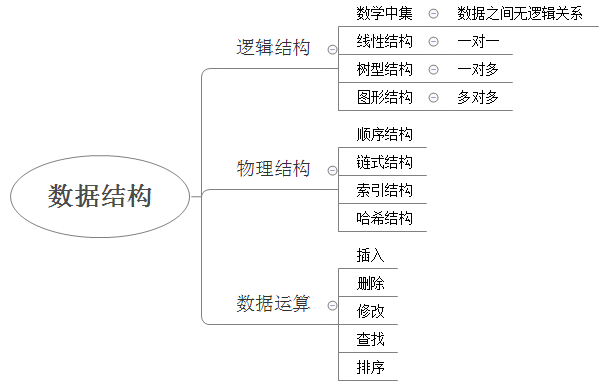

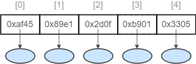


数据的逻辑结构指反映数据元素之间的逻辑关系，而与他们在计算机中的存储位置无关：

* 集合（数学中集合的概念）：数据结构中的元素之间除了“同属一个集合” 的相互关系外，别无其他关系；
* 线性结构：数据结构中的元素存在一对一的相互关系；
* 树形结构：数据结构中的元素存在一对多的相互关系；
* 图形结构：数据结构中的元素存在多对多的相互关系。

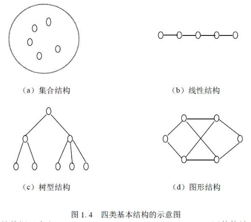

数据的物理结构/存储结构：是描述数据具体在内存中的存储（如：顺序结构、链式结构、索引结构、哈希结构）等，一种数据逻辑结构可表示成一种或多种物理存储结构。

数据结构是一门完整并且复杂的课程，那么我们今天只是简单的讨论常见的几种数据结构，让我们对数据结构与算法有一个初步的了解。

## 1.栈

```java
1.特点:
  先进后出
2.好比:手枪压子弹      
```

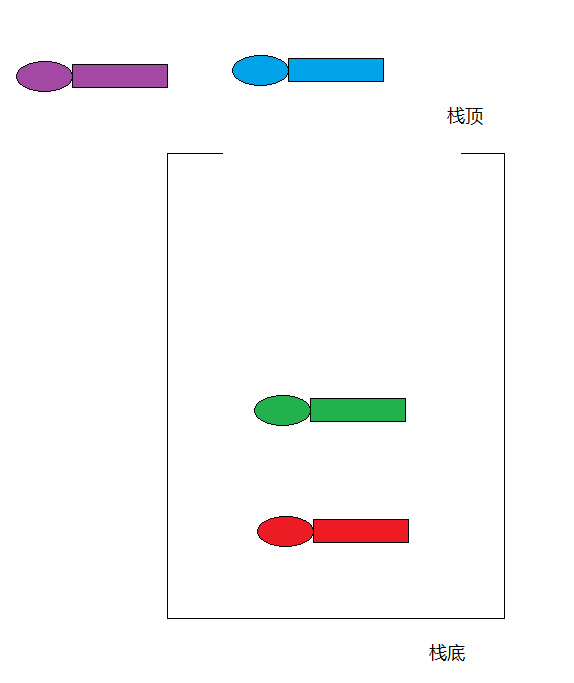

## 2.队列

```java
1.特点:先进先出
2.好比:过安检    
```

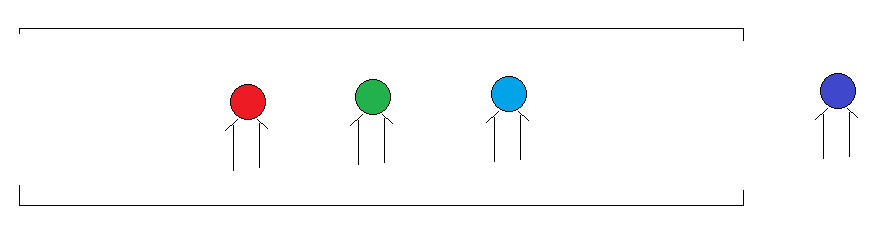

## 3.数组

```java
1.特点:查询快,增删慢
2.查询快:因为有索引,我们可以直接通过索引操作元素
  增删慢:因为数组定长
        a.添加元素:创建新数组,将老数组中的元素复制到新数组中去,在最后添加新元素;要是从中间插入就更麻烦了
                  插入完新元素,后面的元素都要往后移动
        b.删除元素:创建新数组,将老数组中的元素复制到新数组中去,被删除的元素就不复制了;如果要是从之间删除
                  被删除的元素后面的元素都要往前移动
```

## 4.链表

```java
1.在集合中涉及到了两种链表
2.单向链表
  a.节点:一个节点分为两部分
    第一部分:数据域(存数据)
    第二部分:指针域(保存下一个节点地址)
  b.特点:前面节点记录后面节点的地址,但是后面节点地址不记录前面节点地址
      
3.双向链表:
  a.节点:一个节点分为三部分
    第一部分:指针域(保存上一个节点地址)
    第二部分:数据域(保存的数据)
    第三部分:指针域(保存下一个节点地址)
  b.特点:
    前面节点记录后面节点地址,后面节点也记录前面节点地址
        
4.链表结构特点:查询慢,增删快        
```

### 4.1单向链表

```java
a.节点:一个节点分为两部分
  第一部分:数据域(存数据)
  第二部分:指针域(保存下一个节点地址)
b.特点:前面节点记录后面节点的地址,但是后面节点地址不记录前面节点地址
```

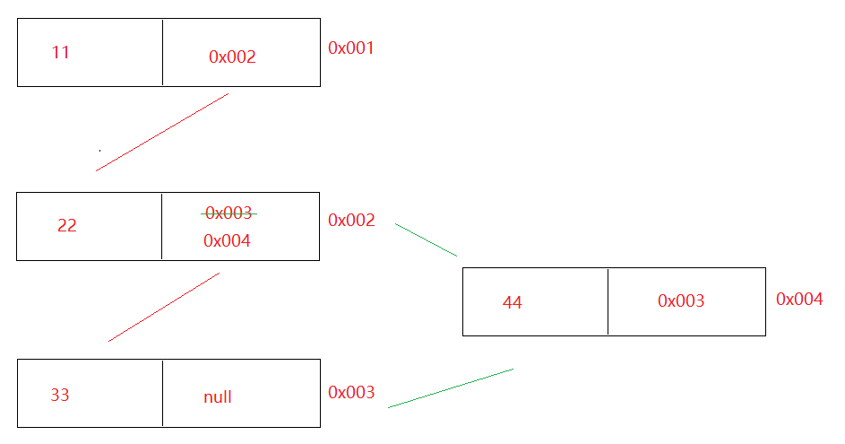

### 4.2双向链表

```java
  a.节点:一个节点分为三部分
    第一部分:指针域(保存上一个节点地址)
    第二部分:数据域(保存的数据)
    第三部分:指针域(保存下一个节点地址)
  b.特点:
    前面节点记录后面节点地址,后面节点也记录前面节点地址
```

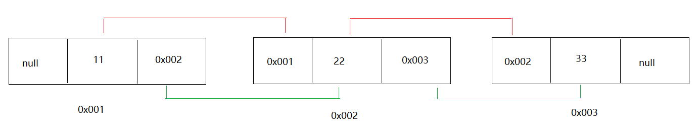

# 第五章.List接口

```java
1.概述:是Collection接口的子接口
2.常见的实现类:
  ArrayList LinkedList Vector
```

# 第六章.List集合下的实现类

## 1.ArrayList集合

```java
1.概述:ArrayList是List接口的实现类
2.特点:
  a.元素有序-> 按照什么顺序存的,就按照什么顺序取
  b.元素可重复
  c.有索引-> 可以利用索引去操作元素
  d.线程不安全
      
3.数据结构:数组       
4.常用方法:
  boolean add(E e)  -> 将元素添加到集合中->尾部(add方法一定能添加成功的,所以我们不用boolean接收返回值)
  void add(int index, E element) ->在指定索引位置上添加元素
  boolean remove(Object o) ->删除指定的元素,删除成功为true,失败为false
  E remove(int index) -> 删除指定索引位置上的元素,返回的是被删除的那个元素
  E set(int index, E element) -> 将指定索引位置上的元素,修改成后面的element元素
  E get(int index) -> 根据索引获取元素
  int size()  -> 获取集合元素个数
```

### 1.1.ArrayList集合使用

```java
public class Demo01ArrayList {
    public static void main(String[] args) {
        ArrayList<String> list = new ArrayList<>();
        //boolean add(E e)  -> 将元素添加到集合中->尾部(add方法一定能添加成功的,所以我们不用boolean接收返回值)
        list.add("铁胆火车侠");
        list.add("喜洋洋");
        list.add("火影忍者");
        list.add("灌篮高手");
        list.add("网球王子");
        System.out.println(list);
        //void add(int index, E element) ->在指定索引位置上添加元素
        list.add(2,"涛哥");
        System.out.println(list);
        //boolean remove(Object o) ->删除指定的元素,删除成功为true,失败为false
        list.remove("涛哥");
        System.out.println(list);
        //E remove(int index) -> 删除指定索引位置上的元素,返回的是被删除的那个元素
        String element = list.remove(0);
        System.out.println(element);
        System.out.println(list);
        //E set(int index, E element) -> 将指定索引位置上的元素,修改成后面的element元素
        String element2 = list.set(0, "金莲");
        System.out.println(element2);
        System.out.println(list);
        //E get(int index) -> 根据索引获取元素
        System.out.println(list.get(0));
        //int size()  -> 获取集合元素个数
        System.out.println(list.size());
    }
}

```

```java
public class Demo02ArrayList {
    public static void main(String[] args) {
        ArrayList<String> list = new ArrayList<>();
        list.add("铁胆火车侠");
        list.add("喜洋洋");
        list.add("火影忍者");
        list.add("灌篮高手");
        list.add("网球王子");

        Iterator<String> iterator = list.iterator();
        while(iterator.hasNext()){
            System.out.println(iterator.next());
        }

        System.out.println("=====================");

        for (int i = 0;i<list.size();i++){
            System.out.println(list.get(i));
        }

        System.out.println("=====================");
        /*
           遍历带有索引集合的快捷键
             集合名.fori
         */
        for (int i = 0; i < list.size(); i++) {
            System.out.println(list.get(i));
        }

    }
}

```

>  ```java
>  public class Demo03ArrayList {
>      public static void main(String[] args) {
>          ArrayList<Integer> list = new ArrayList<>();
>          list.add(2);
>          System.out.println(list);
>  
>          /*
>            需求:删除2
>            remove(Object o) -> 直接删除指定元素
>            remove(int index) -> 删除指定索引位置上的元素
>  
>            如果remove中直接传递整数,默认调用按照指定索引删除元素的remove
>            但是此时list中没有2索引,所以越界
>  
>            解决:我们可以将2包装成包装类,变成包装类之后,其父类就是Object了,
>  
>  
>           */
>          //list.remove(2);
>          list.remove(Integer.valueOf(2));
>          System.out.println(list);
>      }
>  }
>  
>  ```

### 1.2.底层源码分析

```java
1.ArrayList构造方法:
  a.ArrayList() 构造一个初始容量为十的空列表
  b.ArrayList(int initialCapacity) 构造具有指定初始容量的空列表 
      
2.ArrayList源码总结:
  a.不是一new底层就会创建初始容量为10的空列表,而是第一次add的时候才会创建初始化容量为10的空列表
  b.ArrayList底层是数组,那么为啥还说集合长度可变呢?
    ArrayList底层会自动扩容-> Arrays.copyOf    
  c.扩容多少倍?
    1.5倍
```

```java
ArrayList() 构造一个初始容量为十的空列表
=========================================
private static final Object[] DEFAULTCAPACITY_EMPTY_ELEMENTDATA = {};
Object[] elementData; ->ArrayList底层的那个数组
    
public ArrayList() {
    this.elementData = DEFAULTCAPACITY_EMPTY_ELEMENTDATA;
}   

=========================================
list.add("a");

public boolean add(E e) {
    modCount++;
    add(e, elementData, size);// e->要存的元素  elementData->集合数组,长度开始为0,size->0
    return true;
}

private void add(E e->元素, Object[] elementData->集合数组, int s->0) {
    if (s == elementData.length)
        elementData = grow();
    elementData[s] = e;
    size = s + 1;
}

private Object[] grow() {
    return grow(size + 1);
}

private Object[] grow(int minCapacity->1) {
    int oldCapacity = elementData.length;//0
    if (oldCapacity > 0 || elementData != DEFAULTCAPACITY_EMPTY_ELEMENTDATA) {
        int newCapacity = ArraysSupport.newLength(oldCapacity,
                minCapacity - oldCapacity, /* minimum growth */
                oldCapacity >> 1           /* preferred growth */);
        return elementData = Arrays.copyOf(elementData, newCapacity);
    } else {
        return elementData = new Object[Math.max(DEFAULT_CAPACITY->10, minCapacity->1)];
    }
}
==========================================
假设ArrayList中存了第11个元素,会自动扩容-> Arrays.copyOf

private Object[] grow(int minCapacity) {//11
    int oldCapacity = elementData.length;//10
    if (oldCapacity > 0 || elementData != DEFAULTCAPACITY_EMPTY_ELEMENTDATA) {
        int newCapacity(15) = ArraysSupport.newLength(oldCapacity->10,
                minCapacity - oldCapacity->1, /* minimum growth */
                oldCapacity >> 1 ->5          /* preferred growth */);
        return elementData = Arrays.copyOf(elementData, newCapacity);
    } else {
        return elementData = new Object[Math.max(DEFAULT_CAPACITY, minCapacity)];
    }
}    


public static int newLength(int oldLength->10, int minGrowth->1, int prefGrowth->5) {
        // preconditions not checked because of inlining
        // assert oldLength >= 0
        // assert minGrowth > 0

        int prefLength = oldLength + Math.max(minGrowth, prefGrowth); // 15
        if (0 < prefLength && prefLength <= SOFT_MAX_ARRAY_LENGTH) {
            return prefLength;
        } else {
            // put code cold in a separate method
            return hugeLength(oldLength, minGrowth);
        }
}
```

```java
 ArrayList(int initialCapacity) 构造具有指定初始容量的空列表 
```

```java
ArrayList<String> list = new ArrayList<>(5);
==============================================
public ArrayList(int initialCapacity->5) {
    if (initialCapacity > 0) {
        this.elementData = new Object[initialCapacity];//直接创建长度为5的数组
    } else if (initialCapacity == 0) {
        this.elementData = EMPTY_ELEMENTDATA;
    } else {
        throw new IllegalArgumentException("Illegal Capacity: "+
                                           initialCapacity);
    }
}    
```

> ArrayList<String>  list = new  ArrayList<String>() -> 现在我们想用都是new
>
> 但是将来开发不会想使用就new集合,都是调用一个方法,查询出很多数据来,此方法返回一个集合,自动将查询出来的数据放到集合中,我们想在页面上展示数据,遍历集合
>
> 而且将来调用方法,返回的集合类型,一般都是接口类型
>
> List<泛型> list = 对象.查询方法()

# 第七章.LinkedList集合

```java
1.概述:LinkedList是List接口的实现类
2.特点:
  a.元素有序
  b.元素可重复
  c.有索引 -> 这里说的有索引仅仅指的是有操作索引的方法,不代表本质上具有索引
  d.线程不安全
      
3.数据结构:双向链表      
    
4.方法:有大量直接操作首尾元素的方法
  - public void addFirst(E e):将指定元素插入此列表的开头。
  - public void addLast(E e):将指定元素添加到此列表的结尾。
  - public E getFirst():返回此列表的第一个元素。
  - public E getLast():返回此列表的最后一个元素。
  - public E removeFirst():移除并返回此列表的第一个元素。
  - public E removeLast():移除并返回此列表的最后一个元素。
  - public E pop():从此列表所表示的堆栈处弹出一个元素。
  - public void push(E e):将元素推入此列表所表示的堆栈。
  - public boolean isEmpty()：如果列表没有元素，则返回true。
```

```java
public class Demo05LinkedList {
    public static void main(String[] args) {
        LinkedList<String> linkedList = new LinkedList<>();
        linkedList.add("吕布");
        linkedList.add("刘备");
        linkedList.add("关羽");
        linkedList.add("张飞");
        linkedList.add("貂蝉");
        System.out.println(linkedList);

        linkedList.addFirst("孙尚香");
        System.out.println(linkedList);

        linkedList.addLast("董卓");
        System.out.println(linkedList);

        System.out.println(linkedList.getFirst());
        System.out.println(linkedList.getLast());

        linkedList.removeFirst();
        System.out.println(linkedList);

        linkedList.removeLast();
        System.out.println(linkedList);

        System.out.println("======================");

        Iterator<String> iterator = linkedList.iterator();
        while(iterator.hasNext()){
            System.out.println(iterator.next());
        }

        System.out.println("=======================");
        for (int i = 0; i < linkedList.size(); i++) {
            System.out.println(linkedList.get(i));
        }
    }
}

```

```java
public E pop():从此列表所表示的堆栈处弹出一个元素。
public void push(E e):将元素推入此列表所表示的堆栈。
```

```java
public class Demo06LinkedList {
    public static void main(String[] args) {
        LinkedList<String> linkedList = new LinkedList<>();
        linkedList.add("吕布");
        linkedList.add("刘备");
        linkedList.add("关羽");
        linkedList.add("张飞");
        linkedList.add("貂蝉");

        //public E pop():从此列表所表示的堆栈处弹出一个元素。
        linkedList.pop();
        System.out.println(linkedList);
        //public void push(E e):将元素推入此列表所表示的堆栈。
        linkedList.push("涛哥");
        System.out.println(linkedList);
    }
}

```

## 1.1 LinkedList底层成员解释说明

```java
1.LinkedList底层成员
  transient int size = 0;  元素个数
  transient Node<E> first; 第一个节点对象
  transient Node<E> last;  最后一个节点对象
  
2.Node代表的是节点对象
   private static class Node<E> {
        E item;//节点上的元素
        Node<E> next;//记录着下一个节点地址
        Node<E> prev;//记录着上一个节点地址

        Node(Node<E> prev, E element, Node<E> next) {
            this.item = element;
            this.next = next;
            this.prev = prev;
        }
    }
```

## 1.2 LinkedList中add方法源码分析

```java
LinkedList<String> list = new LinkedList<>();
list.add("a");
list.add("b");    

void linkLast(E e) {
        final Node<E> l = last;
        final Node<E> newNode = new Node<>(l, e, null);
        last = newNode;
        if (l == null)
            first = newNode;
        else
            l.next = newNode;
        size++;
        modCount++;
}
```

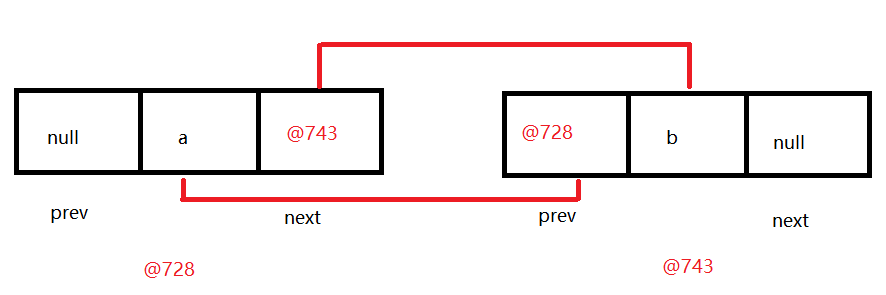

## 1.3.LinkedList中get方法源码分析

```java
public E get(int index) {
    checkElementIndex(index);
    return node(index).item;
} 

Node<E> node(int index) {
    // assert isElementIndex(index);

    if (index < (size >> 1)) {
        Node<E> x = first;
        for (int i = 0; i < index; i++)
            x = x.next;
        return x;
    } else {
        Node<E> x = last;
        for (int i = size - 1; i > index; i--)
            x = x.prev;
        return x;
    }
}
```

```java
index < (size >> 1)采用二分思想，先将index与长度size的一半比较，如果index<size/2，就只从位置0往后遍历到位置index处，而如果index>size/2，就只从位置size往前遍历到位置index处。这样可以减少一部分不必要的遍历
```

# 第八章.增强for

## 1.基本使用

```java
1.作用:
  遍历集合或者数组
2.格式:
  for(元素类型 变量名:要遍历的集合名或者数组名){
      变量名就是代表的每一个元素
  }

3.快捷键:集合名或者数组名.for
```

```java
public class Demo01ForEach {
    public static void main(String[] args) {
        ArrayList<String> list = new ArrayList<>();
        list.add("张三");
        list.add("李四");
        list.add("王五");
        list.add("赵六");
        for (String s : list) {
            System.out.println(s);
        }

        System.out.println("=====================");

        int[] arr = {1,2,3,4,5};
        for (int i : arr) {
            System.out.println(i);
        }
    }
}

```

## 2.注意

```java
1.增强for遍历集合时,底层实现原理为迭代器
2.增强for遍历数组时,底层实现原理为普通for
```

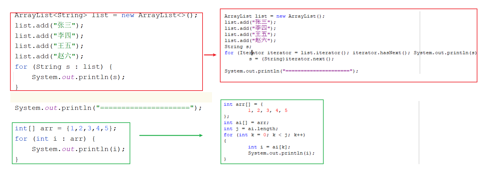

> 所以不管是用迭代器还是使用增强for,在遍历集合的过程中都不要随意修改集合长度,否则会出现并发修改异常