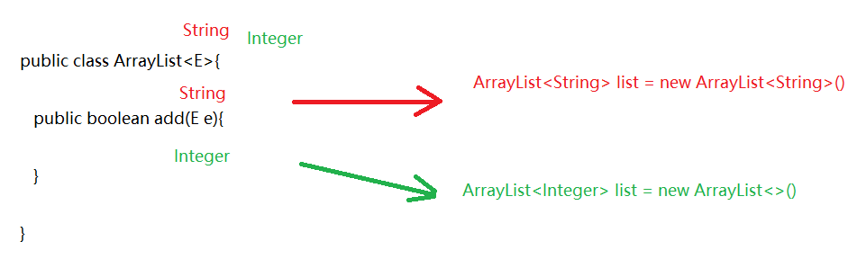
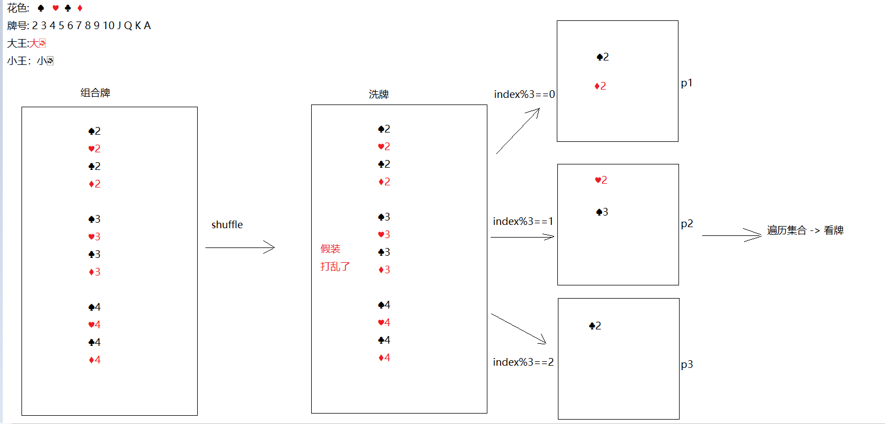
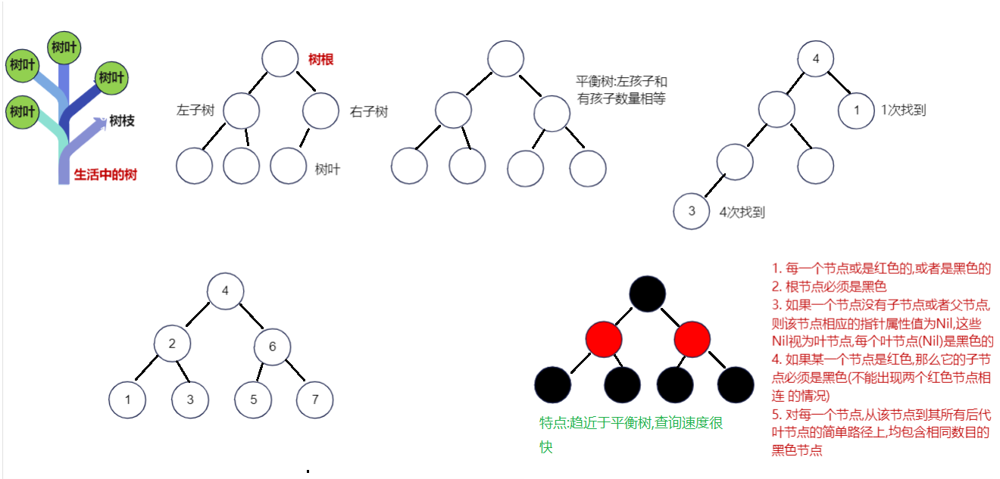
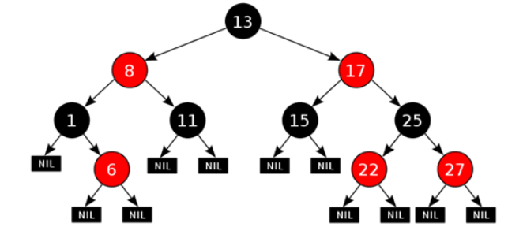
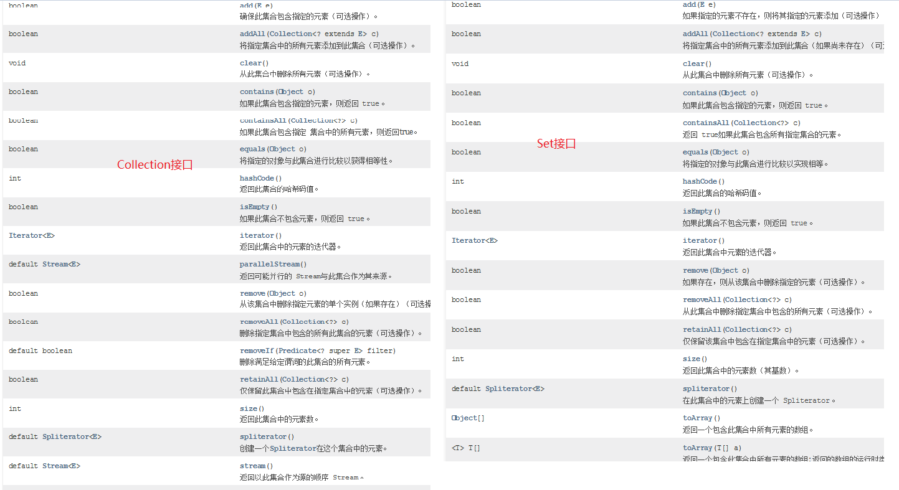

# 模块19.集合

```java
模块18回顾:
  1.Collection集合:单列集合的顶级接口
    a.add  addAll  clear size  isEmpty  remove  toArray  contains
  2.迭代器:Iterator
    a.获取:iterator方法
    b.方法:
      hasNext()
      next()
    c.并发修改异常:在迭代集合的时候,不能随意修改集合长度
      原因:调用add,只给实际操作次数+1.后面调用next的时候,没有给预期操作次数重新赋值,导致预期操作次数和实际操作次数不相等了
          
   3.数据结构:
     栈:先进后出
     队列:先进先出
     数组:查询快,增删慢
     链表:查询慢,增删快
         
   4.ArrayList
     a.特点:
       元素有序,有索引,元素可重复,线程不安全
     b.数据结构:
       数组
     c.方法:
       add(元素)直接在最后添加元素
       add(索引,元素)在指定索引位置上添加元素
       remove(元素)删除指定元素
       remove(索引)按照指定索引删除元素
       size()获取元素个数
       get(索引)根据索引获取元素
       set(索引,元素)将指定索引位置上的元素修改成我们指定的元素
     d.利用无参构造创建集合对象,第一次add时,会创建一个长度为10的空数组
       超出范围,自动扩容->Arrays.copyOf
       扩容1.5倍
           
   5.LinkedList
     a.特点: 元素有序 有索引(java提供了按照索引操作元素的方法,并不代表本质上拥有索引),元素可重复,线程不安全
         
     b.数据结构:双向链表
     c.方法:有大量直接操作收尾元素的方法
         
   6.增强for:
     a.格式:
       for(元素类型 变量名:集合名或者数组名){
           变量就代表每一个元素
       }

     b.原理:
       遍历集合时,原理为迭代器
       遍历数组时,原理为普通for
           
模块19重点:
  1.会Collections集合工具类的常用方法
  2.会使用泛型
  3.知道HashSet和LinkedHashSet的特点以及使用
  4.知道HashSet将元素去重复的过程       
```

# 第一章.Collections集合工具类

```java
1.概述:集合工具类
2.特点:
  a.构造私有
  b.方法都是静态的
      
3.使用:类名直接调用
    
4.方法:
  static <T> boolean addAll(Collection<? super T> c, T... elements)->批量添加元素 
  static void shuffle(List<?> list) ->将集合中的元素顺序打乱
  static <T> void sort(List<T> list) ->将集合中的元素按照默认规则排序
  static <T> void sort(List<T> list, Comparator<? super T> c)->将集合中的元素按照指定规则排序 
```

```java
public class Demo01Collections {
    public static void main(String[] args) {
        ArrayList<String> list = new ArrayList<>();
        //static <T> boolean addAll(Collection<? super T> c, T... elements)->批量添加元素
        Collections.addAll(list,"张三","李四","王五","赵六","田七","朱八");
        System.out.println(list);
        //static void shuffle(List<?> list) ->将集合中的元素顺序打乱
        Collections.shuffle(list);
        System.out.println(list);
        //static <T> void sort(List<T> list) ->将集合中的元素按照默认规则排序-> ASCII码表
        ArrayList<String> list1 = new ArrayList<>();
        list1.add("c.举头望明月");
        list1.add("a.床前明月光");
        list1.add("d.低头思故乡");
        list1.add("b.疑是地上霜");
        Collections.sort(list1);
        System.out.println(list1);
    }
}

```

```java
1.方法:static <T> void sort(List<T> list, Comparator<? super T> c)->将集合中的元素按照指定规则排序
    
2.Comparator比较器
  a.方法:
    int compare(T o1,T o2)
                o1-o2 -> 升序
                o2-o1 -> 降序    
```

```java
public class Person {
    private String name;
    private Integer age;

    public Person() {
    }

    public Person(String name, Integer age) {
        this.name = name;
        this.age = age;
    }

    public String getName() {
        return name;
    }

    public void setName(String name) {
        this.name = name;
    }

    public Integer getAge() {
        return age;
    }

    public void setAge(Integer age) {
        this.age = age;
    }

    @Override
    public String toString() {
        return "Person{" +
                "name='" + name + '\'' +
                ", age=" + age +
                '}';
    }
}

```

```java
public class Demo02Collections {
    public static void main(String[] args) {
        ArrayList<Person> list = new ArrayList<>();
        list.add(new Person("柳岩",18));
        list.add(new Person("涛哥",16));
        list.add(new Person("金莲",20));

        Collections.sort(list, new Comparator<Person>() {
            @Override
            public int compare(Person o1, Person o2) {
                return o1.getAge()-o2.getAge();
            }
        });

        System.out.println(list);
    }
}

```

```java
1.接口:Comparable接口
2.方法: int compareTo(T o) -> this-o (升序)   o-this(降序)
```

```java
public class Student implements Comparable<Student>{
    private String name;
    private Integer score;

    public Student() {
    }

    public Student(String name, Integer score) {
        this.name = name;
        this.score = score;
    }

    public String getName() {
        return name;
    }

    public void setName(String name) {
        this.name = name;
    }

    public Integer getScore() {
        return score;
    }

    public void setScore(Integer score) {
        this.score = score;
    }

    @Override
    public String toString() {
        return "Student{" +
                "name='" + name + '\'' +
                ", score=" + score +
                '}';
    }

    @Override
    public int compareTo(Student o) {
        return this.getScore()-o.getScore();
    }
}

```

```java
public class Demo03Collections {
    public static void main(String[] args) {
        ArrayList<Student> list = new ArrayList<>();
        list.add(new Student("涛哥",100));
        list.add(new Student("柳岩",150));
        list.add(new Student("三上",80));
        Collections.sort(list);
        System.out.println(list);
    }
}

```

> ```java
> Arrays中的静态方法:
>   static <T> List<T> asList(T...a) -> 直接指定元素,转存到list集合中
> ```
>
> ```java
> public class Demo04Collections {
>     public static void main(String[] args) {
>         List<String> list = Arrays.asList("张三", "李四", "王五");
>         System.out.println(list);
>     }
> }
> ```

# 第二章.泛型

```java
1.泛型:<>
2.作用:
  统一数据类型,防止将来的数据转换异常
3.注意:
  a.泛型中的类型必须是引用类型
  b.如果泛型不写,默认类型为Object    
```

## 1.为什么要使用泛型

```java
1.从使用层面上来说:
  统一数据类型,防止将来的数据类型转换异常
2.从定义层面上来看:
  定义带泛型的类,方法等,将来使用的时候给泛型确定什么类型,泛型就会变成什么类型,凡是涉及到泛型的都会变成确定的类型,代码更灵活
```

```java
public class Demo01Genericity {
    public static void main(String[] args) {
        ArrayList list = new ArrayList();
        list.add("1");
        list.add(1);
        list.add("abc");
        list.add(2.5);
        list.add(true);

        //获取元素中为String类型的字符串长度
        for (Object o : list) {
            String s = (String) o;
            System.out.println(s.length());//ClassCastException
           
        }
    }
}
```



## 2.泛型的定义

### 2.1含有泛型的类

```java
1.定义:
   public class 类名<E>{
       
   }

2.什么时候确定类型
  new对象的时候确定类型  
```

```java
public class MyArrayList <E>{
    //定义一个数组,充当ArrayList底层的数组,长度直接规定为10
    Object[] obj = new Object[10];
    //定义size,代表集合元素个数
    int size;

    /**
     * 定义一个add方法,参数类型需要和泛型类型保持一致
     *
     * 数据类型为E  变量名随便取
     */
    public boolean add(E e){
        obj[size] = e;
        size++;
        return true;
    }

    /**
     * 定义一个get方法,根据索引获取元素
     */
    public E get(int index){
        return (E) obj[index];
    }

    @Override
    public String toString() {
        return Arrays.toString(obj);
    }
}
```

```java
public class Demo02Genericity {
    public static void main(String[] args) {
        MyArrayList<String> list1 = new MyArrayList<>();
        list1.add("aaa");
        list1.add("bbb");
        System.out.println(list1);//直接输出对象名,默认调用toString

        System.out.println("===========");

        MyArrayList<Integer> list2 = new MyArrayList<>();
        list2.add(1);
        list2.add(2);
        Integer element = list2.get(0);
        System.out.println(element);
        System.out.println(list2);
    }
}

```

### 2.2含有泛型的方法

```java
1.格式:
  修饰符 <E> 返回值类型 方法名(E e)
      
2.什么时候确定类型
  调用的时候确定类型
```

```java
public class ListUtils {
    //定义一个静态方法addAll,添加多个集合的元素
    public static <E> void addAll(ArrayList<E> list,E...e){
        for (E element : e) {
            list.add(element);
        }
    }

}
```

```java
public class Demo03Genericity {
    public static void main(String[] args) {
        ArrayList<String> list1 = new ArrayList<>();
        ListUtils.addAll(list1,"a","b","c");
        System.out.println(list1);

        System.out.println("================");

        ArrayList<Integer> list2 = new ArrayList<>();
        ListUtils.addAll(list2,1,2,3,4,5);
        System.out.println(list2);
    }
}

```

### 2.3含有泛型的接口

```java
1.格式:
  public interface 接口名<E>{
      
  }
2.什么时候确定类型:
  a.在实现类的时候还没有确定类型,只能在new实现类的时候确定类型了 ->比如 ArrayList
  b.在实现类的时候直接确定类型了 -> 比如Scanner    
```

```java
public interface MyList <E>{
    public boolean add(E e);
}
```

```java
public class MyArrayList1<E> implements MyList<E>{
    //定义一个数组,充当ArrayList底层的数组,长度直接规定为10
    Object[] obj = new Object[10];
    //定义size,代表集合元素个数
    int size;

    /**
     * 定义一个add方法,参数类型需要和泛型类型保持一致
     *
     * 数据类型为E  变量名随便取
     */
    public boolean add(E e){
        obj[size] = e;
        size++;
        return true;
    }

    /**
     * 定义一个get方法,根据索引获取元素
     */
    public E get(int index){
        return (E) obj[index];
    }

    @Override
    public String toString() {
        return Arrays.toString(obj);
    }
}

```

```java
public class Demo04Genericity {
    public static void main(String[] args) {
        MyArrayList1<String> list1 = new MyArrayList1<>();
        list1.add("张三");
        list1.add("李四");
        System.out.println(list1.get(0));

    }
}
```

```java
public interface MyIterator <E>{
    E next();
}

public class MyScanner implements MyIterator<String>{
    @Override
    public String next() {
        return "涛哥和金莲的故事";
    }
}

```

```java
public class Demo05Genericity {
    public static void main(String[] args) {
        MyScanner myScanner = new MyScanner();
        String result = myScanner.next();
        System.out.println("result = " + result);
    }
}

```

## 3.泛型的高级使用

### 3.1 泛型通配符 ?

```java
public class Demo01Genericity {
    public static void main(String[] args) {
        ArrayList<String> list1 = new ArrayList<>();
        list1.add("张三");
        list1.add("李四");

        ArrayList<Integer> list2 = new ArrayList<>();
        list2.add(1);
        list2.add(2);
        
        method(list1);
        method(list2);
    }
    
    public static void method(ArrayList<?> list){
        for (Object o : list) {
            System.out.println(o);
        }
    }

}
```

### 3.2 泛型的上限下限

```java
1.作用:可以规定泛型的范围
2.上限:
  a.格式:<? extends 类型>
  b.含义:?只能接收extends后面的本类类型以及子类类型    
3.下限:
  a.格式:<? super 类型>
  b.含义:?只能接收super后面的本类类型以及父类类型    
```

```java
/**
 * Integer -> Number -> Object
 * String -> Object
 */
public class Demo02Genericity {
    public static void main(String[] args) {
        ArrayList<Integer> list1 = new ArrayList<>();
        ArrayList<String> list2 = new ArrayList<>();
        ArrayList<Number> list3 = new ArrayList<>();
        ArrayList<Object> list4 = new ArrayList<>();

        get1(list1);
        //get1(list2);错误
        get1(list3);
        //get1(list4);错误

        System.out.println("=================");

        //get2(list1);错误
        //get2(list2);错误
        get2(list3);
        get2(list4);
    }

    //上限  ?只能接收extends后面的本类类型以及子类类型
    public static void get1(Collection<? extends Number> collection){

    }

    //下限  ?只能接收super后面的本类类型以及父类类型
    public static void get2(Collection<? super Number> collection){

    }
}

```

> 应用场景:
>
>  1.如果我们在定义类,方法,接口的时候,如果类型不确定,我们可以考虑定义含有泛型的类,方法,接口
>
>  2.如果类型不确定,但是能知道以后只能传递某个类的继承体系中的子类或者父类,就可以使用泛型的通配符

# 第三章.斗地主案例(扩展案例)

## 3.1 案例介绍

按照斗地主的规则，完成洗牌发牌的动作。
具体规则：

使用54张牌打乱顺序,三个玩家参与游戏，三人交替摸牌，每人17张牌，最后三张留作底牌。

## 3.2 案例分析

- 准备牌：

  牌可以设计为一个ArrayList<String>,每个字符串为一张牌。
  每张牌由花色数字两部分组成，我们可以使用花色集合与数字集合嵌套迭代完成每张牌的组装。
  牌由Collections类的shuffle方法进行随机排序。

- 发牌

  将每个人以及底牌设计为ArrayList<String>,将最后3张牌直接存放于底牌，剩余牌通过对3取模依次发牌。

- 看牌

  直接打印每个集合。

  

## 3.3 代码实现

```java
1.创建ArrayList集合-> color -> 专门存花色
2.创建一个ArrayList集合 -> number -> 专门存牌号
3.创建一个ArrayList集合 -> poker -> 专门存花色和牌号组合好的牌面
4.打乱poker
5.创建4个ArrayList集合,分别代表三个玩家,以及存储一个底牌
6.如果index为最后三张,往dipai集合中存
7.如果index%3==0 给p1
8.如果index%3==1 给p2
9.如果index%3==2 给p3
10.遍历看牌
```

```java
public class Poker {
    public static void main(String[] args) {
        //1.创建ArrayList集合-> color -> 专门存花色
        ArrayList<String> color = new ArrayList<>();
        //2.创建一个ArrayList集合 -> number -> 专门存牌号
        ArrayList<String> number = new ArrayList<>();
        //3.创建一个ArrayList集合 -> poker -> 专门存花色和牌号组合好的牌面
        ArrayList<String> poker = new ArrayList<>();

        color.add("♠");
        color.add("♥");
        color.add("♣");
        color.add("♦");

        for (int i = 2; i <= 10; i++) {
            number.add(i + "");
        }

        number.add("J");
        number.add("Q");
        number.add("K");
        number.add("A");

        //System.out.println(color);
        //System.out.println(number);

        for (String num : number) {
            for (String huaSe : color) {
                String pokerNumber = huaSe + num;
                poker.add(pokerNumber);
            }
        }

        poker.add("😊");
        poker.add("☺");
        //System.out.println(poker);

        //4.打乱poker
        Collections.shuffle(poker);
        //System.out.println(poker);
        //5.创建4个ArrayList集合,分别代表三个玩家,以及存储一个底牌
        ArrayList<String> p1 = new ArrayList<>();
        ArrayList<String> p2 = new ArrayList<>();
        ArrayList<String> p3 = new ArrayList<>();
        ArrayList<String> dipai = new ArrayList<>();
        for (int i = 0; i < poker.size(); i++) {
            String s = poker.get(i);
            //6.如果index为最后三张,往dipai集合中存
            if (i >= 51) {
                dipai.add(s);
                //7.如果index%3==0 给p1
            } else if (i % 3 == 0) {
                p1.add(s);
                //8.如果index%3==1 给p2
            } else if (i % 3 == 1) {
                p2.add(s);
                //9.如果index%3==2 给p3
            }else if (i%3==2){
                p3.add(s);
            }
        }

        //10.遍历看牌
        System.out.println("涛哥:"+p1);
        System.out.println("三上:"+p2);
        System.out.println("金莲:"+p3);
        System.out.println("底牌:"+dipai);
    }
}
```

```java
public class Poker1 {
    public static void main(String[] args) {
        //1.创建数组-> color -> 专门存花色
        String[] color = "♠-♥-♣-♦".split("-");
        //2.创建数组 -> number -> 专门存牌号
        String[] number = "2-3-4-5-6-7-8-9-10-J-Q-K-A".split("-");
        //3.创建一个ArrayList集合 -> poker -> 专门存花色和牌号组合好的牌面
        ArrayList<String> poker = new ArrayList<>();

        //System.out.println(color);
        //System.out.println(number);

        for (String num : number) {
            for (String huaSe : color) {
                String pokerNumber = huaSe + num;
                poker.add(pokerNumber);
            }
        }

        poker.add("😊");
        poker.add("☺");
        //System.out.println(poker);

        //4.打乱poker
        Collections.shuffle(poker);
        //System.out.println(poker);
        //5.创建4个ArrayList集合,分别代表三个玩家,以及存储一个底牌
        ArrayList<String> p1 = new ArrayList<>();
        ArrayList<String> p2 = new ArrayList<>();
        ArrayList<String> p3 = new ArrayList<>();
        ArrayList<String> dipai = new ArrayList<>();
        for (int i = 0; i < poker.size(); i++) {
            String s = poker.get(i);
            //6.如果index为最后三张,往dipai集合中存
            if (i >= 51) {
                dipai.add(s);
                //7.如果index%3==0 给p1
            } else if (i % 3 == 0) {
                p1.add(s);
                //8.如果index%3==1 给p2
            } else if (i % 3 == 1) {
                p2.add(s);
                //9.如果index%3==2 给p3
            }else if (i%3==2){
                p3.add(s);
            }
        }

        //10.遍历看牌
        System.out.println("涛哥:"+p1);
        System.out.println("三上:"+p2);
        System.out.println("金莲:"+p3);
        System.out.println("底牌:"+dipai);
    }
}

```

# 第四章.红黑树(了解)

```java
集合加入红黑树的目的:提高查询效率
HashSet集合:
  数据结构:哈希表
      jdk8之前:哈希表 = 数组+链表
      jdk8之后:哈希表 = 数组+链表+红黑树 ->为的是查询效率    
```



```java
1. 每一个节点或是红色的,或者是黑色的

2. 根节点必须是黑色

3. 如果一个节点没有子节点或者父节点,则该节点相应的指针属性值为Nil,这些Nil视为叶节点,每个叶节点(Nil)是黑色的

4. 如果某一个节点是红色,那么它的子节点必须是黑色(不能出现两个红色节点相连 的情况)

5. 对每一个节点,从该节点到其所有后代叶节点的简单路径上,均包含相同数目的黑色节点
```



https://www.cs.usfca.edu/~galles/visualization/RedBlack

# 第五章.Set集合

```java
1.涛哥总说:Set接口并没有对Collection接口进行功能上的扩充,而且所有的Set集合底层都是依靠Map实现
```



## 1.Set集合介绍

```java
Set和Map密切相关的
Map的遍历需要先变成单列集合,只能变成set集合
```

## 2.HashSet集合的介绍和使用

```java
1.概述:HashSet是Set接口的实现类
2.特点:
  a.元素唯一
  b.元素无序
  c.无索引
  d.线程不安全
3.数据结构:哈希表
  a.jdk8之前:哈希表 = 数组+链表
  b.jdk8之后:哈希表 = 数组+链表+红黑树
            加入红黑树目的:查询快
4.方法:和Collection一样
5.遍历:
  a.增强for
  b.迭代器
```

```java
public class Demo01HashSet {
    public static void main(String[] args) {
        HashSet<String> set = new HashSet<>();
        set.add("张三");
        set.add("李四");
        set.add("王五");
        set.add("赵六");
        set.add("田七");
        set.add("张三");
        System.out.println(set);

        //迭代器
        Iterator<String> iterator = set.iterator();
        while(iterator.hasNext()){
            System.out.println(iterator.next());
        }

        System.out.println("============");

        //增强for
        for (String s : set) {
            System.out.println(s);
        }
    }
}

```

## 3.LinkedHashSet的介绍以及使用

```java
1.概述:LinkedHashSet extends HashSet
2.特点:
  a.元素唯一
  b.元素有序
  c.无索引
  d.线程不安全
3.数据结构:
  哈希表+双向链表
4.使用:和HashSet一样      
```

```java
public class Demo02LinkedHashSet {
    public static void main(String[] args) {
        LinkedHashSet<String> set = new LinkedHashSet<>();
        set.add("张三");
        set.add("李四");
        set.add("王五");
        set.add("赵六");
        set.add("田七");
        set.add("张三");
        System.out.println(set);

        //迭代器
        Iterator<String> iterator = set.iterator();
        while(iterator.hasNext()){
            System.out.println(iterator.next());
        }

        System.out.println("============");

        //增强for
        for (String s : set) {
            System.out.println(s);
        }
    }
}

```

## 4.哈希值

```java
1.概述:是由计算机算出来的一个十进制数,可以看做是对象的地址值
2.获取对象的哈希值,使用的是Object中的方法
  public native int hashCode()
    
3.注意:如果重写了hashCode方法,那计算的就是对象内容的哈希值了
    
4.总结:
  a.哈希值不一样,内容肯定不一样
  b.哈希值一样,内容也有可能不一样    
```

```java
public class Person {
    private String name;
    private Integer age;

    public Person() {
    }

    public Person(String name, Integer age) {
        this.name = name;
        this.age = age;
    }

    public String getName() {
        return name;
    }

    public void setName(String name) {
        this.name = name;
    }

    public Integer getAge() {
        return age;
    }

    public void setAge(Integer age) {
        this.age = age;
    }

    @Override
    public boolean equals(Object o) {
        if (this == o) return true;
        if (o == null || getClass() != o.getClass()) return false;
        Person person = (Person) o;
        return Objects.equals(name, person.name) && Objects.equals(age, person.age);
    }

    @Override
    public int hashCode() {
        return Objects.hash(name, age);
    }
}

```

```java
public class Demo01Hash {
    public static void main(String[] args) {
        Person p1 = new Person("涛哥", 18);
        Person p2 = new Person("涛哥", 18);
        System.out.println(p1);//com.atguigu.f_hash.Person@4eec7777
        System.out.println(p2);//com.atguigu.f_hash.Person@3b07d329

        System.out.println(p1.hashCode());
        System.out.println(p2.hashCode());

        //System.out.println(Integer.toHexString(1324119927));//4eec7777
        //System.out.println(Integer.toHexString(990368553));//3b07d329

        System.out.println("======================");

        String s1 = "abc";
        String s2 = new String("abc");
        System.out.println(s1.hashCode());//96354
        System.out.println(s2.hashCode());//96354

        System.out.println("=========================");

        String s3 = "通话";
        String s4 = "重地";
        System.out.println(s3.hashCode());//1179395
        System.out.println(s4.hashCode());//1179395

    }
}

```

> ```java
> 如果不重写hashCode方法,默认计算对象的哈希值
> 如果重写了hashCode方法,计算的是对象内容的哈希值
> ```

## 5.字符串的哈希值时如何算出来的

```java
String s = "abc"
byte[] value = {97,98,99}    
```

```java
public int hashCode() {
    int h = hash;
    if (h == 0 && !hashIsZero) {
        h = isLatin1() ? StringLatin1.hashCode(value)
                       : StringUTF16.hashCode(value);
        if (h == 0) {
            hashIsZero = true;
        } else {
            hash = h;
        }
    }
    return h;
}
====================================================
StringLatin1.hashCode(value)底层源码,String中的哈希算法
    
public static int hashCode(byte[] value) {
    int h = 0;
    for (byte v : value) {
        h = 31 * h + (v & 0xff);
    }
    return h;
}
```

```java
直接跑到StringLatin1.hashCode(value)底层源码,计算abc的哈希值-> 0xff这个十六进制对应的十进制255
任何数据和255做&运算,都是原值
    
第一圈:
  h = 31*0+97 = 97
第二圈:
  h = 31*97+98 = 3105
第三圈:
  h = 31*3105+99 = 96354
```

```java
问题:在计算哈希值的时候,有一个定值就是31,为啥?
     31是一个质数,31这个数通过大量的计算,统计,认为用31,可以尽量降低内容不一样但是哈希值一样的情况
    
     内容不一样,哈希值一样(哈希冲突,哈希碰撞)
```

## 6.HashSet的存储去重复的过程

```java
1.先计算元素的哈希值(重写hashCode方法),再比较内容(重写equals方法)
2.先比较哈希值,如果哈希值不一样,存
3.如果哈希值一样,再比较内容
  a.如果哈希值一样,内容不一样,存
  b.如果哈希值一样,内容也一样,去重复  
```

```java
public class Test02 {
    public static void main(String[] args) {
        HashSet<String> set = new HashSet<>();
        set.add("abc");
        set.add("通话");
        set.add("重地");
        set.add("abc");
        System.out.println(set);//[通话, 重地, abc]

    }
}

```

## 7.HashSet存储自定义类型如何去重复

```java
public class Person {
    private String name;
    private Integer age;

    public Person() {
    }

    public Person(String name, Integer age) {
        this.name = name;
        this.age = age;
    }

    public String getName() {
        return name;
    }

    public void setName(String name) {
        this.name = name;
    }

    public Integer getAge() {
        return age;
    }

    public void setAge(Integer age) {
        this.age = age;
    }

    @Override
    public boolean equals(Object o) {
        if (this == o) return true;
        if (o == null || getClass() != o.getClass()) return false;
        Person person = (Person) o;
        return Objects.equals(name, person.name) && Objects.equals(age, person.age);
    }

    @Override
    public int hashCode() {
        return Objects.hash(name, age);
    }

    @Override
    public String toString() {
        return "Person{" +
                "name='" + name + '\'' +
                ", age=" + age +
                '}';
    }
}

```

```java
public class Test03 {
    public static void main(String[] args) {
        HashSet<Person> set = new HashSet<>();
        set.add(new Person("涛哥",16));
        set.add(new Person("金莲",24));
        set.add(new Person("涛哥",16));
        System.out.println(set);
    }
}
```

```java
总结:
1.如果HashSet存储自定义类型,如何去重复呢?重写hashCode和equals方法,让HashSet比较属性的哈希值以及属性的内容
2.如果不重写hashCode和equals方法,默认调用的是Object中的,不同的对象,肯定哈希值不一样,equals比较对象的地址值也不一样,所以此时即使对象的属性值一样,也不能去重复    
```
