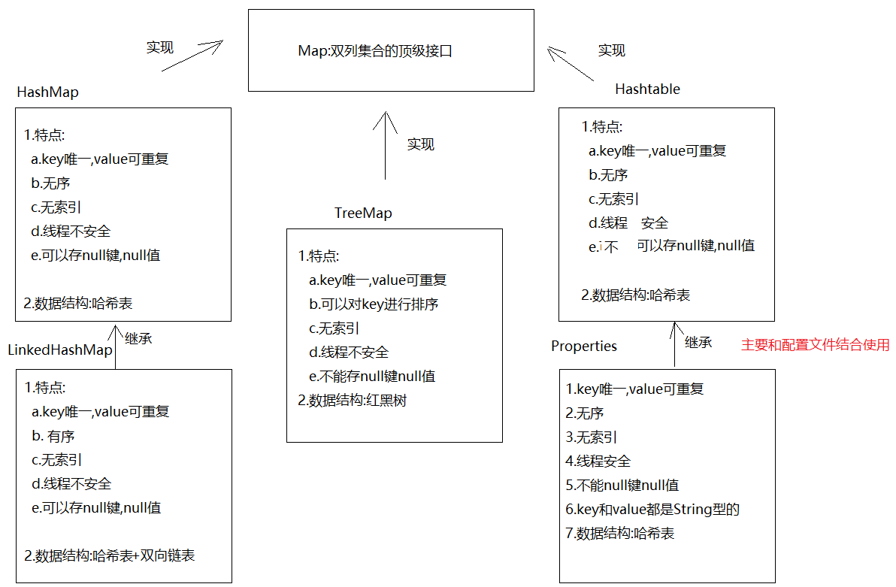
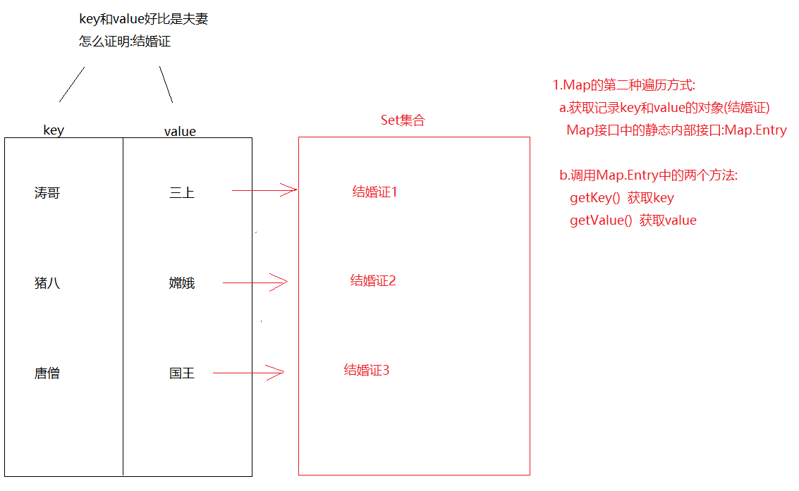
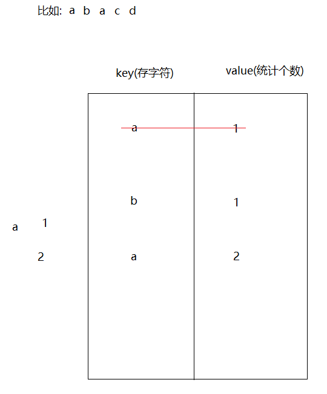
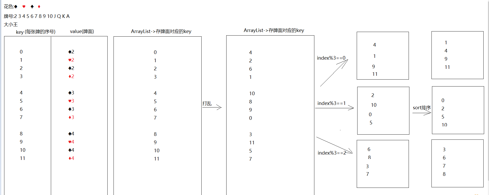
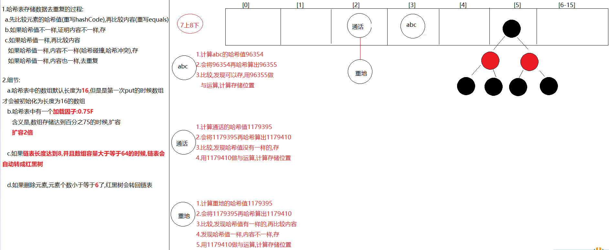
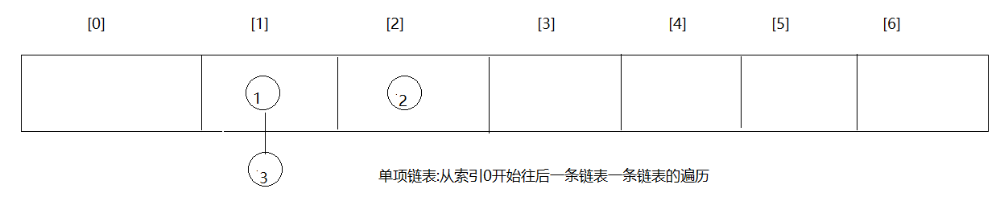
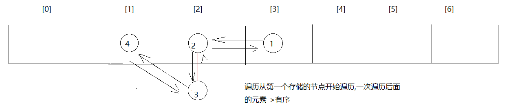

# 模块20.Map集合

```java
模块19回顾:
  1.Collections集合工具类
    方法:
        addAll-> 批量添加元素
        shuffle-> 元素打乱
        sort->排序-> ascii
        sort(集合,比较器)-> 按照指定的顺序排序
  2.泛型:
    a.含有泛型的类:
      public class 类名<E>{}
      new对象的时候确定类型
    b.含有泛型的方法:
      修饰符 <E> 返回值类型 方法名(E e){}
      调用的时候确定类型
    c.含有泛型的接口
      public interface 接口名<E>{}
      在实现类的时候确定类型
      在实现类的时候还没有确定类型,只能new对象的时候确定
    d.泛型通配符
      <? extends 类型> ?接收的泛型类型是后面类的本类以及子类
      <? super 类型> ?接收的泛型类型是后面类的本类以及父类
          
  3.哈希值:计算机计算出来的十进制数,可以看成是对象的地址值
    a.要是没有重写hashCode方法,默认调用Object中的hashCode方法,计算的是对象的哈希值
    b.要是重写了hashCode方法,计算的是对象内容的哈希值
  4.HashSet集合
    特点:  元素唯一  无序 无索引 线程不安全
    数据结构: 哈希表 = 数组+链表+红黑树
   
  5.LinkedHashSet
    特点:元素唯一  有序 无索引 线程不安全  
    数据结构: 哈希表+双向链表
  6.set存储自定义对象怎么去重复 -> 重写hashCode和equals方法
        
  7.去重复过程:先比较元素哈希值,再比较内容
    如果哈希值不一样,存
    如果哈希值一样,再比较内容->哈希值一样,内容不一样,存;哈希值一样,内容一样,去重复
        
模块20重点:
  1.会使用HashMap和LinkedHashMap以及知道他们的特点
  2.会使用Properties属性集
  3.会操作集合嵌套
  4.知道哈希表结构存储元素过程    
```

# 第一章.Map集合 

																	

## 1.Map的介绍

```java
1.概述:是双列集合的顶级接口
2.元素特点:
  元素都是由key(键),value(值)组成 -> 键值对
```

## 2.HashMap的介绍和使用

```java
1.概述:HashMap是Map的实现类
2.特点:
  a.key唯一,value可重复 -> 如果key重复了,会发生value覆盖
  b.无序
  c.无索引
  d.线程不安全
  e.可以存null键null值
3.数据结构:
  哈希表
4.方法:
  V put(K key, V value)  -> 添加元素,返回的是
  V remove(Object key)  ->根据key删除键值对,返回的是被删除的value
  V get(Object key) -> 根据key获取value
  boolean containsKey(Object key)  -> 判断集合中是否包含指定的key
  Collection<V> values() -> 获取集合中所有的value,转存到Collection集合中
      
  Set<K> keySet()->将Map中的key获取出来,转存到Set集合中  
  Set<Map.Entry<K,V>> entrySet()->获取Map集合中的键值对,转存到Set集合中
```

```java
public class Demo01HashMap {
    public static void main(String[] args) {
        HashMap<String, String> map = new HashMap<>();
        //V put(K key, V value)  -> 添加元素,返回的是被覆盖的value
        String value1 = map.put("猪八", "嫦娥");
        System.out.println(value1);
        String value2 = map.put("猪八", "高翠兰");
        System.out.println(value2);
        System.out.println(map);

        map.put("后裔","嫦娥");
        map.put("二郎神","嫦娥");
        map.put("唐僧","女儿国国王");
        map.put("涛哥","金莲");
        map.put(null,null);
        System.out.println(map);

        //V remove(Object key)  ->根据key删除键值对,返回的是被删除的value
        String value3 = map.remove("涛哥");
        System.out.println(value3);
        System.out.println(map);
        //V get(Object key) -> 根据key获取value
        System.out.println(map.get("唐僧"));
        //boolean containsKey(Object key)  -> 判断集合中是否包含指定的key
        System.out.println(map.containsKey("二郎神"));
        //Collection<V> values() -> 获取集合中所有的value,转存到Collection集合中
        Collection<String> collection = map.values();
        System.out.println(collection);
    }
}

```

```java
1.概述:LinkedHashMap extends HashMap
2.特点:
  a.key唯一,value可重复 -> 如果key重复了,会发生value覆盖
  b.有序
  c.无索引
  d.线程不安全
  e.可以存null键null值
3.数据结构:
  哈希表+双向链表
4.使用:和HashMap一样      
```

```java
public class Demo02LinkedHashMap {
    public static void main(String[] args) {
        LinkedHashMap<String, String> map = new LinkedHashMap<>();
        map.put("八戒","嫦娥");
        map.put("涛哥","金莲");
        map.put("涛哥","三上");
        map.put("唐僧","女儿国国王");
        System.out.println(map);
    }
}

```

## 3.HashMap的两种遍历方式

### 3.1.方式1:获取key,根据key再获取value

```java
Set<K> keySet()->将Map中的key获取出来,转存到Set集合中  
```

```java
public class Demo03HashMap {
    public static void main(String[] args) {
        HashMap<String, String> map = new HashMap<>();
        map.put("猪八", "嫦娥");
        map.put("猪八", "高翠兰");
        map.put("后裔","嫦娥");
        map.put("二郎神","嫦娥");
        map.put("唐僧","女儿国国王");
        map.put("涛哥","金莲");

        Set<String> set = map.keySet();//获取所有的key,保存到set集合中
        for (String key : set) {
            //根据key获取value
            System.out.println(key+".."+map.get(key));
        }

    }
}
```

### 3.2.方式2:同时获取key和value



```java
Set<Map.Entry<K,V>> entrySet()->获取Map集合中的键值对,转存到Set集合中
```

```java
public class Demo04HashMap {
    public static void main(String[] args) {
        HashMap<String, String> map = new HashMap<>();
        map.put("猪八", "嫦娥");
        map.put("猪八", "高翠兰");
        map.put("后裔","嫦娥");
        map.put("二郎神","嫦娥");
        map.put("唐僧","女儿国国王");
        map.put("涛哥","金莲");

        /*
          Set集合中保存的都是"结婚证"-> Map.Entry
          我们需要将"结婚证"从set集合中遍历出来
         */
        Set<Map.Entry<String, String>> set = map.entrySet();
        for (Map.Entry<String, String> entry : set) {
            String key = entry.getKey();
            String value = entry.getValue();
            System.out.println(key+"..."+value);
        }
    }
}
```

## 1.Map存储自定义对象时如何去重复

```java
public class Person {
    private String name;
    private Integer age;

    public Person() {
    }

    public Person(String name, Integer age) {
        this.name = name;
        this.age = age;
    }

    public String getName() {
        return name;
    }

    public void setName(String name) {
        this.name = name;
    }

    public Integer getAge() {
        return age;
    }

    public void setAge(Integer age) {
        this.age = age;
    }

    @Override
    public String toString() {
        return "Person{" +
                "name='" + name + '\'' +
                ", age=" + age +
                '}';
    }

    @Override
    public boolean equals(Object o) {
        if (this == o) return true;
        if (o == null || getClass() != o.getClass()) return false;
        Person person = (Person) o;
        return Objects.equals(name, person.name) && Objects.equals(age, person.age);
    }

    @Override
    public int hashCode() {
        return Objects.hash(name, age);
    }
}

```

```java
public class Demo05HashMap {
    public static void main(String[] args) {
        HashMap<Person, String> map = new HashMap<>();
        map.put(new Person("涛哥",18),"河北省");
        map.put(new Person("三上",26),"日本");
        map.put(new Person("涛哥",18),"北京市");
        System.out.println(map);
    }
}
```

```java
如果key为自定义类型,去重复的话,重写hashCode和equals方法,去重复过程和set一样一样的
因为set集合的元素到了底层都是保存到了map的key位置上
```

## 2.Map的练习

```java
需求:用Map集合统计字符串中每一个字符出现的次数
步骤:
  1.创建Scanner和HashMap
  2.遍历字符串,将每一个字符获取出来
  3.判断,map中是否包含遍历出来的字符 -> containsKey
  4.如果不包含,证明此字符第一次出现,直接将此字符和1存储到map中
  5.如果包含,根据字符获取对应的value,让value++
  6.将此字符和改变后的value重新保存到map集合中
  7.输出
```



```java
public class Demo06HashMap {
    public static void main(String[] args) {
        //1.创建Scanner和HashMap
        Scanner sc = new Scanner(System.in);
        HashMap<String, Integer> map = new HashMap<>();
        String data = sc.next();
        //2.遍历字符串,将每一个字符获取出来
        char[] chars = data.toCharArray();
        for (char aChar : chars) {
            String key = aChar+"";
            //3.判断,map中是否包含遍历出来的字符 -> containsKey
            if (!map.containsKey(key)){
            //4.如果不包含,证明此字符第一次出现,直接将此字符和1存储到map中
                map.put(key,1);
            }else{
                //5.如果包含,根据字符获取对应的value,让value++
                //6.将此字符和改变后的value重新保存到map集合中
                Integer value = map.get(key);
                value++;
                map.put(key,value);
            }
        }

        //7.输出
        System.out.println(map);
    }
}

```

## 3.斗地主_Map版本



```java
public class Demo07Poker {
    public static void main(String[] args) {
        //1.创建数组-> color -> 专门存花色
        String[] color = "♠-♥-♣-♦".split("-");
        //2.创建数组 -> number -> 专门存牌号
        String[] number = "2-3-4-5-6-7-8-9-10-J-Q-K-A".split("-");
        //3.创建map集合,key为序号,value为组合好的牌面
        HashMap<Integer, String> poker = new HashMap<>();
        //4.创建一个ArrayList,专门存储key
        ArrayList<Integer> list = new ArrayList<>();
        list.add(0);
        list.add(1);

        //5.组合牌,存储到map中
        int key = 2;
        for (String num : number) {
            for (String huaSe : color) {
                String pokerNumber = huaSe+num;
                poker.put(key,pokerNumber);
                list.add(key);
                key++;
            }
        }

        poker.put(0,"😊");
        poker.put(1,"☺");

        //6.洗牌,打乱list集合中的key
        Collections.shuffle(list);
        //7.创建四个list集合
        ArrayList<Integer> p1 = new ArrayList<>();
        ArrayList<Integer> p2 = new ArrayList<>();
        ArrayList<Integer> p3 = new ArrayList<>();
        ArrayList<Integer> dipai = new ArrayList<>();

        //8.发牌
        for (int i = 0; i < list.size(); i++) {
            Integer key1 = list.get(i);
            if (i>=51){
                dipai.add(key1);
            }else if (i%3==0){
                p1.add(key1);
            }else if (i%3==1){
                p2.add(key1);
            }else if (i%3==2){
                p3.add(key1);
            }
        }

        //9.排序
        Collections.sort(p1);
        Collections.sort(p2);
        Collections.sort(p3);
        Collections.sort(dipai);

        lookPoker("涛哥",p1,poker);
        lookPoker("三上",p2,poker);
        lookPoker("金莲",p3,poker);
        lookPoker("大郎",dipai,poker);
    }

    private static void lookPoker(String name, ArrayList<Integer> list, HashMap<Integer, String> map) {
        System.out.print(name+":");

        for (Integer key : list) {
            String value = map.get(key);
            System.out.print(value+" ");
        }

        System.out.println();
    }
}

```

# 第二章.哈希表结构存储过程



```java
1.HashMap底层数据数据结构:哈希表
2.jdk7:哈希表 = 数组+链表
  jdk8:哈希表 = 数组+链表+红黑树
3.
  先算哈希值,此哈希值在HashMap底层经过了特殊的计算得出
  如果哈希值不一样,直接存
  如果哈希值一样,再去比较内容,如果内容不一样,也存
  如果哈希值一样,内容也一样,直接去重复(后面的value将前面的value覆盖)
  
  哈希值一样,内容不一样->哈希冲突(哈希碰撞)
4.要知道的点:
  a.在不指定长度时,哈希表中的数组默认长度为16,HashMap创建出来,一开始没有创建长度为16的数组
  b.什么时候创建的长度为16的数组呢?在第一次put的时候,底层会创建长度为16的数组
  c.哈希表中有一个数据加[加载因子]->默认为0.75(加载因子)->代表当元素存储到百分之75的时候要扩容了->2倍
  d.如果对个元素出现了哈希值一样,内容不一样时,就会在同一个索引上以链表的形式存储,当链表长度达到8并且当前数组长度>=64时,链表就会改成使用红黑树存储
    如果后续删除元素,那么在同一个索引位置上的元素个数小于6,红黑树会变回链表
  e.加入红黑树目的:查询快
```

```java
外面笔试时可能会问到的变量
default_initial_capacity:HashMap默认容量  16
default_load_factor:HashMap默认加载因子   0.75f
threshold:扩容的临界值   等于   容量*0.75 = 12  第一次扩容
treeify_threshold:链表长度默认值,转为红黑树:8
min_treeify_capacity:链表被树化时最小的数组容量:64
```

> 1.问题:哈希表中有数组的存在,但是为啥说没有索引呢?
>
> ​            哈希表中虽然有数组,但是set和map却没有索引,因为存数据的时候有可能在同一个索引下形成链表,如果2索引上有一条链表,那么我们要是按照索引2获取,咱们获取哪个元素呢?所以就取消了按照索引操作的机制
>
> 2.问题:为啥说HashMap是无序的,LinkedHashMap是有序的呢?
>
> ​    原因:HashMap底层哈希表为单向链表
>
> ​             
>
> ​             LinkedHashMap底层在哈希表的基础上加了一条双向链表    
>
> 

## 1.HashMap无参数构造方法的分析

```java
//HashMap中的静态成员变量
static final float DEFAULT_LOAD_FACTOR = 0.75f;
public HashMap() {
    this.loadFactor = DEFAULT_LOAD_FACTOR; // all other fields defaulted
}
```

解析：使用无参数构造方法创建HashMap对象，将加载因子设置为默认的加载因子，loadFactor=0.75F。

## 2.HashMap有参数构造方法分析

```java
HashMap(int initialCapacity, float loadFactor) ->创建Map集合的时候指定底层数组长度以及加载因子
    
public HashMap(int initialCapacity, float loadFactor) {
    if (initialCapacity < 0)
    	throw new IllegalArgumentException("Illegal initial capacity: " +
    initialCapacity);
    if (initialCapacity > MAXIMUM_CAPACITY)
    	initialCapacity = MAXIMUM_CAPACITY;
    if (loadFactor <= 0 || Float.isNaN(loadFactor))
    	throw new IllegalArgumentException("Illegal load factor: " +
    loadFactor);
    this.loadFactor = loadFactor;
    this.threshold = tableSizeFor(initialCapacity);//10
}
```

解析：带有参数构造方法，传递哈希表的初始化容量和加载因子

- 如果initialCapacity（初始化容量）小于0，直接抛出异常。
- 如果initialCapacity大于最大容器，initialCapacity直接等于最大容器
  - MAXIMUM_CAPACITY = 1 << 30 是最大容量  (1073741824)
- 如果loadFactor（加载因子）小于等于0，直接抛出异常
- tableSizeFor（initialCapacity）方法计算哈希表的初始化容量。
  - 注意：哈希表是进行计算得出的容量，而初始化容量不直接等于我们传递的参数。

## 3.tableSizeFor方法分析

```java
static final int tableSizeFor(int cap) {
    int n = cap - 1;
    n |= n >>> 1;
    n |= n >>> 2;
    n |= n >>> 4;
    n |= n >>> 8;
    n |= n >>> 16;
    return (n < 0) ? 1 : (n >= MAXIMUM_CAPACITY) ? MAXIMUM_CAPACITY : n + 1;
}

8  4  2  1规则->无论指定了多少容量,最终经过tableSizeFor这个方法计算之后,都会遵循8421规则去初始化列表容量为了存取高效，尽量较少碰撞
```

解析：该方法对我们传递的初始化容量进行位移运算，位移的结果是 8 4 2 1 码

- 例如传递2，结果还是2，传递的是4，结果还是4。
- 例如传递3，结果是4，传递5，结果是8，传递20，结果是32。

## 4.Node 内部类分析

哈希表是采用数组+链表的实现方法，HashMap中的内部类Node非常重要，证明HashSet是一个单向链表

```java
 static class Node<K,V> implements Map.Entry<K,V> {
     final int hash;
     final K key;
     V value;
     Node<K,V> next;
 Node(int hash, K key, V value, Node<K,V> next) {
     this.hash = hash;
     this.key = key;
     this.value = value;
     this.next = next;
}
```

解析：内部类Node中具有4个成员变量

- hash，对象的哈希值
- key，作为键的对象
- value，作为值得对象（讲解Set集合，不牵扯值得问题）
- next，下一个节点对象

## 5.存储元素的put方法源码

```java
public V put(K key, V value) {
	return putVal(hash(key), key, value, false, true);
}
```

解析：put方法中调研putVal方法，putVal方法中调用hash方法。

- hash(key)方法：传递要存储的元素，获取对象的哈希值
- putVal方法，传递对象哈希值和要存储的对象key

## 6.putVal方法源码

```java
Node<K,V>[] tab; Node<K,V> p; int n, i;
	if ((tab = table) == null || (n = tab.length) == 0)
		n = (tab = resize()).length;
```

解析：方法中进行Node对象数组的判断，如果数组是null或者长度等于0，那么就会调研resize()方法进行数组的扩容。

## 7.resize方法的扩容计算

```java
if (oldCap > 0) {
     if (oldCap >= MAXIMUM_CAPACITY) {
         threshold = Integer.MAX_VALUE;
         return oldTab;
     }
     else if ((newCap = oldCap << 1) < MAXIMUM_CAPACITY &&
              oldCap >= DEFAULT_INITIAL_CAPACITY)
         newThr = oldThr << 1; // double threshold
}
```

解析：计算结果，新的数组容量=原始数组容量<<1，也就是乘以2。

## 8.确定元素存储的索引

```java
if ((p = tab[i = (n - 1) & hash]) == null)
	 tab[i] = newNode(hash, key, value, null);
```

解析：i = (数组长度 - 1) & 对象的哈希值，会得到一个索引，然后在此索引下tab[i]，创建链表对象。

不同哈希值的对象，也是有可能存储在同一个数组索引下。

```java
其中resize()扩容的方法,默认是16
 tab[i] = newNode(hash, key, value, null);->将元素放在数组中  i就是索引

 i = (n - 1) & hash
     0000 0000 0000 0000 0000 0000 0000 1111->15
                                                    &   0&0=0 0&1=0 1&1=1
     0000 0000 0000 0001 0111 1000 0110 0011->96355
--------------------------------------------------------
     0000 0000 0000 0000 0000 0000 0000 0011->3
```

```java
     0000 0000 0000 0000 0000 0000 0000 1111->15
                                                    &   0&0=0 0&1=0 1&1=1
     0000 0000 0001 0001 1111 1111 0001 0010->1179410
--------------------------------------------------------
     0000 0000 0000 0000 0000 0000 0000 0010->2
```

## 9.遇到重复哈希值的对象

```java
 Node<K,V> e; K k;
 if (p.hash == hash &&
 	((k = p.key) == key || (key != null && key.equals(k))))
		 e = p;
```

解析：如果对象的哈希值相同，对象的equals方法返回true，判断为一个对象，进行覆盖操作。

```java
else {
     for (int binCount = 0; ; ++binCount) {
     	if ((e = p.next) == null) {
     		p.next = newNode(hash, key, value, null);
     	if (binCount >= TREEIFY_THRESHOLD - 1) // -1 for 1st
     		treeifyBin(tab, hash);
     	break;
 }
```

解析：如果对象哈希值相同，但是对象的equals方法返回false，将对此链表进行遍历，当链表没有下一个节点的时候，创建下一个节点存储对象.

# 第三章.TreeSet

```java
1.概述:TreeSet是Set的实现类
2.特点:
  a.对元素进行排序
  b.无索引
  c.不能存null
  d.线程不安全
  e.元素唯一
3.数据结构:红黑树      
```

```java
构造:
  TreeSet() -> 构造一个新的空 set，该 set 根据其元素的自然顺序进行排序 -> ASCII 
  TreeSet(Comparator<? super E> comparator)构造一个新的空 TreeSet，它根据指定比较器进行排序     
```

```java
public class Person {
    private String name;
    private Integer age;

    public Person() {
    }

    public Person(String name, Integer age) {
        this.name = name;
        this.age = age;
    }

    public String getName() {
        return name;
    }

    public void setName(String name) {
        this.name = name;
    }

    public Integer getAge() {
        return age;
    }

    public void setAge(Integer age) {
        this.age = age;
    }

    @Override
    public String toString() {
        return "Person{" +
                "name='" + name + '\'' +
                ", age=" + age +
                '}';
    }

    @Override
    public boolean equals(Object o) {
        if (this == o) return true;
        if (o == null || getClass() != o.getClass()) return false;
        Person person = (Person) o;
        return Objects.equals(name, person.name) && Objects.equals(age, person.age);
    }

    @Override
    public int hashCode() {
        return Objects.hash(name, age);
    }
}
```

```java
public class Demo01TreeSet {
    public static void main(String[] args) {
        TreeSet<String> set1 = new TreeSet<>();
        set1.add("c.白毛浮绿水");
        set1.add("a.鹅鹅鹅");
        set1.add("b.曲项向天歌");
        set1.add("d.红掌拨清波");
        System.out.println(set1);

        System.out.println("=====================");
        TreeSet<Person> set2 = new TreeSet<>(new Comparator<Person>() {
            @Override
            public int compare(Person o1, Person o2) {
                return o1.getAge()-o2.getAge();
            }
        });
        set2.add(new Person("柳岩",18));
        set2.add(new Person("涛哥",12));
        set2.add(new Person("三上",20));
        System.out.println(set2);
    }
}

```

# 第四章.TreeMap

```java
1.概述:TreeMap是Map的实现类
2.特点:
  a.对key进行排序
  b.无索引
  c.key唯一
  d.线程不安全
  e.不能存null
3.数据结构:红黑树      
```

```java
构造:
  TreeMap() -> 使用键的自然顺序构造一个新的、空的树映射 -> ASCII 
  TreeMap(Comparator<? super E> comparator)构造一个新的、空的树映射，该映射根据给定比较器进行排序
```

```java
public class Person {
    private String name;
    private Integer age;

    public Person() {
    }

    public Person(String name, Integer age) {
        this.name = name;
        this.age = age;
    }

    public String getName() {
        return name;
    }

    public void setName(String name) {
        this.name = name;
    }

    public Integer getAge() {
        return age;
    }

    public void setAge(Integer age) {
        this.age = age;
    }

    @Override
    public String toString() {
        return "Person{" +
                "name='" + name + '\'' +
                ", age=" + age +
                '}';
    }

    @Override
    public boolean equals(Object o) {
        if (this == o) return true;
        if (o == null || getClass() != o.getClass()) return false;
        Person person = (Person) o;
        return Objects.equals(name, person.name) && Objects.equals(age, person.age);
    }

    @Override
    public int hashCode() {
        return Objects.hash(name, age);
    }
}

```

```java
public class Demo02TreeMap {
    public static void main(String[] args) {
        TreeMap<String, String> map1 = new TreeMap<>();
        map1.put("c","白毛浮绿水");
        map1.put("a","鹅鹅鹅");
        map1.put("b","曲项向天歌");
        map1.put("d","红掌拨清波");
        System.out.println(map1);

        System.out.println("=============");

        TreeMap<Person, String> map2 = new TreeMap<>(new Comparator<Person>() {
            @Override
            public int compare(Person o1, Person o2) {
                return o1.getAge()-o2.getAge();
            }
        });

        map2.put(new Person("柳岩",18),"北京");
        map2.put(new Person("涛哥",12),"北京");
        map2.put(new Person("三上",20),"北京");
        System.out.println(map2);

    }
}
```

# 第五章.Hashtable和Vector集合(了解)

## 1.Hashtable集合

```java
1.概述:Hashtable是Map的实现类
2.特点:
  a.key唯一,value可重复
  b.无序
  c.无索引
  d.线程安全   
  e.不能存储null键,null值
3.数据结构:哈希表      
```

```java
public class Demo01Hashtable {
    public static void main(String[] args) {
        Hashtable<String, String> table = new Hashtable<>();
        table.put("迪丽热巴","马尔扎哈");
        table.put("古力娜扎","涛哥思密达");
        table.put("古力娜扎","雷霆嘎巴");
        table.put("玛卡巴卡","哈哈哈哈");
        //table.put(null,null);
        System.out.println(table);
    }
}
```

> HashMap和Hashtable区别:
>
>   相同点:元素无序,无索引,key唯一
>
>   不同点:HashMap线程不安全,Hashtable线程安全
>
> ​               HashMap可以存储null键null值;Hashtable不能

## 2.Vector集合

```java
1.概述:Vector是List接口的实现类
2.特点:
  a.元素有序
  b.有索引
  c.元素可重复
  d.线程安全
3.数据结构:数组
    
4.源码分析:
  a.如果用空参构造创建对象,数组初始容量为10,如果超出范围,自动扩容,2倍
  b.如果用有参构造创建对象,如果超出了范围,自动扩容,扩的是老数组长度+指定的容量增强
```

```java
public class Demo02Vector {
    public static void main(String[] args) {
        Vector<String> vector = new Vector<>();
        vector.add("张三");
        vector.add("李四");
        for (String s : vector) {
            System.out.println(s);
        }
    }
}
```

> Vector底层源码分析
>
> ```java
> Vector() 构造一个空向量，使其内部数据数组的大小为 10，其标准容量增量为零
> Vector(int initialCapacity, int capacityIncrement)使用指定的初始容量和容量增量构造一个空的向量 
> ```
>
> ```java
> Vector<String> vector = new Vector<>();
> public Vector() {
>     this(10);
> }
> public Vector(int initialCapacity->10) {
>     this(initialCapacity, 0);
> }
> public Vector(int initialCapacity->10, int capacityIncrement->0) {
>     super();
>     if (initialCapacity < 0)
>         throw new IllegalArgumentException("Illegal Capacity: "+
>                                            initialCapacity);
>     this.elementData = new Object[initialCapacity];//长度为0的数组
>     this.capacityIncrement = capacityIncrement;//0
> }
> =====================================================
> vector.add("李四");-> 假设李四是第11个元素
> public synchronized boolean add(E e) {
>     modCount++;
>     ensureCapacityHelper(elementCount + 1);
>     elementData[elementCount++] = e;
>     return true;
> }  
> private void ensureCapacityHelper(int minCapacity->11) {
>     // overflow-conscious code
>     if (minCapacity - elementData.length > 0)
>         grow(minCapacity->11);
> }
> private void grow(int minCapacity->11) {
>     // overflow-conscious code
>     int oldCapacity = elementData.length;//10
>     int newCapacity = oldCapacity + ((capacityIncrement > 0) ?
>                                      capacityIncrement : oldCapacity);//10+10=20
>     if (newCapacity - minCapacity < 0)
>         newCapacity = minCapacity;
>     if (newCapacity - MAX_ARRAY_SIZE > 0)
>         newCapacity = hugeCapacity(minCapacity);
>     elementData = Arrays.copyOf(elementData, newCapacity);
> }
> ```
>
> ```java
> Vector<String> vector = new Vector<>(10,5);
> public Vector(int initialCapacity->10, int capacityIncrement->5) {
>     super();
>     if (initialCapacity < 0)
>         throw new IllegalArgumentException("Illegal Capacity: "+
>                                            initialCapacity);
>     this.elementData = new Object[initialCapacity];
>     this.capacityIncrement = capacityIncrement;//5
> }
> 
> ======================================================
> vector.add("李四");-> 假设李四是第11个元素
> public synchronized boolean add(E e) {
>     modCount++;
>     ensureCapacityHelper(elementCount + 1);
>     elementData[elementCount++] = e;
>     return true;
> }    
> 
> private void ensureCapacityHelper(int minCapacity->11) {
>     // overflow-conscious code
>     if (minCapacity - elementData.length > 0)
>         grow(minCapacity);
> }
> 
> private void grow(int minCapacity->11) {
>     // overflow-conscious code
>     int oldCapacity = elementData.length;//10
>     int newCapacity = oldCapacity + ((capacityIncrement > 0) ?
>                                      capacityIncrement : oldCapacity);
>     if (newCapacity - minCapacity < 0)
>         newCapacity = minCapacity;
>     if (newCapacity - MAX_ARRAY_SIZE > 0)
>         newCapacity = hugeCapacity(minCapacity);
>     elementData = Arrays.copyOf(elementData, newCapacity);
> }
> ```

# 第六章.Properties集合(属性集)

```java
1.概述:Properties 继承自 Hashtable
2.特点:
  a.key唯一,value可重复
  b.无序
  c.无索引
  d.线程安全
  e.不能存null键,null值
  f.Properties的key和value类型默认为String
3.数据结构:哈希表
4.特有方法:
  Object setProperty(String key, String value)  -> 存键值对
  String getProperty(String key)  ->根据key获取value的
  Set<String> stringPropertyNames()  -> 获取所有的key,保存到set集合中,相当于keySet方法
  void load(InputStream inStream) -> 将流中的数据加载到Properties集合中(IO部分讲)    
```

```java
public class Demo01Properties {
    public static void main(String[] args) {
        Properties properties = new Properties();
        //Object setProperty(String key, String value)  -> 存键值对
        properties.setProperty("username","root");
        properties.setProperty("password","1234");
        System.out.println(properties);
        //String getProperty(String key)  ->根据key获取value的
        System.out.println(properties.getProperty("username"));
        //Set<String> stringPropertyNames()  -> 获取所有的key,保存到set集合中,相当于keySet方法
        Set<String> set = properties.stringPropertyNames();
        for (String key : set) {
            System.out.println(properties.getProperty(key));
        }
    }
}

```

# 第七章.集合嵌套

## 1.List嵌套List

```java
需求:创建2个List集合,每个集合中分别存储一些字符串,将2个集合存储到第3个List集合中
```

```java
public class Demo01ListInList {
    public static void main(String[] args) {
        ArrayList<String> list1 = new ArrayList<>();
        list1.add("杨过");
        list1.add("小龙女");
        list1.add("尹志平");

        ArrayList<String> list2 = new ArrayList<>();
        list2.add("涛哥");
        list2.add("金莲");
        list2.add("三上");

        /*
           list中的元素是两个 ArrayList<String>
           所以泛型也应该是 ArrayList<String>
         */
        ArrayList<ArrayList<String>> list = new ArrayList<>();
        list.add(list1);
        list.add(list2);

        /*
          先遍历大集合,将两个小集合遍历出来
          再遍历两个小集合,将元素获取出来
         */
        for (ArrayList<String> arrayList : list) {
            for (String s : arrayList) {
                System.out.println(s);
            }
        }
    }
}
```

## 2.List嵌套Map

```java
1班级有第三名同学，学号和姓名分别为：1=张三，2=李四，3=王五，2班有三名同学，学号和姓名分别为：1=黄晓明，2=杨颖，3=刘德华,请将同学的信息以键值对的形式存储到2个Map集合中，在将2个Map集合存储到List集合中。
```

```java
public class Demo02ListInMap {
    public static void main(String[] args) {
        //1.创建两个map集合
        HashMap<Integer, String> map1 = new HashMap<>();
        map1.put(1,"张三");
        map1.put(2,"李四");
        map1.put(3,"王五");

        HashMap<Integer, String> map2 = new HashMap<>();
        map2.put(1,"黄晓明");
        map2.put(2,"杨颖");
        map2.put(3,"刘德华");

        //2.创建一个存储map集合的list集合
        ArrayList<HashMap<Integer, String>> list = new ArrayList<>();
        list.add(map1);
        list.add(map2);

        //3.先遍历list集合,再遍历map集合
        for (HashMap<Integer, String> map : list) {
            Set<Map.Entry<Integer, String>> set = map.entrySet();
            for (Map.Entry<Integer, String> entry : set) {
                System.out.println(entry.getKey()+"..."+entry.getValue());
            }
        }
    }
}

```

## 3.Map嵌套Map

```java
- JavaSE  集合 存储的是 学号 键，值学生姓名
  - 1  张三
  - 2  李四
- JavaEE 集合 存储的是 学号 键，值学生姓名
  - 1  王五
  - 2  赵六
```

```java
public class Demo03MapInMap {
    public static void main(String[] args) {
        //1.创建两个map集合
        HashMap<Integer, String> map1 = new HashMap<>();
        map1.put(1,"张三");
        map1.put(2,"李四");

        HashMap<Integer, String> map2 = new HashMap<>();
        map2.put(1,"王五");
        map2.put(2,"赵六");

        HashMap<String, HashMap<Integer, String>> map = new HashMap<>();
        map.put("javase",map1);
        map.put("javaee",map2);

        Set<Map.Entry<String, HashMap<Integer, String>>> set = map.entrySet();
        for (Map.Entry<String, HashMap<Integer, String>> entry : set) {
            HashMap<Integer, String> hashMap = entry.getValue();
            Set<Integer> set1 = hashMap.keySet();
            for (Integer key : set1) {
                System.out.println(key+"..."+hashMap.get(key));
            }
        }
    }
}

```


