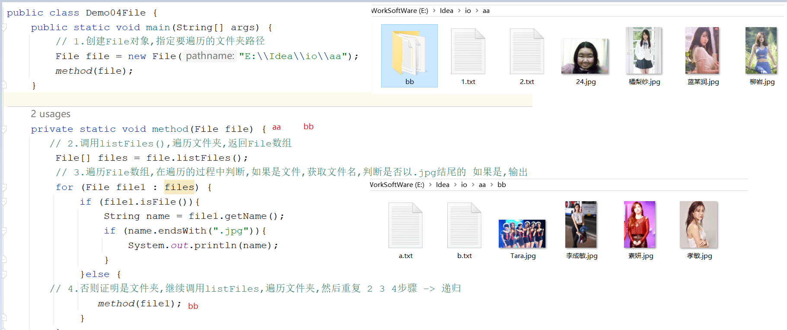
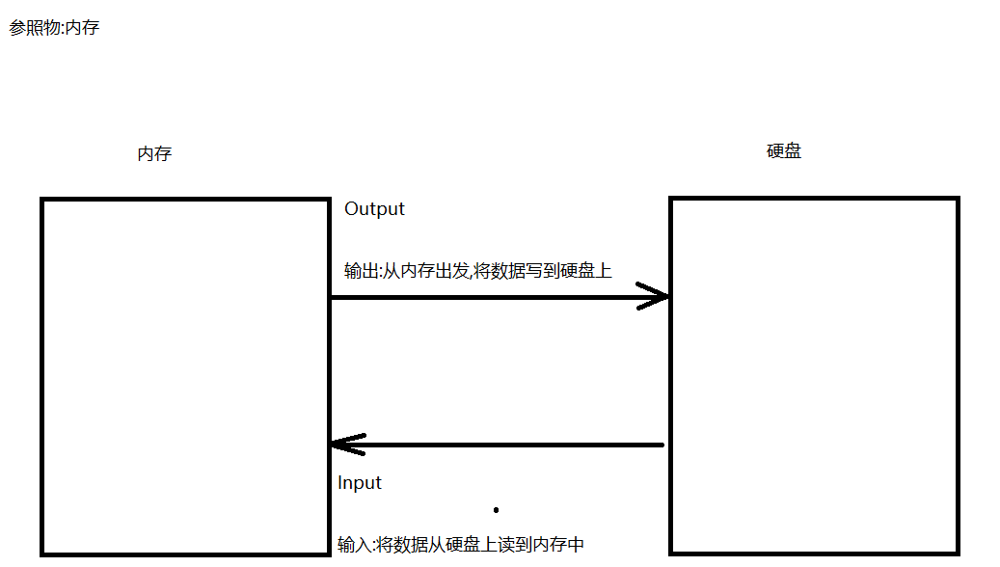
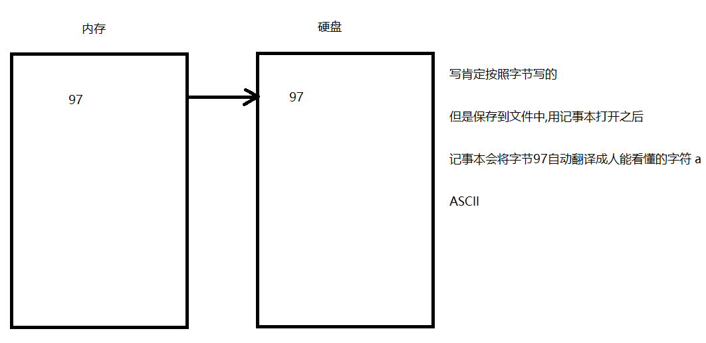
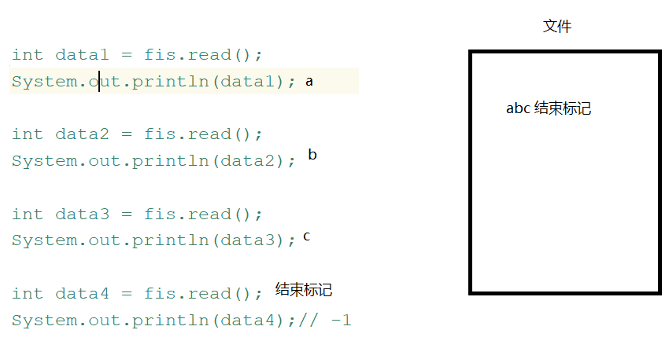
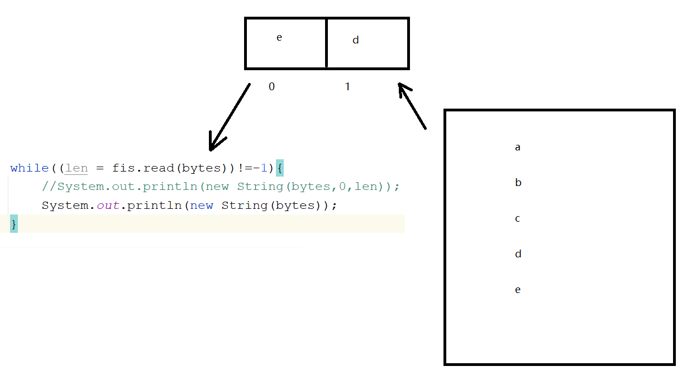
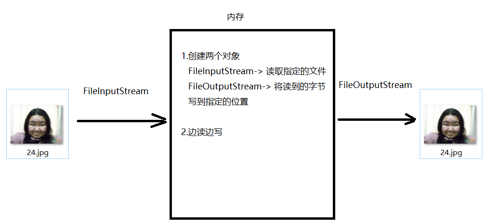

# 	模块21.IO流

```java
模块20回顾:
  1.HashMap
    a.特点:无序,无索引,key唯一,线程不安全,可以存null键null值
    b.数据结构:哈希表
    c.方法:put remove get keySet entrySet  values  containsKey
  2.LinkedHashMap:
    a.特点:有序,无索引,key唯一,线程不安全,可以存null键null值
    b.数据结构:哈希表+双向链表
        
  3.key如何去重复:重写hashCode和equals方法
      
  4.TreeSet:是set接口实现类
    a.特点:对元素排序,无索引,元素唯一,线程不安全,不可以存null键null值
    b.构造:
      TreeSet()
      TreeSet(Comparator c)
  5.TreeMap:
    a.特点:对 key排序,无索引,key唯一,线程不安全,不可以存null键null值
    b.构造:
      TreeMap()
      TreeMap(Comparator c)
  6.Hashtable:是map接口的实现类
    a.特点:无序,无索引,key唯一,线程安全,不能存null键null值
    b.用法:和HashMap一样
    c.数据结构:哈希表
  7.Vector: 
    a.特点:有序,有索引,元素可重复,线程安全
    b.数据结构:数组
  8.Properties:是Hashtable子类
    a.特点:无序,无索引,key唯一,线程安全,不能存null键null值,key和value都是String的
    b.特有方法:
      setProperty
      getProperty
      stringPropertyNames
      load(IO流对象) -> 将流中数据加载到集合中
          
 模块21重点: 
   1.分清楚IO流流向
   2.会字节流和字符流的读写操作    
```


# 第一章.File类

## 1.File类

```java
计算机常识:
  1.以.jpg结尾的一定是图片吗?
    不一定,有可能是文件夹
      
  2.什么是文本文档?
    用记事本打开,人能看懂的文件 -> txt  html css  
  
  3.E:\Idea\io\1.jpg 中的1.jpg的父路径是谁?
    E:\Idea\io
        
  4.分隔符:
    a.路径名称分隔符:
      windows: \
      linux: /    
    b.路径分隔符:一个路径和其他路径之间的分隔符
      ;
```

```java
1.概述:文件和目录(文件夹)路径名的抽象表示   
2.简单理解:
  我们在创建File对象的时候,需要传递一个路径,这个路径定为到哪个文件或者文件夹上,我们的File就代表哪个对象
  File file = new File("E:\Idea\io\1.jpg")    
```

## 2.File的静态成员

```java
static String pathSeparator:与系统有关的路径分隔符，为了方便，它被表示为一个字符串。
static String separator:与系统有关的默认名称分隔符，为了方便，它被表示为一个字符串。  
```

```java
public class Demo01File {
    public static void main(String[] args) {
        //file01();
        file02();
    }

    /*
      将来写代码如何正确编写一个路径用java代码
     */
    private static void file02() {
        String path1 = "E:\\Idea\\io";
        System.out.println(path1);
        System.out.println("==================");

        //要求代码写完,一次编写,到处运行
        String path2 = "E:"+File.separator+"Idea"+File.separator+"io";
        System.out.println(path2);
    }

    private static void file01() {
        //static String pathSeparator:与系统有关的路径分隔符，为了方便，它被表示为一个字符串。
        String pathSeparator = File.pathSeparator;
        System.out.println("pathSeparator = " + pathSeparator); //  ;
        //static String separator:与系统有关的默认名称分隔符，为了方便，它被表示为一个字符串。
        String separator = File.separator;
        System.out.println("separator = " + separator); //  \
    }
}

```

## 3.File的构造方法

```java
File(String parent, String child) 根据所填写的路径创建File对象
     parent:父路径
     child:子路径
File(File parent, String child)  根据所填写的路径创建File对象
     parent:父路径,是一个File对象
     child:子路径
File(String pathname)  根据所填写的路径创建File对象
     pathname:直接指定路径   
```

```java
public class Demo02File {
    public static void main(String[] args) {
        //File(String parent, String child) 根据所填写的路径创建File对象
        //parent:父路径
        //child:子路径
        File file1 = new File("E:\\Idea\\io", "1.jpg");
        System.out.println("file1 = " + file1);
        //File(File parent, String child)  根据所填写的路径创建File对象
        //parent:父路径,是一个File对象
        //child:子路径
        File parent = new File("E:\\Idea\\io");
        File file2 = new File(parent, "1.jpg");
        System.out.println("file2 = " + file2);
        //File(String pathname)  根据所填写的路径创建File对象
        //pathname:直接指定路径
        File file3 = new File("E:\\Idea\\io\\1.jpg");
        System.out.println("file3 = " + file3);
    }
}
```

> 细节:
>
>   我们创建File对象的时候,传递的路径可以是不存在的,但是传递不存在的路径

## 4.File的获取方法

```java
String getAbsolutePath() -> 获取File的绝对路径->带盘符的路径
String getPath() ->获取的是封装路径->new File对象的时候写的啥路径,获取的就是啥路径
String getName()  -> 获取的是文件或者文件夹名称
long length() -> 获取的是文件的长度 -> 文件的字节数   
```

```java
    private static void file01() {
        //String getAbsolutePath() -> 获取File的绝对路径->带盘符的路径
        File file1 = new File("1.txt");
        System.out.println("file1.getAbsolutePath() = " + file1.getAbsolutePath());
        //String getPath() ->获取的是封装路径->new File对象的时候写的啥路径,获取的就是啥路径
        File file2 = new File("io\\1.txt");
        System.out.println("file2.getPath() = " + file2.getPath());
        //String getName()  -> 获取的是文件或者文件夹名称
        File file3 = new File("E:\\Idea\\io\\1.jpg");
        System.out.println("file3.getName() = " + file3.getName());
        //long length() -> 获取的是文件的长度 -> 文件的字节数
        File file4 = new File("E:\\Idea\\io\\1.txt");
        System.out.println("file4.length() = " + file4.length());
    }
```

## 5.File的创建方法

```java
boolean createNewFile()  -> 创建文件
        如果要创建的文件之前有,创建失败,返回false
        如果要创建的文件之前没有,创建成功,返回true
    
boolean mkdirs() -> 创建文件夹(目录)既可以创建多级文件夹,还可以创建单级文件夹
        如果要创建的文件夹之前有,创建失败,返回false
        如果要创建的文件夹之前没有,创建成功,返回true
```

```java
    private static void file02() throws IOException {
        /*boolean createNewFile()  -> 创建文件
        如果要创建的文件之前有,创建失败,返回false
        如果要创建的文件之前没有,创建成功,返回true*/
        File file1 = new File("E:\\Idea\\io\\1.txt");
        System.out.println("file1.createNewFile() = " + file1.createNewFile());

        /*boolean mkdirs() -> 创建文件夹(目录)既可以创建多级文件夹,还可以创建单级文件夹
        如果要创建的文件夹之前有,创建失败,返回false
        如果要创建的文件夹之前没有,创建成功,返回true*/
        File file2 = new File("E:\\Idea\\io\\haha\\heihei\\hehe");
        System.out.println("file2.mkdirs() = " + file2.mkdirs());
    }
```

## 6.File类的删除方法

```java
boolean delete()->删除文件或者文件夹

注意:
  1.如果删除文件,不走回收站
  2.如果删除文件夹,必须是空文件夹,而且也不走回收站    
```

```java
    private static void file03() {
        //boolean delete()->删除文件或者文件夹
        //File file1 = new File("E:\\Idea\\io\\1.txt");
        File file1 = new File("E:\\Idea\\io\\haha");
        System.out.println("file1.delete() = " + file1.delete());
    }
```

## 7.File类的判断方法

```java
boolean isDirectory() -> 判断是否为文件夹 
boolean isFile()  -> 判断是否为文件
boolean exists()  -> 判断文件或者文件夹是否存在    
```

```java
    private static void file04() {
        File file = new File("E:\\Idea\\io\\1.txt");
        // boolean isDirectory() -> 判断是否为文件夹
        System.out.println("file.isDirectory() = " + file.isDirectory());
       // boolean isFile()  -> 判断是否为文件
        System.out.println("file.isFile() = " + file.isFile());
       // boolean exists()  -> 判断文件或者文件夹是否存在
        System.out.println("file.exists() = " + file.exists());
    }
```

## 8.File的遍历方法

```java
String[] list() -> 遍历指定的文件夹,返回的是String数组 
File[] listFiles()-> 遍历指定的文件夹,返回的是File数组 ->这个推荐使用
    
细节:listFiles方法底层还是list方法
     调用list方法,遍历文件夹,返回一个Stirng数组,遍历数组,将数组中的内容一个一个封装到File对象中,然后再将File对象放到File数组中
```

```java
    private static void file05() {
        File file = new File("E:\\Idea\\io\\aa");
        //String[] list() -> 遍历指定的文件夹,返回的是String数组
        String[] list = file.list();
        for (String s : list) {
            System.out.println(s);
        }
        //File[] listFiles()-> 遍历指定的文件夹,返回的是File数组 ->这个推荐使用
        System.out.println("==============");
        File[] files = file.listFiles();
        for (File file1 : files) {
            System.out.println(file1);
        }
    }
```

### 练习:遍历指定文件夹下所有的.jpg文件

```java
 1.创建File对象,指定要遍历的文件夹路径
 2.调用listFiles(),遍历文件夹,返回File数组
 3.遍历File数组,在遍历的过程中判断,如果是文件,获取文件名,判断是否以.jpg结尾的
   如果是,输出
 4.否则证明是文件夹,继续调用listFiles,遍历文件夹,然后重复 2 3 4步骤 -> 递归    
```

```java
public class Demo04File {
    public static void main(String[] args) {
        // 1.创建File对象,指定要遍历的文件夹路径
        File file = new File("E:\\Idea\\io\\aa");
        method(file);
    }

    private static void method(File file) {
       // 2.调用listFiles(),遍历文件夹,返回File数组
        File[] files = file.listFiles();
        // 3.遍历File数组,在遍历的过程中判断,如果是文件,获取文件名,判断是否以.jpg结尾的 如果是,输出
        for (File file1 : files) {
            if (file1.isFile()){
                String name = file1.getName();
                if (name.endsWith(".jpg")){
                    System.out.println(name);
                }
            }else {
       // 4.否则证明是文件夹,继续调用listFiles,遍历文件夹,然后重复 2 3 4步骤 -> 递归
               method(file1);
            }
        }
    }
}

```



## 9.相对路径和绝对路径

```java
1.绝对路径:从盘符开始写的路径
  E:\\idea\\io\\1.txt
2.相对路径:不从盘符名开始写的路径
    
3.针对idea中写相对路径:
  a.口诀:哪个路径是参照路径,哪个路径就可以省略不写,剩下的就是在idea中的相对路径写法
        在idea中参照路径其实就是当前project的绝对路径
      
  b.比如:在module21下创建了一个1.txt
    先找1.txt的绝对路径:E:\Idea\idea2022\workspace\javase\module21\1.txt
    再找参照路径:E:\Idea\idea2022\workspace\javase
    参照路径可以省略:module21\1.txt
        
4.总结:
  在idea中写的相对路径,其实就是从模块名开始写
      
5.注意:
  如果直接写一个文件名1.txt,它所在的位置默认是在当前project下
```

# 第二章.字节流

## 1.IO流介绍以及输入输出以及流向的介绍

```java
1.单词:
  Output:输出
  Input:输入
      
  write:写数据
  read:读数据
      
2.IO流:
  将一个设备上的数据传输到另外一个设备上,称之为IO流技术
      
3.为啥要学IO流呢?
  之前学了一个集合以及数组,可以保存数据,但是这两个都是临时存储(代码运行完毕,集合和数组会从内存中消失,从而数据就不存在了),所以集合和数组达不到永久保存的目的,我们希望咱们的数据永久保存起来,所以我们就可以将数据保存到硬盘上,此时我们就可以随时想拿到硬盘上的数据就随时拿
      
  而且我们将来传输数据,必然要用到输入,输出动作    
```

## 2.IO流的流向_针对se阶段的IO

```java
输入流:将数据从硬盘上读到内存中  Input
输出流:从内存出发,将数据写到硬盘上  Output
    
    
要是从电脑和电脑之间做数据传输,就是相对的
    发数据一方 : 输出
    接数据一方 : 输入
```



## 3.IO流分类

```java
字节流:万能流,一切皆字节
      字节输出流:  OutputStream 抽象类
      字节输入流:  InputStream 抽象类
          
字符流:专门操作文本文档
      字符输出流:Writer 抽象类
      字符输入流:Reader 抽象类
```

## 4.OutputStream中子类[FileOutputStream]的介绍以及方法的简单介绍

```java
 1.概述:字节输出流,OutputStream 是一个抽象类
        子类: FileOutputStream
 2.作用:往硬盘上写数据
     
 3.构造:
   FileOutputStream(File file) 
   FileOutputStream(String name)
       
 4.特点:
   a.指定的文件如果没有,输出流会自动创建
   b.每执行一次,默认都会创建一个新的文件,覆盖老文件 
       
 5.方法:
   void write(int b)  一次写一个字节
   void write(byte[] b)  一次写一个字节数组
   void write(byte[] b, int off, int len)  一次写一个字节数组一部分 
             b:写的数组
             off:从数组的哪个索引开始写
             len:写多少个
   void close()  -> 关闭资源              
```

```java
      /*
       void write(int b)  一次写一个字节
     */
    private static void method01() throws IOException {
        FileOutputStream fos = new FileOutputStream("module21\\1.txt");
        fos.write(97);
        fos.close();
    }
```

```java
    /*
       void write(byte[] b)  一次写一个字节数组
     */
    private static void method02()throws IOException {
        FileOutputStream fos = new FileOutputStream("module21\\1.txt");
        byte[] bytes = {97,98,99,100,101,102,103};
        fos.write(bytes);
        fos.close();
    }
```

```java
      /*
         void write(byte[] b, int off, int len)  一次写一个字节数组一部分
             b:写的数组
             off:从数组的哪个索引开始写
             len:写多少个
     */
    private static void method03()throws IOException {
        FileOutputStream fos = new FileOutputStream("module21\\1.txt");
        byte[] bytes = {97,98,99,100,101,102,103};
        fos.write(bytes,0,2);
        fos.close();
    }
```

```java
       /*
       void write(byte[] b)  一次写一个字节数组
     */
    private static void method04()throws IOException {
        FileOutputStream fos = new FileOutputStream("module21\\1.txt");
        //byte[] bytes = "abc".getBytes();
        fos.write("abcde".getBytes());
        fos.close();
    }
```



```java
1.字节流的续写追加:
  FileOutputStream(String name, boolean append) 
                   append:true -> 会实现续写追加,文件不覆盖了
                       
2.换行:
  a.windows: \r\n -> 占2个字节   \n
  b.linux: \n
  c.mac os : \r
```

```java
    private static void method05()throws IOException {
        FileOutputStream fos = new FileOutputStream("module21\\1.txt",true);
        fos.write("床前明月光\r\n".getBytes());
        fos.write("疑是地上霜\n".getBytes());
        fos.write("举头望明月\n".getBytes());
        fos.write("低头思故乡\n".getBytes());
        fos.close();
    }
```

## 5.InputStream子类[FileInputStream]的介绍以及方法的使用

```java
1.概述:字节输入流 InputStream ,是一个抽象类
      子类:FileInputStream
          
2.作用:读数据,将数据从硬盘上读到内存中来
    
3.构造:
  FileInputStream(File file)
  FileInputStream(String path)  
      
4.方法:
  int read()   一次读一个字节,返回的是读取的字节
  int read(byte[] b)  一次读取一个字节数组,返回的是读取的字节个数
  int read(byte[] b, int off, int len)  一次读取一个字节数组一部分,返回的是读取的字节个数
  void close()  关闭资源        
```

## 6.一次读取一个字节

```java
     /*
       int read()   一次读一个字节,返回的是读取的字节
     */
    private static void method01()throws Exception {
        FileInputStream fis = new FileInputStream("module21\\1.txt");
        //int data1 = fis.read();
        //System.out.println(data1);

        //int data2 = fis.read();
        //System.out.println(data2);

        //int data3 = fis.read();
        //System.out.println(data3);

        //int data4 = fis.read();
        //System.out.println(data4);// -1

        //int data5 = fis.read();
        //System.out.println(data5);//-1

        System.out.println("=================");
        //定义一个变量,接收读取到的字节
        int len;
        while((len = fis.read())!=-1){
            System.out.println((char)len);
        }

        fis.close();
    }
```

> 问题1:一个流对象,读完之后,就不要再读了;除非重新new一个新的对象
>
> 问题2:流关闭之后,流对象不能继续使用了
>
> ```java
> Exception in thread "main" java.io.IOException: Stream Closed
> 	at java.base/java.io.FileInputStream.read0(Native Method)
> 	at java.base/java.io.FileInputStream.read(FileInputStream.java:228)
> 	at com.atguigu.c_input.Demo01FileInputStream.method01(Demo01FileInputStream.java:38)
> 	at com.atguigu.c_input.Demo01FileInputStream.main(Demo01FileInputStream.java:7)
> ```
>
> 

## 7.读取-1的问题

```java
每个文件末尾都会有一个"结束标记",这个"结束标记"我们看不见,摸不着
    
而read()方法规定,如果读到了文件的结束标记,方法直接返回-1    
```



## 8.一次读取一个字节数组以及过程

```java
  /*
       int read(byte[] b)  一次读取一个字节数组,返回的是读取的字节个数
     */
    private static void method02()throws Exception {
        FileInputStream fis = new FileInputStream("module21\\1.txt");
        /*
           创建一个数组:byte[]
            1.创建的数组相当于一个临时存储区域,我们要读取的内容会临时保存到数组中
              然后我们再从数组中将数据获取

            2.数组长度定为多少,每次读取多少个,一般情况下数组长度定为1024或者1024的倍数
              如果剩下的字节不够数组长度了,那么就最后有多少读多少
         */
        byte[] bytes = new byte[2];
        //int len1 = fis.read(bytes);
        /*System.out.println(len1);//2
        System.out.println(new String(bytes,0,len1));
        System.out.println("===============");
        int len2 = fis.read(bytes);
        System.out.println(len2);//2
        System.out.println(new String(bytes,0,len2));
        System.out.println("===============");
        int len3 = fis.read(bytes);
        System.out.println(len3);//1
        System.out.println(new String(bytes,0,len3));*/

        //定义一个变量len,接收读取的字节个数
        int len;
        while((len = fis.read(bytes))!=-1){
            //System.out.println(new String(bytes,0,len));
            System.out.println(new String(bytes));
        }
        fis.close();
    }  
```



## 9.字节流实现图片复制分析



## 10.字节流实现图片复制代码实现

```java
public class Demo01CopyFile {
    public static void main(String[] args)throws Exception {
        //1.创建FileInputStream
        FileInputStream fis = new FileInputStream("E:\\Idea\\io\\24.jpg");
        //2.创建一个FileOutputStream,将读取的图片写到指定的位置
        FileOutputStream fos = new FileOutputStream("E:\\Idea\\io\\大姐.jpg");
        //3.定义一个数组
        byte[] bytes = new byte[1024];
        //4.边读边写
        int len;
        while((len = fis.read(bytes))!=-1){
            fos.write(bytes,0,len);//读多少个,写多少个
        }
        //5.关流  先开后关
        fos.close();
        fis.close();
    }
}
```

# 第三章.字符流

## 1.字节流读取中文的问题

```java
1.注意:
  字节流是万能流,更侧重于文件复制,但是尽量不要边读边看
      
2.原因:
  UTF-8:一个汉字占3个字节
  GBK:一个中文占2个字节
      
  如果按照字节读取,每次读取的字节没有构成一个汉字的字节数,就直接输出,汉字是显示不了的
      
3.解决: 
  将文本文档中的内容,按照字符去操作
```

> 话说回来:
>
>   1.按照字符去操作编码也要一致,如果不一致,照样会乱码
>
>   2.按照字节流去操作即使编码一致,边读边看,也有可能乱码

## 2.FileReader的介绍以及使用

```java
字符流专门操作文本文档的,但是复制操作不要用字符流,要用字节流
```

```java
1.概述:字符输入流 -> Reader -> 是一个抽象类
      子类:FileReader
2.作用:将文本文档中的内容读取到内存中来
3.构造:
  FileReader(File file)
  FileReader(String path)
4.方法:
  int read() -> 一次读取一个字符,返回的是读取字符对应的int值 
  int read(char[] cbuf) -> 一次读取一个字符数组,返回的是读取个数  
  int read(char[] cbuf, int off, int len) -> 一次读取一个字符数组一部分,返回的是读取个数
           cbuf:读取的数组
           off:从数组的哪个索引开始读
           len:读多少个
  void close() -> 关闭资源    
```

```java
 private static void method01() throws IOException {
        FileReader fr = new FileReader("module21\\1.txt");
        int len;
        while((len = fr.read())!=-1){
            System.out.println((char) len);
        }
        fr.close();
    }
```

```java
private static void method02()throws Exception {
        FileReader fr = new FileReader("module21\\1.txt");
        char[] chars = new char[2];
        int len;
        while((len = fr.read(chars))!=-1){
            System.out.println(new String(chars,0,len));
        }
        fr.close();
}
```

## 3.FileWriter的介绍以及使用

```java
1.概述:字符输出流 -> Writer -> 抽象类
  子类:FileWriter
2.作用:将数据写到文件中
3.构造:
  FileWriter(File file) 
  FileWriter(String fileName)     
  FileWriter(String fileName, boolean append) -> 追加,续写 
4.方法:
  void write(int c) -> 一次写一个字符 
  void write(char[] cbuf) 一次写一个字符数组 
  void write(char[] cbuf, int off, int len) 一次写一个字符数组一部分  
  void write(String str) 直接写一个字符串
  void flush()  :将缓冲区中的数据刷到文件中    
  void close()  关流
      
5.注意:FileWriterr底层自带一个缓冲区,我们写的数据会先保存到缓冲区中,所以我们需要将缓冲区中的数据刷到文件中      
```

```java
public class Demo01FileWriter {
    public static void main(String[] args)throws Exception {
        FileWriter fw = new FileWriter("module21\\2.txt");
        fw.write("千山鸟飞绝\r\n");
        fw.write("万径人踪灭\r\n");
        fw.write("孤舟蓑笠翁\r\n");
        fw.write("独钓寒江雪\r\n");
        //fw.flush();
        fw.close();
    }
}
```

## 4.FileWriter的刷新功能和关闭功能

```java
flush():将缓冲区中的数据刷到文件中,后续流对象还能继续使用
close():先刷新后关闭,后续流对象不能使用了    
```

## 5.IO异常处理的方式

```java
public class Demo01Exception {
    public static void main(String[] args) {
        FileWriter fw = null;
        try{
            fw = new FileWriter("module21\\3.txt");
            fw.write("你好");

        }catch (Exception e){
            e.printStackTrace();
        }finally {
            //如果fw不为null,证明new出来了所以需要close;相反不需要close
            if (fw!=null){
                try {
                    fw.close();
                } catch (IOException e) {
                    e.printStackTrace();
                }
            }

        }
    }
}

```

## 6.JDK7之后io异常处理方式

```java
1.格式:
  try(IO对象){
      可能出现异常的代码
  }catch(异常类型 对象名){
      处理异常
  }
2.注意:
  以上格式处理IO异常,会自动关流
```

```java
public class Demo02Exception {
    public static void main(String[] args) {
        try(FileWriter fw = new FileWriter("module21\\4.txt");){
            fw.write("你好");
        }catch (Exception e){
            e.printStackTrace();
        }
    }
}

```

