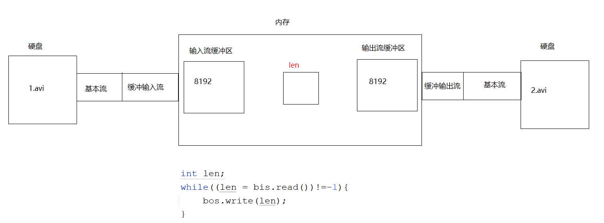
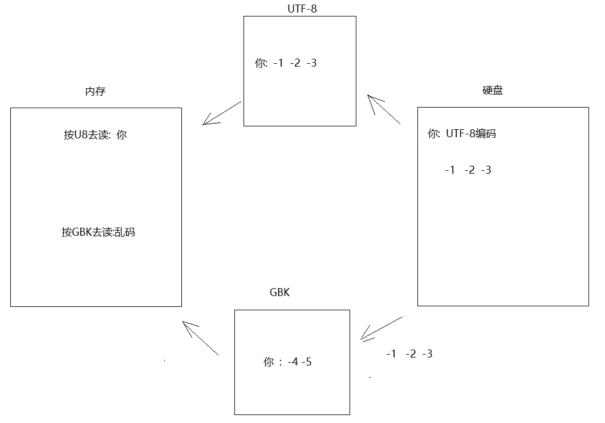
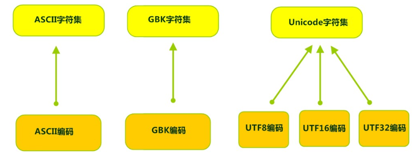
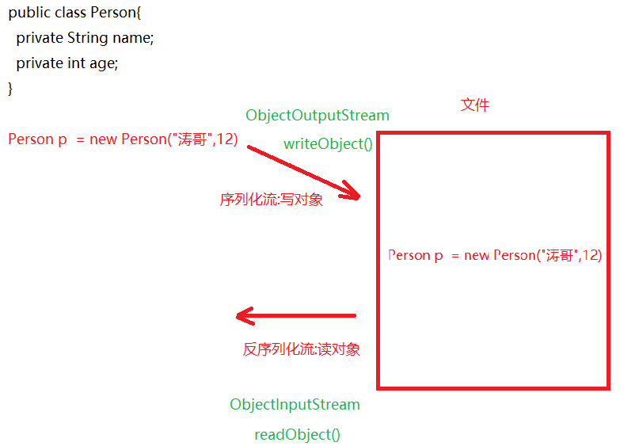
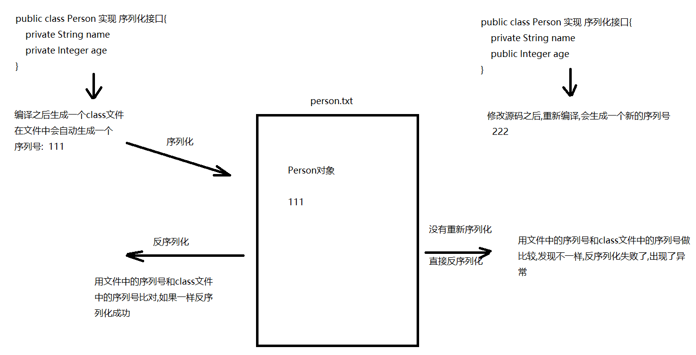
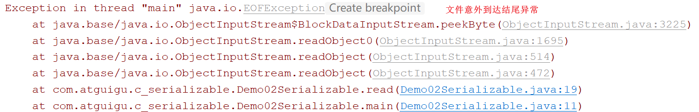
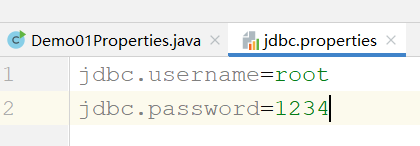
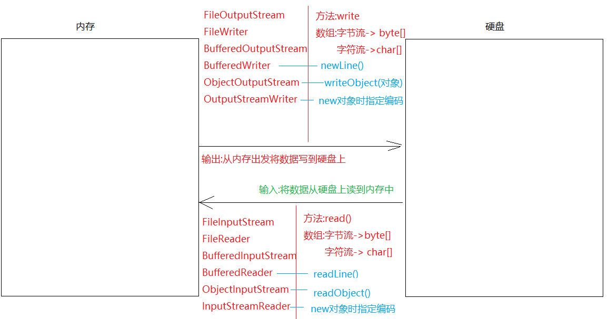

# 	模块22.IO流

```java
模块21回顾:
  1.File:代表的是文件或者文件夹对象
  2.静态成员:
    pathSeparator:获取的是路径和路径之间的分隔符  ;
    separator:获取的是路径名称分隔符 \
  3.构造:
    File(String parent,String child)
    File(File parent,String child)
    File(String path)
  4.获取方法:
    getAbsolutePath()获取绝对路径
    getPath()获取封装路径
    getName()获取文件或者文件夹名称
    length()获取文件长度->字节数
  5.创建功能:
    createNewFile()创建文件
    mkdirs()创建文件夹
  6.删除功能:
    delete()删除文件或者文件夹
  7.判断功能:
    isDirectory()判断是否为文件夹
    isFile()判断是否为文件
    exists()判断文件或者文件夹是否存在
  8.遍历功能:
    list()  listFiles()
  9.IO流四大基类:抽象类
    OutputStream   InputStream Writer Reader
  10.FileOutputStream:字节输出流
     a.构造:
       FileOutputStream(File file)
       FileOutputStream(String path)
       FileOutputStream(String path,boolean append) -> 追加续写
     b.方法:
       write  写一个字节,一个字节数组,字节数组一部分
       close:关流
  11.FileInputStream:字节输入流
     a.构造:
       FileInputStream(File file)
       FileInputStream(String path)
     b.方法:
       read 读一个字节,一个字节数组,一个字节数组一部分
       close:关流
           
  12.FileReader:字符输入流
     a.构造:
       FileReader(File file)
       FileReader(String path)
     b.方法:
       read:一次读一个字符,一个字符数组,一个字符数组一部分
       close: 关流
           
  13.FileWriter:字符输出流 
     a.构造:
       FileWriter(File file)
       FileWriter(String path)
     b.方法:
       write  写一个字符,一个字符数组,字符数组一部分,字符串
       flush:刷新
       close:先刷新后关流
           
模块22重点:
  1.会使用缓冲流:字节和字符
  2.会使用转换流
  3.会实现序列化接口,以及使用序列化流
  4.会使用Properties集合,读取配置文件中的内容
```

# 第一章.字节缓冲流

```java
1.为啥要学字节缓冲流
  之前所写的FileOutputStream,FileInputStream,FileReader,FileWriter这都叫做基本类,其中FileInputStream和FileOutputStream的读写方法都是本地方法(方法声明上带native),本地方法是和系统以及硬盘打交道的,也就是说这两个对象的读和写都是在硬盘之间进行读写的,效率不高;缓冲流中底层带一个长度为8192的数组(缓冲区),此时读和写都是在内存中完成的(在缓冲区之间完成),内存中的读写效率非常高
    
   使用之前需要将基本流包装成缓冲流,其实就new对象时,传递基本流 
    
2.字节缓冲流
  a.BufferedOutputStream:字节缓冲输出流
    构造:BufferedOutputStream(OutputStream out)
    使用:和FileOutputStream一样
        
  b.BufferedInputStream:字节缓冲输入流
    构造:BufferedInputStream(InputStream in)
    使用:和FileInputStream一样   
```

```java
 public class Demo01BufferedInputStream_OutputStream {
    public static void main(String[] args)throws Exception {
        //method01();
        method02();
    }

    //使用字节缓冲流复制文件
    private static void method02()throws Exception {
        long start = System.currentTimeMillis();

        FileInputStream fis = new FileInputStream("E:\\Idea\\io\\1.avi");
        FileOutputStream fos = new FileOutputStream("E:\\Idea\\io\\2.avi");

        BufferedInputStream bis = new BufferedInputStream(fis);
        BufferedOutputStream bos = new BufferedOutputStream(fos);
        //边读编写
        int len;
        while((len = bis.read())!=-1){
            bos.write(len);
        }

        long end = System.currentTimeMillis();

        System.out.println(end-start);

        bos.close();
        bis.close();
    }

    //用基本流复制文件
    private static void method01()throws Exception {
        long start = System.currentTimeMillis();

        FileInputStream fis = new FileInputStream("E:\\Idea\\io\\1.avi");
        FileOutputStream fos = new FileOutputStream("E:\\Idea\\io\\2.avi");
        //边读编写
        int len;
        while((len = fis.read())!=-1){
            fos.write(len);
        }

        long end = System.currentTimeMillis();

        System.out.println(end-start);

        fos.close();
        fis.close();
    }
}
```

> 细节:
>
>   问题1:使用缓冲流的时候,为啥只需要关闭缓冲流,不用单独关闭基本流呢?
>
> ​             原因:缓冲流的close方法底层会自动关闭基本流/?
>
>   问题2:缓冲流底层有数组(缓冲区),都是在内存之间进行读写,那么缓冲流读写的过程是啥样的呢?
>
> ​             注意:先依靠基本流将数据读出来,然后交给缓冲流,由于缓冲流缓冲区是8192,所以每次读取8192个字节放到缓冲区中,然后再将输入流缓冲区中的数据交给输出流缓冲区,然后再利用基本流将数据写到硬盘上
>
> ​            那么在操作代码时len是干啥的呢?其实主要是在两个缓冲区中倒腾数据,将输入流缓冲区中的数据读到,然后写到输出流缓冲区中,等待输出流缓冲区满了,再依靠基本流写到硬盘上;如果输入流缓冲区中的数据读不到了,重新从硬盘上读8192个字节,进入到输入流缓冲区中,继续利用len在两个缓冲区中来回倒腾数据
>
> 


# 第二章.字符缓冲流

```java
我们知道,字符流的基本流底层是有缓冲区的,所以在效率这一块效果不是特别明显,但是不代表不重要,因为我们应该主要学字符缓冲流的两个特有方法
```

## 1.字符缓冲输出流_BufferedWriter

```java
1.构造:
  BufferedWriter(Writer w)
2.方法:
  用起来和FileWriter一样
3.特有方法:
  newLine() 换行
```

```java
public class Demo02BufferedWriter {
    public static void main(String[] args)throws Exception {
        BufferedWriter bw = new BufferedWriter(new FileWriter("module22\\1.txt",true));
        bw.write("床前明月光");
        bw.newLine();
        bw.write("疑是地上霜");
        bw.newLine();
        bw.write("举头望明月");
        bw.newLine();
        bw.write("低头思故乡");
        bw.newLine();
        bw.close();
    }
}

```

## 2.字符缓冲输入流_BufferedReader

```java
1.构造:
  BufferedReader(Reader r)
2.方法:
  用法和FileReader一样
3.特有方法:
  String readLine()-> 一次读一行,如果读到结束标记,返回的是null
```

```java
public class Demo03BufferedReader {
    public static void main(String[] args)throws Exception {
        BufferedReader br = new BufferedReader(new FileReader("module22\\1.txt"));
        /*String s = br.readLine();
        System.out.println(s);

        String s1 = br.readLine();
        System.out.println(s1);

        String s2 = br.readLine();
        System.out.println(s2);

        String s3 = br.readLine();
        System.out.println(s3);

        String s4 = br.readLine();
        System.out.println(s4);*/

        //定义一个字符串,接收读取的内容
        String line = null;
        while((line = br.readLine())!=null){
            System.out.println(line);
        }
        br.close();
    }
}
```

# 第三章.转换流

## 1.字符编码

计算机中储存的信息都是用二进制数表示的，而我们在屏幕上看到的数字、英文、标点符号、汉字等字符是二进制数转换之后的结果。[按照某种规则，将字符存储到计算机中，称为**编码**] 。反之，将存储在计算机中的二进制数按照某种规则解析显示出来，称为**解码** 。比如说，按照A规则存储，同样按照A规则解析，那么就能显示正确的文本f符号。反之，按照A规则存储，再按照B规则解析，就会导致乱码现象。



- **字符编码`Character Encoding`** : 就是一套自然语言的字符与二进制数之间的对应规则。

## 2.字符集

- **字符集 `Charset`**：也叫编码表。是一个系统支持的所有字符的集合，包括各国家文字、标点符号、图形符号、数字等。

计算机要准确的存储和识别各种字符集符号，需要进行字符编码，一套字符集必然至少有一套字符编码。常见字符集有ASCII字符集、GBK字符集、Unicode字符集等。



可见，当指定了**编码**，它所对应的**字符集**自然就指定了，所以**编码**才是我们最终要关心的。

- **ASCII字符集** ：
  - ASCII（American Standard Code for Information Interchange，美国信息交换标准代码）是基于拉丁字母的一套电脑编码系统，用于显示现代英语，主要包括控制字符（回车键、退格、换行键等）和可显示字符（英文大小写字符、阿拉伯数字和西文符号）。
  - 基本的ASCII字符集，使用7位（bits）表示一个字符，共128字符。ASCII的扩展字符集使用8位（bits）表示一个字符，共256字符，方便支持欧洲常用字符。
- **ISO-8859-1字符集**：
  - 拉丁码表，别名Latin-1，用于显示欧洲使用的语言，包括荷兰、丹麦、德语、意大利语、西班牙语等。
  - ISO-8859-1使用单字节编码，兼容ASCII编码。
- **GBxxx字符集**：
  - GB就是国标的意思，是为了显示中文而设计的一套字符集。
  - **GB2312**：简体中文码表。一个小于127的字符的意义与原来相同。但两个大于127的字符连在一起时，就表示一个汉字，这样大约可以组合了包含7000多个简体汉字，此外数学符号、罗马希腊的字母、日文的假名们都编进去了，连在ASCII里本来就有的数字、标点、字母都统统重新编了两个字节长的编码，这就是常说的"全角"字符，而原来在127号以下的那些就叫"半角"字符了。
  - **GBK**：最常用的中文码表。是在GB2312标准基础上的扩展规范，使用了双字节编码方案，共收录了21003个汉字，完全兼容GB2312标准，同时支持繁体汉字以及日韩汉字等。
  - **GB18030**：最新的中文码表。收录汉字70244个，采用多字节编码，每个字可以由1个、2个或4个字节组成。支持中国国内少数民族的文字，同时支持繁体汉字以及日韩汉字等。
- **Unicode字符集** ：
  - Unicode编码系统为表达任意语言的任意字符而设计，是业界的一种标准，也称为统一码、标准万国码。
  - 它最多使用4个字节的数字来表达每个字母、符号，或者文字。有三种编码方案，UTF-8、UTF-16和UTF-32。最为常用的UTF-8编码。
  - UTF-8编码，可以用来表示Unicode标准中任何字符，它是电子邮件、网页及其他存储或传送文字的应用中，优先采用的编码。互联网工程工作小组（IETF）要求所有互联网协议都必须支持UTF-8编码。所以，我们开发Web应用，也要使用UTF-8编码。它使用一至四个字节为每个字符编码，编码规则：
    1. 128个US-ASCII字符，只需一个字节编码。
    2. 拉丁文等字符，需要二个字节编码。 
    3. 大部分常用字（含中文），使用三个字节编码。
    4. 其他极少使用的Unicode辅助字符，使用四字节编码。

```java
1.想要不乱码,编码和解码遵循的规则(字符编码)要一致 -> 想要不乱码,最重要的是先知道这个字符按照什么编码去存的
2.UTF-8中一个汉字占3个字节
  GBK中一个汉字占2个字节
```

## 3.转换流_InputStreamReader

```java
1.字节流读取中文在编码一致的情况,也不要边读边看,因为如果字节读不准,读不全,输出的内容有可能会出现乱码
2.所以,我们学了字符流,字符流读取文本文档中的内容如果编码一致,就不会出现乱码问题了
3.但是如果编码不一致,字符流读取文本文档中的内容也有可能出现乱码
```

```java
1.概述:是字节流通向字符流的桥梁 -> 读数据
2.构造:
  InputStreamReader(InputStream in,String charsetName)
                                   charsetName:指定编码,不区分大小写
3.作用:
  可以直接指定编码,按照指定的编码去读内容
4.用法:
  基本用法和FileReader一样
```

```java
public class Demo01InputStreamReader {
    public static void main(String[] args)throws Exception {
        InputStreamReader isr =
                new InputStreamReader(new FileInputStream("E:\\Idea\\io\\1.txt"),"gbk");
        int data = isr.read();
        System.out.println((char)data);
        isr.close();
    }
}
```

## 4.转换流_OutputStreamWriter

```java
1.概述:是字符流通向字节流的桥梁
2.构造:
  OutputStreamWriter(OutputStream out,String charsetName)
                   
3.作用:
  按照指定的编码规则去存数据
      
4.用法:
  和FileWriter一样
```

```java
public class Demo02OutputStreamWriter {
    public static void main(String[] args)throws Exception {
        OutputStreamWriter osw =
                new OutputStreamWriter(new FileOutputStream("E:\\Idea\\io\\1.txt"),"gbk");
        osw.write("你好");
        osw.close();
    }
}
```

# 第四章.序列化流

## 一.序列化流和反序列化流介绍

```java
1.作用:读写对象
2.两个对象:
  a.ObjectOutputStream -> 序列化流 -> 写对象
  b.ObjectInputStream -> 反序列化流 -> 读对象  
3.注意:
  我们将对象序列化到文件中,我们打开文件看不懂,这就对了,很多时候,我们操作的数据不能随便让别人看懂,不然别人就随意改动了,我们只需要将这些看不懂的内容成功读回来即可
      
  应用场景:比如玩儿游戏会对英雄存档,那么退出的时候英雄变成对象,将人物的属性变成对象的成员变量值,然后存到文件中,再次打开游戏,直接从文件中将这些人物对象读回来,将对象以及对象中的属性还原    
```



## 二.序列化流_ObjectOutputStream

```java
1.作用:写对象
2.构造:
  ObjectOutputStream(OutputStream out)
3.方法:
  writeObject(Object obj) -> 写对象
4.注意:
  想要将对象序列化到文件中,被序列化的对象需要实现Serializable接口
```

```java
public class Person implements Serializable {
    private String name;
    private Integer age;

    public Person() {
    }

    public Person(String name, Integer age) {
        this.name = name;
        this.age = age;
    }

    public String getName() {
        return name;
    }

    public void setName(String name) {
        this.name = name;
    }

    public Integer getAge() {
        return age;
    }

    public void setAge(Integer age) {
        this.age = age;
    }

    @Override
    public String toString() {
        return "Person{" +
                "name='" + name + '\'' +
                ", age=" + age +
                '}';
    }
}

```

```java
    //序列化
    private static void write()throws Exception {
        ObjectOutputStream oos =
                new ObjectOutputStream(new FileOutputStream("module22\\person.txt"));
        Person p1 = new Person("涛哥", 12);
        oos.writeObject(p1);
        oos.close();
    }
```

## 三.反序列化_ObjectInputStream

```java
1.作用:读对象
2.构造:
  ObjectInputStream(InputStream in)
3.方法:
  Object readObject()
```

```java
    private static void read()throws Exception {
        ObjectInputStream ois =
                new ObjectInputStream(new FileInputStream("module22\\person.txt"));
        Person person = (Person) ois.readObject();
        System.out.println(person);
        ois.close();
    }
```

## 四.不想被序列化操作(了解)

```java
transient
```

## 五.反序列化时出现的问题以及分析以及解决

```java
 问题描述:
   序列化之后,修改源码,修改完之后没有重新序列化,直接反序列化了,就会出现了序列号冲突问题:
   InvalidClassException
```



```java
解决:将序列号定死,后面不管怎么修改源码,序列号都是这一个
    在被序列化的对象中加上一个public static final long 的变量,并为其赋值
```

```java
public class Person implements Serializable {
    public static final long serialVersionUID = 42L;
    private String name;
    public Integer age;

    public Person() {
    }

    public Person(String name, Integer age) {
        this.name = name;
        this.age = age;
    }

    public String getName() {
        return name;
    }

    public void setName(String name) {
        this.name = name;
    }

    public Integer getAge() {
        return age;
    }

    public void setAge(Integer age) {
        this.age = age;
    }

    @Override
    public String toString() {
        return "Person{" +
                "name='" + name + '\'' +
                ", age=" + age +
                '}';
    }
}

```

> 将一个对象实现一个序列化接口,我们将来才能让这个对象变成二进制,在网络上传输

## 六.经验问题

```java
1.问题:循环读取的次数和存储对象的个数不对应,就会出现EOFException
2.解决:(涛哥说一种方式,其他方式也有,同学们都想一下还有什么方式)    
```

```java
public class Demo02Serializable {
    public static void main(String[] args) throws Exception {
        //write();
        read();
    }

    //反序列化流
    private static void read() throws Exception {
        ObjectInputStream ois =
                new ObjectInputStream(new FileInputStream("module22\\person.txt"));
       /* for (int i = 0; i < 4; i++) {
            Person person = (Person) ois.readObject();
            System.out.println(person);
        }*/
        //将集合反序列化出来即可
        ArrayList<Person> list = (ArrayList<Person>) ois.readObject();
        for (Person person : list) {
            System.out.println(person);
        }
        ois.close();
    }

    //序列化
    private static void write() throws Exception {
        ObjectOutputStream oos =
                new ObjectOutputStream(new FileOutputStream("module22\\person.txt"));
        //创建一个集合,存储多个Person对象
        ArrayList<Person> list = new ArrayList<>();
        Person p1 = new Person("涛哥", 12);
        Person p2 = new Person("三上", 30);
        Person p3 = new Person("金莲", 24);
        //将对象存储到集合中
        list.add(p1);
        list.add(p2);
        list.add(p3);
        oos.writeObject(list);
        oos.close();
    }
}

```



# 第五章.打印流_PrintStream(了解)

## 1.PrintStream打印流基本使用

```java
 1.构造:
   PrintStream(String fileName)
 2.方法:
   a.println(): 原样输出,自带换行效果
   b.print():  原样输出,不带换行效果    
```

```java
public class Demo01PrintStream {
    public static void main(String[] args)throws Exception{
        PrintStream ps = new PrintStream("module22\\printstream.txt");
        ps.println("涛哥是一个大帅哥");
        ps.println("涛哥是一个小鲜肉");
        ps.println("涛哥和金莲不为人知的故事");
        ps.close();
    }
}

```

```java
改变流向:
  1.什么叫做改变流向:
    System.out.println()-> 本身是输出到控制台上
    改变流向:可以让输出语句从控制台上输出改变成往指定文件中输出
        
  2.方法:System中的方法:
    static void setOut(PrintStream out) -> 改变流向 ->让输出语句从控制台输出转移到指定文件中
```

```java
public class Demo02PrintStream {
    public static void main(String[] args)throws Exception{
        PrintStream ps = new PrintStream("module22\\log.txt");

        //改变流向
        System.setOut(ps);

        System.out.println("这个错误是今天下午2点出现的");
        System.out.println("这个错误是文件意外到达结尾异常");
        System.out.println("出现的原因是循环反序列化次数不对");
        ps.close();
    }
}

```

> 使用场景:
>
>   可以将输出的内容以及详细信息放到日志文件中,永久保存
>
>   以后我们希望将输出的内容永久保存,但是输出语句会将结果输出到控制台上,控制台是临时显示,如果有新的程序运行,新程序的运行结果会覆盖之前的结果,这样无法达到永久保存,到时候我们想看看之前的运行结果信息就看不到了,所以我们需要将输出的结果保存到日志文件中,就可以使用setOut改变流向

## 2.PrintStream打印流完成续写

```java
PrintStream(OutputStream out)  -> 可以依靠OutputStream的续写功能完成打印流续写
```

```java
public class Demo03PrintStream {
    public static void main(String[] args)throws Exception{
        PrintStream ps = new PrintStream(new FileOutputStream("module22\\log.txt",true));

        //改变流向
        System.setOut(ps);

        System.out.println("这个错误是今天下午2点出现的");
        System.out.println("这个错误是文件意外到达结尾异常");
        System.out.println("出现的原因是循环反序列化次数不对");
        ps.close();
    }
}

```

# 第六章.Properties集合

### 1.Properties结合IO流使用方法

```java
回顾:
  1.概述: Properties extends Hashtable
  2.特点:
    a.无序,无索引
    b.key唯一,value可重复
    c.线程安全
    d.key和value默认类型都是String
        
  3.特有方法:
    setProperty(String key,String value) 存键值对
    getProperty(String key) -> 根据key获取value
    stringPropertyNames()-> 获取所有的key存放到set集合中
    load(InputStream in) -> 将流中的数据加载到Properties集合中
```

```java
public class Demo01Properties {
    public static void main(String[] args) {
        Properties properties = new Properties();
        properties.setProperty("username","root");
        properties.setProperty("password","1234");

        Set<String> set = properties.stringPropertyNames();
        for (String key : set) {
            System.out.println(properties.getProperty(key));
        }
    }
}

```

```java
使用场景:配合配置文件使用
    
注意:
   将来我们不能将很多的硬数据放到源码中,比如用户名和密码这些数据,因为将来我们有可能换用户名或者密码,如果一换,我们就需要去源码中修改,将来我们的类和类之间都有联系,有可能牵一发动全身,所以我们需要将这些数据提取出来,放到文件中,改的时候直接去文件中改,源码不需要改动
```

```java
创建配置文件:
  1.在模块下右键 -> file -> 取名为xxx.properties
  2.在xxx.properties文件中写配置数据
    a.key和value都是key=value形式
    b.key和value都是String的,但是不要加双引号
    c.每个键值对写完之后,需要换行再写下一对
    d.键值对之间最好不要有空格(空格可以有,但是不建议写)
    e.键值对中建议不要使用中文(中文可以有,但是直接读取会乱码,需要转换流转码)  
```

```properties
jdbc.username=root
jdbc.password=1234
```



```java
public class Demo02Properties {
    public static void main(String[] args)throws Exception {
        Properties properties = new Properties();
        FileInputStream fis = new FileInputStream("module22\\jdbc.properties");
        properties.load(fis);

        Set<String> set = properties.stringPropertyNames();
        for (String key : set) {
            System.out.println(key+"..."+properties.getProperty(key));
        }
    }
}

```

# 第七章.Commons-io工具包

## 一.介绍

```java
IO技术开发中，代码量很大，而且代码的重复率较高。如果我们要遍历目录，拷贝目录就需要使用方法的递归调用，也增大了程序的复杂度。

Apache软件基金会，开发了IO技术的工具类`commonsIO`，大大简化IO开发。
```

## 二.添加第三方jar包

```java
1.Apache软件基金会属于第三方(Oracle公司是第一方,我们自己是第二方,其他的都是第三方),我们使用第三方开发出来的工具,都需要添加第三方提供给我们的jar包
    
2.jar包:本身是一个压缩包,里面转的都是class文件,我们想使用jar包中的工具类,就需要将相应的jar包解压到我们的当前项目下
    
3.怎么引入jar包
  a.在当前模块下创建文件夹,取名为lib或者libs
  b.将准备好的jar包,放到此文件夹下
  c.对着jar包,右键 -> add as library (如果我们想将lib下所有的jar包一起解压,我们就直接对着lib文件夹右键)
  d.level可以选择module,此时上面叫做name的输入框会变成空的,不用管
  e.直接点ok  
```

## 三.工具包的使用

```java
IOUtils类
- 静态方法：IOUtils.copy(InputStream in,OutputStream out)传递字节流，实现文件复制。
- 静态方法：IOUtils.closeQuietly(任意流对象)悄悄的释放资源，自动处理close()方法抛出的异常。
```

```java
public class Demo01IOUtils {
    public static void main(String[] args) /*throws Exception*/{
        //- 静态方法：IOUtils.copy(InputStream in,OutputStream out)传递字节流，实现文件复制。
        //IOUtils.copy(new FileInputStream("E:\\Idea\\io\\8.jpg"),new FileOutputStream("E:\\Idea\\io\\孝敏.jpg"));
        //- 静态方法：IOUtils.closeQuietly(任意流对象)悄悄的释放资源，自动处理close()方法抛出的异常。
        FileWriter fw = null;
        try{
            fw = new FileWriter("module22\\commons.txt");
            fw.write("你好");
        }catch (Exception e){
            e.printStackTrace();
        }finally {
            if (fw!=null){
                IOUtils.closeQuietly(fw);
            }
        }
    }
}
```

```java
FileUtils类

- 静态方法：FileUtils.copyDirectoryToDirectory(File src,File dest);
           传递File类型的目录，进行整个目录的复制，自动进行递归遍历。
           
           参数:
             src:要复制的文件夹路径
             dest:要将文件夹粘贴到哪里去
             
- 静态方法：writeStringToFile(File file,String str)写字符串到文本文件中。
- 静态方法：String readFileToString(File file)读取文本文件，返回字符串。
```

```java
public class Demo02FileUtils {
    public static void main(String[] args)throws Exception {
       /* - 静态方法：FileUtils.copyDirectoryToDirectory(File src,File dest);
        传递File类型的目录，进行整个目录的复制，自动进行递归遍历。

        参数:
        src:要复制的文件夹路径
        dest:要将文件夹粘贴到哪里去*/
        //FileUtils.copyDirectoryToDirectory(new File("E:\\Idea\\io\\aa"),new File("E:\\Idea\\io\\cc"));

        //- 静态方法：writeStringToFile(File file,String str)写字符串到文本文件中。
        //FileUtils.writeStringToFile(new File("module22\\commons.txt"),"haha");
        //- 静态方法：String readFileToString(File file)读取文本文件，返回字符串。
        String s = FileUtils.readFileToString(new File("module22\\commons.txt"));
        System.out.println(s);
    }
}

```

# 第八章.如何快速记忆IO流



