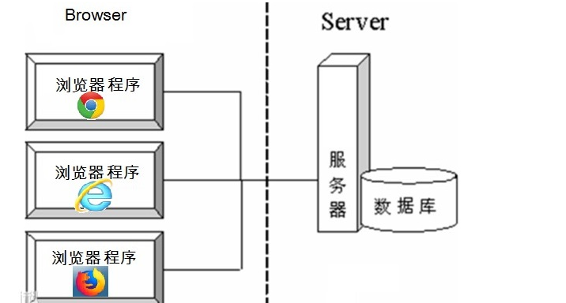
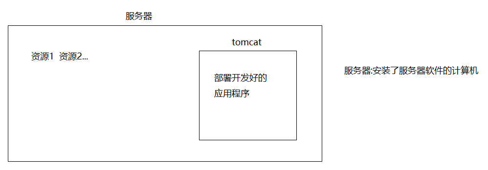
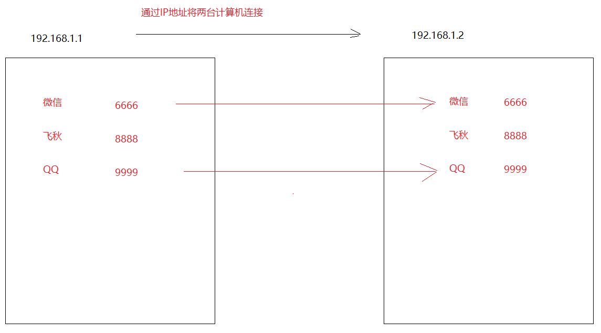
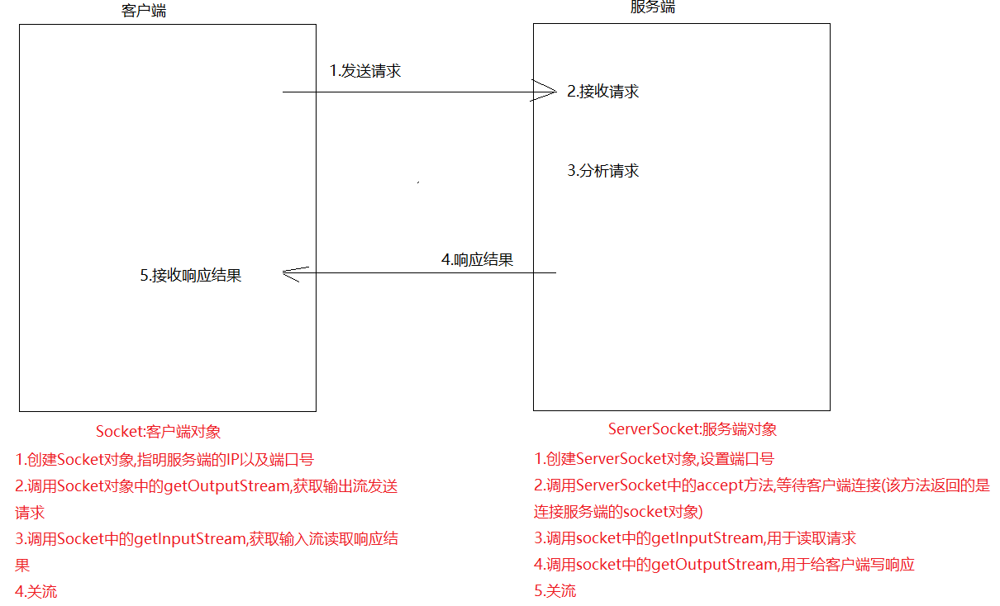
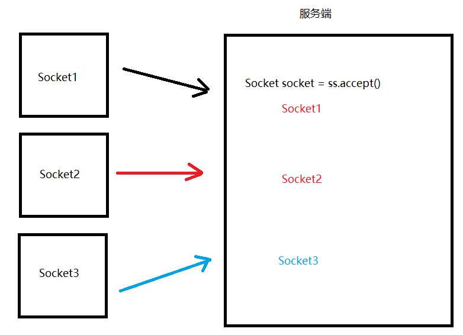
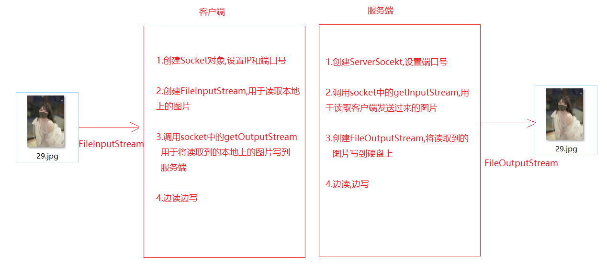
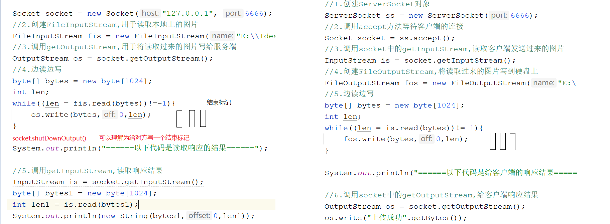
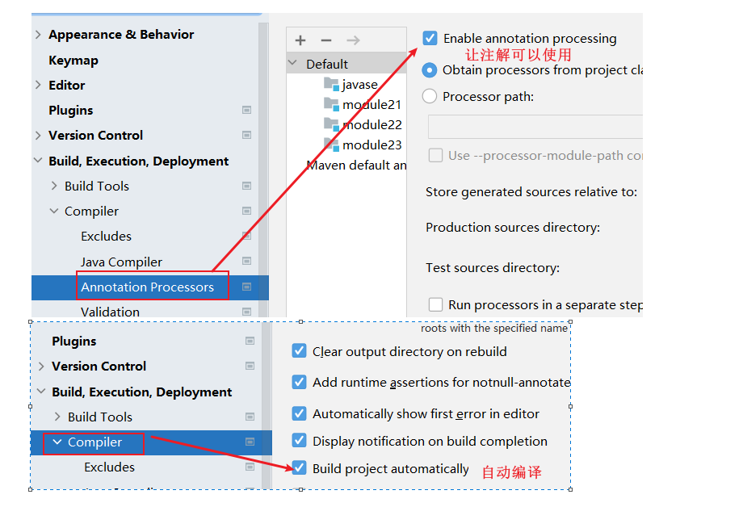

# 模块23_网络编程&正则表达式&设计模式

```java
模块22回顾
   1.字节缓冲流:
     BufferedOutputStream -> 用法和FileOutputStream一样
     BufferedInputStream -> 用法和FIleInputStream一样
         
   2.字符缓冲流:
     BufferedWriter -> 用法和FileWriter一样
           特有方法:newLine()换行
     BufferedReader -> 用法和FileReader一样
           特有方法:readLine()一次读一行
               
   3.转换流:
     OutputStreamWriter(OutputStream out,String charsetName)
     InputStreamReader(InputStream in,String charsetName)
         
   4.序列化流:读写对象
     ObjectOutputStream(OutputStream out) -> 写对象
           方法:writeObject(对象)
     ObjectIntputStream(InputStream in) -> 读对象
           方法:readObject()
               
   5.打印流:PrintStream
     方法:println 和 print
     改变流向:System中的setOut方法
         
   6.Properties集合:load(InputStream in) -> 将流中的数据加载到集合中,结合配置文件使用
       
   7.Commons-IO->FileUtils和IOUtils
       
模块23重点:
   1.了解三次握手和四次挥手
   2.客户端和服务端的交互过程
   3.会使用TCP协议写一个简单的程序
   4.知道正则表达式的基本使用
   5.会单例模式
   6.会Lombok的使用
```

# 第一章.网络编程

```java
概述:在网络通信协议下,不同计算机上运行的程序,进行数据传输
    比如:通信,视频通话,网游,邮件等
    只要是计算机之间通过网络进行数据传输,就有网络编程的存在
```

## 1.软件结构

- **C/S结构** ：全称为Client/Server结构，是指客户端和服务器结构。常见程序有ＱＱ、红蜘蛛、飞秋等软件。


**B/S结构** ：全称为Browser/Server结构，是指浏览器和服务器结构。常见浏览器有IE、谷歌、火狐等。



两种架构各有优势，但是无论哪种架构，都离不开网络的支持。**网络编程**，就是在一定的协议下，实现两台计算机的通信的程序。

## 2.服务器概念

```java
1.概述:安装了服务器软件的计算机
2.后面马上要见到的服务器软件:tomcat    
```

> 网络通信协议:两台计算机在做数据交互时要遵守的规则,协议会对数据的格式,速率等进行规定,只有都遵守了这个协议,才能完成数据交互
>
> 两台计算机想完成数据交互,需要遵守网络通信协议



## 3.通信三要素

```java
[IP地址]:计算机的唯一标识,用于两台计算机之间的连接

      a.概述:指互联网协议地址（Internet Protocol Address），俗称IP
            计算机的唯一标识
      b.作用:可用于计算机和计算机之间的连接
      c.IPV4
        32位的二进制数，通常被分为4个字节，表示成a.b.c.d 的形式，例如192.168.65.100 。其中a、b、c、d都是0~255之间的十进制整数，那么最多可以表示42亿个。
        IPV6
        为了扩大地址空间，拟通过IPv6重新定义地址空间，采用128位地址长度，每16个字节一组，分成8组十六进制数，表示成ABCD:EF01:2345:6789:ABCD:EF01:2345:6789->号称能给地球上的每一粒沙子分配一个IP地址
        
      d.查看ip的命令:ipconfig
        测试是否能连接其他计算机的命令:ping ip地址
        
      e:特殊的网址:代表的是本机地址,到了哪里都不会变,代表自己
        127.0.0.1 -> 固定不变
        localhost
          
        localhost(主机名,写的是服务器的IP):端口号/应用名称/资源
          
        localhost:8080/应用名称/index.html
        

[协议]
     TCP:面向连接协议
         需要先确认连接,才能进行数据交互
         三次握手:
            - 第一次握手，客户端向服务器端发出连接请求，等待服务器确认。
            - 第二次握手，服务器端向客户端回送一个响应，通知客户端收到了连接请求。
            - 第三次握手，客户端再次向服务器端发送确认信息，确认连接。
            
         好处:数据安全,能给数据的传输提供一个安全的传输环境
         坏处:效率低
     
     UDP:面向无连接协议
         好处:效率高
         坏处:传输的数据不安全,容易丢失数据包

[端口号]
   每一个应用程序的唯一标识
  
  用两个字节表示的整数，它的取值范围是0~65535。其中，0~1023之间的端口号用于一些知名的网络服务和应用，普通的应用程序需要使用1024以上的端口号。如果端口号被另外一个服务或应用所占用，会导致当前程序启动失败。
```



> TCP协议中的三次握手和四次挥手
>
> ```java
> 三次握手:
> - 第一次握手，客户端向服务器端发出连接请求，等待服务器确认。
> - 第二次握手，服务器端向客户端回送一个响应，通知客户端收到了连接请求。
> - 第三次握手，客户端再次向服务器端发送确认信息，确认连接。
> ```
>
> ```java
> 四次挥手:
> - 第一次挥手：客户端向服务器端提出结束连接，让服务器做最后的准备工作。此时，客户端处于半关闭状态，即表示不再向服务器发送数据了，但是还可以接受数据。
>     
> - 第二次挥手：服务器接收到客户端释放连接的请求后，会将最后的数据发给客户端。并告知上层的应用进程不再接收数据。
>     
> - 第三次挥手：服务器发送完数据后，会给客户端发送一个释放连接的报文。那么客户端接收后就知道可以正式释放连接了。
>     
> - 第四次挥手：客户端接收到服务器最后的释放连接报文后，要回复一个彻底断开的报文。这样服务器收到后才会彻底释放连接。这里客户端，发送完最后的报文后，会等待2MSL，因为有可能服务器没有收到最后的报文，那么服务器迟迟没收到，就会再次给客户端发送释放连接的报文，此时客户端在等待时间范围内接收到，会重新发送最后的报文，并重新计时。如果等待2MSL后，没有收到，那么彻底断开。
> ```

## 4.UDP协议编程

```java
1.DatagramSocket -> 好比寄快递找的快递公司
2.DatagramPacket -> 好比快递公司打包
```

### 4.1.客户端(发送端)

```java
1.创建DatagramSocket对象(快递公司)
  a.空参:端口号从可用的端口号中随机一个使用
  b.有参:自己指定
2.创建DatagramPacket对象,将数据进行打包
  a.要发送的数据-> byte[]
  b.指定接收端的IP
  c.指定接收端的端口号
3.发送数据
4.释放资源
```

```java
public class Send {
    public static void main(String[] args) throws Exception{
        /*1.创建DatagramSocket对象(快递公司)
        a.空参:端口号从可用的端口号中随机一个使用
        b.有参:自己指定*/
        DatagramSocket socket = new DatagramSocket();
       /* 2.创建DatagramPacket对象,将数据进行打包
        a.要发送的数据-> byte[]
        b.指定接收端的IP
        c.指定接收端的端口号*/
        byte[] bytes = "你好呀".getBytes();
        InetAddress ip = InetAddress.getByName("127.0.0.1");
        int port = 6666;
        DatagramPacket dp = new DatagramPacket(bytes, bytes.length, ip, port);
        //3.发送数据
        socket.send(dp);
        //4.释放资源
        socket.close();
    }
}

```

> 直接执行发现,发送端在没有接收端的情况下,不会报错,因为UDP协议是面向无连接协议,不管有没有接收端,照发不误

### 4.2.服务端(接收端)

```java
1.创建DatagramSocket对象,指定服务端的端口号
2.接收数据包
3.解析数据包
4.释放资源    
```

```java
public class Receive {
    public static void main(String[] args) throws Exception{
        //1.创建DatagramSocket对象,指定服务端的端口号
        DatagramSocket socket = new DatagramSocket(6666);
        //2.接收数据包
        byte[] bytes = new byte[1024];//用于保存接收过来的数据
        DatagramPacket dp = new DatagramPacket(bytes, bytes.length);
        socket.receive(dp);
        //3.解析数据包
        byte[] data = dp.getData();//接收的数据
        int len = dp.getLength();//从数据包中获取多少个数据
        InetAddress address = dp.getAddress();//获取发送端的主机
        int port = dp.getPort();//发送端的端口号
        System.out.println(new String(data,0,len));
        System.out.println(address+"..."+port);
        //4.释放资源
        socket.close();
    }
}

```

## 5.TCP协议编程






### 4.1.编写客户端

```java
1.创建Socket对象,指明服务端的ip以及端口号
2.调用socket中的getOutputStream,往服务端发送请求
3.调用socket中的getInputStream,读取服务端响应回来的数据
4.关流
```

```java
public class Client {
    public static void main(String[] args)throws Exception {
        //1.创建Socket对象,指明服务端的ip以及端口号
        Socket socket = new Socket("127.0.0.1", 6666);
        //2.调用socket中的getOutputStream,往服务端发送请求
        OutputStream os = socket.getOutputStream();
        os.write("我想下载一个小电影".getBytes());
        //3.调用socket中的getInputStream,读取服务端响应回来的数据
        InputStream is = socket.getInputStream();
        byte[] bytes = new byte[1024];
        int len = is.read(bytes);
        System.out.println(new String(bytes,0,len));
        //4.关流
        is.close();
        os.close();
        socket.close();
    }
}

```

### 4.2.编写服务端

```java
1.创建ServerSocket对象,设置端口号
2.调用ServerSocket中的accept方法,等待客户端连接,返回Socket对象
3.调用socket中的getInputStream,用于读取客户端发送过来的数据
4.调用socket中的getOutputStream,用于给客户端响应数据
5.关闭资源
```

```java
public class Server {
    public static void main(String[] args)throws Exception {
        //1.创建ServerSocket对象,设置端口号
        ServerSocket ss = new ServerSocket(6666);
        //2.调用ServerSocket中的accept方法,等待客户端连接,返回Socket对象
        Socket socket = ss.accept();
        //3.调用socket中的getInputStream,用于读取客户端发送过来的数据
        InputStream is = socket.getInputStream();
        byte[] bytes = new byte[1024];
        int len = is.read(bytes);
        System.out.println(new String(bytes,0,len));
        //4.调用socket中的getOutputStream,用于给客户端响应数据
        OutputStream os = socket.getOutputStream();
        os.write("给你一个小电影".getBytes());
        //5.关闭资源
        os.close();
        is.close();
        socket.close();
        ss.close();
    }
}

```

## 6.文件上传



### 6.1.文件上传客户端以及服务端实现

```java
public class Client {
    public static void main(String[] args)throws Exception {
        //1.创建Socket对象
        Socket socket = new Socket("127.0.0.1", 6666);
        //2.创建FileInputStream,用于读取本地上的图片
        FileInputStream fis = new FileInputStream("E:\\Idea\\io\\24.jpg");
        //3.调用getOutputStream,用于将读取过来的图片写给服务端
        OutputStream os = socket.getOutputStream();
        //4.边读边写
        byte[] bytes = new byte[1024];
        int len;
        while((len = fis.read(bytes))!=-1){
            os.write(bytes,0,len);
        }

        //给服务端写一个结束标记
        socket.shutdownOutput();
        System.out.println("======以下代码是读取响应的结果======");

        //5.调用getInputStream,读取响应结果
        InputStream is = socket.getInputStream();
        byte[] bytes1 = new byte[1024];
        int len1 = is.read(bytes1);
        System.out.println(new String(bytes1,0,len1));

        //6.关流
        is.close();
        os.close();
        fis.close();
        socket.close();
    }
}

```

```java
public class Server {
    public static void main(String[] args)throws Exception {
        //1.创建ServerSocket对象
        ServerSocket ss = new ServerSocket(6666);
        //2.调用accept方法等待客户端的连接
        Socket socket = ss.accept();
        //3.调用socket中的getInputStream,读取客户端发送过来的图片
        InputStream is = socket.getInputStream();

        /*
          UUID调用randomUUID(),再调用toString,将其转成String
         */
        String s = UUID.randomUUID().toString();
        String name = s + System.currentTimeMillis();

        //4.创建FileOutputStream,将读取过来的图片写到硬盘上
        FileOutputStream fos = new FileOutputStream("E:\\Idea\\io\\upload\\"+name+".jpg");
        //5.边读边写
        byte[] bytes = new byte[1024];
        int len;
        while((len = is.read(bytes))!=-1){
            fos.write(bytes,0,len);
        }

        System.out.println("======以下代码是给客户端的响应结果======");

        //6.调用socket中的getOutputStream,给客户端响应结果
        OutputStream os = socket.getOutputStream();
        os.write("上传成功".getBytes());
        //7.关流
        os.close();
        fos.close();
        is.close();
        socket.close();
        ss.close();
    }
}

```




> ```java
> public class Demo01UUID {
>     public static void main(String[] args) {
>         String string = UUID.randomUUID().toString();//生成一个十六进制的随机数
>         System.out.println("string = " + string);
>     }
> }
> ```

### 6.2.文件上传服务端实现(多线程)

```java
public class ServerThread {
    public static void main(String[] args) throws Exception {
        //1.创建ServerSocket对象
        ServerSocket ss = new ServerSocket(6666);

        while (true) {
            //2.调用accept方法等待客户端的连接
            Socket socket = ss.accept();

            new Thread(new Runnable() {
                @Override
                public void run() {
                    InputStream is = null;
                    FileOutputStream fos = null;
                    OutputStream os = null;
                    try {
                        //3.调用socket中的getInputStream,读取客户端发送过来的图片
                        is = socket.getInputStream();

        /*
          UUID调用randomUUID(),再调用toString,将其转成String
         */
                        String s = UUID.randomUUID().toString();
                        String name = s + System.currentTimeMillis();

                        //4.创建FileOutputStream,将读取过来的图片写到硬盘上
                       fos = new FileOutputStream("E:\\Idea\\io\\upload\\" + name + ".jpg");
                        //5.边读边写
                        byte[] bytes = new byte[1024];
                        int len;
                        while ((len = is.read(bytes)) != -1) {
                            fos.write(bytes, 0, len);
                        }

                        System.out.println("======以下代码是给客户端的响应结果======");

                        //6.调用socket中的getOutputStream,给客户端响应结果
                        os = socket.getOutputStream();
                        os.write("上传成功".getBytes());

                    } catch (Exception e) {
                        e.printStackTrace();
                    }finally {
                        //7.关流
                       CloseUtils.closeQ(socket,fos,is,os);
                    }

                }
            }).start();

        }

    }
}

```

```java
public class CloseUtils {
    private CloseUtils(){

    }
    public static void closeQ(Socket socket, FileOutputStream fos, InputStream is, OutputStream os){
        if (os!=null){
            try {
                os.close();
            } catch (IOException e) {
                throw new RuntimeException(e);
            }
        }

        if (fos!= null){
            try {
                fos.close();
            } catch (IOException e) {
                throw new RuntimeException(e);
            }
        }

        if (is!=null){
            try {
                is.close();
            } catch (IOException e) {
                throw new RuntimeException(e);
            }
        }

        if (socket!=null){
            try {
                socket.close();
            } catch (IOException e) {
                throw new RuntimeException(e);
            }
        }
    }
}


```

# 第二章.正则表达式

## 1.正则表达式的概念及演示

```java
1.概述:正则表达式是一个具有特殊规则的字符串
2.作用:校验
  比如:校验手机号,身份证号,密码,用户名,邮箱等
3.String中有一个校验正则的方法:
  boolean matches(String regex)  校验字符串是否符合指定的regex的规则
4.比如:校验QQ号(不能以0开头,必须都是数字,必须是5-15位的)      
```

```java
public class Demo01Regex {
    public static void main(String[] args) {
        Scanner scanner = new Scanner(System.in);
        String data = scanner.next();
        //boolean result01 = method01(data);
        //System.out.println("result01 = " + result01);
        boolean result02 = method02(data);
        System.out.println("result02 = " + result02);
    }

    private static boolean method02(String data) {
        boolean result = data.matches("[1-9][0-9]{4,14}");
        return result;
    }

    private static boolean method01(String data) {
        //不能是0开头的
        if (data.startsWith("0")) {
            return false;
        }

        //必须都是数字
        char[] chars = data.toCharArray();
        for (char aChar : chars) {
            if (aChar < '0' || aChar > '9') {
                return false;
            }
        }

        //必须是5-15位
        if (data.length()<5 || data.length()>15){
            return false;
        }

        return true;
    }
}
```

## 2.正则表达式-字符类

```java
java.util.regex.Pattern:正则表达式的编译表示形式。
    正则表达式-字符类:[]表示一个区间,范围可以自己定义
        语法示例：
        1. [abc]：代表a或者b，或者c字符中的一个。
        2. [^abc]：代表除a,b,c以外的任何字符。
        3. [a-z]：代表a-z的所有小写字符中的一个。
        4. [A-Z]：代表A-Z的所有大写字符中的一个。
        5. [0-9]：代表0-9之间的某一个数字字符。
        6. [a-zA-Z0-9]：代表a-z或者A-Z或者0-9之间的任意一个字符。
        7. [a-dm-p]：a 到 d 或 m 到 p之间的任意一个字符      
```

```java
    //字符类
    private static void method01() {
        //1.验证字符串是否以h开头,d结尾,中间是aeiou的某一个字符
        boolean result01 = "had".matches("[h][aeiou][d]");
        System.out.println("result01 = " + result01);

        //2.验证字符串是否以h开头,d结尾,中间不是aeiou的某个字符
        boolean result02 = "hyd".matches("[h][^aeiou][d]");
        System.out.println("result02 = " + result02);

        //3.验证字符串是否是开头a-z的任意一个小写字母,后面跟ad
        boolean result03 = "had".matches("[a-z][a][d]");
        System.out.println("result03 = " + result03);
    }

```

## 3.正则表达式-逻辑运算符

```java
 正则表达式-逻辑运算符
        语法示例：
        1. &&：并且
        2. | ：或者
```

```java
    /*
      逻辑运算符
     */
    private static void method02() {
       //1.要求字符串是小写字母并且字符不能以[aeiou]开头,后面跟ad
        boolean result01 = "yad".matches("[[a-z]&&[^aeiou]][a][d]");
        System.out.println("result01 = " + result01);

        //2.要求字符是aeiou的某一个字符开头,后面跟ad
        boolean result02 = "had".matches("[a|e|i|o|u][a][d]");
        System.out.println("result02 = " + result02);
    }
```

## 4.正则表达式-预定义字符

```java
 正则表达式-预定义字符
    语法示例：
    1. "." ： 匹配任何字符。(重点)  不能加[]
    2. "\\d"：任何数字[0-9]的简写；(重点)
    3. "\\D"：任何非数字[^0-9]的简写；
    4. "\\s"： 空白字符：[ \t\n\x0B\f\r] 的简写
    5. "\\S"： 非空白字符：[^\s] 的简写
    6. "\\w"：单词字符：[a-zA-Z_0-9]的简写(重点)
    7. "\\W"：非单词字符：[^\w]
```

```java
    //预定义字符
    private static void method03() {
        //1.验证字符串是否是三位数字
        //boolean result01 = "111".matches("[0-9][0-9][0-9]");
        boolean result01 = "111".matches("\\d\\d\\d");
        System.out.println("result01 = " + result01);

        //2.验证手机号: 1开头 第二位3 5 8 剩下的都是0-9的数字
        boolean result02 = "13838381438".matches("[1][358]\\d\\d\\d\\d\\d\\d\\d\\d\\d");
        System.out.println("result02 = " + result02);

        //3.验证字符串是否以h开头,d结尾,中间是任意一个字符
        boolean result03 = "had".matches("[h].[d]");
        System.out.println("result03 = " + result03);
    }
```

## 5. 正则表达式-数量词

```java
 正则表达式-数量词
        语法示例：x代表字符
        1. X? : x出现的数量为 0次或1次
        2. X* : x出现的数量为 0次到多次 任意次
        3. X+ : x出现的数量为 1次或多次 X>=1次
        4. X{n} : x出现的数量为 恰好n次 X=n次
        5. X{n,} : x出现的数量为 至少n次 X>=n次  x{3,}
        6. X{n,m}: x出现的数量为 n到m次(n和m都是包含的)   n=<X<=m
```

```java
    //数量词
    private static void method04() {
         //1.验证字符串是否是三位数字
        boolean result01 = "111".matches("\\d{3}");
        System.out.println("result01 = " + result01);
        //2.验证手机号: 1开头 第二位3 5 8 剩下的都是0-9的数字
        boolean result02 = "13838381438".matches("[1][358]\\d{9}");
        System.out.println("result02 = " + result02);

        //3.验证qq号:  不能是0开头,都是数字,长度为5-15
        boolean result03 = "111111".matches("[1-9][0-9]{4,14}");
        System.out.println("result03 = " + result03);

    }
```

## 6.正则表达式-分组括号( )

```java
正则表达式-分组括号( )  (abc)
```

```java
    //分组括号
    private static void method05() {
        //校验abc可以出现任意次
        boolean result = "abcabc".matches("(abc)*");
        System.out.println("result = " + result);
    }
```

## 7.String类中和正则表达式相关的方法

```java
 String类中和正则表达式相关的方法
        boolean matches(String regex) 判断字符串是否匹配给定的正则表达式。
        String[] split(String regex) 根据给定正则表达式的匹配拆分此字符串。
        String replaceAll(String regex, String replacement)把满足正则表达式的字符串,替换为新的字符
```

```java
    private static void method06() {
        //String[] split(String regex) 根据给定正则表达式的匹配拆分此字符串。
        String s1 = "abc hahah  hehe   hdhshsh";
        String[] arr1 = s1.split(" +");
        System.out.println(Arrays.toString(arr1));
        //String replaceAll(String regex, String replacement)把满足正则表达式的字符串,替换为新的字符
        String s2 = s1.replaceAll(" +", "z");
        System.out.println("s2 = " + s2);
    }
```

## 8.正则表达式生成网址:

```html
https://www.sojson.com/regex/generate
```

# 第三章.设计模式

```java
设计模式（Design pattern），是一套被反复使用、经过分类编目的、代码设计经验的总结，使用设计模式是为了可重用代码、保证代码可靠性、程序的重用性,稳定性。

1995 年，GoF（Gang of Four，四人组）合作出版了《设计模式：可复用面向对象软件的基础》一书，共收录了 23 种设计模式。<大话设计模式>

总体来说设计模式分为三大类：

创建型模式，共五种：工厂方法模式、抽象工厂模式、单例模式、建造者模式、原型模式。-->创建对象

结构型模式，共七种：适配器模式、装饰器模式、代理模式、外观模式、桥接模式、组合模式、享元模式。-->对功能进行增强

行为型模式，共十一种：策略模式、模板方法模式、观察者模式、迭代子模式、责任链模式、命令模式、备忘录模式、状态模式、访问者模式、中介者模式、解释器模式。
```

## 1.模版方法设计模式

```java
模板方法（Template Method）模式：定义一个操作中的算法的骨架，而将一些步骤延迟到子类中。明确了一部分功能，而另一部分功能不明确。需要延伸到子类中实现

饭店中吃饭: 点菜，吃菜和买单三个步骤。点菜和买单基本上一致的，但是吃菜不同，吃法也不同。明确了一部分功能，而另一部分功能不明确。
```

```java
public abstract class Hotel {
    public void eat(){
        System.out.println("点菜");
        eatCai();
        System.out.println("买单");
    }
    public abstract void eatCai();
}

```

```java
public class QuanJuDe extends Hotel{
    @Override
    public void eatCai() {
        System.out.println("薄饼");
        System.out.println("放鸭肉");
        System.out.println("酱");
        System.out.println("葱丝");
        System.out.println("黄瓜丝");
        System.out.println("卷着吃");
    }
}

public class ZhangLiang extends Hotel{
    @Override
    public void eatCai() {
        System.out.println("调麻酱");
        System.out.println("放辣椒油");
        System.out.println("倒到大碗中吃");
    }
}

```

```java
public class Test01 {
    public static void main(String[] args) {
        QuanJuDe quanJuDe = new QuanJuDe();
        quanJuDe.eat();

        System.out.println("================");

        ZhangLiang zhangLiang = new ZhangLiang();
        zhangLiang.eat();
    }
}
```

## 2.单例模式

```properties
1.目的:单(一个) 例(实例,对象)
  让一个类只产生一个对象,供外界使用
  
2.分类:
  a.饿汉式:我好饥渴呀,好饥饿呀,迫不及待要这个对象,所以和对象就需要赶紧new出来
  b.懒汉式:我好懒呀,不着急要对象,想啥时候使用,你啥时候new给我
```

### 2.1.饿汉式：

```properties
饿汉式:我好饥渴呀,好饥饿呀,迫不及待要这个对象,所以和对象就需要赶紧new出来
```

```java
public class Singleton {
    /*
      防止外界随意使用构造方法new对象,我们需要将构造私有化
     */
    private Singleton(){

    }

    /*
       为了赶紧new对象,我们new对象的时候变成静态的,让其随着类的加载而加载
       为了不让外界随便使用类名调用此静态对象,我们将其变成private
     */
    private static Singleton singleton = new Singleton();

    /*
       为了将内部new出来的对象给外界
       我们可以定义 一个方法,将内部的对象返回给外界
     */
    public static Singleton getSingleton(){
        return singleton;
    }
}

```

```java
public class Test01 {
    public static void main(String[] args) {
        for (int i = 0; i < 10; i++) {
            Singleton singleton = Singleton.getSingleton();
            System.out.println(singleton);
        }
    }
}

```

### 2.2.懒汉式：

```properties
懒汉式:我好懒呀,不着急要对象,想啥时候使用,你啥时候new给我
```

```java
public class Singleton1 {
    /*
      防止外界随意使用构造方法new对象,我们需要将构造私有化
    */
    private Singleton1() {

    }

    /*
       懒汉式,不着急new对象
     */
    private static Singleton1 singleton1 = null;

    /*
       为了将内部new出来的对给外界
       定义一个方法,将内部new出来的对返回
     */
    public static Singleton1 getSingleton1() {
        //如果singleton1不是null就没必要抢锁了,直接返回,是null再抢锁
        if (singleton1==null){
            synchronized (Singleton1.class){
                if (singleton1 == null) {
                    singleton1 = new Singleton1();
                }
            }
        }
        return singleton1;
    }
}

```

### 1.3.小结

```java
构造私有
对象私有,静态的
```

# 第四章.Lombok

```java
1.作用:简化javabean开发
2.使用:
  a.下插件 -> 如果是idea2022不用下载了,自带
  b.导lombok的jar包
  c.修改设置    
```

## 1.lombok介绍

Lombok通过增加一些“处理程序”，可以让javabean变得简洁、快速。

Lombok能以注解形式来简化java代码，提高开发效率。开发中经常需要写的javabean，都需要花时间去添加相应的getter/setter，也许还要去写构造器、equals等方法，而且需要维护。

Lombok能通过注解的方式，在编译时自动为属性生成构造器、getter/setter、equals、hashcode、toString方法。出现的神奇就是在源码中没有getter和setter方法，但是在编译生成的字节码文件中有getter和setter方法。这样就省去了手动重建这些代码的麻烦，使代码看起来更简洁些。



## 2.lombok常用注解

### @Getter和@Setter

- 作用：生成成员变量的get和set方法。
- 写在成员变量上，指对当前成员变量有效。
- 写在类上，对所有成员变量有效。
- 注意：静态成员变量无效。

### @ToString

- 作用：生成toString()方法。
- 注解只能写在类上。

### @NoArgsConstructor和@AllArgsConstructor

- @NoArgsConstructor：无参数构造方法。
- @AllArgsConstructor：满参数构造方法。
- 注解只能写在类上。

### @EqualsAndHashCode

- 作用：生成hashCode()和equals()方法。
- 注解只能写在类上。

### @Data

- 作用：生成get/set，toString，hashCode，equals，无参构造方法
- 注解只能写在类上。

```java
@Data
@AllArgsConstructor
@NoArgsConstructor
public class Person {
    private String name;
    private Integer age;
}

```

```java
public class Test01 {
    public static void main(String[] args) {
        Person person = new Person();
        person.setName("涛哥");
        person.setAge(10);

        System.out.println(person.getName()+"..."+person.getAge());

        System.out.println("================");

        Person p1 = new Person("三上", 28);
        System.out.println(p1.getName()+"..."+p1.getAge());
    }
}

```

  	