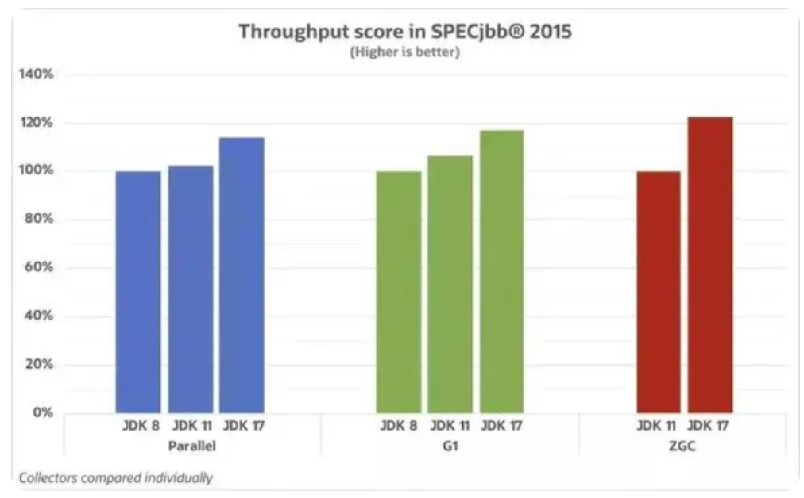
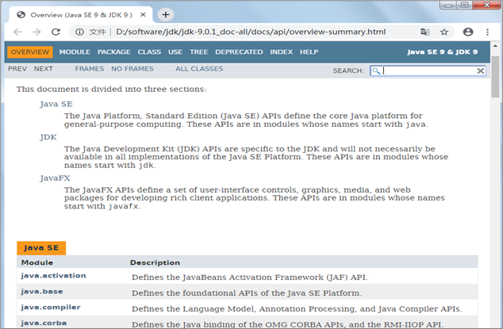

# 模块24.jdk新特性

```java
模块23回顾:
  1.网编:
    a.概述:在网络通信协议下,不同计算机上运行的程序
    b.软件架构:  cs  bs(java主要从事bs开发)
    c.服务器:安装了服务器软件的计算机
    d.通信三要素:  IP地址 协议 端口号
    e.协议:
      UDP:面向无连接协议
      TCP:面向连接协议 -> 三次握手  四次挥手
    f.UDP:  DatagramSocket  DatagramPacket
            send(dp)   receive(dp)
      TCP:  Socket   ServerSocket
            getInputStream  getOutputStream   accept      
  2.正则表达式:是一个具有特殊规则的字符串,用于校验
    a.boolean matches(正则)
    b.字符类:[abc]  [0-9]
    c.逻辑运算符: && |
    d.预定义字符:  .   \\d   \\w
    e.数量词: x*  x+ x?  x{n}  x{n,}  x{n,m}
    f.分组括号: ()
  3.设计模式
    a.模版方法:在一个通用的骨架中,一部分功能确定,一部分功能不确定(延伸到子类中实现)  
    b.单例模式:目的:让一个类只产生一个对象
      饿汉式
      懒汉式
  4.Lombok:简化javabean
    @Data  
      
模块24重点:
  Lambda表达式
  Stream流
```

# 第一章.Lambda表达式

## 1.函数式编程思想和Lambda表达式定义格式

```java
1.面向对象思想:是Java的核心编程思想
  强调的是找对象,帮我们做事儿
  
  比如:去北京 -> 强调的是怎么去,火车,高铁,飞机,汽车,自行车,腿儿  

2.jdk8开始又了个新的思想:函数式编程思想:
  强调的是结果,不强调过程
      
  比如:去北京 -> 只强调去了还是没去
      
3.Lambda表达式:
  a.定义格式:
    ()->{}
  b.各部分解释:
    () : 重写方法的参数位置
    -> : 将参数传递到方法体中
    {} : 重写方法的方法体    
```

```java
public class Demo01Lambda {
    public static void main(String[] args) {
        new Thread(new Runnable() {
            @Override
            public void run() {
                System.out.println("我执行了");
            }
        }).start();

        System.out.println("============");
        
        new Thread(()-> System.out.println("我执行了")).start();

        ArrayList<String> list = new ArrayList<>();
    }
}

```

## 2.Lambda表达式使用前提

```java
1.必须是函数式接口做方法参数传递
2.啥叫函数式接口:
  有且只有一个抽象方法的接口,用@FunctionalInterface去检测
```

```java
@FunctionalInterface
public interface USB {
    void open();
}
```

## 3.Lambda表达式省略规则

```java
1.Lambda表达式怎么写(涛哥给的新手秘籍)
  a.观察是否是函数式接口做方法参数传递
  b.如果是,考虑使用Lambda表达式
  c.调用方法,以匿名内部类的形式传递实参
  d.从new接口开始到重写方法的方法名结束,选中,删除,别忘记再删除一个右半个大括号
  e.在重写方法的参数后面,方法体的大括号前面加上 -> 
    
    
2.省略规则:
  a.重写方法的参数类型可以干掉
  b.如果重写方法只有一个参数,所在的小括号可以干掉
  c.如果方法体中只有一句话,那么所在的大括号以及分号可以干掉
  d.如果方法体中只有一句话并且带return的,那么所在的大括号,分号以及return 可以干掉
```

```java
public class Person {
   private String name;
   private Integer age;

    public Person() {
    }

    public Person(String name, Integer age) {
        this.name = name;
        this.age = age;
    }

    public String getName() {
        return name;
    }

    public void setName(String name) {
        this.name = name;
    }

    public Integer getAge() {
        return age;
    }

    public void setAge(Integer age) {
        this.age = age;
    }

    @Override
    public String toString() {
        return "Person{" +
                "name='" + name + '\'' +
                ", age=" + age +
                '}';
    }
}

```

```java
public class Demo03Lambda {
    public static void main(String[] args) {
        ArrayList<Person> list = new ArrayList<>();
        list.add(new Person("张三",10));
        list.add(new Person("李四",8));
        list.add(new Person("王五",9));

       /* Collections.sort(list, new Comparator<Person>() {
            @Override
            public int compare(Person o1, Person o2) {
                return o1.getAge()-o2.getAge();
            }
        });
*/
        System.out.println("=============Lambda==========");

      /*  Collections.sort(list,(Person o1, Person o2)-> {
                return o1.getAge()-o2.getAge();
        });*/

        System.out.println("===========Lambda表达式简化形式==========");

        Collections.sort(list,(o1, o2)-> o1.getAge()-o2.getAge());
        System.out.println(list);
    }
}

```

# 第二章.函数式接口

```java
1.函数式接口:
  有且只有一个抽象方法的接口
2.检测:
  @FunctionalInterface
```

```java
@FunctionalInterface
public interface USB {
    void open(String s);
    //void close();
}

```

```java
public class Test01 {
    public static void main(String[] args) {
       method(new USB() {
           @Override
           public void open(String s) {
               System.out.println(s+"开启了");
           }
       });
        System.out.println("=====Lambda====");
        method((String s)->{
                System.out.println(s+"开启了");
        });

        System.out.println("=====Lambda简化版====");
        method(s-> System.out.println(s+"开启了"));
    }
    public  static void method(USB usb){
        usb.open("鼠标");
    }
}

```

## 1.Supplier

```java
1.Supplier接口
   java.util.function.Supplier<T>接口，它意味着"供给"->我们想要什么就给什么
2.方法:
  T get() -> 我们想要什么,get方法就可以返回什么

3.需求:
   使用Supplier接口作为方法的参数
   用Lambda表达式求出int数组中的最大值
       
4.泛型:
  <引用数据类型>-> 规定了我们操作的数据是什么类型
  <>中只能写引用数据类型,不能写基本数据类型
```

| 基本类型 | 包装类    |
| -------- | --------- |
| byte     | Byte      |
| short    | Short     |
| int      | Integer   |
| long     | Long      |
| float    | Float     |
| double   | Double    |
| char     | Character |
| boolean  | Boolean   |

```java
public class Demo01Supplier {
    public static void main(String[] args) {
        method(new Supplier<Integer>() {
            @Override
            public Integer get() {
                int[] arr = {4,3,4,6,7};
                Arrays.sort(arr);
                return arr[arr.length-1];
            }
        });

        System.out.println("==================");
        method(()-> {
                int[] arr = {4,3,4,6,7};
                Arrays.sort(arr);
                return arr[arr.length-1];
        });
    }

    public static void method(Supplier<Integer> supplier){
        Integer max = supplier.get();//让get方法返回一个数组最大值
        System.out.println("max = " + max);
    }
}

```


## 2.Consumer

```java
java.util.function.Consumer<T>->消费型接口->操作
  方法:
    void accept(T t)，意为消费一个指定泛型的数据
        
"消费"就是"操作",至于怎么操作,就看重写accept方法之后,方法体怎么写了
```

```java
public class Demo02Consumer {
    public static void main(String[] args) {
        method(new Consumer<String>() {
            @Override
            public void accept(String s) {
                System.out.println(s.length());
            }
        },"abcdefg");
        System.out.println("==================");
        method(s-> System.out.println(s.length()),"abcdefg");
    }
    public static void method(Consumer<String> consumer,String s){
        consumer.accept(s);
    }
}
```


## 3.Function

```java
java.util.function.Function<T,R>接口用来根据一个类型的数据得到另一个类型的数据
  方法:
     R apply(T t)根据类型T参数获取类型R的结果
```

```java
public class Demo03Function {
    public static void main(String[] args) {
        method(new Function<Integer, String>() {
            @Override
            public String apply(Integer integer) {
                return integer+"";
            }
        },100);

        System.out.println("===================");
        method(integer -> integer+"",200);
    }

    public static void method(Function<Integer,String> function,Integer number){
        String s = function.apply(number);
        System.out.println("s = " + (s+1));
    }
}

```


## 4.Predicate

```java
java.util.function.Predicate<T>接口。->判断型接口
    boolean test(T t)->用于判断的方法,返回值为boolean型
```

```java
public class Demo04Predicate {
    public static void main(String[] args) {
        method(new Predicate<String>() {
            @Override
            public boolean test(String s) {
                return s.length()==7;
            }
        },"abcdefg");

        System.out.println("===================");

        method(s -> s.length()==7,"abcd");
    }
    public static void method(Predicate<String> predicate,String s){
        boolean test = predicate.test(s);
        System.out.println("test = " + test);
    }
}
```

# 第三章.Stream流

```java
1.Stream流中的"流"不是特指"IO流",它是一种"流式编程"(编程方式),可以看做是"流水线"
```


```java
public class Demo01Stream {
    public static void main(String[] args) {
        ArrayList<String> list = new ArrayList<>();
        list.add("张无忌");
        list.add("张三丰");
        list.add("张大彪");
        list.add("吕不韦");
        list.add("张三");
        list.add("赵姬");
        list.add("张翠山");
        list.add("嫪毐");

        //需求1:筛选出姓张的人
       /* ArrayList<String> listZhang = new ArrayList<>();
        for (String s : list) {
            if (s.startsWith("张")){
                listZhang.add(s);
            }
        }
        System.out.println(listZhang);*/

        //需求2:筛选出三个字的张姓人物
       /* ArrayList<String> listThree = new ArrayList<>();
        for (String s : listZhang) {
            if (s.length()==3){
                listThree.add(s);
            }
        }
        System.out.println(listThree);*/

        //需求3.遍历集合,将三个字姓张的打印出来
        /*for (String s : listThree) {
            System.out.println(s);
        }

        System.out.println("================");*/

        //将list转成Stream流对象
        Stream<String> stream = list.stream();
        /*stream.filter(new Predicate<String>() {
            @Override
            public boolean test(String s) {
                return s.startsWith("张");
            }
        }).filter(new Predicate<String>() {
            @Override
            public boolean test(String s) {
                return s.length()==3;
            }
        }).forEach(new Consumer<String>() {
            @Override
            public void accept(String s) {
                System.out.println(s);
            }
        });*/

        System.out.println("======================");

        stream.filter(s -> s.startsWith("张")).filter(s -> s.length()==3).forEach(s -> System.out.println(s));
    }
}

```

## 1.Stream的获取

```java
1.针对集合:Collection中的方法
    Stream<E> stream()  
    
2.针对数组:Stream接口中的静态方法:
    static <T> Stream<T> of(T... values)  
```

```java
public class Demo02Stream {
    public static void main(String[] args) {
        //1.针对集合:Collection中的方法
        //Stream<E> stream()
        ArrayList<String> list = new ArrayList<>();
        list.add("张三");
        list.add("李四");
        list.add("王五");
        Stream<String> stream = list.stream();
        System.out.println(stream);

        //2.针对数组:Stream接口中的静态方法:
        //static <T> Stream<T> of(T... values)
        Stream<String> stream1 = Stream.of("金莲", "三上", "松下");
        System.out.println(stream1);
    }
}
```

## 2.Stream的方法

### 2.1.Stream中的forEach方法:void forEach(Consumer<? super T> action);

```java
forEach : 逐一处理->遍历
void forEach(Consumer<? super T> action);

注意:forEach方法是一个[终结方法],使用完之后,Stream流不能用了
```

```java
 /**
     * 逐一处理,可以用来遍历
     */
    private static void foreach() {
        Stream<String> stream1 = Stream.of("金莲", "三上", "松下");
       /* stream1.forEach(new Consumer<String>() {
            @Override
            public void accept(String s) {
                System.out.println(s);
            }
        });*/
        System.out.println("==============");

        stream1.forEach(s-> System.out.println(s));
    }
```

### 2.2.Stream中的long count()方法

```java
1.作用:统计元素个数
2.注意:count也是一个终结方法
```

```java
    /**
     * 统计元素个数
     */
    private static void count() {
        Stream<String> stream1 = Stream.of("金莲", "三上", "松下","柳岩");
        long count = stream1.count();
        System.out.println("count = " + count);
    }
```

### 2.3.Stream中的Stream<T> filter(Predicate<? super T> predicate)方法

```java
1.方法:Stream<T> filter(Predicate<? super T> predicate)方法,返回一个新的Stream流对象
2.作用:根据某个条件进行元素过滤
```

```java
    private static void filter() {
        Stream<String> stream1 = Stream.of("金莲", "三上", "松下","柳岩","张无忌");
        /*stream1.filter(new Predicate<String>() {
            @Override
            public boolean test(String s) {
                return s.length() == 2;
            }
        }).forEach(new Consumer<String>() {
            @Override
            public void accept(String s) {
                System.out.println(s);
            }
        });*/

        System.out.println("============");

        stream1.filter(s -> s.length()==2).forEach(s -> System.out.println(s));


    }
```

### 2.4.Stream<T> limit(long maxSize):获取Stream流对象中的前n个元素,返回一个新的Stream流对象

```java
1.Stream<T> limit(long maxSize):获取Stream流对象中的前n个元素,返回一个新的Stream流对象
```

```java
    /**
     * 获取前几个元素
     */
    private static void limit() {
        Stream<String> stream1 = Stream.of("金莲", "三上", "松下","柳岩","张无忌");
        stream1.limit(3).forEach(s -> System.out.println(s));
    }
```

### 2.5.Stream<T> skip(long n): 跳过Stream流对象中的前n个元素,返回一个新的Stream流对象

```java
Stream<T> skip(long n): 跳过Stream流对象中的前n个元素,返回一个新的Stream流对象
```

```java
    /**
     * 跳过前n个元素
     */
    private static void skip() {
        Stream<String> stream1 = Stream.of("金莲", "三上", "松下","柳岩","张无忌");
        stream1.skip(2).forEach(s -> System.out.println(s));
    }

```

### 2.6.static <T> Stream<T> concat(Stream<? extends T> a, Stream<? extends T> b):两个流合成一个流

```java
1.方法:static <T> Stream<T> concat(Stream<? extends T> a, Stream<? extends T> b):两个流合成一个流
```

```java
    /**
     *  流合并,是一个静态方法
     */
    private static void concat() {
        Stream<String> stream1 = Stream.of("金莲", "三上", "松下","柳岩","张无忌");
        Stream<String> stream2 = Stream.of("涛哥", "涛哥1", "涛哥2","涛哥3");

        Stream.concat(stream1, stream2).forEach(s -> System.out.println(s));

    }

```

### 2.7.将Stream流变成集合

```java
从Stream流对象转成集合对象，使用Stream接口方法collect()
```

```java
    /**
     * 流转集合
     */
    private static void collect() {
        Stream<String> stream1 = Stream.of("金莲", "三上", "松下","柳岩","张无忌");
        List<String> list = stream1.collect(Collectors.toList());
        System.out.println(list);
    }
```

### 2.8.dinstinct方法

```
Stream<T> distinct()
元素去重复,依赖hashCode和equals方法
```

```java
    /**
     * 去重复元素
     * 被去重的元素底层需要重写hashCode和equals方法
     */
    private static void distinct() {
        //Stream<String> stream1 = Stream.of("金莲", "三上", "松下","柳岩","张无忌","张无忌");
        //stream1.distinct().forEach(s -> System.out.println(s));

        Stream<Person> stream = Stream.of(new Person("张三", 10), new Person("李四", 12), new Person("张三", 10));
        stream.distinct().forEach(person -> System.out.println(person));
    }
```

### 2.9.转换流中的类型

```java
Stream<R> map(Function<T,R> mapper)-> 转换流中的数据类型
```

```java
    /**
     * 转换流中的类型
     */
    private static void map() {
        Stream<Integer> stream = Stream.of(1, 2, 3, 4, 5, 6);
        stream.map(new Function<Integer, String>() {
            @Override
            public String apply(Integer integer) {
                return integer+"";
            }
        }).forEach(s -> System.out.println(s+1));
    }
```

### 2.10.Stream流练习

```java
   1. 第一个队伍只要名字为3个字的成员姓名；//filter

   2. 第一个队伍筛选之后只要前3个人；//limit

   3. 第二个队伍只要姓张的成员姓名；//filter

   4. 第二个队伍筛选之后不要前2个人；//skip

   5. 将两个队伍合并为一个队伍；//concat

   6. 打印整个队伍的姓名信息。//forEeach
```

```java
public class Demo04Stream {
    public static void main(String[] args) {
        ArrayList<String> one = new ArrayList<>();
        one.add("迪丽热巴");
        one.add("宋远桥");
        one.add("苏星河");
        one.add("老子");
        one.add("庄子");
        one.add("孙子");
        one.add("洪七公");

        ArrayList<String> two = new ArrayList<>();
        two.add("古力娜扎");
        two.add("张无忌");
        two.add("张三丰");
        two.add("赵丽颖");
        two.add("张二狗");
        two.add("张天爱");
        two.add("张三");

        //将两个集合变成Stream流
        Stream<String> teamA = one.stream();
        Stream<String> teamB = two.stream();

        //Stream<String> listA = teamA.filter(s -> s.length() == 3).limit(3);
        //Stream<String> listB = teamB.filter(s -> s.startsWith("张")).skip(2);

        //合并
        Stream.concat(teamA.filter(s -> s.length() == 3).limit(3),teamB.filter(s -> s.startsWith("张")).skip(2)).forEach(s -> System.out.println(s));

    }
}

```

# 第四章.方法引用

## 1.方法引用的介绍

```java
1.概述:引用方法
2.啥时候使用:
  a.被引用的方法要写在重写方法里面
  b.被引用的方法从参数上,返回值上要和所在重写方法一致,而且引用的方法最好是操作重写方法的参数值的
  c.干掉重写方法的参数;干掉->;干掉被引用方法的参数 -> 将被引用方法的.改成::    
```

## 2.方法引入的体验

```java
public class Demo01Method {
    public static void main(String[] args) {
        Stream<String> stream = Stream.of("明日", "三上", "金莲", "松下", "有菜");

        /*
           accept是重写方法:  参数类型为String
                            无返回值

           accept方法里面有println方法:println参数类型为String,被引用的方法操作重写方法的参数值
                                    println没有返回值
         */
       /* stream.forEach(new Consumer<String>() {
            @Override
            public void accept(String s) {
                System.out.println(s);
            }
        });*/

        System.out.println("===================");
        //stream.forEach(s -> System.out.println(s));
        System.out.println("===================");
        stream.forEach(System.out::println);
    }
}
```

## 3.对象名--引用成员方法

```java
1.使用对象名引用成员方法
  格式:
    对象::成员方法名
         
2.需求:
    函数式接口:Supplier
        java.util.function.Supplier<T>接口
    抽象方法:
        T get()。用来获取一个泛型参数指定类型的对象数据。
        Supplier接口使用什么泛型,就可以使用get方法获取一个什么类型的数据
```

```java
public class Demo02Method {
    public static void main(String[] args) {
        method(new Supplier<String>() {
            /*
               get为重写方法:无参的,返回值为String
               trim方法在get中:无参的,返回值为String
               考虑使用方法引用
             */
            @Override
            public String get() {
                return " abc ".trim();
            }
        });

        System.out.println("================");

        method(()->" abc ".trim());

        System.out.println("================");
        method(" abc "::trim);
    }

    public static void method(Supplier<String> supplier){
        String s = supplier.get();
        System.out.println("s = " + s);
    }
}
```

## 4.类名--引用静态方法

```java
类名--引用静态方法
    格式:
      类名::静态成员方法
```

```java
public class Demo03Method {
    public static void main(String[] args) {
        method(new Supplier<Double>() {
            /*
               get:无参,返回值类型为double
               random():无参,返回值类型为double
             */
            @Override
            public Double get() {
                return Math.random();
            }
        });
        System.out.println("==================");

        method(()->Math.random());

        System.out.println("==================");
        
        method(Math::random);
    }
    public static void method(Supplier<Double> supplier){
        Double aDouble = supplier.get();
        System.out.println("aDouble = " + aDouble);
    }
}

```

## 5.类--构造引用

```java
1. 类--构造方法引用
   格式:
     构造方法名称::new
             
2.需求:
    函数式接口:Function
        java.util.function.Function<T,R>接口
    抽象方法:
        R apply(T t)，根据类型T的参数获取类型R的结果。用于数类型转换
```

```java
public class Demo04Method {
    public static void main(String[] args) {
        method(new Function<String, Person>() {
            /*
              apply为重写方法:  有一个String的参数,返回值类型为Person对象
              new Person(s) : 一个String参数的构造,类型为String,返回值类型Person类型
             */
            @Override
            public Person apply(String s) {
                return new Person(s);
            }
        },"涛哥");

        method(s -> new Person(s),"金莲");

        method(Person::new,"三上");
    }
    public static void method(Function<String,Person> function,String name){
        Person person = function.apply(name);
        System.out.println(person);
    }
}

```

## 6.数组--数组引用

```java
数组--数组引用
     格式:
          数组的数据类型[]::new
          int[]::new  创建一个int型的数组
          double[]::new  创建于一个double型的数组
```

```java
public class Demo05Method {
    public static void main(String[] args) {
        method(new Function<Integer, int[]>() {
            /*
              apply:重写的方法,参数为Integer型,返回值类型为int[]
              new int[integer]: [integer]看成参数,参数为Integer型,返回值int[]
             */
            @Override
            public int[] apply(Integer integer) {
                return new int[integer];
            }
        },10);

        System.out.println("=================");

        method(integer-> new int[integer],10);

        System.out.println("==================");

        method(int[]::new,10);
    }

    public static void method(Function<Integer,int[]> function,Integer len){
        int[] arr = function.apply(len);
        System.out.println(arr.length);
    }
}
```

# 第五章.Java9-17新特性

## 5.1 JDK版本的选择

历经曲折的Java 9在4次跳票后，终于在2017年9月21日发布。从Java 9这个版本开始，Java 的计划发布周期是6个月，这意味着Java的更新从传统的以特性驱动的发布周期，转变为以时间驱动的发布周期，并逐步地将Oracle JDK原商业特性进行开源。针对企业客户的需求，Oracle将以3年为周期发布长期支持版本（Long Term Support，LTS），最近的LTS版本就是Java 11和Java17了，其他都是过渡版本

在Java 17正式发布之前，Java开发框架Spring率先在官博宣布，Spring Framework 6和Spring Boot 3计划在2022年第四季度实现总体可用性的高端基线：

1、Java 17+(来自 Spring Framework 5.3.x 线中的 Java 8-17)

2、Jakarta EE 9+（来自Spring框架5.3.x 线中的 Java EE 7-8）

3.Spring 官方说明：`https://spring.io/blog/2022/01/20/spring-boot-3-0-0-m1-is-now-available`


> Springboot3.0 是需要用Java17和Spring6.0为基础建设。如果从企业选型最新Springboot3.0作为架构来说，它搭配jdk17肯定是标配了。
>
> 针对于Spring 6，官网的说明会弃用java8以9为最低版本，而且兼容tomcat10+。

4.JDK17针对于GC方面作出了优化,以及做了性能的提高

   a.在吞吐量方面，Parallel 中 JDK 8 和 JDK 11 差距不大，JDK 17 相较 JDK 8 提升 15% 左右；G1 中 JDK 17 比 JDK 8 提升  18%；ZGC 在 JDK 11引入，JDK 17 对比JDK 11 提升超过 20% 



  b. 在 GC 延迟方面，JDK 17 的提升更为明显。在 Parallel 中 JDK 17 对比 JDK 8 和JDK 11 提升 40%；在 G1 中，JDK 11 对比 JDK 8 提升 26%，JDK 17 对比 JDK 8 提升接近 60%！ZGC 中 JDK 17 对比 JDK  11 提升超过 40% 


>  从GC性能角度去看，JDK 11对比JDK 8延迟提升不到40%；反观JDK 17对比JDK 8 延迟提升 60%，吞吐量提升 18%；可以看到JDK17的提升还是非常明显的 

由于JDK对性能提升方面都是自动的，所以我们可以直接学习JDK新特性中的语法和API。我们要知道的是下面的语法不都是从JDK17才开始有的，但是JDK17都支持这些语法和API。

> 1.查看jdk版本: java -version

## 5.2 接口的私有方法

Java8版本接口增加了两类成员：

- 公共的默认方法
- 公共的静态方法

Java9版本接口又新增了一类成员：

- 私有的方法

为什么JDK1.9要允许接口定义私有方法呢？因为我们说接口是规范，规范是需要公开让大家遵守的

**私有方法**：因为有了默认方法和静态方法这样具有具体实现的方法，那么就可能出现多个方法由共同的代码可以抽取，而这些共同的代码抽取出来的方法又只希望在接口内部使用，所以就增加了私有方法。

```java
public interface USB {
    private void open(){
        System.out.println("私有非静态方法");
    }

    private static void close(){
        System.out.println("私有静态方法");
    }

    //定义一个默认方法调用私有方法
    public default void methodDef(){
        open();
        close();
    }
}

```

```java
public class UsbImpl implements USB{
}

```

```java
public class Test01 {
    public static void main(String[] args) {
        new UsbImpl().methodDef();
    }
}
```

## 5.3 钻石操作符与匿名内部类结合

自Java 9之后我们将能够与匿名实现类共同使用钻石操作符，即匿名实现类也支持类型自动推断

```java
public class Person {
    private String name;
    private Integer age;

    public Person() {
    }

    public Person(String name, Integer age) {
        this.name = name;
        this.age = age;
    }

    public String getName() {
        return name;
    }

    public void setName(String name) {
        this.name = name;
    }

    public Integer getAge() {
        return age;
    }

    public void setAge(Integer age) {
        this.age = age;
    }

    @Override
    public String toString() {
        return "Person{" +
                "name='" + name + '\'' +
                ", age=" + age +
                '}';
    }
}

```

```java
public class Test02 {
    public static void main(String[] args) {
        ArrayList<Person> list = new ArrayList<>();
        list.add(new Person("张三",10));
        list.add(new Person("李四",8));
        list.add(new Person("王五",20));

        Collections.sort(list, new Comparator<Person>() {
            @Override
            public int compare(Person o1, Person o2) {
                return o1.getAge()-o2.getAge();
            }
        });

        System.out.println(list);
    }
}

```

Java 8的语言等级编译会报错：“'<>' cannot be used with anonymous classes。”Java 9及以上版本才能编译和运行正常。

## 5.4 try..catch升级

之前我们讲过JDK 1.7引入了trywith-resources的新特性，可以实现资源的自动关闭，此时要求：

- 该资源必须实现java.io.Closeable接口
- 在try子句中声明并初始化资源对象
- 该资源对象必须是final的

```java
try(IO流对象1声明和初始化;IO流对象2声明和初始化){
    可能出现异常的代码
}catch(异常类型 对象名){
	异常处理方案
}
```

JDK1.9又对trywith-resources的语法升级了

- 该资源必须实现java.io.Closeable接口
- 在try子句中声明并初始化资源对象，也可以直接使用已初始化的资源对象
- 该资源对象必须是final的

```java
IO流对象1声明和初始化;
IO流对象2声明和初始化;

try(IO流对象1;IO流对象2){
    可能出现异常的代码
}catch(异常类型 对象名){
	异常处理方案
}
```

```java
public class Test03 {
    public static void main(String[] args) throws IOException {
        //method01();
        method02();
    }

    /**
     * jdk9开始
     * 为了减轻try的压力,可以将对象放到外面去new,然后将对象名,放到 try中
     * 而且依然能自动刷新和关流
     */
    private static void method02() throws IOException {
        FileWriter fw = new FileWriter("module24\\io.txt");
        try(fw){
            fw.write("你好");
        }catch (Exception e){
            e.printStackTrace();
        }
    }

    /**
     * jdk8之前
     */
    private static void method01() {
        try(FileWriter fw = new FileWriter("module24\\io.txt")){
            fw.write("你好");
        }catch (Exception e){
            e.printStackTrace();
        }
    }
}
```

## 5.5 局部变量类型自动推断

jdk10之前，我们定义局部变量都必须要明确数据的数据类型，但是到了JDK10，出现了一个最为重要的特性，就是`局部变量类型推断`，顾名思义，就是定义局部变量时，不用先确定具体的数据类型了，可以直接根据具体数据推断出所属的数据类型。

```java
var 变量名 = 值;
```

```java
public class Test04 {
    public static void main(String[] args) {
        var i = 10;
        System.out.println("i = " + i);

        var j = "helloworld";
        System.out.println("j = " + j);

        var arr = new int[]{1,2,3,4,5};
        for (var element : arr) {
            System.out.println(element);
        }
    }
}
```

## 5.6 switch表达式

switch表达式在Java 12中作为预览语言出现，在Java 13中进行了二次预览，得到了再次改进，最终在Java 14中确定下来。另外，在Java17中预览了switch模式匹配。

传统的switch语句在使用中有以下几个问题。

（1）匹配是自上而下的，如果忘记写break，那么后面的case语句不论匹配与否都会执行。

（2）所有的case语句共用一个块范围，在不同的case语句定义的变量名不能重复。

（3）不能在一个case语句中写多个执行结果一致的条件，即每个case语句后只能写一个常量值。

（4）整个switch语句不能作为表达式返回值。

### 1、Java12的switch表达式

Java 12对switch语句进行了扩展，将其作为增强版的switch语句或称为switch表达式，可以写出更加简化的代码。

- 允许将多个case语句合并到一行，可以简洁、清晰也更加优雅地表达逻辑分支。
- 可以使用-> 代替 :
  - ->写法默认省略break语句，避免了因少写break语句而出错的问题。
  - ->写法在标签右侧的代码段可以是表达式、代码块或 throw语句。
  - ->写法在标签右侧的代码块中定义的局部变量，其作用域就限制在代码块中，而不是蔓延到整个switch结构。
- 同一个switch结构中不能混用“→”和“:”，否则会有编译错误。使用字符“:”，这时fall-through规则依然有效，即不能省略原有的break语句。"："的写法表示继续使用传统switch语法。

案例需求：

请使用switch-case结构实现根据月份输出对应季节名称。例如，3～5月是春季，6～8月是夏季，9～11月是秋季，12～2月是冬季。

Java12之前写法：

```java
@Test
    public void test1() {
        int month = 3;
        switch (month) {
            case 3:
            case 4:
            case 5:
                System.out.println("春季");
                break;
            case 6:
            case 7:
            case 8:
                System.out.println("夏季");
                break;
            case 9:
            case 10:
            case 11:
                System.out.println("秋季");
                break;
            case 12:
            case 1:
            case 2:
                System.out.println("冬季");
                break;
            default:
                System.out.println("月份输入有误！");
        }
    }
```

Java12之后写法：

```java
private static void method02() {
        int month = 5;
        switch (month) {
            case 12, 1, 2 -> System.out.println("冬季");
            case 3, 4, 5 -> System.out.println("春季");
            case 6, 7, 8 -> System.out.println("夏季");
            case 9, 10, 11 -> System.out.println("秋季");
            default -> System.out.println("有毛病呀,没有这个月份");

        }
    }

    /**
     * 如果用:
     * break不写依然会case穿透性
     */
    private static void method01() {
      int month = 5;
      switch (month){
          case 12,1,2:
              System.out.println("冬季");
              break;
          case 3,4,5:
              System.out.println("春季");
              break;
          case 6,7,8:
              System.out.println("夏季");
              break;
          case 9,10,11:
              System.out.println("秋季");
              break;
          default:
              System.out.println("有毛病呀,没有这个月份");
              break;
      }
    }
```

### 2、Java13的switch表达式

Java 13提出了第二个switch表达式预览，引入了yield语句，用于返回值。这意味着，switch表达式（返回值）应该使用yield语句，switch语句（不返回值）应该使用break语句。

案例需求：判断季节。

```java
/**
     * jdk13之后
     */
    private static void method04() {
        int month = 5;
        var seson = switch (month) {
            case 12, 1, 2 -> {
                yield "冬季";
            }
            case 3, 4, 5 -> {
                yield "春季";
            }
            case 6, 7, 8 -> {
               yield "夏季";
            }
            case 9, 10, 11 -> {
               yield "秋季";
            }
            default -> {
               yield "有毛病";
            }
        };
        System.out.println("seson = " + seson);
    }

    /**
     * jdk13之前想要拿到switch结果,需要定义一个变量,然后为其赋值
     */
    private static void method03() {
        int month = 5;
        String season = "";
        switch (month) {
            case 12, 1, 2:
                season = "冬季";
                break;
            case 3, 4, 5:
                season = "春季";
                break;
            case 6, 7, 8:
                season = "夏季";
                break;
            case 9, 10, 11:
                season = "秋季";
                break;
            default:
                season = "有毛病";
                break;
        }
        System.out.println("season = " + season);
    }
```

## 5.7 文本块

预览的新特性文本块在Java 15中被最终确定下来，Java 15之后我们就可以放心使用该文本块了。

### 1、Java13文本块

JDK 12引入了Raw String Literals特性，但在其发布之前就放弃了这个特性。这个JEP与引入多行字符串文字（文本块）在意义上是类似的。Java 13中引入了文本块（预览特性），这个新特性跟Kotlin中的文本块是类似的。

**现实问题**

在Java中，通常需要使用String类型表达HTML，XML，SQL或JSON等格式的字符串，在进行字符串赋值时需要进行转义和连接操作，然后才能编译该代码，这种表达方式难以阅读并且难以维护。

文本块就是指多行字符串，例如一段格式化后的XML、JSON等。而有了文本块以后，用户不需要转义，Java能自动搞定。因此，**文本块将提高Java程序的可读性和可写性。**

**目标**

- 简化跨越多行的字符串，避免对换行等特殊字符进行转义，简化编写Java程序。
- 增强Java程序中字符串的可读性。

**举例**

会被自动转义，如有一段以下字符串：

```html
<html>
  <body>
      <p>Hello, 尚硅谷</p>
  </body>
</html>
```

将其复制到Java的字符串中，会展示成以下内容：

```java
"<html>\n" +
"    <body>\n" +
"        <p>Hello, 尚硅谷</p>\n" +
"    </body>\n" +
"</html>\n";
```

即被自动进行了转义，这样的字符串看起来不是很直观，在JDK 13中，就可以使用以下语法了：

```java
"""
<html>
  <body>
      <p>Hello, world</p>
  </body>
</html>
""";
```

使用“”“作为文本块的开始符和结束符，在其中就可以放置多行的字符串，不需要进行任何转义。看起来就十分清爽了。

文本块是Java中的一种新形式，它可以用来表示任何字符串，并且提供更多的表现力和更少的复杂性。

（1）文本块由零个或多个字符组成，由开始和结束分隔符括起来。

- 开始分隔符由三个双引号字符表示，后面可以跟零个或多个空格，最终以行终止符结束。
- 文本块内容以开始分隔符的行终止符后的第一个字符开始。
- 结束分隔符也由三个双引号字符表示，文本块内容以结束分隔符的第一个双引号之前的最后一个字符结束。

以下示例代码是错误格式的文本块：

```java
String err1 = """""";//开始分隔符后没有行终止符,六个双引号最中间必须换行

String err2 = """  """;//开始分隔符后没有行终止符,六个双引号最中间必须换行
```

如果要表示空字符串需要以下示例代码表示：

```java
String emp1 = "";//推荐
String emp2 = """
   """;//第二种需要两行，更麻烦了
```

（2）允许开发人员使用“\n”“\f”和“\r”来进行字符串的垂直格式化，使用“\b”“\t”进行水平格式化。如以下示例代码就是合法的。

```java
String html = """
    <html>\n
      <body>\n
        <p>Hello, world</p>\n
      </body>\n
    </html>\n
    """;
```

（3）在文本块中自由使用双引号是合法的。

```java
String story = """
Elly said,"Maybe I was a bird in another life."

Noah said,"If you're a bird , I'm a bird."
 """;
```

## 5.8 instanceof模式匹配

instanceof的模式匹配在JDK14、15中预览，在JDK16中转正。有了它就不需要编写先通过instanceof判断再强制转换的代码。

```java
public abstract class Animal {
    public abstract void eat();
}
```

```java
public class Dog extends Animal{
    @Override
    public void eat() {
        System.out.println("狗啃骨头");
    }

    //特有方法
    public void lookDoor(){
        System.out.println("狗会看门");
    }
}

```

从JDK14开始,我们不需要单独强转,直接省略强转的过程

```java
public /*abstract*/ record Person(String name)/* extends Record*/{

    //int i;不能声明实例变量
    static int i;//可以声明静态变量
    
    //不能声明空参构造
   /* public Person(){

    }*/

    public static void method(){//可以声明静态方法
        System.out.println("method");
    }
    public void method01(){//可以声明实例方法(成员方法)
        System.out.println("method01");
    }
}
```

## 5.9 Record类

Record类在JDK14、15预览特性，在JDK16中转正。

record是一种全新的类型，它本质上是一个 final类，同时所有的属性都是 final修饰，它会自动编译出get、hashCode 、比较所有属性值的equals、toString 等方法，减少了代码编写量。使用 Record 可以更方便的创建一个常量类。

**1.注意:**

- Record只会有一个全参构造

- 重写的equals方法比较所有属性值

- 可以在Record声明的类中定义静态字段、静态方法或实例方法(非静态成员方法)。

- 不能在Record声明的类中定义实例字段(非静态成员变量)；

- 类不能声明为abstract；

- 不能显式的声明父类，默认父类是java.lang.Record类

- 因为Record类是一个 final类，所以也没有子类等。

  ```java
  public record Person(String name) {
      //int i;//不能声明实例变量
  
      static int i;//可以声明静态变量
  
  //不能声明空参构造
  /*    public Person(){
  
      }*/
  
      //可以声明静态方法
      public static void method(){
  
      }
  
      //可以声明非静态方法
      public void method01(){
  
      }
  }
  
  ```
  
  ```java
  public class Test01 {
      public static void main(String[] args) {
          Person person = new Person("张三");
          Person person1 = new Person("张三");
          System.out.println(person);
  
          System.out.println(person.equals(person1));
      }
  }
  ```

## 5.10 密封类

其实很多语言中都有`密封类`的概念，在Java语言中,也早就有`密封类`的思想，就是final修饰的类，该类不允许被继承。而从JDK15开始,针对`密封类`进行了升级。

Java 15通过密封的类和接口来增强Java编程语言，这是新引入的预览功能并在Java 16中进行了二次预览，并在Java17最终确定下来。这个预览功能用于限制超类的使用，密封的类和接口限制其他可能继承或实现它们的其他类或接口。

```java
【修饰符】 sealed class 密封类 【extends 父类】【implements 父接口】 permits 子类{
    
}
【修饰符】 sealed interface 接口 【extends 父接口们】 permits 实现类{
    
}
```

- 密封类用 sealed 修饰符来描述，
- 使用 permits 关键字来指定可以继承或实现该类的类型有哪些
- 一个类继承密封类或实现密封接口，该类必须是sealed、non-sealed、final修饰的。
- sealed修饰的类或接口必须有子类或实现类

```java
public sealed class Animal permits Dog,Cat{
}

public non-sealed class Dog extends Animal{
}

public non-sealed class Cat extends Animal{
}
```

```java
package com.atguigu.sealed;

import java.io.Serializable;

public class TestSealedInterface {
}
sealed interface Flyable /*extends Serializable*/ permits Bird {
    
}
non-sealed class Bird implements Flyable{
    
}
```

## 5.11 其他

陆续在新版本变化的API有很多，因篇幅问题不能一一列举。

Java 9带来了很多重大的变化，其中最重要的变化是Java平台模块系统的引入。众所周知，Java发展已经超过20年，Java和相关生态在不断丰富的同时也越来越暴露出一些问题。

（1）当某些应用很简单时。夸张地说，如若仅是为了打印一个“helloworld”，那么之前版本的JRE中有一个很重要的rt.jar（如Java 8的rt.jar中有60.5M），即运行一个“helloworld”，也需要一个数百兆的JRE环境，而这在很多小型设备中是很难实现的。

（2）当某些应用很复杂，有很多业务模块组成时。我们以package的形式设计和组织类文件，在起初阶段还不错，但是当我们有数百个package时，它们之间的依赖关系一眼是看不完的，当代码库越来越大，创建越复杂，盘根错节的“意大利面条式代码”的概率会呈指数级增长，这给后期维护带来了麻烦，而可维护性是软件设计和演进过程中最重要的问题。

（3）一个问题是classpath。所有的类和类库都堆积在classpath中。当这些JAR文件中的类在运行时有多个版本时，Java的ClassLoader就只能加载那个类的某个版本。在这种情形下，程序的运行就会有歧义，有歧义是一件非常坏的事情。这个问题总是频繁出现，它被称为“JAR Hell”。

（4）很难真正对代码进行封装, 而系统并没有对不同部分（也就是 JAR 文件）之间的依赖关系有明确的概念。每个公共类都可以被类路径下的其他类访问到，这样就会在无意中使用了并不想被公开访问的API。

模块就是为了修复这些问题存在的。模块化系统的优势有以下几点。

- 模块化的主要目的是减少内存的开销。

- 只需要必要模块，而非全部JDK模块，可简化各种类库和大型应用的开发和维护。
- 改进Java SE平台，使其可以适应不同大小的计算设备。
- 改进其安全性、可维护性。用模块管理各个package，其实就是在package外再裹一层，可以通过声明暴露某个package，不声明默认就是隐藏。因此，模块化系统使代码组织上更安全，因为它可以指定哪些部分可以暴露，哪些部分需要隐藏。
- 更可靠的配置，通过明确指定的类的依赖关系代替以前易错的路径（class-path）加载机制。模块必须声明对其他模块的显示依赖，并且模块系统会验证应用程序所有阶段的依赖关系：编译时、链接时和运行时。假设一个模块声明对另一个模块的依赖，并且第二个模块在启动时丢失，JVM检测到依赖关系丢失，在启动时就会失败。在Java 9之前，当使用缺少的类型时，这样的应用程序只会生成运行时错误而不是启动时错误。

Java 9是一个庞大的系统工程，从根本上带来了一个整体改变，包括JDK的安装目录，以适应模块化的设计。

大家可以发现在Java 9之后，API的组织结构也变了。

原来Java 8的API，包是顶级的封装，Java 8的API结构如图所示。


而Java 9的API，模块是顶级的封装，模块之下才是包，如java.base模块，Java 9的API中Java SE部分的模块结构如图所示。




