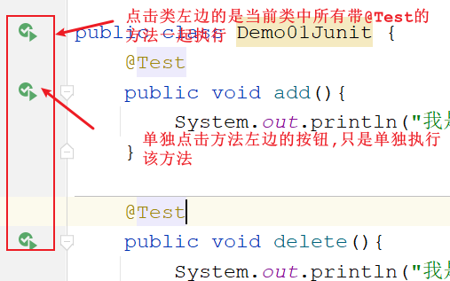
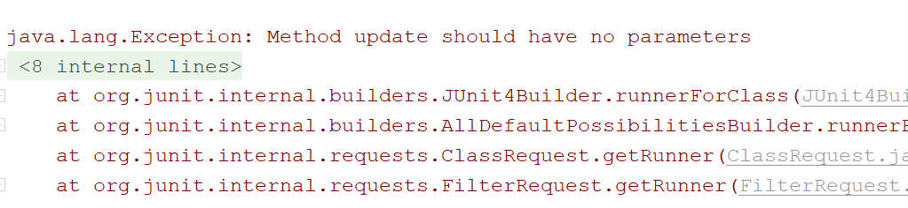
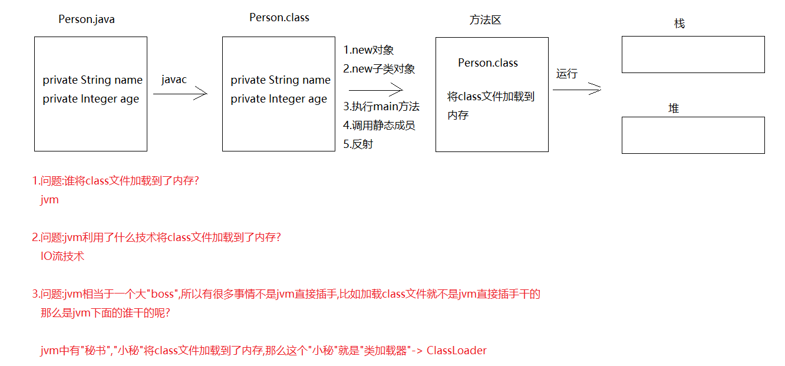
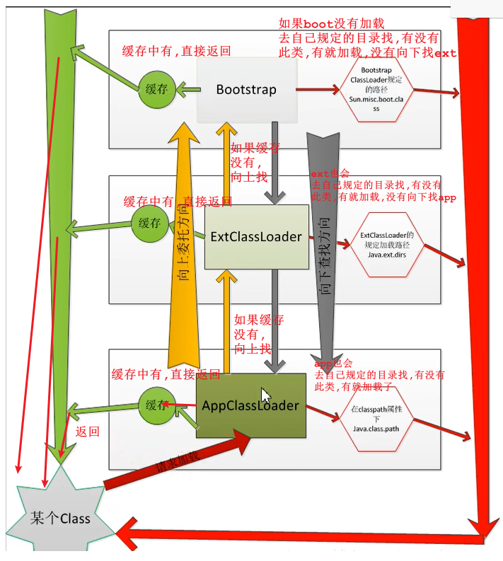
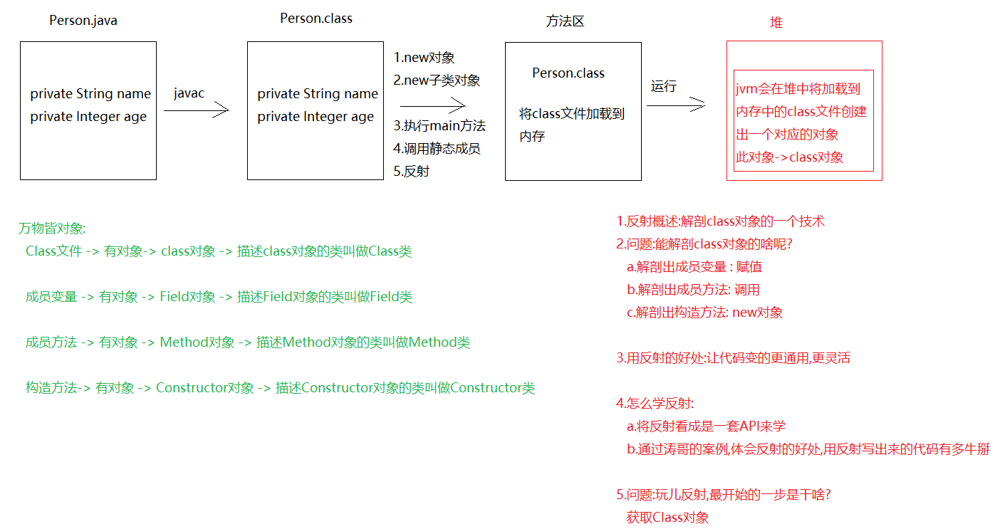
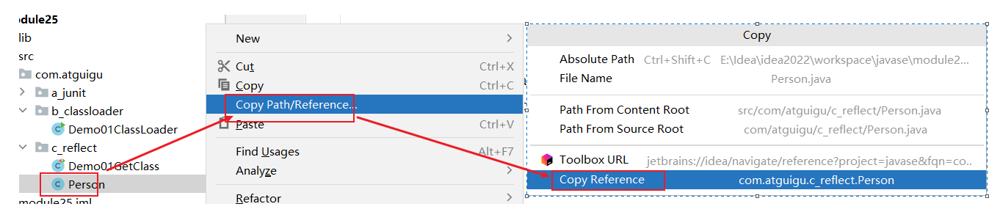
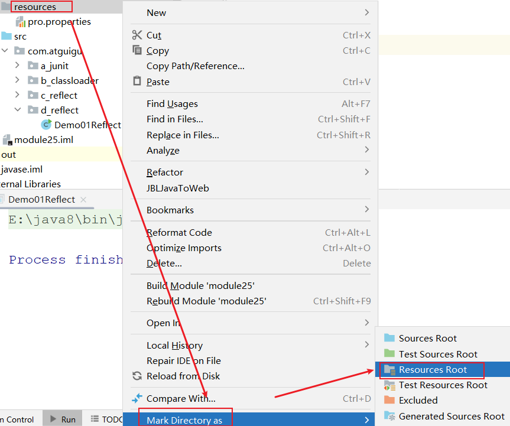
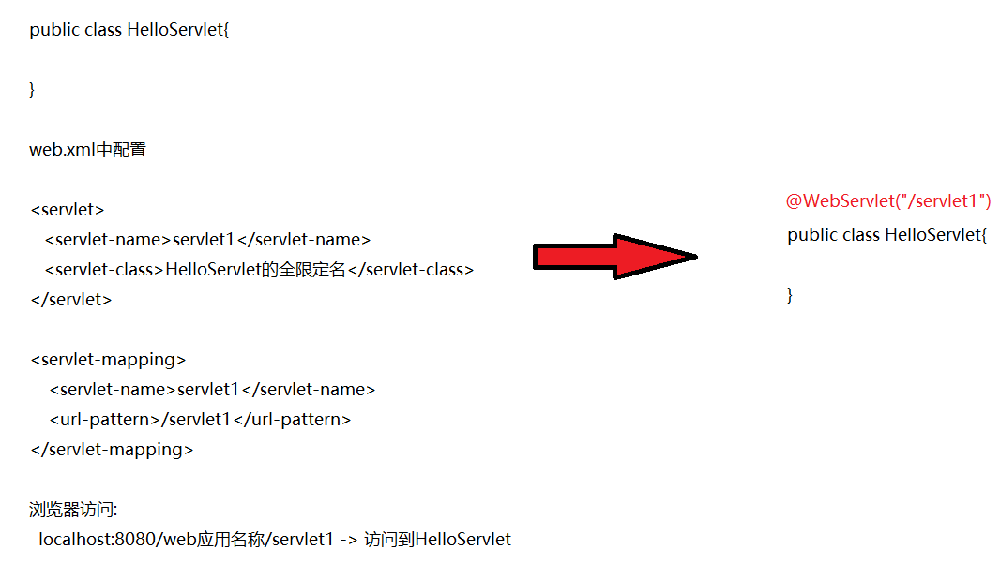

# 模块25.反射_注解

```java
模块24重点回顾:
  1.Lambda表达式
    a.格式:
      () -> {}
    b.使用条件:必须有函数式接口作为方法参数传递(有且只有一个抽象方法的接口叫做函数式接口,带@FunctionalInterface)
  2.新手怎么入门:
    a.观察是否是函数式接口作为方法参数传递
    b.如果是,考虑使用Lambda表达式
    c.调用方法,以匿名内部类形式传递实参
    d.从new接口开始到重写方法的方法名结束,选中,删除,别忘记删除右半个大括号
    e.在重写方法的参数后面以及方法体之间加->
  3.省略规则:
    a.重写方法的参数类型可以干掉
    b.如果重写方法只有一个参数,所在的小括号可以干掉
    c.如果方法体只有一句话,那么所在的大括号以及分号可以干掉
    d.如果方法体中只有一句话并且带return,那么所在的大括号,return,分号都干掉
        
        
  4.Stream流:流水线的流
    a.获取1:调用Collection中的方法stream() -> 针对集合
    b.获取2:调用Stream接口中的of(可变参数)  -> 针对数组
  
  5.方法:
    forEach:遍历  count:统计  filter:过滤  limit:获取前n个  skip:跳过前n个
    concat:流合并  collect:流转集合  distinct:去重复  map:转换流中的数据类型
        
  6.方法引用:
    a.被引用的方法要写在重写的方法里面
    b.被引用的方法从参数上,返回值上要和所在重写方法一致,而且引用的方法最好操作重写方法的参数
    c.干掉重写方法的参数,干掉->,干掉被引用方法的参数,将.改成::

模块25重点:
  1.会使用Junit单元测试
  2.知道反射是干啥的
  3.会使用反射中的API去操作class对象(构造,方法,属性)
  4.通过涛哥设计的案例,体会反射代码写出来的好处->多用于框架中
  5.会使用注解    
     
```

# 第一章 Junit单元测试

## 1.Junit介绍

```java
1.概述:Junit是一个单元测试框架,可以代替main方法去执行其他的方法
2.作用:可以单独执行一个方法,测试该方法是否能跑通
3.注意:Junit是第三方工具,所以使用之前需要导入jar包    
```

## 2.Junit的基本使用(重点)

```java
1.导入Junit的jar包
2.定义一个方法,在方法上写注解: @Test
3.执行方法:
  a.点击该方法左边的绿色按钮,点击run执行 -> 单独执行一个指定的方法
  b.如果想要执行所有带@Test的方法,点击类名左边绿色按钮,点击run执行 -> 执行当前类中所有带@Test的方法   
```

```java
public class Demo01Junit {
    @Test
    public void add(){
        System.out.println("我是@Test执行的add方法");
    }

    @Test
    public void delete(){
        System.out.println("我是@Test执行的delete方法");
    }
}

```



## 3.Junit的注意事项

```java
1.@Test不能修饰static方法
2.@Test不能修饰带参数的方法
3.@Test不能修饰带返回值的方法    
```

> 

## 4.Junit相关注解

```java
@Before:在@Test之前执行,有多少个@Test执行,@Before就执行多少次->都是用作初始化一些数据
@After:在@Test之后执行,有多少个@Test执行,@After就执行多少次-> 都是用作释放资源使用
```

```java
public class Demo02Junit {
    @Test
    public void add(){

        System.out.println("我是@Test执行的add方法");
    }

    @Test
    public void delete(){

        System.out.println("我是@Test执行的delete方法");
    }


    @Before
    public void methodBefore(){
        System.out.println("我是@Before执行的方法");
    }

    @After
    public void methodAfter(){
        System.out.println("我是@After执行的方法");
    }

}

```

## 5.@Test以后怎么使用

```java
public class Demo03Junit {
   /* public static void main(String[] args) {
        CategoryController cc = new CategoryController();
        int result = cc.add("蔬菜");
        System.out.println("result = " + result);

        List<String> list = cc.findAllCategory();
        System.out.println(list);
    }*/

    /**
     * 此方法专门测添加功能
     */
    @Test
    public void add(){
        CategoryController cc = new CategoryController();
        int result = cc.add("蔬菜");
        System.out.println("result = " + result);
    }

    /**
     * 此方法专门测查询所有功能
     */
    @Test
    public void findAllCategory(){
        CategoryController cc = new CategoryController();
        List<String> list = cc.findAllCategory();
        System.out.println(list);
    }
}
```

```java
public class CategoryController {
    /**
     * 添加功能
     */
    public int add(String categoryName){
        ArrayList<String> list = new ArrayList<>();
        list.add(categoryName);
        return 1;//如果返回一个1,证明添加成功了
    }

    /**
     * 查询功能
     */
    public List<String> findAllCategory(){
        ArrayList<String> list = new ArrayList<>();
        list.add("蔬菜");
        list.add("水果");
        list.add("服装");
        list.add("电器");
        list.add("玩具");
        return list;
    }
}

```

> 其他注解
>
> ```java
> @BeforeClass:在@Test之前执行,只执行一次,可以修饰静态方法
> @AfterClass:@Test之后执行,只执行一次,可以修饰静态方法
> ```
>
> ```java
> public class Demo04Junit {
>     @Test
>     public void add(){
> 
>         System.out.println("我是@Test执行的add方法");
>     }
> 
>     @Test
>     public void delete(){
> 
>         System.out.println("我是@Test执行的delete方法");
>     }
> 
> 
>     @BeforeClass
>     public static void methodBefore(){
>         System.out.println("我是@Before执行的方法");
>     }
> 
>     @AfterClass
>     public static void methodAfter(){
>         System.out.println("我是@After执行的方法");
>     }
> 
> }
> 
> ```

# 第二章.类的加载时机

```java
1.new对象
2.new子类对象(new子类对象先初始化父类)
3.执行main方法
4.调用静态成员
5.反射,创建Class对象
```



## 1.类加载器(了解)_ClassLoader

```java
类加载器咱们基于jdk8讲解
```

```java
1.概述:
   在jvm中,负责将本地上的class文件加载到内存的对象_ClassLoader
2.分类:
   BootStrapClassLoader:根类加载器->C语言写的,我们是获取不到的
                        也称之为引导类加载器,负责Java的核心类加载的
                        比如:System,String等
                        jre/lib/rt.jar下的类都是核心类
   ExtClassLoader:扩展类加载器
                  负责jre的扩展目录中的jar包的加载
                  在jdk中jre的lib目录下的ext目录
   AppClassLoader:系统类加载器
                  负责在jvm启动时加载来自java命令的class文件(自定义类),以及classPath环境变量所指定的jar包(第三方jar包)
        
    不同的类加载器负责加载不同的类
       
3.三者的关系(从类加载机制层面):AppClassLoader的父类加载器是ExtClassLoader
            ExtClassLoader的父类加载器是BootStrapClassLoader
 
  但是:他们从代码级别上来看,没有子父类继承关系->他们都有一个共同的父类->ClassLoader

4.获取类加载器对象:getClassLoader()是Class对象中的方法
  类名.class.getClassLoader()
  
5.获取类加载器对象对应的父类加载器
  ClassLoader类中的方法:ClassLoader  	
  getParent()->没啥用
      
6.双亲委派(全盘负责委托机制)

   a.Person类中有一个String
     Person本身是AppClassLoader加载
     String是BootStrapClassLoader加载
   b.加载顺序:
     Person本身是App加载,按道理来说String也是App加载
     但是App加载String的时候,先问一问Ext,说:Ext你加载这个String吗?
     Ext说:我不加载,我负责加载的是扩展类,但是app你别着急,我问问我爹去->boot
     Ext说:boot,你加载String吗?
     boot说:正好我加载核心类,行吧,我加载吧!
         
7.类加载器的cache(缓存)机制(扩展):一个类加载到内存之后,缓存中也会保存一份儿,后面如果再使用此类,如果缓存中保存了这个类,就直接返回他,如果没有才加载这个类.下一次如果有其他类在使用的时候就不会重新加载了,直接去缓存中拿,保证了类在内存中的唯一性
     
8.所以:类加载器的双亲委派和缓存机制共同造就了加载类的特点:保证了类在内存中的唯一性    
```

```java
public class Demo01ClassLoader {
    public static void main(String[] args) {
        app();
        //ext();
        //boot();
    }

    /**
     * 负责加载核心类
     * rt.jar包中的类
     *
     * BootStrapClassLoader是C语言编写,我们获取不到
     */
    private static void boot() {
        ClassLoader classLoader = String.class.getClassLoader();
        System.out.println("classLoader = " + classLoader);
    }


    /**
     * 负责加载扩展类
     */
    private static void ext() {
        ClassLoader classLoader = DNSNameService.class.getClassLoader();
        System.out.println("classLoader = " + classLoader);
    }

    /**
     * 负责加载自定义类以及第三方jar中的类
     */
    private static void app() {
        ClassLoader classLoader = Demo01ClassLoader.class.getClassLoader();
        System.out.println("classLoader = " + classLoader);

        ClassLoader classLoader1 = FileUtils.class.getClassLoader();
        System.out.println("classLoader1 = " + classLoader1);

        ClassLoader parent = classLoader1.getParent();
        System.out.println("parent = " + parent);

        //ClassLoader parent1 = parent.getParent();
        //System.out.println("parent1 = " + parent1);
    }
}

```



# 第三章.反射

## 1.class类的以及class对象的介绍以及反射介绍

```java
1.反射概述:解剖class对象的一个技术
2.问题:能解剖class对象的啥呢?
   a.解剖出成员变量 : 赋值
   b.解剖出成员方法: 调用
   c.解剖出构造方法: new对象

3.用反射的好处:让代码变的更通用,更灵活

4.怎么学反射:
   a.将反射看成是一套API来学
   b.通过涛哥的案例,体会反射的好处,用反射写出来的代码有多牛掰
   
5.问题:玩儿反射,最开始的一步是干啥?
   获取Class对象
    
6.class对象:class文件对应的对象
  class类:描述class对象的类叫做class类
```



## 2.反射之获取Class对象

```java
1.方式1:调用Object中的getClass方法:
  Class <?> getClass()  
2.方式2:不管是基本类型还是引用类型,jvm都为其提供了一个静态成员:class
    
3.方式3:Class类中的静态方法:
   static Class<?> forName(String className)  
                           className:传递的是类的全限定名(包名.类名)
```

```java
public class Person {
    private String name;
    private Integer age;

    public Person() {
    }

    //私有构造
    private Person(String name){
        this.name = name;
    }

    public Person(String name, Integer age) {
        this.name = name;
        this.age = age;
    }

    public String getName() {
        return name;
    }

    public void setName(String name) {
        this.name = name;
    }

    public Integer getAge() {
        return age;
    }

    public void setAge(Integer age) {
        this.age = age;
    }

    @Override
    public String toString() {
        return "Person{" +
                "name='" + name + '\'' +
                ", age=" + age +
                '}';
    }
}

```

```java
public class Demo01GetClass {
    @Test
   public void get1()throws Exception{
        /*
        1.方式1:调用Object中的getClass方法:
                Class <?> getClass()
         */
        Person person = new Person();
        Class<? extends Person> aClass1 = person.getClass();
        System.out.println("aClass1 = " + aClass1);

        System.out.println("==========================");

        //2.方式2:不管是基本类型还是引用类型,jvm都为其提供了一个静态成员:class
        Class<Person> aClass2 = Person.class;
        System.out.println("aClass2 = " + aClass2);

        System.out.println("===========================");

        /*
             static Class<?> forName(String className)
                           className:传递的是类的全限定名(包名.类名)
         */
        Class<?> aClass3 = Class.forName("com.atguigu.c_reflect.Person");
        System.out.println("aClass3 = " + aClass3);

        System.out.println("==========================");

        System.out.println(aClass1==aClass2);
    }
}
```

> 写类的全限定名小技巧:
>
> 1.如何快速写类的全限定名:
>
> ​    a.直接赋值粘贴
>
> ​       
>
>    b.直接写类名 -> 回车选中
>
> 2.如何检测类的全限定名写对了
>
> ​    按ctrl不放,鼠标点击此类名,能跳到对应的类中,就证明写对了

### 2.1.三种获取Class对象的方式最通用的一种

```java
1. 方式3:Class类中的静态方法:
   static Class<?> forName(String className)  
                           className:传递的是类的全限定名(包名.类名) 
2.原因:参数为String形式,可以和properties文件结合使用                               
```

```properties
className=com.atguigu.c_reflect.Student
```

```java
public class Demo02GetClass {
    public static void main(String[] args)throws Exception {
        Properties properties = new Properties();
        FileInputStream in = new FileInputStream("module25\\pro.properties");
        properties.load(in);

        String className = properties.getProperty("className");
        System.out.println(className);

        Class<?> aClass = Class.forName(className);
        System.out.println("aClass = " + aClass);

    }
}

```

### 2.2.开发中最常用的是哪一种

```java
1.直接类名.class-> 最方便使用
```

## 3.获取Class对象中的构造方法

### 3.1.获取所有public的构造方法

```java
1.Class类中的方法:
  Constructor<?>[] getConstructors()  -> 获取所有public的构造
```

```java
public class Demo03GetConstructor {
    public static void main(String[] args) {
        //获取Class对象
        Class<Person> aClass = Person.class;
        //获取所有public的构造
        Constructor<?>[] constructors = aClass.getConstructors();
        for (Constructor<?> constructor : constructors) {
            System.out.println(constructor);
        }
    }
}
```

### 3.2.获取空参构造_public

```java
1.Class类中的方法:
  Constructor<T> getConstructor(Class<?>... parameterTypes)->获取指定的public的构造
                                parameterTypes:可变参数,可以传递0个或者多个参数
  a.如果获取的是空参构造:参数不用写
  b.如果获取的是有参构造:参数写参数类型的class对象    
      
2.Constructor类中的方法:
  T newInstance(Object...initargs) -> 创建对象
                         initargs:传递的是构造方法的实参
  a.如果根据无参构造new对象,initargs不写了
  b.如果根据有参构造new对象,initargs传递实参                           
```

```java
public class Demo04GetConstructor {
    public static void main(String[] args)throws Exception {
        //获取Class对象
        Class<Person> aClass = Person.class;
        Constructor<Person> constructor = aClass.getConstructor();
        System.out.println("constructor = " + constructor);

        /*
          好比是Person person = new Person()
         */
        Person person = constructor.newInstance();

        //好比是直接输出对象名,默认调用toString
        System.out.println(person);
    }
}

```

### 3.3.利用空参构造创建对象的快捷方式_public

```java
Class类中的方法:
  T newInstance() -> 根据空参构造创建对象
      
前提:被反射的类中必须有public的空参构造      
```

```java
public class Demo05GetConstructor {
    public static void main(String[] args)throws Exception {
        //获取Class对象
        Class<Person> aClass = Person.class;
        /*
          好比是Person person = new Person()
         */
        Person person = aClass.newInstance();

        //好比是直接输出对象名,默认调用toString
        System.out.println(person);
    }
}
```

### 3.4.利用反射获取有参构造并创建对象_public

```java
1.Class类中的方法:
  Constructor<T> getConstructor(Class<?>... parameterTypes)->获取指定的public的构造
                                parameterTypes:可变参数,可以传递0个或者多个参数
  a.如果获取的是空参构造:参数不用写
  b.如果获取的是有参构造:参数写参数类型的class对象    
      
2.Constructor类中的方法:
  T newInstance(Object...initargs) -> 创建对象
                         initargs:传递的是构造方法的实参
  a.如果根据无参构造new对象,initargs不写了
  b.如果根据有参构造new对象,initargs传递实参    
```

```java
public class Demo06GetConstructor {
    public static void main(String[] args)throws Exception {
        //获取Class对象
        Class<Person> aClass = Person.class;

        Constructor<Person> constructor = aClass.getConstructor(String.class, Integer.class);
        System.out.println("constructor = " + constructor);

        //创建对象-> 好比是Person person = new Person("三上",26)
        Person person = constructor.newInstance("三上", 26);

        //好比是直接输出Person对象,直接调用toString
        System.out.println(person);
    }
}

```

### 3.5.利用反射获取私有构造(暴力反射)

```java
1.Constructor<?>[] getDeclaredConstructors()获取所有构造方法,包括private  
2.Constructor<T> getDeclaredConstructor(类<?>... parameterTypes)  -> 获取指定构造,包括private   
  parameterTypes:参数类型的class对象  
      
      
3.Constructor有一个父类叫做AccessibleObject ,里面有一个方法
  void setAccessible(boolean flag)  -> 修改访问权限
                     flag为true:解除私有权限
```

```java
public class Demo07GetConstructor {
    public static void main(String[] args) {
        Class<Person> aClass = Person.class;
        Constructor<?>[] dc = aClass.getDeclaredConstructors();
        for (Constructor<?> constructor : dc) {
            System.out.println(constructor);
        }
    }
}
```

```java
public class Demo08GetConstructor {
    public static void main(String[] args)throws Exception {
        Class<Person> aClass = Person.class;
        Constructor<Person> dc = aClass.getDeclaredConstructor(String.class);
        dc.setAccessible(true);//解除私有权限->暴力反射
        
        Person person = dc.newInstance("三上");
        System.out.println(person);

    }
}
```

## 4.反射方法

### 4.1.利用反射获取所有成员方法_public

```java
 1.Class类中方法:
    Method[] getMethods() -> 获取所有public的方法,包括父类中的public方法 
```

```java
   /**
     * 获取所有的public的方法
     */
    private static void method01() {
        Class<Person> aClass = Person.class;
        Method[] methods = aClass.getMethods();
        for (Method method : methods) {
            System.out.println(method);
        }
    }
```

### 4.2.反射之获取方法(有参,无参)_public

```java
1.Class类中的方法:
  Method getMethod(String name, Class<?>... parameterTypes) 获取指定的public的成员方法
                   name:传递方法名
                   parameterTypes:方法参数类型的class对象
                       
2.调用方法:Method对象中的方法:
  Object invoke(Object obj, Object... args)  -> 执行方法
                obj:根据构造new出来的对象
                args:方法实参 -> 如果有参数,直接传递实参;否则不用传
                    
                返回值:Object -> 接收被执行方法的返回值,如果方法没有返回值,不用接收了    
```

```java
    /**
     * 获取指定的public的方法
     */
    private static void method02()throws Exception {
        Class<Person> aClass = Person.class;

        //创建对象
        Person person = aClass.newInstance();

        Method setName = aClass.getMethod("setName", String.class);
        /*
          相当于person.setName("柳岩")
         */
        setName.invoke(person,"柳岩");

        System.out.println(person);//好比调用toString方法

        System.out.println("============================");

        Method getName = aClass.getMethod("getName");

        //好比是person.getName()
        Object o = getName.invoke(person);
        System.out.println(o);
    }

```

### 4.3.反射之操作私有方法

```java
1.Method[] getDeclaredMethods()   -> 获取所有的成员方法,包括private 的
2.Method getDeclaredMethod(String name, 类<?>... parameterTypes)-> 获取执行成员方法,包括private      
    
                       name:传递方法名
                       parameterTypes:方法参数类型的class对象
                           
3.解除私有权限:void setAccessible(boolean flag)                             
```

```java
/**
     * 反射指定的成员方法:包括private的
     */
    private static void method04()throws Exception {
        Class<Person> aClass = Person.class;
        Person person = aClass.newInstance();
        Method method = aClass.getDeclaredMethod("eat");
        method.setAccessible(true);
        method.invoke(person);
    }

    /**
     * 获取所有成员方法,包括private
     */
    private static void method03() {
        Class<Person> aClass = Person.class;
        Method[] dm = aClass.getDeclaredMethods();
        for (Method method : dm) {
            System.out.println(method);
        }
    }
```

## 5.反射成员变量

### 5.1.获取所有属性

```java
Class类中的方法:

1.Field[] getFields() -> 获取所有public的属性
2.Field[] getDeclaredFields()  -> 获取所有属性,包括priavte的    
```

```java
    /**
     * 1.Field[] getFields() -> 获取所有public的属性
     * 2.Field[] getDeclaredFields()  -> 获取所有属性,包括priavte的
     */
    private static void method01() {
        Class<Student> studentClass = Student.class;
        Field[] fields = studentClass.getFields();
        for (Field field : fields) {
            System.out.println(field);
        }

        System.out.println("========================");

        Field[] df = studentClass.getDeclaredFields();
        for (Field field : df) {
            System.out.println(field);
        }
    }
```

### 5.2.获取指定属性

```java
Class类中的方法:

1.Field getField(String name) -> 获取指定public的属性
2.Field getDeclaredField(String name)  -> 获取指定属性,包括priavte的 
    
3.Field类中的方法:
  void set(Object obj,Object value) -> 为属性赋值,相当于javabean中的set方法
           obj:对象
           value:赋予的值
               
  Object get(Object obj) -> 获取属性值
         obj:对象
```

```java
    /**
     * Field getField(String name) -> 获取指定public的属性
     */
    private static void method02()throws Exception {
        Class<Student> studentClass = Student.class;
        Student student = studentClass.newInstance();
        Field age = studentClass.getField("age");
        //调用set方法为属性赋值
        age.set(student,10);
        //调用get方法获取属性值 -> 相当于javabean中的get方法
        Object o = age.get(student);
        System.out.println("o = " + o);
    }

   /**
     * Field getDeclaredField(String name)  -> 获取指定属性,包括priavte的
     */
    private static void method03()throws Exception {
        Class<Student> studentClass = Student.class;
        Student student = studentClass.newInstance();
        Field name = studentClass.getDeclaredField("name");

        //解除私有权限
        name.setAccessible(true);

        //调用set方法为属性赋值
        name.set(student,"柳岩");
        //调用get方法获取属性值 -> 相当于javabean中的get方法
        Object o = name.get(student);
        System.out.println("o = " + o);
    }
```

## 6.反射练习(编写一个小框架)

```java
public interface 接口名{
    public Employee find()
}
```

```java
<select id="find" resultType="Employee的全限定名">
    select 列名 from 表名 where 条件
</select>
    
根据接口的class对象,创建一个实现类对象,然后通过配置文件中的方法名反射这个方法,invoke执行这个方法    
```

```java
需求:在配置文件中,配置类的全限定名,以及配置一个方法名,通过解析配置文件,让配置好的方法执行起来
    className=包名.Person
    methodName=eat
    
步骤:
  1.创建properties配置文件,配置信息
    a.问题:properties配置文件放到哪里?
      将来我们开发完之后给用户的是out路径下的class文件,将class文件打包,  如果将配置文件直接放到模块下
      那么out路径下是不会生成这个配置文件的,如果没有配置文件,程序也就运行不起来了
        
      解决:我们可以将配置文件放到src下,放到src下,out路径下就会出现配置文件 
          
    b.问题:将配置文件放到src下,out路径下会自动生成配置文件,但是如果我们将来将所有的配置文件都放到src下,那么src下面会显得特别乱
      解决:我们可以单独创建一个文件夹,将所有的配置文件放到此文件夹下,将此文件夹改成资源目录,取名为resources  
        
  2.读取配置文件,解析配置文件
    a.问题:如果将配置文件放到resources资源目录下,我们怎么读取
      new FileInputStream("模块名\\resources\\properties文件名") -> 这样不行,out路径下没有resources  -> 相当于写死了
    
    b.问题解决:用类加载器
      ClassLoader classLoader = 当前类.class.getClassLoader()  
      InputStream in = classLoader.getResourceAsStream("文件名")//自动扫描resources下的文件->可以简单理解为扫描out路径下的配置文件
      
          
  3.根据解析出来的className,创建Class对象
  4.根据解析出来的methodName,获取对应的方法
  5.执行方法
```

```properties
className=com.atguigu.d_reflect.Person
methodName=eat
```



```java
public class Demo01Reflect {
    public static void main(String[] args)throws Exception {
        //1.创建properties集合
        Properties properties = new Properties();
        //2.读取配置文件,解析配置文件
        InputStream in = Demo01Reflect.class.getClassLoader().getResourceAsStream("pro.properties");
        properties.load(in);
        //System.out.println(properties);
        //3.根据解析出来的className,创建Class对象
        //4.根据解析出来的methodName,获取对应的方法
        String className = properties.getProperty("className");
        String methodName = properties.getProperty("methodName");

        Class<?> aClass = Class.forName(className);
        Object o = aClass.newInstance();

        Method method = aClass.getMethod(methodName);
        //5.执行方法
        method.invoke(o);
    }
}

```

# 第四章.注解

## 1.注解的介绍

```java
1.引用数据类型:
  类 数组 接口 枚举 注解
      
1.jdk1.5版本的新特性->一个引用数据类型
       和类,接口,枚举是同一个层次的
     
       引用数据类型:类 数组  接口 枚举 注解
2.作用:
        说明:对代码进行说明,生成doc文档(API文档)
        检查:检查代码是否符合条件   @Override(会用) @FunctionalInterface 
        分析:对代码进行分析,起到了代替配置文件的作用(会用)
3.JDK中的注解:
        @Override  ->  检测此方法是否为重写方法
           jdk1.5版本,支持父类的方法重写
           jdk1.6版本,支持接口的方法重写
        @Deprecated -> 方法已经过时,不推荐使用
                       调用方法的时候,方法上会有横线,但是能用
        @SuppressWarnings->消除警告  @SuppressWarnings("all")      
```



```java
public class Person {
    @Deprecated
    public void eat(){
        System.out.println("人要吃饭");
    }
}
```

```java
@SuppressWarnings("all")
public class Test01 {
    public static void main(String[] args) {
        Person person = new Person();
        person.eat();

        System.out.println("================");

        ArrayList list = new ArrayList();
        list.add(1);
    }
}
```

## 2.注解的定义以及属性的定义格式

```java
大家需要知道的是,咱们这里说的注解属性,其实本质上是抽象方法,但是我们按照属性来理解,好理解,因为到时候使用注解的时候,需要用=为其赋值
```

```java
1.定义:
  public @interface 注解名{
      
  }

2.定义属性:增强注解的作用
  数据类型 属性名() -> 此属性没有默认值,需要在使用注解的时候为其赋值
  数据类型 属性名() default 值 -> 此属性有默认值,如果有需要,还可以二次赋值
    
3.注解中能定义什么类型的属性呢?
  a.8种基本类型
  b.String类型,class类型,枚举类型,注解类型
  c.以及以上类型的一维数组
```

```java
public @interface Book {
    //书名
    String bookName();
    //作者
    String[] author();
    //价格
    int price();
    //数量
    int count() default 10;
}
```

## 3.注解的使用(重点)

```java
1.注解的使用:
  说白了就是为注解中的属性赋值
2.使用位置上:
  在类上使用,方法上使用,成员变量上使用,局部变量上使用,参数位置使用等
3.使用格式:
  a.@注解名(属性名 = 值,属性名 = 值...)
  b.如果属性中有数组:
    @注解名(属性名 = {元素1,元素2...})
```

```java
public @interface Book {
    //书名
    String bookName();
    //作者
    String[] author();
    //价格
    int price();
    //数量
    int count() default 10;
}
```

```java
@Book(bookName = "金瓶梅",author = {"涛哥","金莲"},price = 10,count = 20)
public class BookShelf {
}
```

```java
注解注意事项:
      1.空注解可以直接使用->空注解就是注解中没有任何的属性
      2.不同的位置可以使用一样的注解,但是同样的位置不能使用一样的注解
      3.使用注解时,如果此注解中有属性,注解中的属性一定要赋值,如果有多个属性,用,隔开
        如果注解中的属性有数组,使用{}
      4.如果注解中的属性值有默认值,那么我们不必要写,也不用重新赋值,反之必须写上
      5.如果注解中只有一个属性,并且属性名叫value,那么使用注解的时候,属性名不用写,直接写值
        (包括单个类型,还包括数组)
```

```java
public @interface Book1 {
    String value();
}
```

```java
@Book(bookName = "金瓶梅", author = {"涛哥", "金莲"}, price = 10, count = 20)
@Book1("水浒野传")
public class BookShelf {
    @Book(bookName = "金瓶梅", author = {"涛哥", "金莲"}, price = 10, count = 20)
    public void method() {

    }
}

```

## 4.注解解析的方法->AnnotatedElement接口

```java
注解的解析:说白了就是将注解中的属性值获取出来
    
1.注解解析涉及到的接口:AnnotatedElement接口
  实现类:  AccessibleObject, Class, Constructor, Executable, Field, Method, Package, Parameter  
      
2.解析思路:先判断指定位置上有没有使用指定的注解,如果有,获取指定的注解,获取注解中的属性值
  a.boolean isAnnotationPresent(Class<? extends Annotation> annotationClass)->判断指定位置上有没有指定的注解
    
    比如:判断BookShelf上有没有Book注解
        Class bookShelf = BookShelf.class
        bookShelf.isAnnotationPresent(Book.class) 
            
  b.getAnnotation(Class<T> annotationClass) ->获取指定的注解,返回值类型为获取的注解类型
    比如:获取BookShelf上的Book注解
        Class bookShelf = BookShelf.class
        boolean result = bookShelf.isAnnotationPresent(Book.class) 
        如果result为true,证明BookShelf上有Book注解,那就获取
        Book book = bookShelf.getAnnotation(Book.class)   
            
```

```java
public @interface Book {
    //书名
    String bookName();
    //作者
    String[] author();
    //价格
    int price();
    //数量
    int count() default 10;
}

```

```java
@Book(bookName = "金瓶梅", author = {"涛哥", "金莲"}, price = 10, count = 20)
public class BookShelf {
}

```

```java
public class Test01 {
    public static void main(String[] args) {
        //1.获取BookShelf的class对象
        Class<BookShelf> bookShelfClass = BookShelf.class;
        //2.判断bookShelf上有没有Book注解
        boolean b = bookShelfClass.isAnnotationPresent(Book.class);
        //3.判断,如果b为true,就获取
        if (b){
            Book book = bookShelfClass.getAnnotation(Book.class);
            System.out.println(book.bookName());
            System.out.println(Arrays.toString(book.author()));
            System.out.println(book.price());
            System.out.println(book.count());
        }
    }
}

```

> 以上代码么有解析出来:
>
> 涛哥猜想:如果Book注解被加载到内存了,那么我们一定能判断出来BookShelf上有没有Book注解;但是现在没有判断出来,但是BookShelf上确实用了Book注解了,所以涛哥猜想,Book注解有可能就没有在内存中出现

# 第五章.元注解

```java
1.概述:元注解就是管理注解的注解
2.从哪些方面管理呢?
  a.控制注解的使用位置
    控制注解是否能在类上使用
    控制注解是否能在方法上使用
    控制注解是否能在构造上使用等
    
  b.控制注解的生命周期(加载位置)
    控制注解是否能在源码中出现
    控制注解是否能在class文件中出现
    控制注解是否能在内存中出现
    
3.怎么使用:
  a.@Target:控制注解的使用位置
     属性:ElementType[] value();
          ElementType是一个枚举,里面的成员可以类名直接调用
     ElementType中的成员:
         TYPE:控制注解能使用在类上
         FIELD:控制注解能使用在属性上
         METHOD:控制注解能使用在方法上
         PARAMETER:控制注解能使用在参数上
         CONSTRUCTOR:控制注解能使用在构造上
         LOCAL_VARIABLE:控制注解能使用在局部变量上 
             
  b.@Retention:控制注解的生命周期(加载位置)
    属性:RetentionPolicy value();
        RetentionPolicy是一个枚举,里面的成员可以类名直接调用
    RetentionPolicy中的成员:
        SOURCE:控制注解能在源码中出现 -> 默认
        CLASS:控制注解能在class文件中出现
        RUNTIME:控制注解能在内存中出现    
```

```java
@Target({ElementType.TYPE,ElementType.METHOD})
@Retention(RetentionPolicy.RUNTIME)
public @interface Book {
    //书名
    String bookName();
    //作者
    String[] author();
    //价格
    int price();
    //数量
    int count() default 10;
}

```

## 1.注解再次解析(成功了)

```java
public class Test01 {
    public static void main(String[] args) {
        //1.获取BookShelf的class对象
        Class<BookShelf> bookShelfClass = BookShelf.class;
        //2.判断bookShelf上有没有Book注解
        boolean b = bookShelfClass.isAnnotationPresent(Book.class);
        //3.判断,如果b为true,就获取
        if (b){
            Book book = bookShelfClass.getAnnotation(Book.class);
            System.out.println(book.bookName());
            System.out.println(Arrays.toString(book.author()));
            System.out.println(book.price());
            System.out.println(book.count());
        }
    }
}

```

# 第六章.枚举

## 1.枚举介绍

```java
1.概述:五大引用数据类型:
      类 数组 接口 注解 枚举
          
2.定义:
  public enum 枚举类名{
      
  }
  所有的枚举类父类都是Enum
      
3.定义枚举值:
  a.枚举值特点:都是static final,但是定义的时候不要写出来,写出来报错
             写完所有的枚举值之后,最后加个;
             枚举值名字要大写 -> 开发习惯
                 
  b.使用:类名直接调用
      
  c.注意:每一个枚举值都是当前枚举类的对象    
      
4.问题:枚举类中的枚举值都是什么类型的?
  本类类型
    
5.枚举类中其他成员:构造
  在枚举类中定义的构造,默认都是private的
    
6.枚举类的使用场景:
  表示对象的状态
```

```java
public enum State {
    //State WEIFUKUAN = new State()
    //State WEIFUKUAN = new State("未付款")
    WEIFUKUAN("未付款"),
    //State YIFUKUAN = new State()
    //State YIFUKUAN = new State("已付款")
    YIFUKUAN("已付款"),
    //State WEIFAHUO = new State()
    //State WEIFAHUO = new State("未发货")
    WEIFAHUO("未发货"),
    //State YIFAHUO = new State()
    //State YIFAHUO = new State("已发货")
    YIFAHUO("已发货");

    private String name;

    private State() {

    }

    State(String name) {
        this.name = name;
    }

    public String getName() {
        return name;
    }
}

```

```java
public class Test01 {
    public static void main(String[] args) {
        State weifahuo = State.WEIFAHUO;
        System.out.println(weifahuo);//默认调用toString

        State yifukuan = State.YIFUKUAN;
        System.out.println(yifukuan.getName());

    }
}
```

## 2.枚举的方法_Enum

| 方法名              | 说明                     |
| ------------------- | ------------------------ |
| String toString()   | 返回枚举值的名字         |
| values()            | 返回所有与的枚举值       |
| valueOf(String str) | 将一个字符串转成枚举类型 |

```java
public enum State {
    //State WEIFUKUAN = new State()
    WEIFUKUAN("未付款"),
    //State YIFUKUAN = new State()
    YIFUKUAN("已付款"),
    //State WEIFAHUO = new State()
    WEIFAHUO("未发货"),
    //State YIFAHUO = new State()
    YIFAHUO("已发货");

    private String name;

    private State() {

    }

    State(String name) {
        this.name = name;
    }

    public String getName() {
        return name;
    }
}

```

```java
public class Test01 {
    public static void main(String[] args) {
        State weifahuo = State.WEIFAHUO;
        System.out.println(weifahuo);//默认调用toString

        State yifukuan = State.YIFUKUAN;
        System.out.println(yifukuan.getName());

        System.out.println("====================");

        String string = State.WEIFUKUAN.toString();
        System.out.println("string = " + string);

        System.out.println("===================");
        State[] values = State.values();
        for (State value : values) {
            System.out.println(value);
        }

        System.out.println("==================");

        State yifahuo = State.valueOf("YIFAHUO");
        System.out.println("yifahuo = " + yifahuo);
    }
}

```
